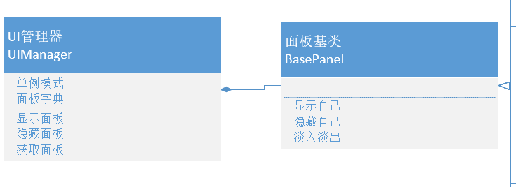

```cs
public class UIManager
{
    private static UIManager instance = new UIManager();
    public static UIManager Instance => instance;

    // 存储面板容器
    private Dictionary<string, BasePanel> panelDic = new Dictionary<string, BasePanel>();

    private Transform canvasTrans;

    private UIManager()
    {
        canvasTrans = GameObject.Find("Canvas").transform;
        // 将EventSystem和UICamera作为Canvas子对象，让Canvas过场景不被删掉
        GameObject.DontDestroyOnLoad(canvasTrans.gameObject);
    }

    // 显示面板
    public T ShowPanel<T>() where T : BasePanel
    {
        // 自定义规则，键名 = 面板类名
        string panelNameKey = typeof(T).Name;

        if (panelDic.ContainsKey(panelNameKey)) return panelDic[panelNameKey] as T;

        // 动态创建面板对象, 设置为Canvas子对象
        GameObject panelObj = GameObject.Instantiate(Resources.Load<GameObject>($"UI/{panelNameKey}"));
        panelObj.transform.SetParent(canvasTrans, false);

        // 存储到容器中
        T res = panelObj.GetComponent<T>();
        panelDic[panelNameKey] = res;
        //panelDic.Add(panelNameKey, res);

        // 显示面板
        res.ShowMe();

        return res;
    }

    // 隐藏面板，这里可以通过默认参数来选择是淡出还是整个删除
    public void HidePanel<T>(bool isFade = true) where T : BasePanel
    {
        string panelNameKey = typeof(T).Name;
        if (panelDic.ContainsKey(panelNameKey))
        {
            if (isFade)
            {
                panelDic[panelNameKey].HideMe(() =>
                {
                    // 删除面板，移除dic
                    GameObject.Destroy(panelDic[panelNameKey].gameObject);
                    // 绝对不能像下面这样写！！！！！！！！！！！
                    //panelDic[panelNameKey] = null;
                    panelDic.Remove(panelNameKey);
                });
            }
            else
            {
                // 删除面板，移除dic
                GameObject.Destroy(panelDic[panelNameKey].gameObject);
                // 绝对不能像下面这样写！！！！！！！！！！！
                //panelDic[panelNameKey] = null;
                panelDic.Remove(panelNameKey);
            }
        }
    }

    // 获得面板
    public T GetPanel<T>() where T : BasePanel
    {
        string panelNameKey = typeof(T).Name;
        return panelDic[panelNameKey] as T ?? null;
    }
}
```