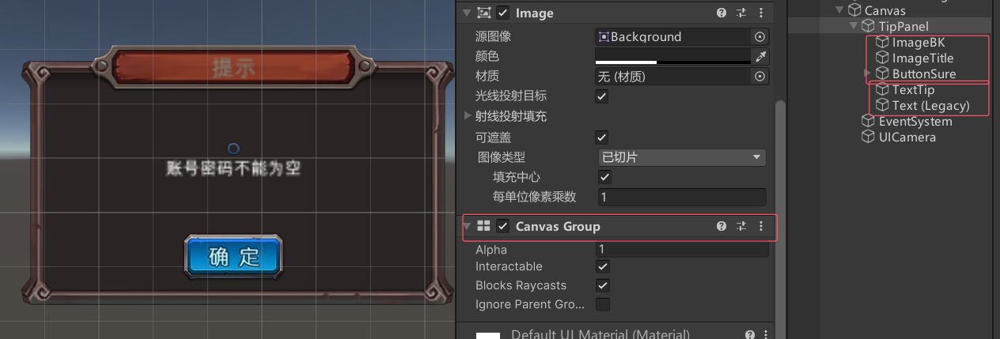
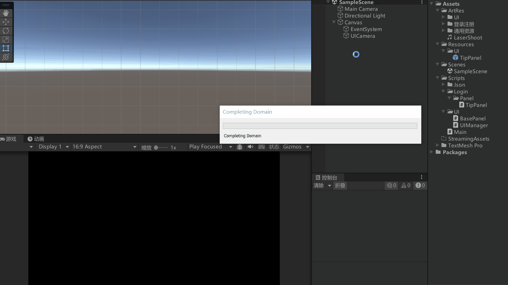
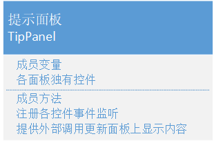

注意这里的Resources/UI文件夹，还有TipPanel预设体名字和TipPanel脚本的名字要一样





```cs
public class TipPanel : BasePanel
{
    public Button btnSure;
    // 提示文字
    public Text txtTip;
    public override void Init()
    {
        btnSure.onClick.AddListener(() =>
        {
            // 统一通过UI管理器
            UIManager.Instance.HidePanel<TipPanel>();
        });
    }

    // 更改提示内容
    public void ChangeTextTip(string tip)
    {
        txtTip.text = tip;
    }
}
```
测试脚本Main
```cs
public class Main : MonoBehaviour
{
    void Start()
    {
        TipPanel tipPanel = UIManager.Instance.ShowPanel<TipPanel>();
        tipPanel.ChangeTextTip("这是一个测试");
    }
}
```

