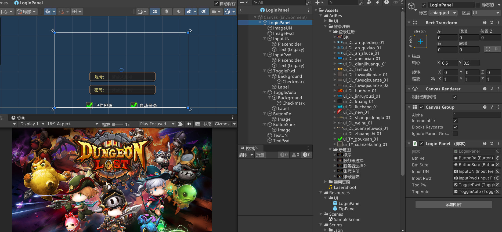
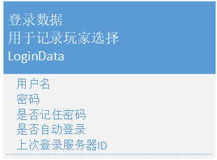
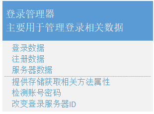
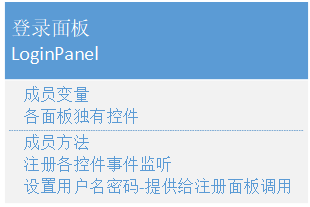
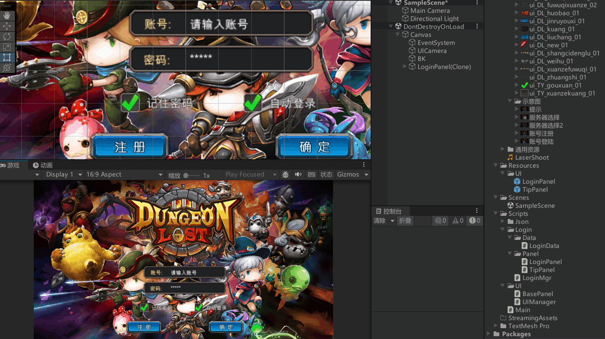

```cs
/// <summary>
/// 登录界面需要记住的玩家操作
/// </summary>
public class LoginData
{
    public string userName;
    public string passWord;
    // 是否记住密码
    public bool rememberPw;
    // 是否自动登录
    public bool autoLogin;
}
```



```cs
public class LoginMgr
{
    private static LoginMgr instance = new LoginMgr();
    public static LoginMgr Instance => instance;
    private LoginMgr() 
    {
        // 加载持久化数据，第一次没有就是其默认
        loginData = JsonMgr.Instance.LoadData<LoginData>("LoginData");
    }

    private LoginData loginData;

    public LoginData LoginData => loginData;

    public void SaveLoginData()
    {
        JsonMgr.Instance.SaveData(loginData, "LoginData", JsonType.LitJson);
    }
}

```




```cs
public class LoginPanel : BasePanel
{
    public Button btnRe;    // 注册按钮
    public Button btnSure;  // 确定登录按钮

    public InputField inputUN;      // 输入的账号
    public InputField inputPwd;     // 输入的密码

    // 记住密码和自动登录
    public Toggle togPw;
    public Toggle togAuto;


    public override void Init()
    {
        btnRe.onClick.AddListener(() =>
        {
            // 显示注册面板，隐藏自己
            UIManager.Instance.HidePanel<LoginPanel>();
        });

        btnSure.onClick.AddListener(() =>
        {
            // 验证用户名
        });

        togPw.onValueChanged.AddListener((isSel) =>
        {
            // 如果没有选记住密码，就把自动登录取消
            if (!isSel)
            {
                togAuto.isOn = false;
            }
        });

        togAuto.onValueChanged.AddListener((isSel) =>
        {
            // 点击自动登录，如果记住密码没被选中，就要将记住密码给选中
            if (isSel)
            {
                togPw.isOn = true;
            }
        });
    }

    // 显示面板前，根据数据更新面板
    public override void ShowMe()
    {
        base.ShowMe();
        // 得到数据
        LoginData loginData = LoginMgr.Instance.LoginData;
        togPw.isOn = loginData.rememberPw;
        togAuto.isOn = loginData.autoLogin;

        inputUN.text = loginData.userName;
        // 密码看上一次是否勾选了记住密码
        if (loginData.rememberPw)
            inputPwd.text = loginData.passWord;

        // 如果上次勾选了自动登录
        if (loginData.autoLogin)
        {
            // 自动验证账号密码相关
        }
    }
}

```