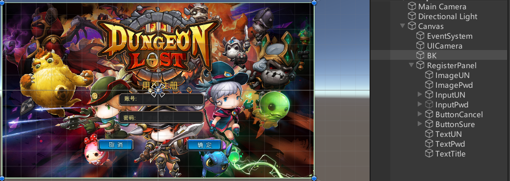
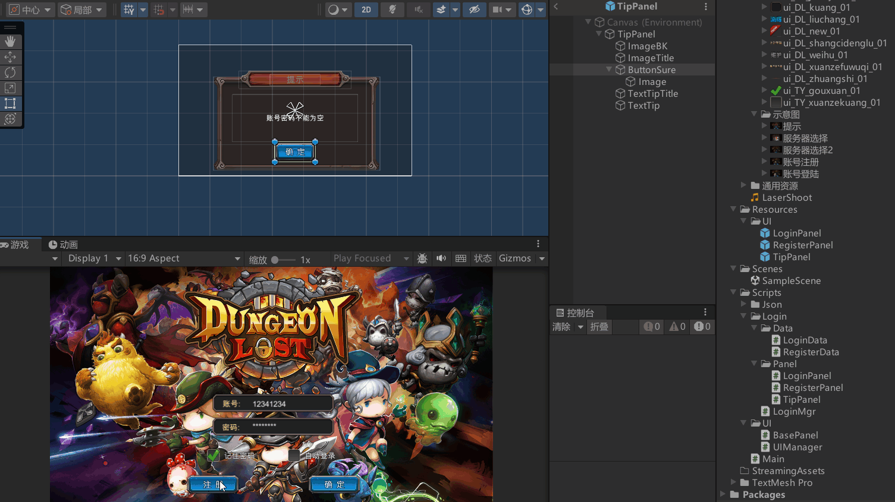

登录面板和注册面板之间的交互
```cs
public class LoginPanel : BasePanel
{
    public Button btnRe;    // 注册按钮
    public Button btnSure;  // 确定登录按钮

    public InputField inputUN;      // 输入的账号
    public InputField inputPwd;     // 输入的密码

    // 记住密码和自动登录
    public Toggle togPw;
    public Toggle togAuto;


    public override void Init()
    {
        btnRe.onClick.AddListener(() =>
        {
            // 显示注册面板，隐藏自己
            UIManager.Instance.ShowPanel<RegisterPanel>();
            UIManager.Instance.HidePanel<LoginPanel>();
        });

        btnSure.onClick.AddListener(() =>
        {
            // 验证用户名
            // 判断用户密码是否合理
            if (inputPwd.text.Length <= 6 || inputUN.text.Length <= 6)
            {

                TipPanel tipPanel = UIManager.Instance.ShowPanel<TipPanel>();
                tipPanel.ChangeTextTip("用户名和mima不合法");
                return;
            }

            // 通过LoginMgr来向持久化数据验证
            if (LoginMgr.Instance.CheckUser(inputUN.text, inputPwd.text))
            {
                // 记录数据
                LoginData loginData = LoginMgr.Instance.LoginData;
                loginData.autoLogin = togAuto.isOn;
                loginData.rememberPw = togPw.isOn;
                loginData.userName = inputUN.text;
                loginData.passWord = inputPwd.text;
                LoginMgr.Instance.SaveLoginData();

                // 根据服务器信息来判断显示哪个面板， 如果之前选过某服务器就自动选那个

                // 登陆成功后隐藏自己
                UIManager.Instance.HidePanel<LoginPanel>();
            }
            else
            {
                UIManager.Instance.ShowPanel<TipPanel>().ChangeTextTip("账号密码错误");
            }

        });

        togPw.onValueChanged.AddListener((isSel) =>
        {
            // 如果没有选记住密码，就把自动登录取消
            if (!isSel)
            {
                togAuto.isOn = false;
            }
        });

        togAuto.onValueChanged.AddListener((isSel) =>
        {
            // 点击自动登录，如果记住密码没被选中，就要将记住密码给选中
            if (isSel)
            {
                togPw.isOn = true;
            }
        });
    }

    // 显示面板前，根据上次数据更新面板
    public override void ShowMe()
    {
        base.ShowMe();
        // 得到数据
        LoginData loginData = LoginMgr.Instance.LoginData;
        togPw.isOn = loginData.rememberPw;
        togAuto.isOn = loginData.autoLogin;

        inputUN.text = loginData.userName;
        // 密码看上一次是否勾选了记住密码
        if (loginData.rememberPw)
            inputPwd.text = loginData.passWord;

        // 如果上次勾选了自动登录
        if (loginData.autoLogin)
        {
            // 自动验证账号密码相关
        }
    }

    // 给外部设置用户名和密码的函数
    public void SetInfo(string username, string password)
    {
        inputUN.text = username;
        inputPwd.text = password;
    }
}
```

注册的账号密码数据
```cs
public class RegisterData
{
    public Dictionary<string, string> registerInfo = new Dictionary<string, string>();
}
```


RegisterPanel
```cs
public class RegisterPanel : BasePanel
{
    public Button btnSure;
    public Button btnCancel;

    public InputField inputUN;
    public InputField inputPwd;
    public override void Init()
    {
        btnCancel.onClick.AddListener(() =>
        {
            // 隐藏自己，显示登录面板
            UIManager.Instance.HidePanel<RegisterPanel>();
            UIManager.Instance.ShowPanel<LoginPanel>();
        });

        // 
        btnSure.onClick.AddListener(() =>
        {
            // 判断用户密码是否合理
            if (inputPwd.text.Length <= 6 || inputUN.text.Length <= 6)
            {
                
                TipPanel tipPanel = UIManager.Instance.ShowPanel<TipPanel>();
                tipPanel.ChangeTextTip("用户名和mima不合法");
                return;
            }

            // 如果合法，用LoginMgr去和数据做持久化
            bool isRegisterOK = LoginMgr.Instance.RegisterUser(inputUN.text, inputPwd.text);
            if (isRegisterOK)
            {
                // 隐藏自己，显示登录面板，还要更新登录面板内容
                UIManager.Instance.HidePanel<RegisterPanel>();
                LoginPanel loginPanel = UIManager.Instance.ShowPanel<LoginPanel>();
                loginPanel.SetInfo(inputUN.text, inputPwd.text);
            }
            else
            {
                // 提示别人用户名已存在
                TipPanel tipPanel = UIManager.Instance.ShowPanel<TipPanel>();
                tipPanel.ChangeTextTip("该用户已经注册过了");
            }
        });
    }
}

```


