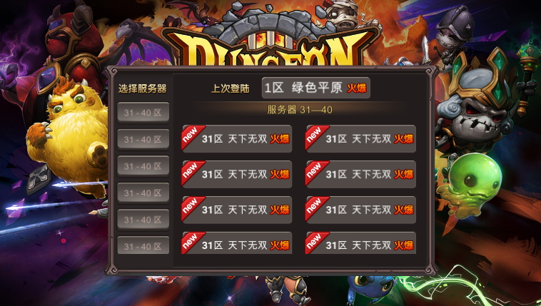
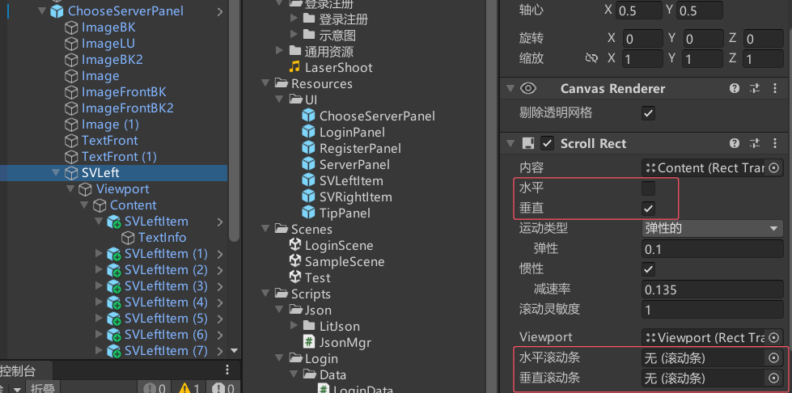
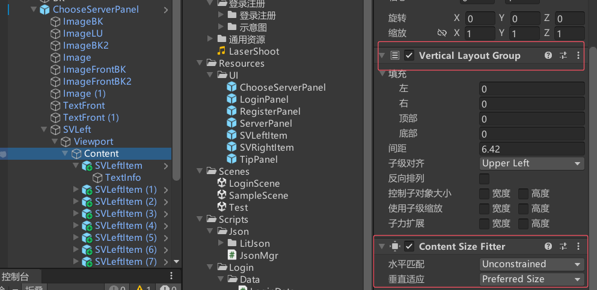
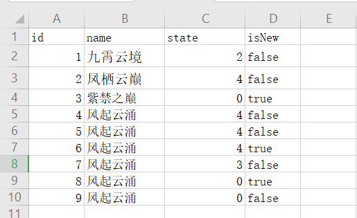
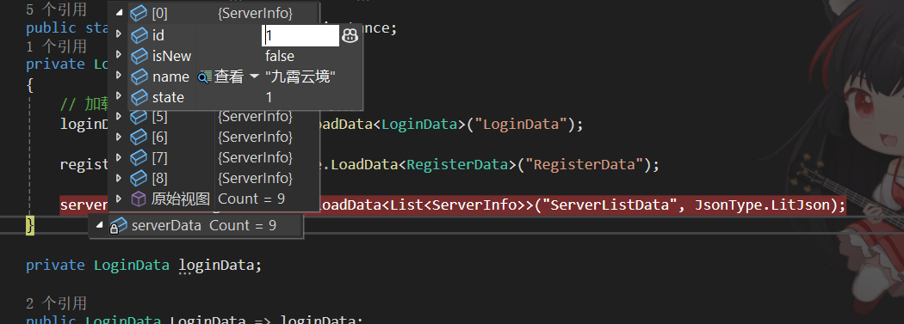
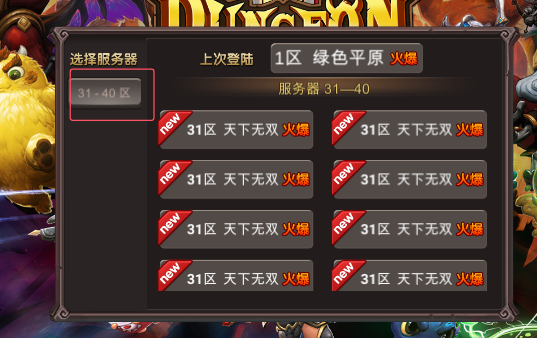
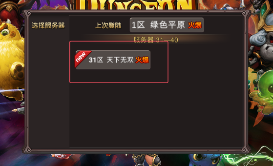
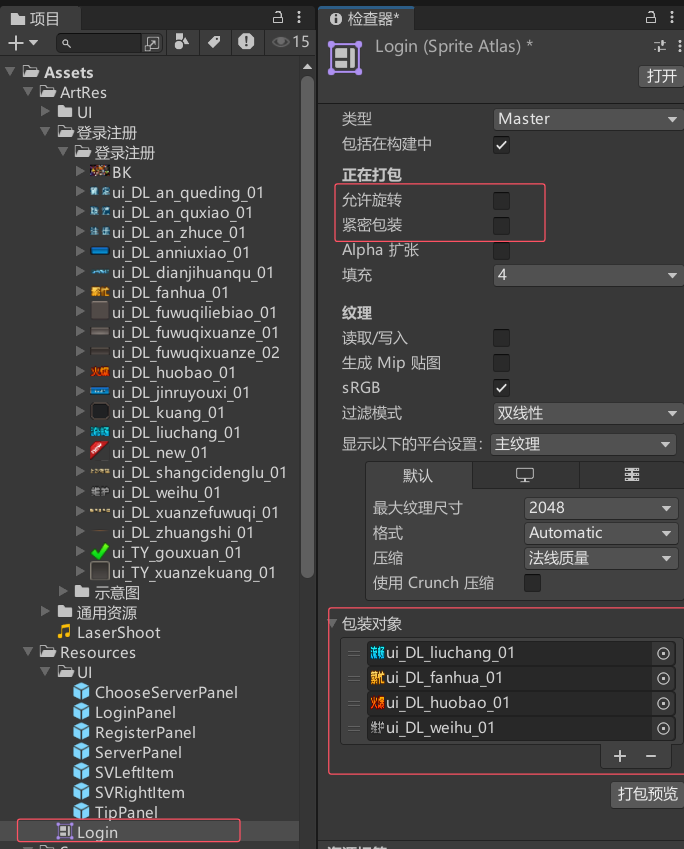
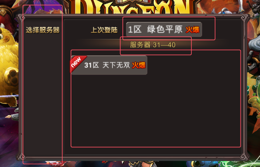

相关注意如下图



只有竖直的宽才变化



选服面板数据准备



复制后通过网页将其转化为json如下
ServerListData.json
```json
[
  {
    "id": 1,
    "name": "九霄云境",
    "state": 1,
    "isNew": false
  },
  {
    "id": 2,
    "name": "凤栖云巅",
    "state": 2,
    "isNew": false
  },
  {
    "id": 3,
    "name": "紫禁之巅",
    "state": 0,
    "isNew": true
  },
  {
    "id": 4,
    "name": "风起云涌",
    "state": 0,
    "isNew": false
  },
  {
    "id": 5,
    "name": "风起云涌",
    "state": 1,
    "isNew": false
  },
  {
    "id": 6,
    "name": "风起云涌",
    "state": 0,
    "isNew": true
  },
  {
    "id": 7,
    "name": "风起云涌",
    "state": 2,
    "isNew": false
  },
  {
    "id": 8,
    "name": "风起云涌",
    "state": 0,
    "isNew": true
  },
  {
    "id": 9,
    "name": "风起云涌",
    "state": 3,
    "isNew": false
  }

]
```

为正确读取这个json里面的数据，创建一个ServerInfo数据类
```cs
public class ServerInfo
{
    public int id;
    public string name;
    public int state;   // [0, 4] 0:维护中, 1:正常, 2:爆满, 3:人满, 4:未开放
    public bool isNew;
}
```

在数据管理器中获取该数据让其它类使用
```cs
public class LoginMgr
{
    private static LoginMgr instance = new LoginMgr();
    public static LoginMgr Instance => instance;
    private LoginMgr()
    {
        // 加载持久化数据，第一次没有就是其默认
        loginData = JsonMgr.Instance.LoadData<LoginData>("LoginData");

        registerData = JsonMgr.Instance.LoadData<RegisterData>("RegisterData");

        serverData = JsonMgr.Instance.LoadData<List<ServerInfo>>("ServerListData", JsonType.LitJson);
    }

    private LoginData loginData;

    public LoginData LoginData => loginData;

    // 注册数据
    private RegisterData registerData;
    public RegisterData RegisterData => registerData;

    // 服务器列表数据
    private List<ServerInfo> serverData;
    public List<ServerInfo> ServerData => serverData;

    public void SaveLoginData() =>
        JsonMgr.Instance.SaveData(loginData, "LoginData", JsonType.LitJson);

     // 存储注册数据
     public void SaveRegisterData() =>
        JsonMgr.Instance.SaveData(registerData, "RegisterData");

    // 注册方法
    public bool RegisterUser(string username, string password)
    {
        // 是否存在客户
        if (registerData.registerInfo.ContainsKey(username))
            return false;

        registerData.registerInfo[username] = password;
        SaveRegisterData();
        return true;
    }

    // 验证用户密码是否合法
    public bool CheckUser(string username, string password)
    {
        if (registerData.registerInfo.ContainsKey(username))
        {
            if (registerData.registerInfo[username] == password)
                return true;
        }
        return false;
    }
}

```
成功读取~



先制作左侧按钮的功能


创建如下脚本，并将其关联到ServerLeftItem预设体

```cs
public class ServerLeftItem : MonoBehaviour
{
    public Button btnSelf;
    public Text txtInfo;    // 显示的区间
    // 区间范围
    private int beginIndex;
    private int endIndex;

    void Start()
    {
        btnSelf.onClick.AddListener(() =>
        {
            // 改变右侧的内容
        });
    }

    public void InitInfo(int begin, int end)
    {
        beginIndex = begin;
        endIndex = end;
        txtInfo.text = string.Format("{0} - {1}区", beginIndex, endIndex);
    }
}

```
制作右侧按钮



制作按钮状态图集，做UI的时候最好把允许旋转和紧密包装给取消了，不然可能有些小问题




制作右侧面板按钮控件的逻辑的时候可以用图集
```cs
using UnityEngine.U2D;
using UnityEngine.UI;

public class ServerRightItem : MonoBehaviour
{
    public Button btnSelf;
    public Image imgNew;     // 是否是新服
    public Image imgState;    // 服务器状态
    public Text txtName;  // 服务器名称
    public ServerInfo nowServerInfo; // 服务器信息
    void Start()
    {
        btnSelf.onClick.AddListener(() =>
        {
            // 记录这次选择的服务器，以供下次登录直接使用，让其直接跳入到服务器面板
            LoginMgr.Instance.LoginData.serverId = nowServerInfo.id;

            // 隐藏选服面板
            // 显示服务器面板
            UIManager.Instance.ShowPanel<ServerPanel>();
        });
    }

    // 根据服务器信息更新UI
    public void UpdateUI(ServerInfo info)
    {
        nowServerInfo = info;
        imgNew.gameObject.SetActive(info.isNew);
        txtName.text = info.id + "区 " + info.name;

        // 一开始默认显示某一状态
        imgState.gameObject.SetActive(true);
        SpriteAtlas sa = Resources.Load<SpriteAtlas>("UI/Login");
        switch (info.state)
        {
            case 0: // 无状态
                imgState.gameObject.SetActive(false);
                break;
            case 1: // 流畅
                imgState.sprite = sa.GetSprite("ui_DL_liuchang_01");
                break;
            case 2: // 繁忙
                imgState.sprite = sa.GetSprite("ui_DL_fanhua_01");
                break;
            case 3: // 火爆
                imgState.sprite = sa.GetSprite("ui_DL_huobao_01");
                break;
            case 4: // 维护
                imgState.sprite = sa.GetSprite("ui_DL_weihu_01");
                break;
        }
    }
}

```


制作选服面板脚本，先看面板需要管理的控件



