## WPF视觉树继承体系全解析

文章链接：[WPF视觉树继承体系全解析-CSDN博客](https://blog.csdn.net/qq_41375318/article/details/159850648)

### WPF视觉树继承体系全解析

**记忆口诀** ：

> 线程安全最底层（DispatcherObject），
> 依赖属性随后跟（DependencyObject），
> 可视化要渲染（Visual），
> 布局输入加事件（UIElement），
> 框架功能资源存（FrameworkElement），
> 控件模板开大门（Control）。

> 从 `object` 到 `Control` ，完整梳理WPF控件的家谱，理解每一步设计的深意。

---

### 完整继承关系图




---

```plaintext
Object
└─ DispatcherObject
    └─ DependencyObject
        ├─ Visual
        │   ├─ UIElement
        │   │   └─ FrameworkElement
        │   │       ├─ Shape (Line, Rectangle, Path, Polygon, Ellipse)
        │   │       ├─ Panel (Grid, StackPanel, Canvas, WrapPanel, DockPanel, UniformGrid)
        │   │       ├─ Decorator (Border, Viewbox, InkPresenter)
        │   │       ├─ ContentElement (FrameworkContentElement)
        │   │       │   ├─ TextElement (Span, Run, Bold, Italic)
        │   │       │   └─ BlockUIContainer
        │   │       └─ Control (所有交互控件的基类)
        │   │           ├─ ContentControl (拥有单个内容的控件)
        │   │           │   ├─ ButtonBase (Button, CheckBox, RadioButton, RepeatButton)
        │   │           │   ├─ HeaderedContentControl (TabItem, GroupBox, Expander)
        │   │           │   ├─ Window, UserControl, Page
        │   │           │   └─ ScrollViewer
        │   │           ├─ ItemsControl (拥有多个内容的控件)
        │   │           │   ├─ Selector (ListBox, ComboBox, TabControl)
        │   │           │   ├─ MenuBase (Menu, ContextMenu)
        │   │           │   └─ TreeView, StatusBar
        │   │           ├─ RangeBase (具有数值范围的控件: Slider, ProgressBar, ScrollBar)
        │   │           ├─ TextBoxBase (TextBox, RichTextBox)
        │   │           └─ PasswordBox, Image, MediaElement
        │   └─ DrawingVisual (用于底层绘图)
        └─ Freezable (可冻结对象，优化性能的关键: Brush, Pen, Geometry, Transform, Animation)
```

---

### 逐层详解

#### 第1层：Object — 万物之源

1. 都继承一个祖先，整个继承体系才不会混乱，否则混乱，设计体系

2. 子类可以赋值给父类，父类不能赋值给子类，除非强制转换。实现多态等等之类面向对象的特点。

3. 可以抽象出来一些公共的方法。

```csharp
public class Object
{
    public virtual bool Equals(object obj);
    public virtual int GetHashCode();
    public Type GetType();
    public virtual string ToString();
}
```

**这一层提供的能力** ：

- 所有.NET对象的基类

- 提供最基础的对象方法（Equals、GetHashCode、ToString）

**为什么WPF需要这一层？** 

> 这是C#的规则，所有类都必须直接或间接继承自Object。WPF没有特殊之处。

---

#### 第2层：DispatcherObject — 线程亲和性

```csharp
public abstract class DispatcherObject
{
    public Dispatcher Dispatcher { get; }
    public void CheckAccess();      // 检查是否有权访问
    public void VerifyAccess();     // 无权访问则抛异常
}
```

**核心能力** ：强制UI元素只能在创建它的线程上访问

**设计原因** ：

```csharp
// ❌ 错误示例：后台线程直接修改UI
Task.Run(() => {
    button.Content = "新文字";  // 抛出异常！
});

// ✅ 正确示例：通过Dispatcher
Task.Run(() => {
    Dispatcher.Invoke(() => {
        button.Content = "新文字";  // 安全
    });
});
```

**为什么这么设计？** 

- WPF UI元素不是线程安全的

- 多个线程同时修改UI会导致状态混乱

- 通过DispatcherObject强制所有UI操作归队到UI线程

> **一句话总结** ：确保UI只被"主人"线程操作，避免多线程打架。

###  [DispatcherObject 的线程强制机制详解](https://blog.csdn.net/qq_41375318/article/details/159851106?sharetype=blogdetail&sharerId=159851106&sharerefer=PC&sharesource=qq_41375318&spm=1011.2480.3001.8118) 

---

#### 第3层：DependencyObject — 依赖属性系统

```csharp
public abstract class DependencyObject : DispatcherObject
{
    // 依赖属性读写
    public object GetValue(DependencyProperty dp);
    public void SetValue(DependencyProperty dp, object value);
    public void ClearValue(DependencyProperty dp);
    
    // 属性元数据
    public DependencyObjectType DependencyObjectType { get; }
    
    // 属性值强制和验证
    public void CoerceValue(DependencyProperty dp);
    public void InvalidateProperty(DependencyProperty dp);
}
```

**核心能力** ：引入依赖属性系统，支持属性值继承、数据绑定、动画等

**传统CLR属性的问题** ：

```csharp
// 传统属性 - 每个实例都存一份值
public class Button {
    public string Text { get; set; }  // 100万个按钮存100万份
    public double Width { get; set; }  // 100万个按钮存100万份
    // 内存浪费巨大！
}
```

**依赖属性的解决方案** ：

```csharp
// 依赖属性 - 值存储在全局哈希表中
public class Button : DependencyObject {
    // 只存一个静态定义
    public static readonly DependencyProperty TextProperty = 
        DependencyProperty.Register("Text", typeof(string), typeof(Button));
    
    public string Text {
        get => (string)GetValue(TextProperty);  // 从全局表取值
        set => SetValue(TextProperty, value);   // 存到全局表
    }
}
```

**依赖属性的强大特性** ：

|    特性    |            说明            |                    示例                    |
| :--------: | :------------------------: | :----------------------------------------: |
| 属性值继承 |  父元素属性自动传给子元素  |       `FontSize="20"` 影响所有子控件       |
|  数据绑定  |    属性可以绑定到数据源    |          `Text="{Binding Name}"`           |
|  动画支持  |     属性可以被动画驱动     |        `Storyboard` 改变 `Opacity`         |
|  样式系统  |    属性可以被Style设置     | `Setter Property="Background" Value="Red"` |
|  附加属性  | 子元素可以给父元素设置属性 |               `Grid.Row="1"`               |


**为什么这么设计？** 

> 传统的.NET属性系统无法高效支持数据绑定、动画、样式等UI框架的核心需求。WPF创建了依赖属性系统，用空间换时间（牺牲少量内存换取巨大的灵活性）。

###  [DependencyObject 与 WPF 依赖属性系统深度解析](https://blog.csdn.net/qq_41375318/article/details/159853029?sharetype=blogdetail&sharerId=159853029&sharerefer=PC&sharesource=qq_41375318&spm=1011.2480.3001.8118) 

---

#### 第4层：Visual— 可视化基元

---

###  [Visual — 可视化基元实操案例教程](https://blog.csdn.net/qq_41375318/article/details/160413293?sharetype=blogdetail&sharerId=160413293&sharerefer=PC&sharesource=qq_41375318&spm=1011.2480.3001.8118) 

---

```csharp
public abstract class Visual : DependencyObject
{
    // 视觉树结构
    public DependencyObject VisualParent { get; }
    public int VisualChildrenCount { get; }
    public Visual GetVisualChild(int index);
    
    // 变换和效果
    public Transform Transform { get; set; }
    public Effect Effect { get; set; }
    public Geometry Clip { get; set; }
    public double Opacity { get; set; }
    public Brush OpacityMask { get; set; }
    
    // 命中测试
    public HitTestResult HitTest(Point point);
    public void AddVisualChild(Visual child);
    public void RemoveVisualChild(Visual child);
    
    // 渲染通知
    protected virtual void OnRender(DrawingContext drawingContext);
}
```

**核心能力** ：WPF渲染系统的核心，每个可见元素都是Visual

**Visual的作用** ：

1. **管理视觉树** ：维护父子关系，但不参与布局

2. **提供渲染能力** ：通过OnRender方法绘制内容

3. **支持命中测试** ：判断鼠标点击在哪个元素上

**Visual的子类** ：

```
Visual
├── UIElement (支持布局和输入)
├── Visual3D (3D对象)
└── ContainerVisual (可视化容器)
```

**为什么需要Visual层？** 

> 不是所有可视化对象都需要完整的布局和输入系统。比如自定义绘图元素，只需要能渲染就行，不需要参与布局计算。Visual提供了最轻量级的可视化能力。

**实际例子** ：

```csharp
// 自定义Visual - 只负责绘图，不参与布局
public class MyDrawingVisual : Visual
{
    protected override void OnRender(DrawingContext dc)
    {
        // 画一个圆
        dc.DrawEllipse(Brushes.Red, null, new Point(50, 50), 40, 40);
    }
}
```

---

#### 第5层：UIElement — 布局和输入

```csharp
public abstract class UIElement : Visual
{
    // ========== 布局系统 ==========
    public virtual void Measure(Size availableSize);    // 测量阶段
    public virtual void Arrange(Size finalSize);        // 排列阶段
    protected virtual Size MeasureCore(Size availableSize);
    protected virtual Size ArrangeCore(Size finalSize);
    
    // 布局属性
    public double Width { get; set; }
    public double Height { get; set; }
    public Thickness Margin { get; set; }
    public HorizontalAlignment HorizontalAlignment { get; set; }
    public VerticalAlignment VerticalAlignment { get; set; }
    
    // ========== 渲染属性 ==========
    public double Opacity { get; set; }
    public Brush OpacityMask { get; set; }
    public Transform RenderTransform { get; set; }
    public Geometry Clip { get; set; }
    public bool IsHitTestVisible { get; set; }
    
    // ========== 输入事件 ==========
    public event MouseEventHandler MouseDown;
    public event MouseEventHandler MouseUp;
    public event KeyboardEventHandler KeyDown;
    public event KeyboardEventHandler KeyUp;
    public event TextCompositionEventHandler TextInput;
    
    // ========== 焦点系统 ==========
    public bool Focusable { get; set; }
    public virtual bool Focus();
    public event DependencyPropertyChangedEventHandler GotFocus;
    public event DependencyPropertyChangedEventHandler LostFocus;
    
    // ========== 命令系统 ==========
    public ICommand Command { get; set; }
    public object CommandParameter { get; set; }
    
    // ========== 生命周期 ==========
    protected virtual void OnRender(DrawingContext drawingContext);
}
```

**核心能力** ：引入WPF的布局系统和输入系统

**两阶段布局算法** ：



**实际示例** ：

```csharp
// 自定义Panel的布局逻辑
protected override Size MeasureOverride(Size availableSize)
{
    foreach (UIElement child in Children)
    {
        // 问每个孩子：你要多大？
        child.Measure(availableSize);
        // 记录孩子的DesiredSize
    }
    return new Size(100, 100); // 告诉父元素：我要100x100
}

protected override Size ArrangeOverride(Size finalSize)
{
    foreach (UIElement child in Children)
    {
        // 告诉每个孩子：你待在这个位置
        child.Arrange(new Rect(0, 0, 50, 50));
    }
    return finalSize;
}
```

**为什么这么设计？** 

> UIElement实现了WPF最核心的 **布局系统** 。两阶段布局算法允许控件先"问"子元素需要多大，然后再"分配"实际位置。这种设计支持自适应布局、响应式设计，是WPF区别于WinForms的最大优势。

---

#### 第6层：FrameworkElement —框架级别功能

```csharp
public abstract class FrameworkElement : UIElement
{
    // ========== 身份标识 ==========
    public string Name { get; set; }
    public object Tag { get; set; }  // 用户自定义数据
    
    // ========== 资源系统 ==========
    public ResourceDictionary Resources { get; set; }
    public object FindResource(object resourceKey);
    public object TryFindResource(object resourceKey);
    
    // ========== 数据上下文 ==========
    public object DataContext { get; set; }
    
    // ========== 样式系统 ==========
    public Style Style { get; set; }
    
    // ========== 模板系统 ==========
    public ControlTemplate Template { get; set; }
    public virtual void OnApplyTemplate();  // 模板应用后调用
    
    // ========== 父元素关系 ==========
    public DependencyObject Parent { get; }
    public DependencyObject TemplatedParent { get; }
    
    // ========== 尺寸属性（增强版） ==========
    public double Width { get; set; }
    public double Height { get; set; }
    public double MinWidth { get; set; }
    public double MaxWidth { get; set; }
    public Thickness Margin { get; set; }
    public Thickness Padding { get; set; }
    public HorizontalAlignment HorizontalAlignment { get; set; }
    public VerticalAlignment VerticalAlignment { get; set; }
    
    // ========== 工具方法 ==========
    public object FindName(string name);  // 通过名称找元素
}
```

**核心能力** ：将Visual/UIElement的底层能力包装成开发者友好的框架

**FrameworkElement新增了什么？** 

|    功能    |                说明                |                  例子                  |
| :--------: | :--------------------------------: | :------------------------------------: |
|  资源系统  | 支持StaticResource/DynamicResource |       `{StaticResource MyBrush}`       |
| 数据上下文 |      MVVM的核心，数据绑定来源      |  `DataContext="{Binding ViewModel}"`   |
|  样式系统  |          统一管理控件外观          | `Style="{StaticResource ButtonStyle}"` |
|  名称系统  |    给元素起名字，代码中可以找到    |          `x:Name="MyButton"`           |
|  模板父级  |       知道自己是模板的一部分       |           `TemplatedParent`            |


**为什么分离FrameworkElement？** 

> UIElement提供了底层的布局和输入，但不够"方便"。FrameworkElement添加了开发者日常使用的功能：样式、资源、数据绑定、命名等。这种分层让底层保持简洁，高层提供便利。

---

#### 第7层：Control — 控件基类

```csharp
public class Control : FrameworkElement
{
    // ========== 外观属性 ==========
    public Brush Background { get; set; }
    public Brush Foreground { get; set; }
    public Brush BorderBrush { get; set; }
    public Thickness BorderThickness { get; set; }
    public double FontSize { get; set; }
    public FontFamily FontFamily { get; set; }
    public FontWeight FontWeight { get; set; }
    public FontStyle FontStyle { get; set; }
    
    // ========== 模板 ==========
    public ControlTemplate Template { get; set; }  // 覆盖FrameworkElement的Template
    public virtual void OnApplyTemplate();  // 模板实例化后调用
    
    // ========== 焦点/键盘导航 ==========
    public bool IsTabStop { get; set; }
    public int TabIndex { get; set; }
    
    // ========== 鼠标行为 ==========
    public Cursor Cursor { get; set; }
    public bool IsMouseOver { get; }
    public bool IsFocused { get; }
    
    // ========== 内置模板部件 ==========
    // 通过TemplatePart特性声明模板需要的子元素
    [TemplatePart(Name = "PART_ContentHost", Type = typeof(FrameworkElement))]
}
```

**核心能力** ：支持模板化外观，这是WPF控件库的基石

**Control vs FrameworkElement** ：

|   特性   |     FrameworkElement     |         Control          |
| :------: | :----------------------: | :----------------------: |
| 外观定义 |       代码内硬编码       |   通过Template外部定义   |
| 主题支持 |           困难           |         原生支持         |
| 典型子类 | Border, TextBlock, Image | Button, TextBox, ListBox |


**模板化设计的威力** ：

```csharp
// Button的默认模板在Generic.xaml中定义
// 用户可以完全替换：
<Button>
    <Button.Template>
        <ControlTemplate TargetType="Button">
            <!-- 完全自定义外观，但保留Button的点击行为 -->
            <Ellipse Fill="Red">
                <ContentPresenter/>
            </Ellipse>
        </ControlTemplate>
    </Button.Template>
</Button>
```

**为什么Control这么设计？** 

> 传统的UI框架（WinForms）把外观和行为耦合在一起。WPF的Control通过模板分离了"行为"和"外观"：
>
> - **行为** ：在C#代码中（点击、焦点、命令等）
>
> - **外观** ：在XAML模板中（ControlTemplate）
>
> 这意味着你可以完全改变一个控件的外观，而不影响它的功能。这是WPF最具革命性的设计。

---

### 设计哲学：为什么WPF要分这么多层？

#### 关注点分离

每一层都有明确的职责：

|       层级       |   职责    |        一句话        |
| :--------------: | :-------: | :------------------: |
| DispatcherObject | 线程安全  |    保证UI线程安全    |
| DependencyObject | 属性系统  |  支持绑定/动画/样式  |
|      Visual      |  可视化   |  只管渲染，不管布局  |
|    UIElement     | 布局+输入 | 两阶段布局，事件处理 |
| FrameworkElement | 框架功能  | 样式、资源、数据绑定 |
|     Control      |  模板化   |      外观可替换      |


#### 渐进增强

```
最简单的绘图：继承 Visual
需要布局：继承 UIElement  
需要样式/资源：继承 FrameworkElement
需要模板化：继承 Control
需要内容：继承 ContentControl
需要数据集合：继承 ItemsControl
```

#### 性能优化

- **Visual** 是最轻量级的可视化元素，不参与布局计算

- **UIElement** 增加了布局成本

- **FrameworkElement** 增加了资源/样式查找的成本

- **Control** 增加了模板解析的成本

选择最合适的层级，而不是一律用Control。

---

### 常用控件的继承链

```csharp
// 简单控件（没有Content）
Button : ButtonBase : ContentControl : Control : FrameworkElement : UIElement : Visual : ...
TextBox : TextBoxBase : Control : ...
ProgressBar : RangeBase : Control : ...

// 内容控件
Label : ContentControl : Control : ...
ToolTip : ContentControl : ...

// 集合控件
ListBox : Selector : ItemsControl : Control : ...
ComboBox : Selector : ItemsControl : ...
TreeView : ItemsControl : ...
```

---

### 实际应用：如何选择基类？

|      你的需求       |      推荐基类      |        理由         |
| :-----------------: | :----------------: | :-----------------: |
| 显示简单的图形/文字 | `FrameworkElement` |   需要布局和样式    |
|  需要数据绑定支持   | `FrameworkElement` | 依赖属性系统已就绪  |
|   需要模板化外观    |     `Control`      | 支持ControlTemplate |
|  需要承载单个内容   |  `ContentControl`  |   内置Content属性   |
| 需要承载多个子元素  |   `ItemsControl`   |    内置Items集合    |
| 需要管理子元素布局  |      `Panel`       |   完整的布局系统    |
| 极致性能，只做绘图  |      `Visual`      |      最轻量级       |


---

### 总结

WPF的分层设计体现了 **单一职责原则** 和 **开闭原则** ：

1. **每一层只做一件事** - DispatcherObject管线程，DependencyObject管属性，Visual管渲染…

2. **上层继承下层** - 复用下层能力，增加新特性

3. **按需选择层级** - 不需要的功能就不继承，保持轻量

这个设计让WPF既能满足复杂业务应用的需求（使用Control），又能高效渲染大量数据（使用Visual），是经过深思熟虑的架构决策。

**记忆口诀** ：

> 线程安全最底层（DispatcherObject），
> 依赖属性随后跟（DependencyObject），
> 可视化要渲染（Visual），
> 布局输入加事件（UIElement），
> 框架功能资源存（FrameworkElement），
> 控件模板开大门（Control）。

