## 使用 StackPanel 面板进行简单布局

上一节讲了 WPF 布局的总原则和运作机制，相当于在脑子里面种了一棵“布局世界观”树。现在就得开始实战了。第一个要学的面板就是 `StackPanel`，因为它是所有布局面板里最简单、最直观、也最常用的之一。

`StackPanel` 干的事情就一句话：**把一堆元素顺着一个方向排成一溜**。要么从上到下一列排，要么从左到右一行排。看起来简单得不能再简单了，但这恰恰是它威力大的原因——WPF 里很多复杂的界面，拆到最底层，都是用无数个 `StackPanel` 一层层搭起来的。

但是光知道它能堆控件还远远不够。你要做到能精确控制每个元素在排列方向以及对齐方向的位置、空间分配、空白间隔，才能真正驾驭它。下面 3.2.1 到 3.2.5 这五个小节，就是一步一步把这套控制力交到你手里。

---

### 布局属性

先写一段最朴素的 `StackPanel` 代码，建立直观感受：

```xml
<Window x:Class="LayoutDemo.MainWindow"
        xmlns="http://schemas.microsoft.com/winfx/2006/xaml/presentation"
        xmlns:x="http://schemas.microsoft.com/winfx/2006/xaml"
        Title="StackPanel 入门" Height="300" Width="300">
    <StackPanel>
        <Button Content="按钮一" />
        <Button Content="按钮二" />
        <Button Content="按钮三" />
        <TextBlock Text="这是文本" />
    </StackPanel>
</Window>
```

一运行，你会发现窗口左上角垂直方向从上到下摆着三个按钮和一个文本块。它们一个贴着一个，没有重叠，也没有被挤到看不见。你改变窗口大小，按钮和文本块只是窗口变大变小时露出更多或更少的空白区域，自己的位置和大小基本不变。

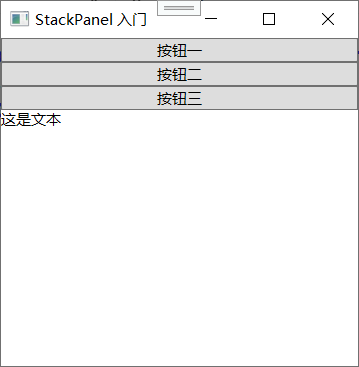

这个效果是怎么出来的？每一个控件的“自然尺寸”决定了它在这个方向上的高度（`DesiredSize.Height`），而在排列方向上，子元素被允许使用内容所需要的全部空间（`StackPanel` 测量阶段在排列方向上给子元素传的 `availableSize` 是无限大的那个方向）。所以每个按钮老老实实把自己包好，一个挨一个往下摆。

**核心属性：`Orientation`**

`StackPanel` 最重要的属性叫 `Orientation`，决定排列方向：

```xml
<StackPanel Orientation="Vertical">   <!-- 默认值，垂直排列 -->
<StackPanel Orientation="Horizontal"> <!-- 水平排列 -->
```

- `Vertical`（垂直）：子元素从上到下堆叠。
- `Horizontal`（水平）：子元素从左到右排列。

默认不写就是 `Vertical`，所以前面的例子虽然没写 `Orientation`，效果还是竖着的。

换成水平试试：

```xml
<StackPanel Orientation="Horizontal">
    <Button Content="按钮一" />
    <Button Content="按钮二" />
    <Button Content="按钮三" />
    <TextBlock Text="这是文本" />
</StackPanel>
```

三个按钮就会在窗口顶部从左到右排成一行。在水平排列的方向（水平方向）上，子元素的宽度由它们自己内容的自然宽度决定，而垂直方向受面板高度限制。

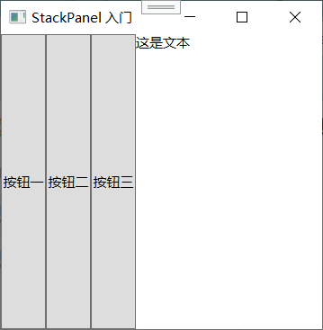

**容器自己怎么确定大小？**

`StackPanel` 本身也是一个控件，它的大小怎么定呢？先看默认情况：如果 `StackPanel` 没有直接被放进某个面板里限制它的大小，它的自然尺寸就是所有子元素自然尺寸的总和（加上边距，后面会讲）。比如垂直排列时，`StackPanel` 的 `DesiredSize.Height` 等于每个子元素高度 + 它们上下边距的总和。也就是说，StackPanel 也是“内容驱动尺寸”的忠实执行者。

但是，如果 `StackPanel` 被放进了一个更大的容器里，比如它就是 `Window` 的直接内容，那它的外部可用空间就会受父容器限制。父容器告诉它“你最多就这么大”，`StackPanel` 在排列方向之外的对齐方向也许会被拉伸（取决于对齐属性，后面会细讲）。而排列方向本身依然会用子元素所需尺寸作为自己的 `DesiredSize`，并且子元素的尺寸在排列方向上依然由它们自己内容决定。

**其他常见布局属性**

除了 `Orientation` 之外，每一个子元素其实也都各自拥有许多影响布局的属性，这些属性并不是 `StackPanel` 独有的，而是所有 WPF 控件都有的，因为它们都是在基类 `FrameworkElement` 里定义的。你在 `StackPanel` 里用的这些属性，未来放到 `Grid`、`DockPanel` 里同样管用。这也正是 WPF 布局系统设计精妙的地方：面板只负责大局算法，控件自己的微调属性在这些面板里都能产生相应的影响。

这些属性包括：

- `HorizontalAlignment`（水平对齐）
- `VerticalAlignment`（垂直对齐）
- `Margin`（外边距）
- `Padding`（内边距，对某些内容控件而言）
- `MinWidth`、`MaxWidth`、`MinHeight`、`MaxHeight`（尺寸约束）
- `Width`、`Height`（显式尺寸，尽量别用）

下面几个小节就是逐一攻破这些属性，让你能随心所欲地调整 `StackPanel` 里面每个元素的表现。

---

### 对齐方式

当你把元素放进 `StackPanel`，默认它们在排列方向的垂直方向（如果是垂直排列就是水平方向，如果是水平排列就是垂直方向）上会被拉伸到填满整个父容器的宽度或高度。那么这个“填满”的行为到底怎么控制呢？关键就是 **`HorizontalAlignment`** 和 **`VerticalAlignment`**。

这两个属性的作用，就是**决定一个元素在父容器分配给它额外空间时，应该怎么摆放自己**。注意这里的前提：**父容器分配的空间大于元素自己需要的尺寸。** 如果父容器刚好给元素分到它所需的尺寸，对齐属性根本看不出效果。

在 `StackPanel` 里，这个多余空间的出现场景是：

- 垂直排列时：`StackPanel` 的宽度可能比某个子元素的自然宽度更大。
- 水平排列时：`StackPanel` 的高度可能比某个子元素的高度更大。

WPF 提供了四个（其实常用的就三个）枚举值：

**`HorizontalAlignment` 的可取值：**

- `Left`：向左边靠齐（默认值之一，取决于控件）。元素贴左边，右面留白。
- `Center`：居中。元素放在中间，左右留白相等。
- `Right`：向右靠齐。元素贴右边，左面留白。
- `Stretch`：拉伸。元素的宽度填满整个容器可用宽度（许多控件的默认值）。

**`VerticalAlignment` 的可取值：**

- `Top`：向上靠齐（与 `Left` 同位）。
- `Center`：居中。
- `Bottom`：向下靠齐。
- `Stretch`：拉伸填满高度（很多控件的默认值）。

说话不如看例子。先看垂直排列时的水平对齐（控制左右）：

```xml
<StackPanel Orientation="Vertical" Background="LightGray">
    <Button Content="左对齐" HorizontalAlignment="Left" />
    <Button Content="居中" HorizontalAlignment="Center" />
    <Button Content="右对齐" HorizontalAlignment="Right" />
    <Button Content="拉伸" HorizontalAlignment="Stretch" />
</StackPanel>
```

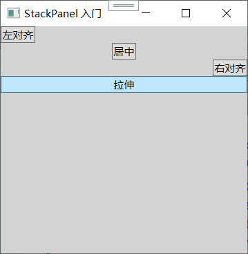

效果：
- 第一个按钮自己只占文字所需的宽度，贴在栈面板左边缘。
- 第二个按钮宽度也是最小内容宽度，但水平居中。
- 第三个按钮贴在右边缘。
- 第四个按钮的宽度被拉满整个 `StackPanel` 宽度（注意 `StackPanel` 的宽度受其父容器控制，如果父容器没限制足够宽度，可能看不出拉伸）。

再看水平排列时的垂直对齐（控制上下）：

```xml
<StackPanel Orientation="Horizontal" Background="LightGray" Height="100">
    <Button Content="上对齐" VerticalAlignment="Top" />
    <Button Content="居中" VerticalAlignment="Center" />
    <Button Content="下对齐" VerticalAlignment="Bottom" />
    <Button Content="拉伸" VerticalAlignment="Stretch" />
</StackPanel>
```

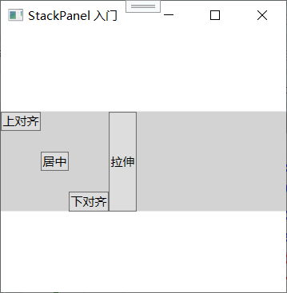

由于给定了 Height=100，子元素的高度自然小于 100 时，就能看到对齐效果：有的贴顶部，有的垂直居中，有的贴底部，最后一个按钮高度被拉满到 100。

**这里有个大坑**，初学者很容易踩：在 StackPanel 的排列方向（orientation 方向）上，对齐属性通常无效。为什么？

因为在排列方向上的 `availableSize` 是 Infinity（无限大），子元素只管把自己定在内容所需尺寸，父容器不会在该方向给它“多余空间”，所以没有空间让你去对齐。比如你在垂直排列时设置某个子元素的 `VerticalAlignment="Bottom"`，因为它下面总会堆别的元素或者 StackPanel 自身高度刚好等于所有子元素高度之和，按钮确实没有多余的垂直空间可以往下“贴”。这点和后面要学的 Grid 非常不同，Grid 明确分配每个格子大小，常常有多余空间，所以四个方向的对齐都有意义。

所以，对 StackPanel 来说：

- **在排列方向上，忽略对齐属性**（元素总是紧挨上一个排列）。
- **在非排列方向上，对齐属性正常发挥作用**（左中右或上中下，拉伸与否）。

这一点要是没弄明白，你就会对着一个设置了 `VerticalAlignment="Bottom"` 却不生效的按钮怀疑人生。

---

### 边距

**边距（Margin）** 解决的是元素和元素之间、元素和容器边界之间的空白间隔问题。如果说对齐属性决定了元素在**多余空间**里的表现，边距就是硬生生的往外推距离——“不管容器怎么算，我都要求在四周留下这么宽的空间不给别人占”。

**Margin 是什么？**

`Margin` 属性的类型是 `Thickness`，可以理解为一个矩形四边留白。你在 XAML 里写 `Margin` 有几种写法：

```xml
<Button Content="确定" Margin="10" />               <!-- 四边都是 10 -->
<Button Content="确定" Margin="10,5,10,5" />        <!-- 左 上 右 下 -->
<Button Content="确定" Margin="10,5" />             <!-- 左右10，上下5 -->
```

- 一个值：四边同等。
- 两个值：第一个是左右，第二个是上下。
- 四个值：按左、上、右、下顺序。

注意顺序是 左-上-右-下，和 CSS 的上右下左不一样。

**Margin例子**

这是没有Margin的效果
```xml
<StackPanel Orientation="Vertical">
    <!-- 第一个按钮：没有设置 Margin，它会紧贴着窗口顶部 -->
    <Button Content="第一个按钮" Background="LightBlue" />

    <!-- 第二个按钮：设置了 Margin -->
    <!-- 效果：距离上方的按钮 20 像素，距离左右侧各 50 像素 -->
    <Button Content="第二个按钮" Background="LightGreen" />
    <Button Content="第三个按钮" Background="LightCoral" />
</StackPanel>
```

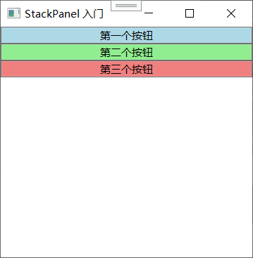


```xml
<StackPanel Orientation="Vertical">
    <!-- 第一个按钮：没有设置 Margin，它会紧贴着窗口顶部 -->
    <Button Content="第一个按钮" Background="LightBlue" />

    <!-- 第二个按钮：设置了 Margin -->
    <!-- 效果：距离上方的按钮 20 像素，距离左右侧各 50 像素 -->
    <Button Content="第二个按钮" 
        Margin="50, 20, 50, 0" 
        Background="LightGreen" />
    <Button Content="第三个按钮" Background="LightCoral" />
</StackPanel>
```

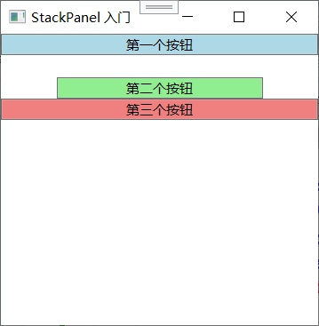


**Margin 对 StackPanel 的影响**

在 `StackPanel` 里，`Margin` 的效果非常直白：它就是在元素的布局矩形外围加上指定的空白。这个空白会影响两个东西：

**1. 对子元素本身的位置和尺寸**

当 `StackPanel` 排列子元素时，它会把每个子元素的 `DesiredSize` 加上它的 `Margin` 作为实际占用的空间。比如垂直排列，一个按钮的自然高度是 30，你设 `Margin="5"`，那它在垂直方向上就实际占用了 30 + 5 (上) + 5 (下) = 40 的空间。按钮本身的绘制区域还是 30 高，但是布局系统会把它周围 5 个单位的空白区域当做“这个按钮的地盘”，别的元素不能进入。

**2. 对容器大小的影响**

因为每个子元素都膨胀了一点（多了外边距），`StackPanel` 算自己需要的总尺寸时，也会把这部分加上去。所以加了 Margin 后，StackPanel 会自己长高或长宽。

**Margin 与对齐的协作**

`Margin` 和 `Alignment` 同时使用时，顺序是先分配 Margin 区域，然后在剩余的空间里做对齐。比如你给一个水平方向的 `StackPanel` 设了 `Height="80"`，里面一个按钮设了 `Margin="10"`、`VerticalAlignment="Stretch"`，那这个按钮的真实可用高度是：80 - 10（上边距） - 10（下边距） = 60。拉伸也是在这个 60 的范围里拉伸，不是整个 80。同理，`HorizontalAlignment` 也是先在左右留出 Margin 宽度，再在剩下的区域中靠左、靠右或居中。

**用 Margin 做间隔**

在没有 CSS 里 `gap` 那种属性的时代（实际上是 WPF 一直没有类似 grid-gap 的内置概念，只有分割线控件），`Margin` 就担起了在 `StackPanel` 里制造控件间间隔的大梁。假设你想让两个按钮中间有 8 单位的间距，可以：

```xml
<StackPanel Orientation="Vertical">
    <Button Content="上面的" Margin="0,0,0,4" />
    <Button Content="下面的" Margin="0,4,0,0" />
</StackPanel>
```

第一个按钮设下外边距 4，第二个按钮设上外边距 4，中间就合成 8 单位的间隔了。不过更常见的粗暴做法是只给每个控件设 `Margin="0,0,0,8"`，最后一个不加，但统一加 `Margin` 3～8 其实很常见（就算最后一个下面多一片空白也视觉上能接受）。

如果希望所有子元素到处都有固定间距，可以直接在 `StackPanel` 的 `Resources` 里整一个统一样式去设 `Margin`，但那是后面“样式”部分的主题，现在知道有这个方法就行。

**Margin 为负数？**

Margin 可以为负数，效果就是元素可以“侵占”旁边的空间，发生重叠。比如 `Margin="0,-10,0,0"`，这个元素就会向上移动 10 单位，可能部分盖住上一个元素。在特定视觉效果下偶尔用得到，比如阴影溢出。但日常界面布局尽量别用负边距，理解成本高且容易在不同分辨率下出错。

---

### 最小尺寸、最大尺寸以及显式地设置尺寸

前面一直在强调 WPF 布局原则第一条：“不要显式设置元素尺寸”。很多人看到这里就心里犯嘀咕：“那我要觉得按钮太窄了怎么办？我要限制文本框拉伸得太宽怎么办？” 有这种想法说明你已经走在正道上了，因为你考虑的不再是死板像素，而是**约束和范围**。WPF 给你提供了四个属性来干这件事：

- `MinWidth`：元素的最小宽度
- `MaxWidth`：元素的最大宽度
- `MinHeight`：元素的最小高度
- `MaxHeight`：元素的最大高度

这四个属性构成一个“尺寸区间”。在实际布局过程中，元素先根据自己的内容计算出一个 `DesiredSize`，然后父容器拿这个 `DesiredSize` 结合布局算法决定一个 `arrangedSize`。在这个过程里，无论中间怎么计算，最终分配给元素的实际尺寸一定强制落在 `[MinWidth, MaxWidth]` 和 `[MinHeight, MaxHeight]` 的范围内（只要父容器能提供）。

**为什么要优先用 Min/Max 而不是 Width/Height？**

因为 `Width` 和 `Height` 是写死尺寸，直接覆盖内容驱动机制。你一旦写了 `Width="200"`，这个控件就会一直保持 200 宽，不管窗口变大变小、不管里面文字变多变少。在自适应界面里这是灾难。而 `MinWidth` 和 `MaxWidth` 只是给了边界，没剥夺内容弹性的可能。

举几个典型场景：

- 你希望一个输入框别太窄，至少能容纳下常见的文本长度，就设置 `MinWidth="100"`，但放高分辨率大屏上它可以被布局系统拉伸到更宽。
- 你希望一个描述文本区域别太宽，以免一眼看过去读半天找不到下一行，就设置 `MaxWidth="300"`。
- 一个图片列表里的缩略图，你设置 `MaxWidth="80" MaxHeight="80"` 保证图不会撑得超大，但小图就保持原有的尺寸。

这些设置都不违反 WPF 布局原则，因为它们没有把尺寸写死成一个绝对值，只是划定了合理区间，让控件的内容和父容器仍有余地博弈。

**例子 1：写死尺寸 vs. 完全不设尺寸（内容驱动）**
```xml
<StackPanel>
    <!-- 情况 A：完全不设宽度（正道）。按钮会根据文字自动撑开 -->
    <Button Content="OK" Margin="5" HorizontalAlignment="Left"/>
    <Button Content="这是一个非常非常长的保存按钮" Margin="5" HorizontalAlignment="Left"/>

    <!-- 情况 B：写死 Width="60"（灾难）。文字多了就会被截断 -->
    <Button Width="60" Content="这是一个非常非常长的保存按钮" Margin="5" HorizontalAlignment="Left"/>
</StackPanel>
```

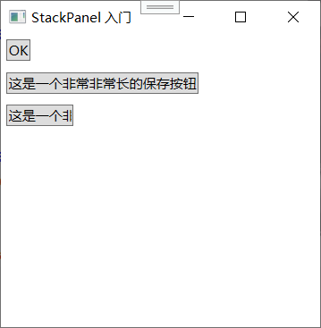


**在 StackPanel 里的表现**

在 `StackPanel` 里，由于排列方向上的 `availableSize` 是无限的，`MaxWidth`/`MaxHeight` 在排列方向依然能发挥约束作用。比如水平排列时，一个按钮自然宽度 120，你设 `MaxWidth="100"`，那它就会被限制到 100 宽（如果内容能适应缩小的空间）。同理，如果设了 `MinWidth="200"`，按钮至少保持 200 宽，哪怕文字不长，左右可能留白。

在非排列方向上，`MinHeight`/`MaxHeight` 同样约束子元素最终分配的尺寸。用好了这四兄弟，你可以把界面调整得很稳。


**显式设置 Width 和 Height**

尽管原则上是坏人，但完全不用 `Width` 和 `Height` 也不现实。某些确切需要固定尺寸的场景：

- 图标、头像、小装饰图：你知道它们就该是 32×32。
- 分隔线：宽度填满，但高度就是 1 或 2 个像素。
- 动画中需要精确尺寸的特定控件。

在这些场景下你可以用 `Width` 和 `Height`：

```xml
<Button Content="小图标" Width="32" Height="32" />
```

写的时候心里得清楚：这个按钮不会再随内容或窗口自适应了。

**显式尺寸与对齐的优先级**

如果一个元素同时又设置了固定尺寸，又设置了 `Stretch` 对齐在某些方向会发生什么？答案：**显式 Width/Height 优先级高于 Stretch**。比如你写 `Width="50" HorizontalAlignment="Stretch"`，元素宽度最终仍是 50，不会拉伸到父容器宽度，因为写死的值直接杀死了拉伸逻辑。这类组合很容易混淆行为，所以一般要么只设对齐，要么只设固定尺寸，别两个同时搞。

**和 StackPanel 特别相关的一个陷阱**

假设你在垂直 `StackPanel` 里有这么一个设定：

```xml
<StackPanel Orientation="Vertical" Width="200">
    <Button Content="保存" Height="30" HorizontalAlignment="Stretch" />
</StackPanel>
```

你的期望可能是“按钮宽度填满 200 的面板宽度”，因为设置了 `Stretch`。事实也确实如此。但是如果你又在 `Button` 上显式写了 `Width="100"`，那按钮宽度就变成 100，`Stretch` 不理了。

但如果把 `Height` 也写死成 30，且你的 `StackPanel` 排列方向就是垂直，并且你没对按钮设什么 `MinHeight` 或 `MaxHeight` 干扰，那这个按钮就能如愿以偿是 200 宽 30 高。看起来相安无事，只是破坏了自适应的可能。

**总结布局属性选择优先级**

对任何一个控件，从好到差的尺寸设置方式可以排个序：

1. **什么都不设**（完全靠内容和父容器自动算）。
2. 设 `MinWidth`/`MaxWidth` 或对应的 `Height`（给范围）。
3. 设 `Width`/`Height` 中的其中一个，另一个交给布局自适应。
4. `Width` 和 `Height` 同时写死（最不推荐）。

你写 XAML 时脑子里就应该按这个顺序问自己：“我能不设死吗？如果不能，最少设什么约束就能满足？” 长期这样训练，写出来的界面会又稳定又灵活。

---

### Border 控件

`Border` 严格来说不是一个布局面板，它属于“装饰控件”。但是它几乎总是和布局面板形影不离——你在搭界面的时候，总会有“给这块区域加个边框”、“加个背景色”、“加个圆角”这种需求。把这些装饰直接做到布局面板上？对不起，`StackPanel`、`Grid` 它们本身是不带背景色和边框的（因为它们继承自 `Panel`，而 `Border` 相关属性在 `Border` 类里）。那怎么办？答案就是用一个 `Border` 包住你的面板。

**Border 是什么？**

`Border` 继承自 `Decorator`，它的本质就是一个只包含**一个**子元素的容器（跟 `ContentControl` 的定位很像，但它更轻量，专为装饰而生）。它把这个子元素原封不动地放在里面，同时在这个子元素外面画上背景色、边框、圆角。

它的核心属性：

- `Background`：背景画刷（可以是纯色，也可以渐变、图片等）。
- `BorderBrush`：边框颜色。
- `BorderThickness`：边框粗细（也是 `Thickness` 类型，可以写四边分别厚度）。
- `CornerRadius`：圆角半径。设为 0 就是直角，数值越大越圆。
- `Padding`：内容到边框内侧的间距。这点很重要——Padding 和 Margin 不同，Margin 是对外推，Padding 是对内缩，会压缩子元素可用的绘图区域。
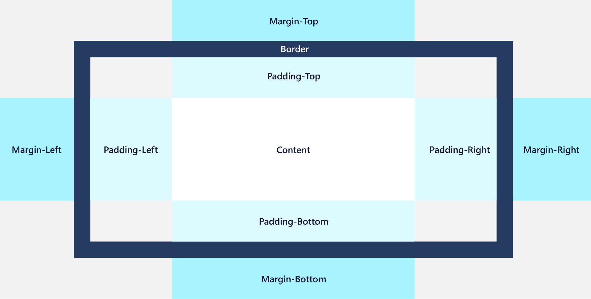


**基本用法**

```xml
<Border Background="LightBlue"
        BorderBrush="DarkBlue"
        BorderThickness="2"
        CornerRadius="8"
        Padding="10">
    <StackPanel>
        <TextBlock Text="用户信息" FontWeight="Bold"/>
        <TextBlock Text="姓名：张三" />
    </StackPanel>
</Border>
```

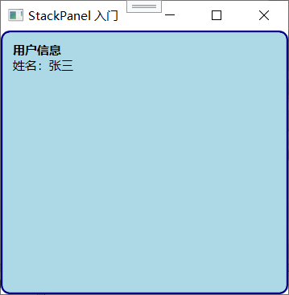

效果就是一块浅蓝色圆角矩形区域，里面文字和边框之间距离 10 单位（由 Padding 控制），而 `Border` 自己与外部其他元素之间的距离可以用 `Margin` 控制。
如果上图的Padding=0效果如下
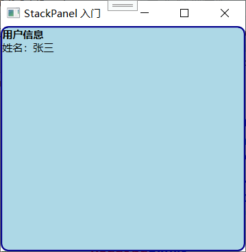


**Border 和 StackPanel 配合的场景**

`StackPanel` 自己不能直接画边框，所以你经常会见到这种模式：

```xml
<Border BorderBrush="Gray" BorderThickness="1" Margin="5" Padding="5">
    <StackPanel>
        <!-- 一组相关控件 -->
    </StackPanel>
</Border>
```

这样，这一组控件就有了视觉上的分组感。如果多个 `Border` + `StackPanel` 组合叠在一个大面板里，就能快速实现带卡片的列表、仪表盘小部件、分组表单等常见界面模式。

**为什么不是直接在控件上设背景和边框？**

WPF 里大多数控件（比如 `TextBox`、`ListBox`）自己都有 `Background` 和 `BorderBrush` 属性，那为什么还需要 `Border` 控件？两个原因：

一是像 `StackPanel`、`Grid` 这种纯粹的布局面板没有背景和边框属性，想给一个区域整体加装饰，只能靠 `Border` 包裹。

二是即使某个控件有背景，你有时候想在一个控件组外围加统一装饰，而不是装饰单控件。比如你想让一个分组框拥有标题、背景和边框，那通常就是一个 `Border`（或 `GroupBox` 控件）包住一个 `StackPanel`。

**性能考量**

`Border` 作为 `Decorator` 子类，本身并不重。它内部没有复杂的布局逻辑，只是在排列时把 `Padding` 空间扣除后再给子元素安排位置，然后在渲染时多画一个背景和边框。所以大量使用并不至于拖垮性能。但它毕竟多了一层视觉树节点，如果一个列表有几千行每行都用一个 `Border` 包裹，就需要注意虚拟化等优化（后面讲 ListBox 时再说）。常规窗口里用几十个 `Border` 完全没压力。

**CornerRadius 的视觉效果**

`CornerRadius` 可以实现很现代的圆角卡片风格，WPF 因为是矢量的，这个圆角在任何 DPI 下都是平滑的。但是它有个小局限：如果你把 `BorderThickness` 设得太厚，而 `CornerRadius` 太小，外角和内角可能错位视觉怪异，一般半径要明显大于边框厚度才好看。

**小技巧：只给一边设边框**

`BorderThickness` 是 `Thickness` 类型的，所以你可以用 “左 上 右 下” 四个数的写法，比如 `BorderThickness="0,0,0,1"` 就只在底部画一条 1 单位粗的线，做分隔线效果。（这比单独用 `Separator` 控件或 `Rectangle` 灵活一些。）

**Border 和 Margin、Padding 三个概念的区分**

这里再总结一下，因为这三个词英文意思也相近，容易混：

- **Margin**：元素的外边距，推远别人的。属于元素自己。
- **Padding**：`Border` 或 `ContentControl`（比如 `Button`）内部内容到边框内边缘的距离，向内缩。
- **BorderThickness**：边框本身的粗度。

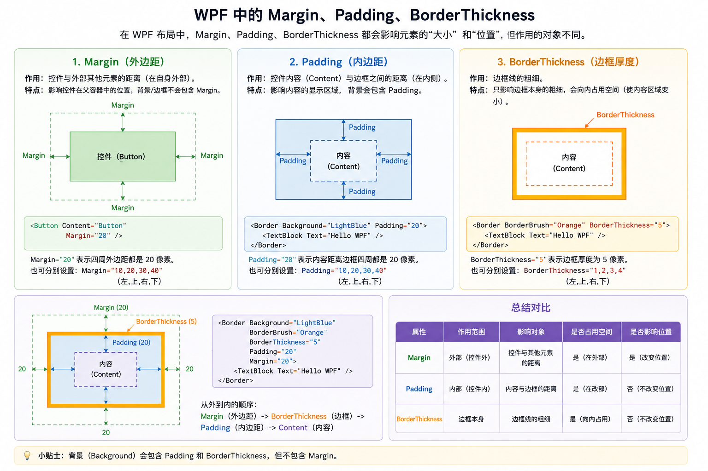


**Border 对 StackPanel 里面元素的约束作用**

当你用 `Border` 包住 `StackPanel` 时，`Border` 的 `Padding` 会减少 `StackPanel` 的所有子元素可用空间。比如：

```xml
<Border Padding="10">
    <StackPanel>
        <Button Content="按 钮" />
    </StackPanel>
</Border>
```

那个按钮的可用宽度比没有 `Padding` 时窄了左右各 10。这个效果等价于给 `StackPanel` 本身设置 `Margin="10"`（但 Margin 是向外推，Padding 是向内挤）。注意，如果 `Border` 已经固定了 `Width`，`Padding` 会导致内容可用宽度变小；如果 `Border` 大小由内容决定（内容驱动），那加了 `Padding` 后 `Border` 尺寸会变大，以维持内容需要的空间。

---

好了，3.2 节就全部拆解完了。咱们把 `StackPanel` 从生到熟，把怎么排列、怎么对齐、怎么留空隙、怎么约束尺寸、怎么加装饰，全过了一遍。

**这节核心一张图收住：**

- `StackPanel` 的主方向由 `Orientation` 定，你要一溜竖排还是横排。
- 非排列方向的抢占和留白由 `HorizontalAlignment`/`VerticalAlignment` + `Margin` 配合搞定。
- 不要写死 `Width`/`Height`，用 `Min`/`Max` 四件套给弹性的同时拴住不合理的极端情况。
- 想要背景、圆角、边框、分组视觉效果，就用 `Border` 把 `StackPanel`（或别的东西）包起来。

下节要讲 `WrapPanel` 和 `DockPanel`，`WrapPanel` 可以看成会换行的 `StackPanel`，`DockPanel` 则是老牌布局模型的现代化身。`StackPanel` 这块石头落稳了，再上手那俩就非常快。