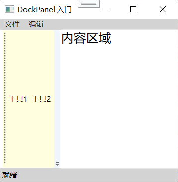
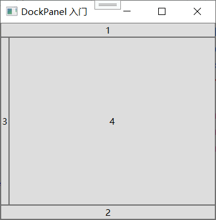
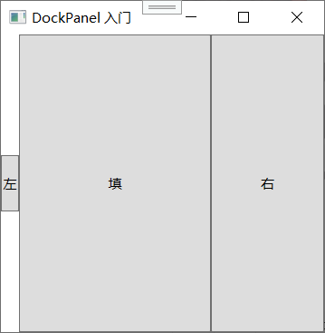
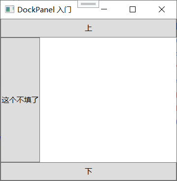
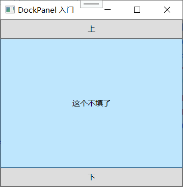
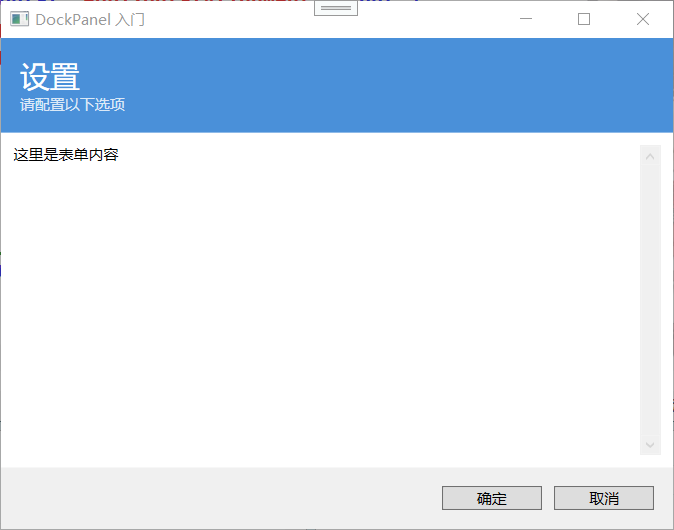

## WrapPanel 和 DockPanel 面板

上一节把 `StackPanel` 从头到脚拆了一遍，你已经掌握了怎么把一堆控件排成一行或一列。`StackPanel` 好用是好用，但它有个硬伤：**如果空间不够，元素就直接被截断，消失在边缘外，不会自动换行**。比如你水平排了十个按钮，窗口一缩，右边的按钮就看不见了，连个滚动条都不给你（除非你外面包了 `ScrollViewer`）。

这一节要学的两个面板正好弥补 `StackPanel` 的不足：

- **`WrapPanel`**：解决“装不下了就换行”的痛点。像文字自动换行一样，控件排到头了自动折到下一行。
- **`DockPanel`**：解决“我要把控件贴在容器的某一边，剩下的空间给中间内容”这种需求。经典的“菜单在顶部、状态栏在底部、导航在左边、内容填中间”布局就是它。

最后还会讲到**嵌套布局容器**——这是整个 WPF 布局体系里最重要、也最常用的高级技巧。实际项目里，没有任何一个面板能单独扛下整个界面，你总是用各种面板一层层套起来，像搭积木一样组合出你想要的布局结构。

---

### WrapPanel 面板

**WrapPanel 是什么？**

`WrapPanel` 可以看作是 `StackPanel` 的“换行升级版”。它在排列方向上和 `StackPanel` 一样，把子元素一个接一个码过去（水平排或垂直排）。但是，当一行（或一列）放不下下一个元素时，它不会硬塞到看不到的地方，而是**自动换到下一行（或下一列）继续排**。

这跟 HTML 里没有 CSS flexbox 之前，大家用 `float:left` 或者 `inline-block` 实现的“自动换行列表”效果非常像。如果你做过网页，应该秒懂。

**Orientation 属性的双重含义**

和 `StackPanel` 一样，`WrapPanel` 也有 `Orientation` 属性，取值也是 `Horizontal` 和 `Vertical`。但是，`WrapPanel` 里 `Orientation` 的含义比 `StackPanel` 更丰富一些，因为它不仅决定了“子元素往哪个方向堆”，还决定了“空间不够时换到哪去”：

**`Orientation="Horizontal"`（默认）**：
- 子元素从左到右依次排。
- 当前行放不下下一个元素时，换到下一行继续排。
- 每一行的高度由该行最高的那个元素决定（跟文字排版里一行的高度由最大字体决定一个道理）。
- 所有行的宽度一致，填满 `WrapPanel` 的整个宽度。

**`Orientation="Vertical"`**：
- 子元素从上到下依次排。
- 当前列放不下下一个元素时，换到下一列继续排。
- 每一列的宽度由该列最宽的那个元素决定。
- 所有列的高度一致，填满 `WrapPanel` 的整个高度。

**基础示例**

```xml
<WrapPanel Orientation="Horizontal">
    <Button Content="短" />
    <Button Content="中等长度" />
    <Button Content="这个按钮文字比较长" />
    <Button Content="又短了" />
    <Button Content="按钮五" />
    <Button Content="按钮六" />
    <Button Content="按钮七" />
    <Button Content="按钮八" />
    <Button Content="按钮九" />
    <Button Content="按钮十" />
</WrapPanel>
```

如果窗口足够宽，十个按钮全在一行；你把窗口拖窄，空间逐渐缩小时，后面的按钮会依次掉到下一行，始终保持所有按钮都看得见。

这种自适应行为非常适合**标签列表、缩略图墙、工具栏（当工具按钮过多时自动折行）、图标网格**等场景。


**ItemHeight 和 ItemWidth**

`WrapPanel` 有两个独有的属性：`ItemHeight` 和 `ItemWidth`。它们允许你**给所有子元素统一指定一个标准的高度或宽度**，这在 `StackPanel` 里没有（`StackPanel` 里每个子元素自有高度/宽度）。

这在制作“格子布局”时特别有用。比如你要在一个 `WrapPanel` 里显示一堆缩略图，每张图你都希望它们宽度统一为 120，高度统一为 100，不管原始图片多大。那就直接设：

```xml
<WrapPanel ItemWidth="120" ItemHeight="100">
    <!-- 一堆 Image 或者带图的 Button -->
</WrapPanel>
```

所有子元素就自动被限在这个统一尺寸格里。

如果 `WrapPanel` 是 `Orientation="Horizontal"`，`ItemHeight` 设置后，每一行的所有元素高度就强制为这个值（有的控件内容少会在垂直方向留白，靠 `VerticalAlignment` 调整）；同理，`ItemWidth` 设置后，每个元素宽度固定。在 `Vertical` 方向下相应地反过来起作用。

**与 StackPanel 的对比**

| 特性 | StackPanel | WrapPanel |
|------|-----------|-----------|
| 排列方式 | 一行或一列，无限延伸 | 多行或多列，自动换行/换列 |
| 超出空间时 | 被截断 | 换行/换列 |
| 子元素尺寸 | 各自自然尺寸 | 各自自然尺寸（或受 ItemWidth/ItemHeight 约束） |
| 常用场景 | 固定数量的线性排列 | 数量不确定、需响应窗口宽度的排列 |

其实 `WrapPanel` 内部的换行逻辑基本上就是：“我把子元素排布想象成一串珠子，空间就是盒子宽度，一行塞满了，我就在这行最末尾砍断，剩下的珠子从下一行开始继续串。”而每一行的高度取决于该行珠子中最大的那一颗。

**对齐在 WrapPanel 中的表现**

`WrapPanel` 里的对齐行为和 `StackPanel` 基本一致，但由于换行多行的存在，有些细微差别需要注意：

- **水平排列时**：`VerticalAlignment` 作用在每一行内部。如果行高大于该行某个元素的高度，该元素可以根据 `VerticalAlignment` 决定自己是贴顶、居中还是贴底。
- **垂直排列时**：`HorizontalAlignment` 作用在每一列内部。
- 在排列方向上，同样因为空间根据内容动态，`HorizontalAlignment`（水平排列时）或 `VerticalAlignment`（垂直排列时）基本看不出效果。

**WrapPanel 在实际开发中的定位**

`WrapPanel` 算是“需要一点点自适应，但又不至于上 `Grid` 那么复杂”的中间选择。比如一个设置页面里排几十个勾选框，用 `WrapPanel` 自动根据窗口宽度换行非常合适。再比如做一个表情包选择器，每个表情是一个小按钮，用 `WrapPanel` 可以自然的形成多行网格。

但是它有个短板：**不适合做严格对齐的表格**。比如你希望每一列的宽度统一、每一行的高度统一且内容能拉伸填满，那 `WrapPanel` 做不到这样精确的控制，那种需求应该上 `UniformGrid` 或 `Grid`。

---

### DockPanel 面板

**DockPanel 的直觉**

`DockPanel` 是 WPF 里实现**停靠布局**的面板。它的布局原则听起来就像一条很自然的规则：“子元素可以贴到我的上下左右任何一条边上，剩下的没被占的中心区域就给最后那个子元素填满。”

这个模型完全对应了经典桌面应用的布局结构：

- 菜单栏贴在顶部（Dock.Top）
- 状态栏贴在底部（Dock.Bottom）
- 工具栏或导航栏贴在左侧（Dock.Left）
- 属性面板贴在右侧（Dock.Right）
- 中间的主工作区填满剩余全部空间

一张嘴说不如看代码：

```xml
<DockPanel>
    <Menu DockPanel.Dock="Top" Background="LightGray">
        <MenuItem Header="文件" />
        <MenuItem Header="编辑" />
    </Menu>
    <StatusBar DockPanel.Dock="Bottom" Background="LightGray">
        <StatusBarItem Content="就绪" />
    </StatusBar>
    <ToolBar DockPanel.Dock="Left" Background="LightYellow">
        <Button Content="工具1" />
        <Button Content="工具2" />
    </ToolBar>
    <Grid Background="White">
        <TextBlock Text="内容区域" FontSize="20" />
    </Grid>
</DockPanel>
```



效果就是典型的三段式布局：顶部菜单、底部状态栏、左边工具栏、中间白底内容区。

**核心附加属性：`DockPanel.Dock`**

`DockPanel` 通过一个附加属性 `DockPanel.Dock` 来控制每个子元素的停靠边。可取值：

- `Top`（默认，如果你不指定就是 Top）
- `Bottom`
- `Left`
- `Right`

注意：**`DockPanel` 的默认 Dock 是 `Left` 还是 `Top`？** 答案是：如果不写 `DockPanel.Dock`，默认值是 `Left`。所以下面两个写法等价：

```xml
<Button Content="点" DockPanel.Dock="Left" />
<Button Content="点" />
```

这跟很多老式 Windows 开发者的直觉（默认应该是 Top 或 Fill）不一样，是初学者容易犯错的地方。所以给自己设个规矩：**只要用 `DockPanel`，就显式给每个子元素写清楚 `DockPanel.Dock="xxx"`，最后一个填中间的元素才不用写**。

**DockPanel 的子元素排列顺序很重要！**

`DockPanel` 不是看你写的 Dock 值来排的，而是**严格按照子元素的声明顺序依次“贴边”**。这个特性非常重要且容易被忽视。

举个例子：

```xml
<DockPanel>
    <Button Content="1" DockPanel.Dock="Top" />
    <Button Content="2" DockPanel.Dock="Bottom" />
    <Button Content="3" DockPanel.Dock="Left" />
    <Button Content="4" />
</DockPanel>
```

布局过程是这样的：
1. 把按钮 1 贴到顶部，占掉顶部空间。
2. 剩余空间里，把按钮 2 贴到底部。
3. 再剩余的空间里，把按钮 3 贴到左边。
4. 剩下的所有空间全给按钮 4。



这说明子元素依次瓜分空间，先来的先占，后来的只能在剩下的区域里操作。

**特别坑的例子**：

```xml
<DockPanel>
    <Button Content="左" DockPanel.Dock="Left" Height="50" />
    <Button Content="右" DockPanel.Dock="Right" Width="100" />
    <Button Content="填" />
</DockPanel>
```

顺序是左、右、填。按钮“左”先占了左边，高度 50（注意它在 Dock 方向的宽度由内容或 Width 决定），按钮“右”在剩余空间的右边占了一块 100 宽的区域，最后中间的按钮“填”得到中间剩下的全部。一切正常。


如果顺序换一下：

```xml
<DockPanel>
    <Button Content="填" />
    <Button Content="左" DockPanel.Dock="Left" Height="50" />
</DockPanel>
```

第一个“填”是默认 Left，所以它先占了左边。然后“左”再想占左边，只能贴到剩余空间的左边去了。结果两个都在左侧，视觉上乱套。所以**建议永远把你确定要填满中心的元素放最后**，前面的都显式 Dock。

**LastChildFill 属性**

`DockPanel` 有一个专有属性叫 `LastChildFill`，默认值为 `true`。意思是：**最后一个子元素会自动填满所有剩余空间**，不管它有没有写 `DockPanel.Dock`。

如果你把 `LastChildFill` 设为 `false`，最后一个子元素就不会自动填满，它会和其他元素一样按照它的 Dock 设置（或默认 Left）去贴边，剩余空间就留白。

```xml
<DockPanel LastChildFill="False">
    <Button Content="上" DockPanel.Dock="Top" Height="30" />
    <Button Content="下" DockPanel.Dock="Bottom" Height="30" />
    <Button Content="这个不填了"/>
</DockPanel>
```


第三个按钮就不会填满中间，而是按默认的 `Left` 贴在左边，只占它自己的宽度，中间留出空白。




绝大多数时候，`LastChildFill` 保持 `true` 最自然，这也是你心里想的那种“主内容区填满”的效果。


**停靠方向和控件尺寸的关系**

当一个元素被 Dock 到某一边时，在停靠方向上的长度由元素自己决定：

- Dock.Top / Dock.Bottom：元素的**高度**自己说了算。
- Dock.Left / Dock.Right：元素的**宽度**自己说了算。

而在另一方向上（垂直方向对于 Top/Bottom，水平方向对于 Left/Right），**元素会被拉伸到填满整个容器的对应维度**。

以 `Dock="Top"` 为例：

- 高度：由按钮内容或显式 Height 决定。
- 宽度：自动拉伸到整个 DockPanel 的宽度。

所以顶部的菜单、工具栏，通常你只关心它们的高度（一行高就够了），宽度交给 DockPanel 自动搞定。左侧导航面板，你只关心它的宽度，高度自动拉满整个窗体的高度。

**在 DockPanel 里对齐和 Margin 的用法**

`Margin` 在 `DockPanel` 里依然重要，用来制造元素之间的间隔，避免全都贴死在一起难看。

`HorizontalAlignment` 和 `VerticalAlignment` 在 `DockPanel` 里也依然有效，但作用范围受停靠限制。比如一个 `Dock="Left"` 的控件，它在水平方向已经贴左边了，`HorizontalAlignment` 基本没效果，但在垂直方向可以用 `VerticalAlignment` 来控制它是贴顶部、居中还是贴底部。

---

### 嵌套布局容器

**为什么必须学嵌套？**

前面讲了 `StackPanel`、`WrapPanel`、`DockPanel`，你可能会觉得：“就这？不管哪个面板，撑死也就满足一种二维排列方式，现实中的界面那么复杂，光靠一个面板哪够？” 你说得完全对。**单个面板能解决的布局非常有限，现实界面都是用多个面板一层套一层搭建起来的。**

这就是“嵌套布局容器”的意义：**每个面板只管自己的那层局部布局，复杂界面通过层层组合来实现**。

这跟搭 HTML 页面时，一个 `div` 套另一个 `div`，外层用 flexbox、内层用 grid，一层层嵌套的道理完全一样。WPF 里的 `StackPanel`、`DockPanel`、`Grid` 就是你手里的 div，它们的嵌套构成了整个界面的骨架。

**嵌套的直觉例子**

需求：一个设置窗口，整体顶部是标题和图标、中间是表单区、底部是确定/取消按钮行。

用单个面板做不到三块区域明确分开。自然的就是用一个外层面板切出三大块，每个大块内部再各自另用面板细化。

`DockPanel` 特别适合这种外科手术式的“切大区域”：

```xml
<DockPanel>
    <!-- 顶部标题区 -->
    <Border DockPanel.Dock="Top" Background="#4A90D9" Padding="15">
        <StackPanel>
            <TextBlock Text="设置" FontSize="24" Foreground="White" />
            <TextBlock Text="请配置以下选项" Foreground="White" Opacity="0.8" />
        </StackPanel>
    </Border>

    <!-- 底部按钮区 -->
    <Border DockPanel.Dock="Bottom" Padding="10" Background="#F0F0F0">
        <StackPanel Orientation="Horizontal" HorizontalAlignment="Right">
            <Button Content="确定" Margin="5" Width="80" />
            <Button Content="取消" Margin="5" Width="80" />
        </StackPanel>
    </Border>

    <!-- 中间表单区 -->
    <ScrollViewer Margin="10">
        <Grid>
            <!-- 具体表单内容省略，后面Grid节会讲 -->
            <TextBlock Text="这里是表单内容" />
        </Grid>
    </ScrollViewer>
</DockPanel>
```



逐层分析一下：

1. **最外层**：`DockPanel`，把窗口切成上、中、下三大块。
2. **顶部**：一个 `Border` 做背景色容器，里面用一个 `StackPanel` 垂直放标题和副标题。
3. **底部**：一个 `Border` 做底色，里面用一个水平 `StackPanel` 把两个按钮右对齐水平排好。
4. **中间**：因为内容可能很长，塞进 `ScrollViewer`。里面的表单具体结构等学到 `Grid` 再细化（比如可以用 `Grid` 划出行列放标签和输入框）。


这样整个界面的布局就清清楚楚，每一部分都有自己的“小管家”，互不干扰。

**嵌套时要注意的三件事**

**第一：理解每个面板的“职责边界”**

当你在设计嵌套时，脑子里要清楚每一层面板负责哪个局部排列。不要试图让一个面板管所有事。拿上面的例子：顶部标题和副标题是垂直排列，那就自然用 `StackPanel`，而不是整个顶层都用 `StackPanel`，因为顶层需要上中下三分区，这不是 `StackPanel` 的强项。

**第二：避免不必要的深度嵌套**

嵌套虽然强大，但每多一层视觉树节点，就要多一层测量和排列的开销。如果十个 `StackPanel` 套在一起只为了放一个按钮，那就是过度设计了。WPF 布局性能在正常嵌套深度下（三五层）完全没问题，但如果嵌套到十几层，并且频繁重新布局，就可能卡顿。所以该合并的时候可以合并（比如用 `Grid` 代替多层 `StackPanel` 组合），后面学了 `Grid` 之后你会对“什么时候该用 Grid 减少嵌套”更有感觉。

**第三：注意尺寸传递和 Margin 叠加**

嵌套面板时，外层面板的尺寸约束（`Width`、`Height`、`Min/Max`、`Padding` 等）会层层往下传递。如果每层都加 `Margin`，间隔会叠加，可能让界面比预期松散。一般只在最外层的控件间加 `Margin`，内层面板紧凑排列，除非有特殊需求。

**嵌套布局的通用设计流程**

对于比较复杂的界面，有个行之有效的“从上到下分解法”：

1. **先看大块的区域划分**：整体是上下结构？左右结构？还是卡片网格？这决定了最外层用什么面板。这个过程中问自己：
   - 有没有明确的“顶、底、左、右”边界？→ `DockPanel`
   - 是一维排列的多个大区？→ `StackPanel`
   - 是规则的网格状分布？→ `Grid`（下一节讲）
2. **对每个大块再分解**：比如顶部区域里，标题和工具栏怎么排？
3. **一层层往下细化**，直到每个局部都简单到用一个 `StackPanel` 或几行 `Grid` 就能搞定的程度。
4. **最后加上 `Border` 或 `Margin`、`Padding` 等装饰性调整**。

**嵌套与 MVVM 的关系（顺手一提）**

学到这里你可能还没接触 MVVM，但嵌套布局其实为 MVVM 提供了物理基础。因为 MVVM 强调 View（界面）和 ViewModel（数据/逻辑）分离，而 View 自身通过嵌套的 `UserControl` 拆分模块。比如你一个主窗口，可能每个大区域都不是直接一堆控件，而是一个独立的 `UserControl`（它内部又是一个完整的 XAML 树），主窗口的布局只要把几个 `UserControl` 摆好位置即可。`UserControl` 内部的布局又可以用各种面板嵌套。这种模块化拆分，让复杂项目变得可维护。

**表格总结三种面板的定位**

| 面板         | 一句话定位       | 缺点           |
| ---------- | ----------- | ------------ |
| StackPanel | 线性排列，简单直接   | 超出空间不换行      |
| WrapPanel  | 线性排列 + 自动换行 | 不能做严格对齐的表格   |
| DockPanel  | 贴边停靠，主区填满   | 不适合复杂网格或均匀排列 |

而嵌套就是：**在 `DockPanel` 的主区域里放 `Grid`，在 `Grid` 的某个格里放一个 `StackPanel`，在 `StackPanel` 的一个位置上再放一个 `WrapPanel`……** 各种面板取长补短，互相配合。

**嵌套中的事件和命名注意事项**

当你把面板嵌套好几层时，控件树的深度就上来了。如果你在 XAML 里用 `x:Name` 给某个深层按钮起名字，它在代码隐藏里直接就能访问到（因为它是类的字段）。不需要沿着树去找，这就是编译 XAML 的好处。

但有一种情况要注意：如果你动态加载了某个嵌套的用户控件或 XAML，那在父级不能直接访问子级的命名元素，因为它们是两个不同的 XAML 编译单元。这时需要通过公开属性或数据绑定来传递。这部分属于控件开发和 MVVM 的进阶，后面会学到。

---

好了，3.3 节到此就彻底讲完了。你现在手里有了 **StackPanel**（线性排列）、**WrapPanel**（自动换行排列）、**DockPanel**（停靠填充布局）三张牌。单个面板的本事你都会了，更重要的是，你理解了嵌套才是解决真实界面复杂度的王道。

下一节 3.4 要学的是 WPF 里最重磅、最通用、也最需要花心思掌握的面板——**Grid 面板**。Grid 是布局世界的大 Boss，学会它你就从“能布局”升级到“精确掌控布局”。
