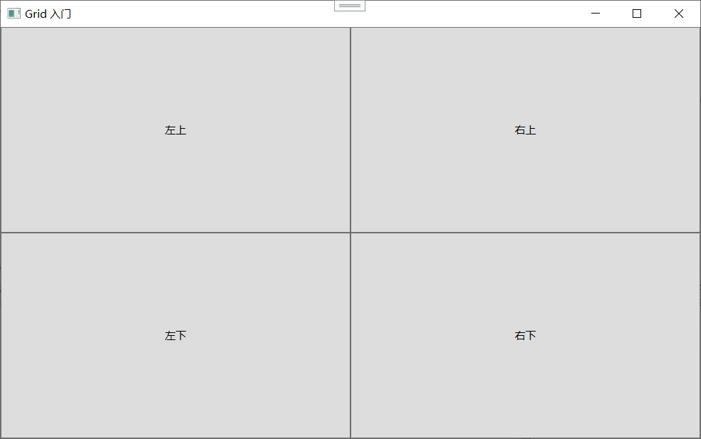
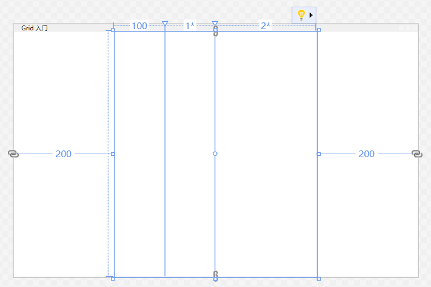
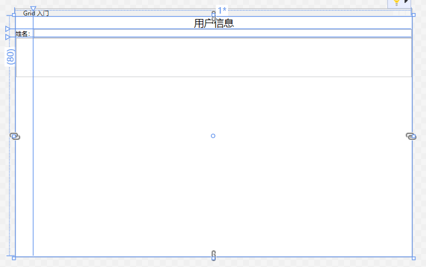
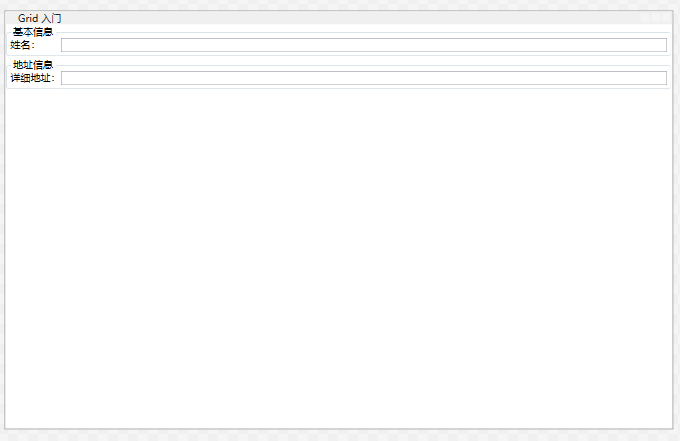

## Grid 面板

前面学完了 `StackPanel`、`WrapPanel`、`DockPanel`，你可能会想：这些面板要么只能排一溜，要么只能贴边，碰上那种规规整整的表格型界面怎么办？比如一个设置页面，左边好几排标签，右边对应好多个输入框，还得上下对齐。这时候用 `StackPanel` 套 `StackPanel` 倒是能凑合，但列会歪、行会错，费半天劲还不如直接画个表格来的整齐。

WPF 的设计者们当然想到了这一点，所以就有了 **`Grid`** 面板——整个 WPF 布局系统里最强大、最灵活、也是使用频率最高的面板。可以毫不夸张地说，**绝大多数正经 WPF 应用的主界面骨架，要么直接就是 `Grid`，要么是 `DockPanel` 包着 `Grid`，再或者一堆 `Grid` 嵌套。** 把 `Grid` 吃透，你的布局能力就上了一个大台阶。

`Grid` 的核心理念很简单：**把空间切分成行和列，形成一个网格，然后把子元素放进这些格子里。** 它们之间的相对位置和对齐都由格子约束，而不是手动调像素。

但这“切格子”三个字里藏着大量细节：行高列宽怎么定？几种尺寸模式各是什么脾气？子元素怎么跨行跨列？格子的尺寸会不会跟外面其他 Grid 联动？怎么让用户拖拽改变格子大小？还有个 `UniformGrid` 是怎么回事？3.4 这一节就是逐一把这些问题讲得明明白白。

---

### 调整行和列

**Grid 的基本结构**

先看一个最简单的 `Grid`：

```xml
<Grid>
    <Grid.RowDefinitions>
        <RowDefinition />
        <RowDefinition />
    </Grid.RowDefinitions>
    <Grid.ColumnDefinitions>
        <ColumnDefinition />
        <ColumnDefinition />
    </Grid.ColumnDefinitions>

    <Button Grid.Row="0" Grid.Column="0" Content="左上" />
    <Button Grid.Row="0" Grid.Column="1" Content="右上" />
    <Button Grid.Row="1" Grid.Column="0" Content="左下" />
    <Button Grid.Row="1" Grid.Column="1" Content="右下" />
</Grid>
```



这里出现了几个核心组件：

- **`Grid.RowDefinitions`**：定义行。里面可以放多个 `RowDefinition` 元素。
- **`Grid.ColumnDefinitions`**：定义列。里面可以放多个 `ColumnDefinition` 元素。
- **`Grid.Row`**：附加属性，指定子元素放在第几行。索引从 0 开始。
- **`Grid.Column`**：附加属性，指定子元素放在第几列。索引从 0 开始。

`RowDefinition` 和 `ColumnDefinition` 本身可以有属性来指定尺寸。格式有三种写法：

**1. 固定尺寸**（绝对像素或 WPF 单位）

```xml
<RowDefinition Height="30" />
<ColumnDefinition Width="100" />
```

这种写死了高度/宽度的值。比如 `Height="30"` 就是该行高度永远是 30。虽然上一章一直在强调不要写死控件尺寸，但对于 Grid 的行列来说，写死某些行高是很常见的，比如顶部标题栏高度、底部状态栏高度，你希望它们永远不变，这种就可以用固定尺寸。但要注意，这违反自适应原则，如果用得太多，窗口缩小时这些固定尺寸的行列会挤占可变行列的空间，出现裁剪或布局异常。

**2. 自动尺寸**

```xml
<RowDefinition Height="Auto" />
<ColumnDefinition Width="Auto" />
```

`Auto` 的意思是：**这一行（或列）的尺寸刚好容纳它里面最大的那个元素的内容**。如果该行里面有个按钮的高度是 35，那这行高度就变成 35；如果没有元素或者元素高度为 0，这一行就塌陷到看不见。`Auto` 非常适合标题行、分隔行、或根据内容动态变化大小的区域，比如一个输入框所在行，行高可能随字体大小变化。

**3. 比例尺寸（星号尺寸）**

```xml
<RowDefinition Height="*" />
<RowDefinition Height="2*" />
<ColumnDefinition Width="3*" />
```

星号 `*` 是最能体现 WPF 自适应布局精髓的地方。它的意思是：**把剩余空间按比例分配**。

什么叫“剩余空间”？先看一个例子：

```xml
<Grid Width="400">
    <Grid.ColumnDefinitions>
        <ColumnDefinition Width="100" />
        <ColumnDefinition Width="*" />
        <ColumnDefinition Width="2*" />
    </Grid.ColumnDefinitions>
</Grid>
```



这个 Grid 总宽 400。第一列固定 100，剩下 300 的空间由第二列和第三列瓜分。`*` 等价于 `1*`，即占据 1 份；`2*` 占据 2 份。所以 300 被分成 1+2=3 份，第二列得 1 份 = 100，第三列得 2 份 = 200。总列宽：100 + 100 + 200 = 400。

当你把窗口拉大，Grid 的总宽变大，固定列 100 不变，多出来的空间依然按 1:2 的比例追加到第二和第三列。窗口变小同理，比例始终维持不变。

星号尺寸非常强大，因为它让你可以描述“这个面板左侧导航固定 200 宽，中间内容填满，右边属性面板占左边剩下空间的一半”这种相对关系，而不用挂钩窗口尺寸变化的代码事件。

**混合使用**

一个典型的 Grid 往往混合这三种尺寸：

```xml
<Grid.RowDefinitions>
    <RowDefinition Height="Auto" />    <!-- 头部，随内容高度 -->
    <RowDefinition Height="*" />       <!-- 内容区，撑开剩余空间 -->
    <RowDefinition Height="30" />      <!-- 底部状态栏，固定高度 -->
</Grid.RowDefinitions>
<Grid.ColumnDefinitions>
    <ColumnDefinition Width="200" />   <!-- 固定宽度导航 -->
    <ColumnDefinition Width="2*" />    <!-- 主要内容区 -->
    <ColumnDefinition Width="*" />     <!-- 属性面板 -->
</Grid.ColumnDefinitions>
```

**RowDefinition 和 ColumnDefinition 的属性**

除了 `Height` 和 `Width`，定义行和列时还可以设置 `MinHeight`/`MaxHeight` 和 `MinWidth`/`MaxWidth`。这些用来给比例尺寸或自动尺寸的行列加上限制。比如：

```xml
<RowDefinition Height="*" MinHeight="50" MaxHeight="300" />
```

即使 `*` 分配给它很多空间，它也不会超过 300，也不会低于 50（低于 50 会放弃比例计算强制维持 50，这可能会挤压其他行）。

**代码里动态增减行列**

你也可以在 C# 里面动态地添加或删除行列：

```csharp
myGrid.RowDefinitions.Add(new RowDefinition { Height = new GridLength(100) });
myGrid.ColumnDefinitions.Insert(0, new ColumnDefinition { Width = GridLength.Auto });
```

子控件通过 `Grid.SetRow(child, 1)`、`Grid.SetColumn(child, 2)` 来指定位置。

**不指定 Row/Column 的子元素**

如果一个子元素没有设置 `Grid.Row` 和 `Grid.Column`，默认是第 0 行第 0 列。如果有多个元素都默认在第 0 行第 0 列，它们会重叠在一起。这在很多时候是多打了个控件，通常要避免，除非你故意要实现叠加效果。

---

### 布局舍入

**什么是布局舍入？**

WPF 使用设备无关像素（1 WPF 单位 = 1/96 英寸）来布局。在标准 96 DPI 屏幕下，1 WPF 单位恰好对应 1 个物理像素。但在高 DPI 或设置了非标准缩放（比如 125%）的情况下，经过测量和排列，一个元素的边缘可能会落到两个物理像素之间，例如一个矩形的左边缘在像素 10.5 的位置。显示器只能显示整数像素，这就会导致边缘模糊、半透明化（抗锯齿），看起来好像对焦不准。

这种模糊在矢量图形中一般用于让斜线更平滑，但对于界面布局（尤其是按钮、格子边框）来说，大家更希望边缘干脆、和物理像素对齐，显得清晰锐利。

WPF 提供了一个特性叫**布局舍入（Layout Rounding）**，确保所有布局计算后的尺寸和位置都整整齐齐对齐到物理像素边界，避免模糊。

**如何使用布局舍入**

在带有子元素的容器（如 `Grid`）上设置 `UseLayoutRounding="True"` 即可启用布局舍入：

```xml
<Grid UseLayoutRounding="True">
    <!-- 子元素 -->
</Grid>
```

`UseLayoutRounding` 定义在 `FrameworkElement` 上，所以几乎所有的控件和面板都可以设置。

启用后，WPF 在测量和排列结束时会微调元素的位置和尺寸，使它们的边缘正好落在最近的全像素边界上。这样避免了抗锯齿导致的模糊。对于文本、图标尤其重要，因为它们模糊后字看起来发虚。

**实际效果和取舍**

- **清晰布局**：边界清晰、文字锐利，适合传统界面。
- **微小位移**：因为要强制对齐像素，可能某些元素会偏移 0.x 个像素，在大多数界面中完全不可察觉。但如果界面中有极其紧密的像素级对齐的动画或图形，可能会产生轻微抖动。
- **对性能的影响**：几乎可以忽略，只是最终排列时多了一步取整操作。
- **默认值**：在 WPF 4 及之后，许多控件默认就开启了 `UseLayoutRounding`（比如 `StackPanel`、`Grid` 等都默认设为 `true`），所以大多数时候你感觉不到模糊。但如果在某些自定义控件或特定场景下发现界面模糊，可以检查是否开启了这个属性。

**模糊还有一种情况——SnapsToDevicePixels**

还有一个容易混淆的属性 `SnapsToDevicePixels`，它也是为了解决像素对齐，但作用方式更底层，是让渲染器在绘制图形元素时把像素边界对齐到设备像素。现在微软推荐用 `UseLayoutRounding` 替代，因为它对整个布局树生效且更彻底。但某些第三方控件或旧代码可能还用 `SnapsToDevicePixels`。

对于初学者，只要记住：**如果你的界面莫名模糊，先检查外层容器是否设了 `UseLayoutRounding="True"`，以及系统 DPI 缩放是否合理**。

---

### 跨越行和列

很多界面并不是每个格子只放一个控件，经常需要让一个控件跨越多列或多行。比如一个表格的标题栏横跨顶部整行；再比如一个表单左侧有标签，右侧有一个大文本框，占多行；又或者最后一个“确定”按钮居中占一整行。

在 `Grid` 里，这依靠两个附加属性实现：

- `Grid.RowSpan`：跨越的行数
- `Grid.ColumnSpan`：跨越的列数

**基本语法**

```xml
<Grid>
    <Grid.RowDefinitions>
        <RowDefinition Height="Auto" />
        <RowDefinition Height="Auto" />
        <RowDefinition Height="Auto" />
    </Grid.RowDefinitions>
    <Grid.ColumnDefinitions>
        <ColumnDefinition Width="Auto" />
        <ColumnDefinition Width="*" />
    </Grid.ColumnDefinitions>

    <!-- 标题横跨两列 -->
    <TextBlock Grid.Row="0" Grid.Column="0" Grid.ColumnSpan="2"
               Text="用户信息" FontSize="20" HorizontalAlignment="Center" />

    <!-- 第一行：标签 + 输入框 -->
    <TextBlock Grid.Row="1" Grid.Column="0" Text="姓名：" />
    <TextBox Grid.Row="1" Grid.Column="1" />

    <!-- 第二行：多行文本框跨越两列 -->
    <TextBox Grid.Row="2" Grid.Column="0" Grid.ColumnSpan="2"
             Height="80" AcceptsReturn="True" />
</Grid>
```



效果就是第一行一个居中的标题，第二行左边姓名标签右边输入框，第三行一个大文本框横跨两列。

**RowSpan / ColumnSpan 默认值**

默认都是 1，即只占自己所在的那一行/列。

**跨越和剩余空间的分配**

跨越格子的时候，如果跨列的控件宽度设为 `HorizontalAlignment="Stretch"`（默认就是 Stretch），那它会填满跨越的那些列的总宽度。被跨越的列的宽度仍然由对应的 `ColumnDefinition` 决定，控件的实际宽度就是这些列分配到的宽度之和。

例如上面那个标题的 `ColumnSpan="2"`，它占列 0 和列 1。列 0 是 `Auto`，列 1 是 `*`，所以标题的宽度等于列 0 的宽度加上列 1 的宽度（也就是 Grid 总宽度）。居中后就在整行居中。

同样，跨行时高度逻辑类似。

**跨越时的对齐和Margin**

控件在跨越多列时，仍然可以使用 `HorizontalAlignment` 和 `Margin` 在分配好的大矩形内调整自己的位置。比如跨两列但想让它左对齐，就设置 `HorizontalAlignment="Left"`，它会在那两列组成的大矩形空间内靠左。


**跨越的常见用途**

- **标题分隔线**：一个 `Rectangle` 或 `Border` 跨行或跨列作为视觉分隔。
- **大块内容区域**：比如主内容区跨过很多行和列。
- **按钮栏**：底部几个按钮用 `StackPanel` 包起来，然后放在一个跨越整行的格子里，自身靠右对齐。
- **复杂表头**：模仿 Excel 那种多层合并单元格的表头。

**注意事项**

跨越列的时候要注意不要造成“占位冲突”。比如你在列 0 行 0 放了一个跨两列的元素，又在列 1 行 0 放另一个元素，两个都会出现在列 1 行 0 的位置，导致重叠。设计时要确保每个格子最多有一个有意的元素。

---

### 分割窗口

`Grid` 有一个非常实用的特性：**允许用户在运行时拖动调整行列的大小**，这种效果在很多软件里都能看到——比如 Outlook 的左侧导航和中间内容区可以拖拽分界线来改变左右宽度。

WPF 提供了一个专用控件 **`GridSplitter`** 来实现这个功能。

**GridSplitter 是什么？**

`GridSplitter` 是一个控件，放在 `Grid` 中某个行列里，当用户把鼠标移到它上面时，光标变成双向箭头，拖拽就可以改变它所在的那一行或那一列的尺寸。

**最简单的用法**

假设我们有一个左右两栏的布局，中间有一条分隔线可拖动：

```xml
<Grid>
    <Grid.ColumnDefinitions>
        <ColumnDefinition Width="*" MinWidth="100" />
        <ColumnDefinition Width="Auto" />
        <ColumnDefinition Width="2*" MinWidth="100" />
    </Grid.ColumnDefinitions>

    <!-- 左侧面板 -->
    <Border Grid.Column="0" Background="LightBlue">
        <TextBlock Text="左侧" />
    </Border>

    <!-- 分割线 -->
    <GridSplitter Grid.Column="1" Width="5" 
                  HorizontalAlignment="Stretch" 
                  VerticalAlignment="Stretch" />

    <!-- 右侧面板 -->
    <Border Grid.Column="2" Background="LightGreen">
        <TextBlock Text="右侧" />
    </Border>
</Grid>
```


这里我们把 `GridSplitter` 放在中间一列（列 1），列宽设为 `Auto`。`GridSplitter` 自身宽度设为 5 像素的拖动条。注意给它设置了 `HorizontalAlignment="Stretch"` 和 `VerticalAlignment="Stretch"`，确保它占据整列的高度，看起来就是一条贯穿的线。

运行时，鼠标移到这条线上按住左键左右拖动，就会改变左边 `*` 列和右边 `2*` 列的大小比例。`MinWidth` 的作用是防止用户把某一列拖得太小看不见。

**GridSplitter 的行为控制**

`GridSplitter` 有几个关键属性：

- **`ShowsPreview`**：是否在拖动时显示虚线预览，还是直接实时调整列宽。默认是实时调整（`false`），如果你更喜欢旧式预览虚线可设为 `true`。
- **`ResizeDirection`**：指定拖拽时改变的是行还是列，或者自动检测。值有 `Columns`、`Rows` 和 `Auto`（默认）。`Auto` 会根据分割器的尺寸猜测方向：如果 `Width` 大于 `Height` 就认为是调整列，否则调整行。常用直板分隔条一般都是宽 5 高撑满，方向是 `Columns`。
- **`ResizeBehavior`**：控制拖动时调整哪一侧。值有 `PreviousAndNext`、`PreviousAndCurrent`、`CurrentAndNext`。默认 `BasedOnAlignment`，会根据分割器的对齐方式推断，一般情况下拖拽中间线，行为就是改变左边和右边的分布。通常不需要改这个，除非有特殊需要调整的方向。

**分割行的例子**

类似地可以分割行：

```xml
<Grid>
    <Grid.RowDefinitions>
        <RowDefinition Height="*" MinHeight="50" />
        <RowDefinition Height="Auto" />
        <RowDefinition Height="2*" MinHeight="50" />
    </Grid.RowDefinitions>

    <Border Grid.Row="0" Background="LightYellow">
        <TextBlock Text="上部分" />
    </Border>

    <GridSplitter Grid.Row="1" Height="5" 
                  HorizontalAlignment="Stretch" 
                  VerticalAlignment="Stretch" />

    <Border Grid.Row="2" Background="LightCoral">
        <TextBlock Text="下部分" />
    </Border>
</Grid>
```

分割线是水平的，高度 5，水平拉伸填满，拖拽就改变上下行的高度比例。


**分割行列的例子**
```xml
<Grid>
    <Grid.ColumnDefinitions>
        <ColumnDefinition Width="*" MinWidth="100" />
        <ColumnDefinition Width="Auto" />
        <ColumnDefinition Width="2*" MinWidth="100" />
    </Grid.ColumnDefinitions>
    <Grid.RowDefinitions>
        <RowDefinition Height="*" />
        <RowDefinition Height="Auto" />
        <RowDefinition Height="*" />
    </Grid.RowDefinitions>

    <!-- 左侧面板 -->
    <Border Grid.Column="0" Background="LightBlue">
        <TextBlock Text="左侧1" />
    </Border>

    <Border Grid.Row="2" Grid.Column="0" Background="LightBlue">
        <TextBlock Text="左侧2" />
    </Border>

    <!-- 分割线1 -->
    <GridSplitter Grid.Column="1" Width="5" Grid.RowSpan="3"
              HorizontalAlignment="Stretch" 
              VerticalAlignment="Stretch" />
    <!-- 分割线2 -->
    <GridSplitter Grid.Row="1" Height="20" 
      ResizeDirection="Rows"
      HorizontalAlignment="Stretch"
      VerticalAlignment="Stretch" />

    <!-- 右侧面板 -->
    <Border Grid.Column="2" Background="LightGreen">
        <TextBlock Text="右侧1" />
    </Border>

    <Border Grid.Row="2" Grid.Column="2" Background="LightGreen">
        <TextBlock Text="右侧2" />
    </Border>
</Grid>
```


**注意事项和常见问题**

- **必须给 `GridSplitter` 单独分配一个行列**。不要把分割器跟内容控件放在同一格子里，否则容易混淆。
- **至少有一侧的列是 `*` 或 `Auto`** 才能调整，如果两边都是固定宽度，拖拽没意义。
- **分割器尺寸太小不好操作**，一般至少设 3~5 个单位宽（或高），鼠标才能轻松点到。
- **`GridSplitter` 本身是一个控件**，它的背景默认是透明，所以你可能看不太见。可以用 `Background` 画刷让它可见，或者在样式里给它设置视觉（例如显示几个小圆点）。
- **键盘快捷键**：`GridSplitter` 默认支持键盘，它获得焦点后，可以用方向键微调分隔位置（通过 `KeyboardIncrement` 属性控制步长）。

`GridSplitter` 让 Grid 的灵活性再次提升，从静态布局变成可动态调整的工作区，非常出彩。

---

### 共享尺寸组

**共享尺寸组是什么？**

有时候，你有**多个互相独立的 `Grid` 控件**（比如它们放在不同的 `GroupBox` 里，或不同卡片里），但你希望它们的某些列的宽度保持一致，就像它们被同一个表格约束着一样。这种“跨 Grid 同步列宽”的需求，可以通过 `SharedSizeGroup` 特性来实现。

简单说：你把不同 `Grid` 中需要对齐的列，设置成同一个“共享组名”，然后父容器开启 `Grid.IsSharedSizeScope="True"`，这些 `Grid` 的列就会自动相互对齐宽度，保证所有同组列一样宽。

**怎么用？**

假设有两个独立的区域，一个放姓名表单，一个放地址表单。你希望它们左边的标签列总是同样宽度，不会因为一个表单的标签字长、另一个字短而错位。

```xml
<StackPanel Grid.IsSharedSizeScope="True">
    <GroupBox Header="基本信息">
        <Grid>
            <Grid.ColumnDefinitions>
                <ColumnDefinition Width="Auto" SharedSizeGroup="LabelColumn" />
                <ColumnDefinition Width="*" />
            </Grid.ColumnDefinitions>
            <TextBlock Grid.Column="0" Text="姓名：" />
            <TextBox Grid.Column="1" />
        </Grid>
    </GroupBox>

    <GroupBox Header="地址信息">
        <Grid>
            <Grid.ColumnDefinitions>
                <ColumnDefinition Width="Auto" SharedSizeGroup="LabelColumn" />
                <ColumnDefinition Width="*" />
            </Grid.ColumnDefinitions>
            <TextBlock Grid.Column="0" Text="详细地址：" />
            <TextBox Grid.Column="1" />
        </Grid>
    </GroupBox>
</StackPanel>
```




如果`Grid.IsSharedSizeScope="False"`


两个 `Grid` 的标签列都设置了 `SharedSizeGroup="LabelColumn"`，并且它们的父元素 `StackPanel` 开启了 `Grid.IsSharedSizeScope="True"`。运行时，WPF 会计算两个 `Grid` 中所有属于 `LabelColumn` 组的列的最大自然宽度，然后将每个 `Grid` 的该列宽度强制设为这个最大值。所以即使“姓名”和“详细地址”长度不同，两个标签列的宽度也相同，标签右侧边界完美对齐。

**`IsSharedSizeScope` 的作用范围**

共享尺寸组的作用域是由**离它最近的、设置了 `IsSharedSizeScope="True"` 的祖先元素**决定的。这个祖先必须是一个 `FrameworkElement` 或其子类。也就是说，你可以在任何容器上设置这个属性（如 `StackPanel`、`Border`、`Grid`、`Window` 等）。它只影响该容器下所有启用了 `SharedSizeGroup` 的列定义。

`IsSharedSizeScope` 默认是 `false`。如果没有开启，`SharedSizeGroup` 属性会被忽略。

**用途举例**

- **多段表单对齐**：常见设置窗口，不同选项卡里的表单标签列宽度一致。
- **表格列表头对齐**：多个独立列表控件，列头保持一致。
- **复杂排版**：多个并列的卡片组件，内部有相同的栏目宽度。

**性能和注意事项**

共享尺寸组需要额外的测量传递，它会让布局系统额外计算组内最大尺寸并应用回去。如果组内列数量很多或者嵌套层级很深，会带来一些性能开销。一般界面里用几个没问题，太多则需留意。

此外，不要滥用 `SharedSizeGroup` 去强制所有列一样宽，如果列的内容性质完全不同，强行等宽可能让布局变丑。只用在确实需要对齐的场景。

---

### UniformGrid 面板

**UniformGrid 是什么？**

`UniformGrid` 是一个简化的 `Grid`，它最大的特点是：**所有格子大小完全相同，行列数可以预设或者自动推算**。

你不必定义 `RowDefinitions` 和 `ColumnDefinitions`，只需告诉它你想要几行几列，或者直接往里塞子元素，它会自动排成整齐的矩阵。

**基本属性**

- **`Rows`**：指定行数
- **`Columns`**：指定列数
- **`FirstColumn`**：第一行有几个空单元格（非零时可留出偏移）

如果 `Rows` 和 `Columns` 都没有设置，`UniformGrid` 会尽量让格子接近正方形，比如 10 个子元素自动排成 3×4 或者 4×3 取决于宽高比。

如果只设置了一个，另一个会自动计算以适应子元素总数。例如设 `Columns="3"`，有 7 个子元素，那么就会有 3 行（因为 3 列 x 3 行 = 9 >= 7），最后一行会有空位。

**例子**

```xml
<UniformGrid Columns="4">
    <Button Content="A" />
    <Button Content="B" />
    <Button Content="C" />
    <Button Content="D" />
    <Button Content="E" />
    <Button Content="F" />
    <Button Content="G" />
</UniformGrid>
```

7 个按钮会排成 4 列，第一行 A B C D，第二行 E F G 再加一个空白格。

每个格子大小相同，会自动根据 `UniformGrid` 自身的总宽度/高度和行列数平均分配。这类似于一个等分的网格。

**UniformGrid 的用途**

- **井字棋、日历**：每周 7 列，行数按需要。
- **照片墙、仪表盘**：等大的缩略块。
- **游戏中的方格地图**：每一格都是相同大小的单元格。
- **均匀排列的一组按钮**，尤其是你想让它们全都一样大，而不是靠内容撑。

**局限性**

`UniformGrid` 所有的格子都一样大，不能像 `Grid` 那样某列宽某列窄，也不能实现星号比例分配。如果需要混合尺寸，还是得用 `Grid`。

**与 `WrapPanel` 的区别**

初学者有时会混淆 `UniformGrid` 和 `WrapPanel`。区别：

- `WrapPanel`：自动换行，每行元素宽度可以不同（取决于内容），行高由最高的元素决定，下一行没有固定列位置，只是继续排。
- `UniformGrid`：严格的等大网格，每个子元素被放入一个标准格子中，位置是固定的，即使内容大小不一，格子也会把他拉伸或居中对齐。

**结合 SharedSizeGroup 使用？**

`UniformGrid` 本身不接受 `SharedSizeGroup`，因为它没有独立的 `ColumnDefinition`。如果想要多个 `UniformGrid` 的格子尺寸一致，通常给它们设相同的 `Width` 和 `Height`，或者用一个外层 `Grid` 约束。

---

好了，3.4 节 Grid 面板的内容就彻底铺开了。我们回头看：

- **3.4.1** 讲了 Grid 的核心：行列定义，三种尺寸模式（固定、Auto、*），以及它们的混合编排。
- **3.4.2** 讲了布局舍入这个像素对齐的细节，保证高 DPI 下界面清晰。
- **3.4.3** 讲了跨越行和列，复杂表格合并单元格全靠它。
- **3.4.4** 讲了 GridSplitter，让用户可以动态调整行列大小，实现了交互式布局。
- **3.4.5** 讲了共享尺寸组，解决跨多个 Grid 的对齐问题。
- **3.4.6** 讲了 UniformGrid，简化版等大网格，快速搞定等分需求。

掌握了 `Grid`，你基本上可以构建任意复杂的桌面界面框架了。实际的界面往往是把 `Grid` 作为主框架，再配合 `StackPanel`、`DockPanel` 细腻调整局部区域，这几板斧组合起来就是 WPF 布局的万能钥匙。

接下来 3.5 节是 `Canvas` 的绝对定位布局，算是布局世界里的一个“特立独行者”，3.6 节还有几个综合布局示例，帮你把这些面板融会贯通。