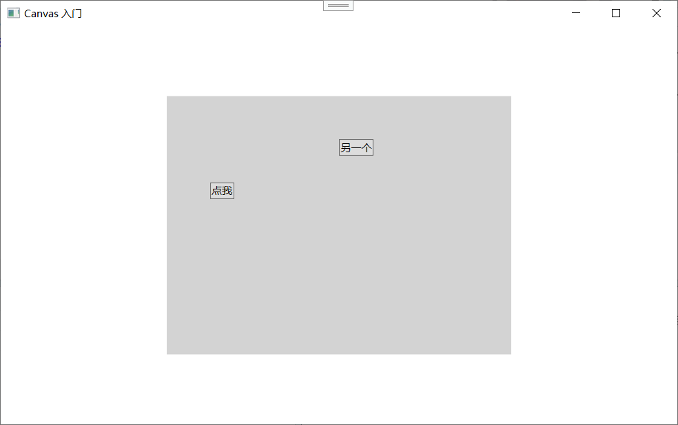
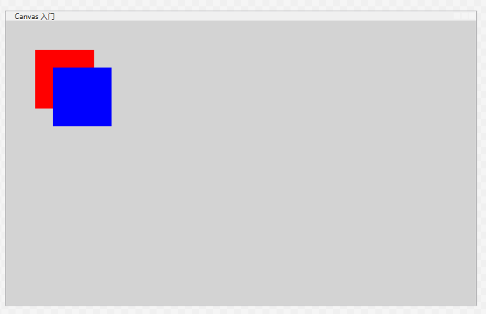
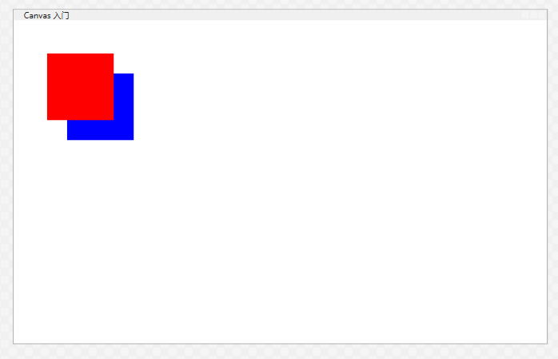
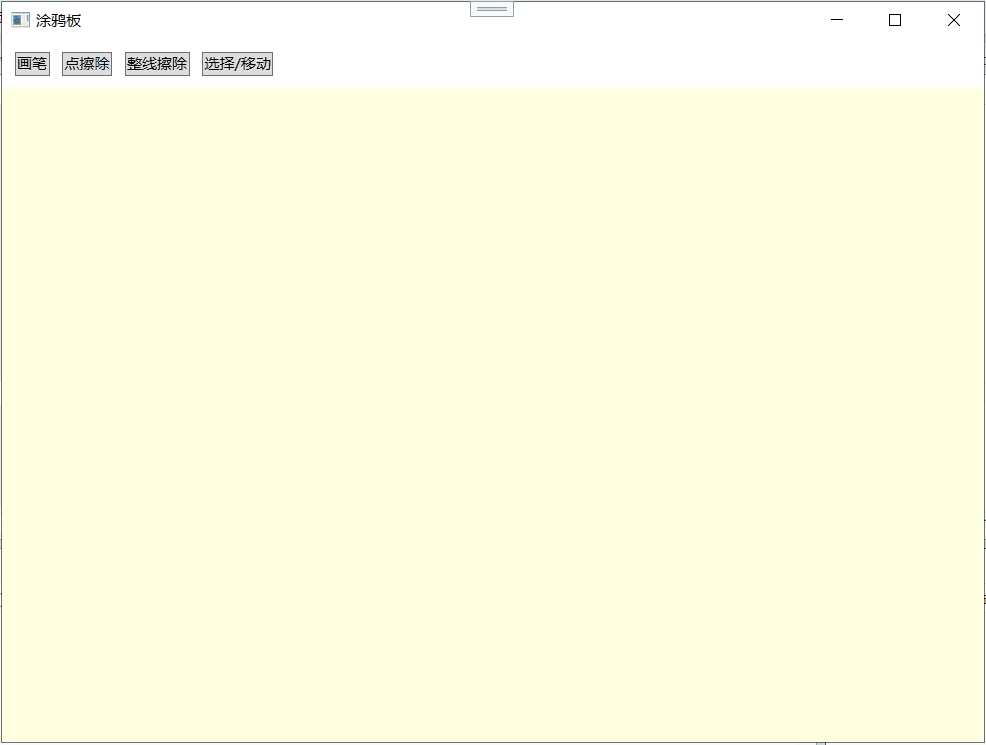

## 使用 Canvas 面板进行基于坐标的布局

从这一章开始到现在，你学的所有布局面板——`StackPanel`、`WrapPanel`、`DockPanel`、`Grid`——都是“自动布局”型的。你告诉它们规则（堆叠方向、停靠边、行列比例），它们自动帮你计算出每个控件该放哪、该多大。这种哲学我们在第 3.1 节就讲了：WPF 布局原则第二条就是“元素的位置不应该用像素坐标来指定”。

但凡事总有例外。有些时候，你就是需要精准地控制某个东西放在哪个像素上。比如：

- 你正在做一个绘图程序，用户画一条线从坐标 (50, 100) 到 (300, 200)。
- 你要做一个视觉设计器，允许用户拖拽控件到任意位置。
- 你需要把几个图形元素按像素级精确叠加到一起，实现某种视觉效果。
- 你做了一个游戏界面，精灵需要在画布上自由移动。

这些场景的共同点是：**位置不是由内容的逻辑关系决定的，而是由外部的“坐标”决定的**。`Canvas` 就是为这种需求而生的面板。

`Canvas` 是 WPF 里最“原始”的布局面板，它回到了最传统的定位方式：**每个子元素相对于 Canvas 的左上角，用 X 和 Y 坐标来指定它放在什么地方**。它不做任何自动换行、自动拉伸、比例分配，完全就是“你说放哪就放哪”。

这一节就专门讲 `Canvas` 的用法，以及和它紧密相关的两个话题：**Z 顺序**（多个元素重叠时谁在谁的上面）和 **`InkCanvas`**（一个专门为手写笔和涂鸦设计的特殊画布控件）。

---

### Canvas 基础用法

**Canvas 和它的附加属性**

要把一个元素用坐标放到 `Canvas` 上，你不需要写 C# 代码，只需要用两个附加属性：

- **`Canvas.Left`**：元素左边缘距离 Canvas 左边缘的距离（X 坐标）
- **`Canvas.Top`**：元素上边缘距离 Canvas 上边缘的距离（Y 坐标）

最简单的例子：

```xml
<Canvas Width="400" Height="300" Background="LightGray">
    <Button Canvas.Left="50" Canvas.Top="100" Content="点我" />
    <Button Canvas.Left="200" Canvas.Top="50" Content="另一个" />
</Canvas>
```



两个按钮放在 Canvas 的不同位置。第一个按钮左上角在 (50, 100)，第二个在 (200, 50)。它们彼此不互相影响，Canvas 不会因为内容多了就自动扩展（除非你设 Canvas 的大小是自动的，见后述）。

**Canvas 还有其他两个附加属性：**

- **`Canvas.Right`**：元素右边缘距离 Canvas 右边缘的距离。等于间接指定 X 坐标。
- **`Canvas.Bottom`**：元素下边缘距离 Canvas 下边缘的距离。

如果你同时指定了 `Left` 和 `Right`，会发生什么？
在 WPF 的 `Canvas` 布局中，如果你同时为一个子元素指定了 `Canvas.Left` 和 `Canvas.Right` 附加属性，**`Canvas.Left` 的优先级高于 `Canvas.Right`，`Canvas.Right` 将被直接忽略。** 
**垂直方向同理**：`Canvas.Top` 的优先级高于 `Canvas.Bottom`。

**在 `Grid` 中**：同时设置 `HorizontalAlignment="Stretch"`（默认）并加上 `Margin` 的 `Left` 和 `Right`，元素会根据父容器的大小进行**拉伸**。
**在 `Canvas` 中**：`Canvas` 不负责管理子元素的尺寸（除非你明确设置了 `Width` 和 `Height`）。它本质上是一个绝对坐标布局容器。因为它不具备“拉伸”或“自适应宽度”的逻辑，所以它不需要（也不会）同时使用 `Left` 和 `Right` 来计算宽度。


**Canvas 中的 Margin**

`Margin` 在 Canvas 里仍然有效，但它不会影响元素的位置计算——Canvas 依然根据 `Canvas.Left` 和 `Canvas.Top` 来放置元素，Margin 只是在元素定位后，在外围再挤出空白，视觉上它把元素推离了原来的位置。实际上，Canvas 在排列子元素时，会把 `Canvas.Left` 加上子元素的 `Margin.Left` 作为实际绘制的起始 X，同理 Y。所以：

```xml
<Button Canvas.Left="100" Canvas.Top="100" Margin="10" Content="点" />
```

这个按钮实际会出现在 X=110，Y=110 的位置（Left 100 + Margin.Left 10）。这有时候会让人困惑，所以通常 Canvas 里的子元素没必要设 Margin，直接用 `Canvas.Left` / `Top` 精确调整就行。

**Canvas 的典型应用场景**

- **绘图编辑器**：用户用鼠标画矩形、圆形、箭头等，每个图形放在 Canvas 上，通过 `Canvas.Left` 和 `Canvas.Top` 控制拖拽位置。
- **简单动画**：配合 `DoubleAnimation` 修改 `Canvas.Left` 和 `Canvas.Top` 就能让元素移动。
- **自定义装饰器**：比如弹出一个悬浮的提示框，直接盖在界面上某个区域。
- **WPF 游戏**：2D 游戏通常使用 Canvas 来放置角色、道具、界面元素。

尽管 Canvas 是“反 WPF 布局原则”的存在，但正是因为它提供了精确坐标控制，才让 WPF 的布局系统完整。一个好的 WPF 界面往往不是全用 Canvas，而是在自适应的 `Grid` 或 `DockPanel` 大框架下，把需要精确控制的局部区域用 Canvas 来实现。

---

### Z 顺序

**什么是 Z 顺序？**

在普通面板（如 `StackPanel`、`Grid`）里，子元素通常不会重叠。但在 `Canvas` 里，元素可以很容易地被放在重叠的位置。比如两个按钮都放在 (50, 50)，它们就叠在一起了。

问题就来了：谁在上面，谁在下面？这个上下关系就叫 **Z 顺序（Z Order）**。

想象你在桌子上叠纸片：桌面是 X 轴左右，Y 轴前后，而垂直于桌面的方向（向上）就是 Z 轴。Z 顺序就是决定哪张纸片叠在别张上面。

**默认 Z 顺序：文档顺序**

在 XAML 里，默认的 Z 顺序就是**元素在 XAML 文件中的声明顺序**——后声明的元素画在前面，覆盖先声明的元素。这和 HTML 的层叠规则一致。

```xml
<Canvas>
    <Rectangle Canvas.Left="50" Canvas.Top="50" 
               Width="100" Height="100" Fill="Red" />
    <Rectangle Canvas.Left="80" Canvas.Top="80" 
               Width="100" Height="100" Fill="Blue" />
</Canvas>
```



第二个蓝色矩形声明在后，所以它会盖在红色矩形的上面。实际看到的就是蓝块压着红块。

**用 Panel.ZIndex 控制 Z 顺序**

有时候你不想靠声明顺序来决定上下关系，比如你动态添加元素，或者设计时不能让某个重要的元素被后来添加的东西挡住。这时候就需要显式设置 Z 顺序。

WPF 所有面板都支持一个附加属性：**`Panel.ZIndex`**。它的值是一个整数，**默认为 0**。值越大的元素越在上面。

```xml
<Canvas>
    <Rectangle Canvas.Left="50" Canvas.Top="50" 
               Width="100" Height="100" Fill="Red" 
               Panel.ZIndex="1" />
    <Rectangle Canvas.Left="80" Canvas.Top="80" 
               Width="100" Height="100" Fill="Blue" 
               Panel.ZIndex="0" />
</Canvas>
```



虽然红色矩形声明在前，但因为它的 `ZIndex="1"` 大于蓝色矩形的 `ZIndex="0"`，所以红色反而叠在蓝色上面。

`Panel.ZIndex` 不仅仅在 `Canvas` 里生效，它在所有 Panel 子类里都可以用。只要子元素发生重叠（比如 `Grid` 里两个元素放在同一格），`ZIndex` 就能决定谁在上面。

**在后台代码中动态改变 ZIndex**
结合鼠标事件，在 C# 中动态修改 `ZIndex` 是极其常见的交互操作，比如实现“点击将窗口/图片置顶”的效果：
```cs
private void Shape_MouseDown(object sender, MouseButtonEventArgs e)
{
    UIElement clickedElement = sender as UIElement;
    if (clickedElement != null)
    {
        // 将点击的元素的 ZIndex 提升为一个很大的数，确保它在最前面
        Panel.SetZIndex(clickedElement, 999);
    }
}

```


**Z 顺序与命中测试**

Z 顺序不仅影响视觉，还影响**命中测试（Hit Testing）**，也就是鼠标点击事件。默认情况下，鼠标点击会先被最上面的元素捕获，如果它有事件处理，就拦下来了，不再往下传。这在 WPF 里叫“路由事件”，后面会详细讲，但这里先记住：重叠元素中，上面的元素优先拿到鼠标事件。

**Z 顺序跟透明区域**

如果一个元素的背景是 `null`（`Transparent` 不算 null，`Transparent` 仍然会参与命中测试），那么鼠标事件会穿过它，落到它下面的元素上。这也是 Canvas 里一个常见的坑：你以为背景没设，元素是透明的，但它默认背景不是 null，可能仍阻挡点击。

---

### InkCanvas 元素

**InkCanvas 是什么？**

`InkCanvas` 是 Canvas 的一个特殊子类，它专门为**手写笔迹（Ink）** 设计。如果你用过 Windows 平板的便签应用，或者 Surface 上的绘图工具，那种随手画线、写毛笔字的感觉，底层控件就是这个。WPF 直接把它内置在了框架里。

`InkCanvas` 主要有两种输入：

- **笔（Stylus）**：精细的笔迹、压力感应。
- **鼠标**：也可以当笔用画图。

**InkCanvas 的基本用法**

最简单的用法——什么都不配，直接放那：

```xml
<Window x:Class="InkDemo.MainWindow"
        xmlns="http://schemas.microsoft.com/winfx/2006/xaml/presentation"
        xmlns:x="http://schemas.microsoft.com/winfx/2006/xaml"
        Title="涂鸦板" Width="800" Height="600">
    <InkCanvas />
</Window>
```

运行后，你就可以用鼠标（或笔）在窗口上画线了。非常直观。

**DrawingAttributes：控制笔迹外观**

`InkCanvas` 有一个 `DefaultDrawingAttributes` 属性，可以设置笔迹的默认外观：

```csharp
inkCanvas.DefaultDrawingAttributes.Color = Colors.Red;
inkCanvas.DefaultDrawingAttributes.Width = 3;
inkCanvas.DefaultDrawingAttributes.Height = 3;
```

`Width` 和 `Height` 控制笔迹的粗细，如果设成不同值可以模拟扁头笔刷。

还可以设置 `IsHighlighter`（荧光笔）或 `StylusTip` 等属性。

**EditingMode：编辑模式**

`InkCanvas` 不只可以画画，它还有多种编辑模式，通过 `EditingMode` 属性切换：

- **`Ink`**（默认）：绘图模式，笔迹画上去。
- **`GestureOnly`**：手势识别模式，只检测手势（如圈选），不留下笔迹。
- **`InkAndGesture`**：笔迹和手势混合模式。
- **`Select`**：选择模式，可以用鼠标或笔圈选已经画好的笔迹，然后移动、缩放它们。
- **`EraseByPoint`**：点擦模式，点击笔迹擦除单个笔画段。
- **`EraseByStroke`**：笔画擦模式，点击整笔擦除一整条笔画。
- **`None`**：禁用所有编辑功能，只显示笔迹。

最常用的是 `Ink` 和 `Select` 以及 `EraseByPoint` 来回切换。比如你可以做一个工具栏，有画笔按钮（切到 Ink 模式），有选择按钮（切到 Select 模式），有橡皮按钮（切到 EraseByPoint 模式）。

```csharp
inkCanvas.EditingMode = InkCanvasEditingMode.Select;
```

**一个带工具栏的小型画板示例**

借助 `EditingMode`，我们可以用极少的代码写出一个简易画板：
```xml
<Grid>
    <Grid.RowDefinitions>
        <RowDefinition Height="Auto" />
        <RowDefinition Height="*" />
    </Grid.RowDefinitions>

    <!-- 工具栏 -->
    <StackPanel Orientation="Horizontal" Grid.Row="0" Margin="5">
        <Button Content="画笔" Click="Pen_Click" Margin="5"/>
        <Button Content="点擦除" Click="ErasePoint_Click" Margin="5"/>
        <Button Content="整线擦除" Click="EraseStroke_Click" Margin="5"/>
        <Button Content="选择/移动" Click="Select_Click" Margin="5"/>
    </StackPanel>

    <!-- 墨迹画布 -->
    <InkCanvas x:Name="myInkCanvas" Grid.Row="1" Background="LightYellow" />
</Grid>

```

后台 C# 代码只需要切换模式：
```cs
private void Pen_Click(object sender, RoutedEventArgs e)
{
    myInkCanvas.EditingMode = InkCanvasEditingMode.Ink;
}
private void ErasePoint_Click(object sender, RoutedEventArgs e)
{
    myInkCanvas.EditingMode = InkCanvasEditingMode.EraseByPoint;
}
private void EraseStroke_Click(object sender, RoutedEventArgs e)
{
    myInkCanvas.EditingMode = InkCanvasEditingMode.EraseByStroke;
}
private void Select_Click(object sender, RoutedEventArgs e)
{
    myInkCanvas.EditingMode = InkCanvasEditingMode.Select;
}

```

效果如下



**笔画数据：Stroke 和 StrokeCollection**

你可能会以为 `InkCanvas` 只是像 Windows 自带的“画图”软件一样，把像素涂黑了？完全不是！
`InkCanvas` 记录的是**矢量数据**。你在上面画的每一笔，都会被保存为一个独立的 `Stroke` 对象，存放在 `InkCanvas.Strokes` 集合中。你可以通过 `InkCanvas.Strokes` 属性访问。

这给你很大的能力：

- **永远清晰**：无论你把画布放大多少倍，线条边缘依然平滑锐利，绝不会出现像素马赛克。
- **后期可编辑**：哪怕画完很久，你依然可以用 `Select` 模式选中某一条特定的线，去改变它的颜色、粗细，或者删除它。
- **保存笔迹**：Stroke 可以序列化成 Ink Serialized Format (ISF) 二进制流，存到文件或数据库。
- **加载笔迹**：从文件读取 ISF 流恢复笔画。
- **程序化添加笔画**：你可以直接用代码生成 `Stroke` 对象加到 `Strokes` 里。
- **删除、移动、缩放** 选择的笔画集合。

基本代码示例：

```csharp
// 保存笔迹到文件
using (FileStream fs = new FileStream("ink.isf", FileMode.Create))
{
    inkCanvas.Strokes.Save(fs);
}

// 从文件加载笔迹
using (FileStream fs = new FileStream("ink.isf", FileMode.Open))
{
    inkCanvas.Strokes = new StrokeCollection(fs);
}
```

**Gesture（手势识别）**

`InkCanvas` 可以识别一些常见手势（比如圈选、擦除、点击），当开启手势模式时，它会触发 `Gesture` 事件。这在平板应用里做些快捷动作很有用，但桌面端相对少用。

**InkCanvas 和子元素**

和普通 `Canvas` 一样，`InkCanvas` 也可以在上面放子元素（按钮、图形等），它们可以和笔迹混合使用：

```xml
<InkCanvas>
    <Button Canvas.Left="10" Canvas.Top="10" Content="清除" 
            Click="ClearInk" />
</InkCanvas>
```

按钮浮在笔迹之上，用户可以点击。

**InkCanvas 的优势总结**

- 内置的笔迹收集、显示、编辑能力，完全不需要你自己写 GDI/DirectX 画线代码。
- 支持压感（如果硬件支持）。
- 序列化笔迹格式标准化（ISF），适合存档和跨平台。
- 编辑模式齐全，直接就能做手写白板应用。

对于需要手写、涂鸦、标注的应用来说，`InkCanvas` 是一个巨大的生产力提升器。

---

好了，3.5 节就讲完了。`Canvas` 作为 WPF 布局体系里唯一基于坐标定位的面板，虽然背离了自动布局的原则，但它填补了精确绘图、拖拽移动、绝对叠加等需求的空白。`Panel.ZIndex` 则让你能控制重叠元素的显示层次，不仅在 Canvas 里有用，在其他面板里同样能派上用场。`InkCanvas` 进一步扩展了画布的能力，让你轻易构建手写和涂鸦功能。

从布局角度，记住一句话：**能用自动布局的地方优先用 `Grid`/`DockPanel`/`StackPanel`，只有必须精确坐标的场景再用 `Canvas`。** 这样你的界面大部分是自适应的，小部分灵活画布，整体稳健又强大。

接下去 3.6 节是几个综合布局实例，会把这些面板全部综合起来做实际可用的界面。到了小结（3.7）时，你能独立搭建任意桌面应用的界面骨架了。