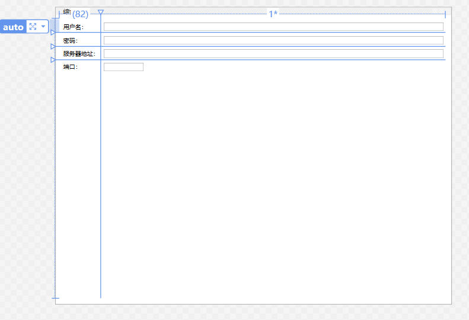
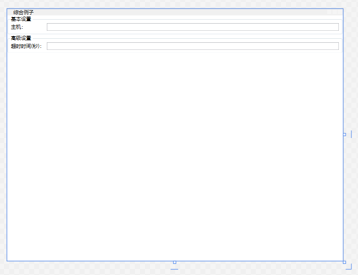
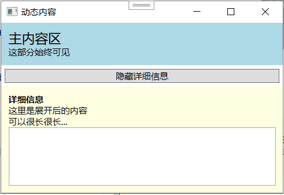
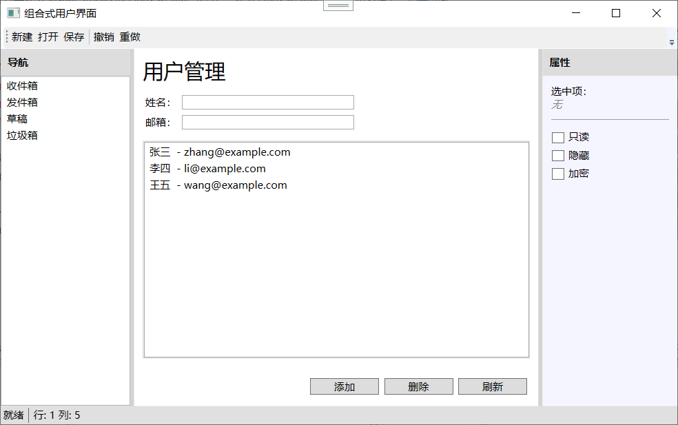

## 布局示例

前面从 3.1 到 3.5，你已经把 WPF 所有的核心布局面板一个一个学完了。每个面板单独拿出来你都会用了，但实际写程序的时候，界面永远不会是“请用一个 StackPanel 完成所有布局”这种简单题。真正的项目界面往往是一个需求丢过来，你得先在心里默默盘算：“外层用什么切大块？中间这个列表区用什么？右下角那几个按钮怎么摆？”然后把你会的各种面板像搭积木一样组合到一起。

3.6 节就是为这个目的设计的。作者给了几个具体的布局实例，一步步演示怎么从需求出发，用前面学的那些面板和属性，搭出真实可用的界面。这一节不是讲新知识，而是**实战演习**。通过这几个例子，你要学会的是一种思维方法：看到一个界面需求，脑子里能自动把它拆成布局树。

下面咱们就逐一拆解这三个示例（3.6.1 列设置、3.6.2 动态内容、3.6.3 组合式用户界面），每个示例里我都会把“为什么这么设计”讲透。

---

## 列设置

**需求场景**

你有没有见过那种设置对话框？左边是一排标签（比如“用户名”、“密码”、“服务器地址”），右边是相应的输入框。要求标签和输入框上下对齐，而且所有标签宽度一致（以最长的标签为准），输入框填满剩余空间。

这个需求用 `StackPanel` 套 `StackPanel` 能做，但标签宽度会参差不齐，视觉上很乱。用 `Grid` 才是正解。

**方案一：单个 Grid 搞定**

最直接的想法：一个 `Grid`，两列多行。第一列放标签，宽度设为 `Auto`（根据最长的标签自动撑开），第二列放输入框，宽度设为 `*`（填满剩余空间）。

```xml
<Grid Margin="10">
    <Grid.RowDefinitions>
        <RowDefinition Height="Auto" />
        <RowDefinition Height="Auto" />
        <RowDefinition Height="Auto" />
        <RowDefinition Height="Auto" />
    </Grid.RowDefinitions>
    <Grid.ColumnDefinitions>
        <ColumnDefinition Width="Auto" />
        <ColumnDefinition Width="*" />
    </Grid.ColumnDefinitions>

    <!-- 第0行：用户名 -->
    <TextBlock Grid.Row="0" Grid.Column="0" Text="用户名：" 
               Margin="5" VerticalAlignment="Center" />
    <TextBox Grid.Row="0" Grid.Column="1" Margin="5" />

    <!-- 第1行：密码 -->
    <TextBlock Grid.Row="1" Grid.Column="0" Text="密码：" 
               Margin="5" VerticalAlignment="Center" />
    <PasswordBox Grid.Row="1" Grid.Column="1" Margin="5" />

    <!-- 第2行：服务器地址 -->
    <TextBlock Grid.Row="2" Grid.Column="0" Text="服务器地址：" 
               Margin="5" VerticalAlignment="Center" />
    <TextBox Grid.Row="2" Grid.Column="1" Margin="5" />

    <!-- 第3行：端口 -->
    <TextBlock Grid.Row="3" Grid.Column="0" Text="端口：" 
               Margin="5" VerticalAlignment="Center" />
    <TextBox Grid.Row="3" Grid.Column="1" Margin="5" Width="80" 
             HorizontalAlignment="Left" />
</Grid>
```



逐行分析一下：

1. **行高都用 `Auto`**：每一行的高度由该行最高的元素决定（一般是输入框的高度），标签和输入框自动垂直居中（靠 `VerticalAlignment="Center"`）。
2. **第一列 `Auto`**：自动适应最长的标签宽度。如果“服务器地址”四个字最宽，那这个标签列的宽度就由它决定，其他短标签（比如“密码”）右边自然会有一些留白，保证所有输入框的左边对齐。
3. **第二列 `*`**：占据所有剩余宽度。输入框拉伸填满这一列（`TextBox` 默认 `HorizontalAlignment="Stretch"`），所以窗口拖宽时输入框也跟着变宽。
4. **端口行的特别处理**：端口输入框通常不需要太宽，所以设了 `Width="80"` 并 `HorizontalAlignment="Left"`，只占它自己需要的宽度，不跟着拉伸。
5. **Margin="5"** 给每个控件四边留点呼吸空间，不至于挤在一起。

这是一个非常标准、非常常用的表单布局模式。你可以不断往下加行，只要复制行定义和标签+输入框那一对就行。

**方案二：多 Grid 用 SharedSizeGroup**

有时候你的表单被拆分成了几个视觉组，每组有自己的 `GroupBox` 包裹，每组里面又是一个小 `Grid`。你希望所有组的标签列宽度统一，这时候就该 `SharedSizeGroup` 出场了。

```xml
<StackPanel Grid.IsSharedSizeScope="True">
    <GroupBox Header="基本设置">
        <Grid>
            <Grid.ColumnDefinitions>
                <ColumnDefinition Width="Auto" SharedSizeGroup="LabelCol" />
                <ColumnDefinition Width="*" />
            </Grid.ColumnDefinitions>
            <TextBlock Grid.Column="0" Text="主机：" Margin="3" />
            <TextBox Grid.Column="1" Margin="3" />
        </Grid>
    </GroupBox>

    <GroupBox Header="高级设置">
        <Grid>
            <Grid.ColumnDefinitions>
                <ColumnDefinition Width="Auto" SharedSizeGroup="LabelCol" />
                <ColumnDefinition Width="*" />
            </Grid.ColumnDefinitions>
            <TextBlock Grid.Column="0" Text="超时时间(秒)：" Margin="3" />
            <TextBox Grid.Column="1" Margin="3" />
        </Grid>
    </GroupBox>
</StackPanel>
```



两个 `GroupBox` 里的标签列都加入了 `SharedSizeGroup="LabelCol"`，并且它们的父级 `StackPanel` 开启了 `Grid.IsSharedSizeScope="True"`。这样“超时时间(秒)”更长的那一组会把标签列撑宽，而“主机”那组的标签列也跟着变宽，保证视觉上的整齐划一。

这种模式在选项对话框、设置向导里特别常见。每页设置内容可能放在独立的 `TabItem` 或者 `GroupBox` 里，但标签列宽跨区块统一。

**你可能遇到的坑：**

- 如果标签列过度伸长（比如某个标签长得变态），可能导致输入框太窄。这时可以给第二列设 `MinWidth`。
- `SharedSizeGroup` 要求有共同的 `IsSharedSizeScope="True"` 祖先。这个祖先可以设在 `Window`、`StackPanel` 或 `Grid` 上，但一定得包含所有参与的 `Grid`。

---

## 动态内容

**需求场景**

不是所有界面都是静态的表单。很多时候，界面上有些区域的内容会在运行时变化——比如用户点了一个按钮，展开一段详细信息；或者搜索结果数量不同，列表区域随之伸缩；再或者语言切换到德文，所有标签文本变长，布局需要自动调整出足够空间。

WPF 的布局系统天然支持这些情况，因为它遵循“内容驱动尺寸”原则。这个示例就是演示布局如何响应动态变化。

**示例：可折叠面板**

做一个简单的展开/折叠面板：顶部有一个切换按钮，点击后显示或隐藏一个详细信息区域。整个窗口的布局要能自动适应这个区域的显隐——显示时窗口内容自动撑开，隐藏时自动收缩。

```xml
<Window x:Class="DynamicLayout.DynamicContentDemo"
        xmlns="http://schemas.microsoft.com/winfx/2006/xaml/presentation"
        xmlns:x="http://schemas.microsoft.com/winfx/2006/xaml"
        Title="动态内容" SizeToContent="Height" Width="400">
    <!-- SizeToContent="Height" 表示窗口高度自动适应内容 -->
    <StackPanel>
        <!-- 始终可见部分 -->
        <Border Background="LightBlue" Padding="10">
            <StackPanel>
                <TextBlock Text="主内容区" FontSize="18" />
                <TextBlock Text="这部分始终可见" />
            </StackPanel>
        </Border>

        <!-- 切换按钮 -->
        <Button x:Name="toggleButton" Content="显示详细信息" 
                Click="ToggleButton_Click" Margin="5" />

        <!-- 可折叠的详细区域 -->
        <Border x:Name="detailPanel" Background="LightYellow" 
                Padding="10" Visibility="Collapsed">
            <StackPanel>
                <TextBlock Text="详细信息" FontWeight="Bold" />
                <TextBlock Text="这里是展开后的内容" />
                <TextBlock Text="可以很长很长..." />
                <TextBox AcceptsReturn="True" Height="80" />
            </StackPanel>
        </Border>
    </StackPanel>
</Window>
```

代码隐藏：

```csharp
private void ToggleButton_Click(object sender, RoutedEventArgs e)
{
    if (detailPanel.Visibility == Visibility.Collapsed)
    {
        detailPanel.Visibility = Visibility.Visible;
        toggleButton.Content = "隐藏详细信息";
    }
    else
    {
        detailPanel.Visibility = Visibility.Collapsed;
        toggleButton.Content = "显示详细信息";
    }
}
```




**关键点分析：**

1. **`SizeToContent="Height"`**：这个属性告诉窗口“我的高度由内容决定”。当详细面板折叠（`Visibility="Collapsed"`）时，它在布局中不占任何空间，`StackPanel` 的总高度变矮，窗口自动收缩；展开后窗口又自动伸长。`SizeToContent` 还有 `Width` 和 `WidthAndHeight` 两个值可选。

2. **`Visibility` 的三个值**：
   - `Visible`：正常显示，占空间。
   - `Hidden`：不可见，但**仍然占空间**（布局不受影响，只是透明）。
   - `Collapsed`：不可见，且**不占空间**（从布局中完全消失）。
   
   这里用 `Collapsed` 才能实现窗口高度的动态收缩。

3. **`StackPanel` 的顺序**：主内容、按钮、详细面板从上到下排列，不管详细面板显示还是隐藏，它们的相对顺序不变。

**更高级的动态：内容变化触发布局更新**

不用 `Visibility` 切换，你也可以直接改变某个控件的属性，WPF 自动重新布局。比如把标签文本从"OK"改成"A very long confirmation message in German"，`TextBlock` 重新测量自己需要的宽度，如果它在一个 `Auto` 列里，那这一列就会自动变宽，其他列相应调整。

举个例子：

```xml
<Grid>
    <Grid.ColumnDefinitions>
        <ColumnDefinition Width="Auto" />
        <ColumnDefinition Width="*" />
    </Grid.ColumnDefinitions>
    <TextBlock Grid.Column="0" x:Name="label" Text="短" Margin="5" />
    <Button Grid.Column="1" Content="变长" Click="MakeLonger_Click" Margin="5" />
</Grid>
```

```csharp
private void MakeLonger_Click(object sender, RoutedEventArgs e)
{
    label.Text = "这个标签现在变得非常非常长，列会自动变宽";
}
```

`Auto` 列会自动扩张容纳变长的文本，`*` 列缩小让位。全程无需手动调整任何尺寸。

**为什么要理解动态内容？**

因为如果你的布局写得好（没有写死控件尺寸，多用 Auto 和星号），你就不需要为“切换语言后文字变长导致截断”或“某些内容动态显示隐藏”这类事头疼。把一切交给 WPF 的布局策略自动处理，这才是 WPF 的真正威力。

---

## 组合式用户界面

**需求场景**

好了，现在到本章最综合、最长的示例了。我们要模拟一个完整应用的简化界面。它包含以下元素：

- 顶部标题栏或工具栏
- 底部状态栏
- 左侧导航面板
- 右侧属性面板
- 中间内容区（里面又有表单、列表等复杂内容）
- 用户还能拖拽调整左右面板和中间内容区的大小

听起来是不是很像 Outlook 或者 Visual Studio 的界面？没错，这类组合式界面是桌面应用中最常见的骨架。

**第一步：总体规划**

先在大脑里把界面按区域切分：

1. **最外层**：典型的 `DockPanel`。顶部、底部、左侧、右侧贴边，中间区域填满。
2. **中间区域**：这层可能是另一个面板，比如一个水平排列的 `Grid`，左边是导航面板，中间是内容区，右边是属性面板，中间用 `GridSplitter` 隔开，允许拖拽调整。
3. **每个区域内部**：再用各自合适的子面板去实现更细的布局。

**完整 XAML 代码**

```xml
<Window x:Class="LayoutDemo.CombinedUI"
        xmlns="http://schemas.microsoft.com/winfx/2006/xaml/presentation"
        xmlns:x="http://schemas.microsoft.com/winfx/2006/xaml"
        Title="组合式用户界面" Height="500" Width="800">
    
    <!-- 最外层：DockPanel -->
    <DockPanel>
        
        <!-- ================= 顶部工具栏 ================= -->
        <ToolBar DockPanel.Dock="Top" Background="#F0F0F0">
            <Button Content="新建" />
            <Button Content="打开" />
            <Button Content="保存" />
            <Separator />
            <Button Content="撤销" />
            <Button Content="重做" />
        </ToolBar>
        
        <!-- ================= 底部状态栏 ================= -->
        <StatusBar DockPanel.Dock="Bottom" Background="#E0E0E0">
            <StatusBarItem Content="就绪" />
            <Separator />
            <StatusBarItem Content="行: 1 列: 5" />
        </StatusBar>
        
        <!-- ================= 中间主区（Grid） ================= -->
        <Grid>
            <Grid.ColumnDefinitions>
                <!-- 左侧导航面板：150 宽，最小 80，最大 300 -->
                <ColumnDefinition Width="150" MinWidth="80" MaxWidth="300" />
                <!-- 分割线：Auto 宽度 -->
                <ColumnDefinition Width="Auto" />
                <!-- 内容区：所占比例 -->
                <ColumnDefinition Width="3*" MinWidth="200" />
                <!-- 分割线 -->
                <ColumnDefinition Width="Auto" />
                <!-- 右侧属性面板：占所有剩余空间的四分之一 -->
                <ColumnDefinition Width="*" MinWidth="100" MaxWidth="400" />
            </Grid.ColumnDefinitions>
            
            <!-- ===== 左侧导航 ===== -->
            <Border Grid.Column="0" Background="#F5F5F5">
                <DockPanel>
                    <TextBlock DockPanel.Dock="Top" Text="导航" 
                               FontWeight="Bold" Background="#DDD" 
                               Padding="8" />
                    <ListBox>
                        <ListBoxItem Content="收件箱" />
                        <ListBoxItem Content="发件箱" />
                        <ListBoxItem Content="草稿" />
                        <ListBoxItem Content="垃圾箱" />
                    </ListBox>
                </DockPanel>
            </Border>
            
            <!-- ===== 左侧分割线 ===== -->
            <GridSplitter Grid.Column="1" Width="5"
                          HorizontalAlignment="Stretch"
                          VerticalAlignment="Stretch"
                          Background="LightGray" />
            
            <!-- ===== 中间内容区 ===== -->
            <Border Grid.Column="2" Background="White" Padding="10">
                <Grid>
                    <Grid.RowDefinitions>
                        <RowDefinition Height="Auto" />   <!-- 标题 -->
                        <RowDefinition Height="Auto" />   <!-- 表单区 -->
                        <RowDefinition Height="*" />      <!-- 列表区 -->
                        <RowDefinition Height="Auto" />   <!-- 按钮行 -->
                    </Grid.RowDefinitions>
                    
                    <!-- 标题 -->
                    <TextBlock Grid.Row="0" Text="用户管理" 
                               FontSize="24" Margin="0,0,0,10" />
                    
                    <!-- 表单：内嵌一个小 Grid -->
                    <Grid Grid.Row="1">
                        <Grid.ColumnDefinitions>
                            <ColumnDefinition Width="Auto" />
                            <ColumnDefinition Width="*" />
                        </Grid.ColumnDefinitions>
                        <Grid.RowDefinitions>
                            <RowDefinition Height="Auto" />
                            <RowDefinition Height="Auto" />
                        </Grid.RowDefinitions>
                        
                        <TextBlock Grid.Row="0" Grid.Column="0" 
                                   Text="姓名：" VerticalAlignment="Center" Margin="3" />
                        <TextBox Grid.Row="0" Grid.Column="1" Margin="3" Width="200" 
                                 HorizontalAlignment="Left" />
                        
                        <TextBlock Grid.Row="1" Grid.Column="0" 
                                   Text="邮箱：" VerticalAlignment="Center" Margin="3" />
                        <TextBox Grid.Row="1" Grid.Column="1" Margin="3" Width="200" 
                                 HorizontalAlignment="Left" />
                    </Grid>
                    
                    <!-- 列表区 -->
                    <Border Grid.Row="2" BorderBrush="LightGray" 
                            BorderThickness="1" Margin="0,10">
                        <ListBox>
                            <ListBoxItem Content="张三  - zhang@example.com" />
                            <ListBoxItem Content="李四  - li@example.com" />
                            <ListBoxItem Content="王五  - wang@example.com" />
                        </ListBox>
                    </Border>
                    
                    <!-- 按钮行 -->
                    <StackPanel Grid.Row="3" Orientation="Horizontal" 
                                HorizontalAlignment="Right" Margin="0,10,0,0">
                        <Button Content="添加" Width="80" Margin="3" />
                        <Button Content="删除" Width="80" Margin="3" />
                        <Button Content="刷新" Width="80" Margin="3" />
                    </StackPanel>
                </Grid>
            </Border>
            
            <!-- ===== 右侧分割线 ===== -->
            <GridSplitter Grid.Column="3" Width="5"
                          HorizontalAlignment="Stretch"
                          VerticalAlignment="Stretch"
                          Background="LightGray" />
            
            <!-- ===== 右侧属性面板 ===== -->
            <Border Grid.Column="4" Background="#F5F5FF">
                <DockPanel>
                    <TextBlock DockPanel.Dock="Top" Text="属性" 
                               FontWeight="Bold" Background="#DDD" 
                               Padding="8" />
                    <StackPanel Margin="10">
                        <TextBlock Text="选中项：" />
                        <TextBlock x:Name="selectedItemText" Text="无" 
                                   FontStyle="Italic" Foreground="Gray" />
                        <Separator Margin="0,10" />
                        <CheckBox Content="只读" Margin="0,3" />
                        <CheckBox Content="隐藏" Margin="0,3" />
                        <CheckBox Content="加密" Margin="0,3" />
                    </StackPanel>
                </DockPanel>
            </Border>
        </Grid>
        
    </DockPanel>
</Window>
```




**这一大坨布局的优点是什么？**

1. **完全自适应**：窗口拖大拖小、切换到高 DPI 屏幕、内容文字变长，所有区域都会自动调整。左侧导航面板有 MinWidth 和 MaxWidth 保护，不会变得太窄或太宽；中间内容区的 `3*` 和右侧 `*` 的比例始终维持；底部的按钮始终在右下角。
2. **用户可调**：拖拽分割线可以重新分配左中右的空间，符合专业用户的习惯。
3. **结构清晰**：外层 DockPanel -> 中间 Grid -> 各区域内细分面板，每一层职责单一。你单独修改右侧属性面板的内部布局，不会影响导航面板或内容区。
4. **可维护性高**：设计师如果要求“把右侧属性面板改到左边去”，你只需要把列 2 和列 4 的 `Grid.Column` 索引互换一下，分割线位置调一下，内部布局完全不用动。

**这个示例体现的 WPF 布局哲学**

- **嵌套即力量**：没有一个面板能单独扛下这么复杂的布局，但通过层层嵌套，每一种面板都能在自己擅长的领域发挥：`DockPanel` 做外框分区，`Grid` 做精确行列，`StackPanel` 做细部排列。
- **内容驱动**：你没有写死任何一个子控件的高度和宽度，除了极少数比如按钮 `Width="80"` 为了视觉统一。其他所有区域的大小都是被它们的“长官”（父面板）动态分配出来的。
- **关注点分离**：界面骨架（XAML）只描述布局和控件放置，逻辑（比如点击“添加”按钮后的业务）留给代码隐藏或 ViewModel。这种分离让你可以独立优化界面美观度而不怕搞坏功能。

---

## 小结

这三个示例从简单到复杂，给你展示了 WPF 布局在实际开发中的运用模式：

- **3.6.1 列设置**：讲解了表单布局中的两列模式，用 `Grid` 的 `Auto` + `*` 实现标签列和输入列的完美对齐。需要跨多个组对齐时，引入了 `SharedSizeGroup`。这是最基础的实用布局模式，几乎所有设置界面都会用到。

- **3.6.2 动态内容**：演示了 WPF 布局如何响应运行时变化。通过 `Visibility="Collapsed"` 实现折叠/展开，配合 `SizeToContent` 让窗口自动调整高度。也展示了改变控件内容（如文本变长）后，`Auto` 列自动适应。核心思想是：只要你没有写死尺寸，WPF 会自动处理一切变化。

- **3.6.3 组合式用户界面**：本章的终极实践，一个复杂的类 Outlook 界面。外 `DockPanel` 起骨架，中 `Grid` 管精确分区，内各种面板层层组合，配合 `GridSplitter` 实现可拖拽调整的分区。这是真实项目中你会反复使用的组合方式。

学完这三个示例，你就要在心里形成一个条件反射：看到任何界面，先问自己“最外层用什么面板？”、“中间区域需要几个格子？”、“每个格子里面是简单排列还是又需要细分？”，然后一层层剥下去。这个思维方式学会了，任何界面你都能拆解成 WPF 的布局组合。

下一节（3.7）是整个第 3 章的总结，会把所有布局面板串起来，帮你把碎片化的知识融成一张完整的布局知识网。