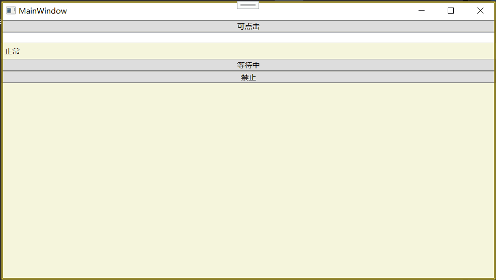

## 控件类

前面几章讲的是 WPF 的底层基础设施——依赖项属性怎么存数据、路由事件怎么传消息、布局面板怎么把东西摆对位置。这些是骨架，是血管，是神经。但从这一章开始，咱们要真正开始跟“用户能看到、能摸到的”东西打交道了——**控件**。

按钮、文本框、列表、下拉框、滑动条、进度条……这些你在任何桌面软件里都能看到的标准零件，在 WPF 里全都是控件。WPF 的所有控件都继承自 `System.Windows.Controls.Control` 这个基类。`Control` 本身又继承自 `FrameworkElement`（所以它天然具备布局、依赖项属性、路由事件等一切能力），并在其上增加了控件特有的共性功能。

这一节 6.1 不是讲某个具体的控件，而是讲**所有控件都会用到的通用外观属性**：背景和前景画刷（6.1.1）、字体设置（6.1.2）、鼠标光标样式（6.1.3）。这些属性你不一定每个都设，但理解它们的设计思路和用法，后面你摆弄任何控件都会心里有底——因为不管是按钮还是标签，它们的背景、文字样式、光标都是一套规则。

---

### 背景画刷和前景画刷

每个控件都有两个最常见的颜色属性：**`Background`（背景）** 和 **`Foreground`（前景）**。它们不是什么简单的“颜色字符串”，而是 `Brush`（画刷）类型。这是 WPF 和传统 Windows 界面库的一大区别，也是 WPF 表现力强悍的重要原因。

#### 为什么是 Brush 而不是 Color？

在 Windows Forms 或 Web 早期开发里，要设背景色通常就是一个颜色值——`red`、`#FF0000`、`Color.Red`。这种设计简单，但也非常局限：你能设的只有纯色。

WPF 的 `Background` 和 `Foreground` 的类型是 `Brush`，这是一个抽象基类。它有几个非常强大的派生类：

- **`SolidColorBrush`**：纯色画刷。这是你最常用的，效果等同于传统的一个颜色。
- **`LinearGradientBrush`**：线性渐变画刷。从左到右、从上到下、对角线方向，颜色从一种平滑过渡到另一种。
- **`RadialGradientBrush`**：径向渐变画刷。从一个中心点向外辐射渐变，像光晕一样。
- **`ImageBrush`**：图像画刷。用一张图片填充背景。
- **`VisualBrush`**：视觉效果画刷。可以把另一个控件的视觉效果直接拿来当画刷用。

这意味着什么？意味着一个按钮的背景可以不是单色的——它可以是渐变色、可以是一张图片、甚至可以是另一个缩小版的控件的画面。这种表达能力是传统纯颜色属性完全无法企及的。

#### 用 SolidColorBrush 设置纯色

XAML 里最简单的写法，靠类型转换器自动把颜色字符串翻译成 `SolidColorBrush`：

```xml
<Button Background="Red" Foreground="White" Content="红色按钮" />
<Button Background="#FF4488" Content="自定义颜色" />
<Button Background="LightBlue" Foreground="DarkBlue" Content="浅蓝底深蓝字" />
```

WPF 内置了大量命名的颜色（`Colors` 类的静态属性），你可以直接用名字，比如 `Red`、`Transparent`、`AliceBlue`、`CornflowerBlue`……也可以写十六进制颜色值（`#AARRGGBB` 或 `#RRGGBB`）。

背后的转换过程：XAML 解析器看到 `Background="Red"`，通过 `BrushConverter` 把 `"Red"` 字符串转换成 `new SolidColorBrush(Colors.Red)`。这个过程是自动的，不需要你手动写。

如果要在代码里设置：

```csharp
myButton.Background = new SolidColorBrush(Colors.Red);
myButton.Foreground = Brushes.White;  // Brushes 类提供了一批预定义的 SolidColorBrush 对象
```

`Brushes` 是一个静态类，提供了 100 多种常用颜色的 `SolidColorBrush` 单例，比你自己 new 更方便，也节省资源。

#### 用渐变画刷

**线性渐变（LinearGradientBrush）**：

```xml
<Button Content="渐变按钮" Width="150" Height="40">
    <Button.Background>
        <LinearGradientBrush StartPoint="0,0" EndPoint="1,1">
            <GradientStop Color="Yellow" Offset="0.0" />
            <GradientStop Color="Orange" Offset="0.5" />
            <GradientStop Color="Red" Offset="1.0" />
        </LinearGradientBrush>
    </Button.Background>
</Button>
```

这里：
- `StartPoint="0,0"` 是左上角，`EndPoint="1,1"` 是右下角，表示从左到右下对角渐变。
- `GradientStop` 定义关键色和它的位置（Offset 0.0 到 1.0）。你可以加任意多个 `GradientStop`。

**径向渐变（RadialGradientBrush）**：

```xml
<RadialGradientBrush Center="0.5,0.5" RadiusX="0.5" RadiusY="0.5">
    <GradientStop Color="White" Offset="0" />
    <GradientStop Color="Blue" Offset="1" />
</RadialGradientBrush>
```

从中心白向外渐变到边缘蓝，形成光晕效果。`RadiusX` 和 `RadiusY` 控制渐变椭圆的大小。

#### Foreground 的特殊之处

`Foreground` 控制的是文字的默认颜色。但需要注意的是，**`Foreground` 是一个依赖项属性，而且它的元数据里设置了 `Inherits = true`**。这意味着如果你在一个容器（比如 `StackPanel`）上设置了 `Foreground="Red"`，容器里所有的子控件（按钮、文本块等）如果没有显式设置自己的 `Foreground`，都会自动继承这个红色。

这在统一界面文字色调时非常方便——你只要在最外层容器上设一个 `Foreground`，里面的所有文字都跟着变色。和 `FontSize`、`FontFamily` 等一样，这是依赖项属性值继承的典型应用。

---

### 字体

控件的文字外观由一组字体相关属性共同决定。这些属性也都是依赖项属性，并且大部分支持值继承（你设在一个容器上，里面的元素自动跟着走）。这让你可以在窗口级别统一字体风格，而不用往每个控件上都贴一遍。

#### 核心字体属性

**`FontFamily`（字体家族）**

指定用哪个字体。类型是 `FontFamily`，但在 XAML 里可以直接写字符串，靠类型转换器翻译。

```xml
<TextBlock Text="Hello" FontFamily="Arial" />
<TextBlock Text="你好" FontFamily="微软雅黑" />
<TextBlock Text="混合字体" FontFamily="Times New Roman, SimSun" />
```

你可以写多个字体名字，用逗号隔开，WPF 会按顺序查找——第一个在系统里找到了就用第一个，没找到就试下一个。这叫“字体回退”。对于同时包含中英文的界面，通常会写 `FontFamily="Segoe UI, 微软雅黑"`，这样英文用 Segoe UI，中文用微软雅黑。

也可以引用资源里的字体（比如嵌入式字体或自定义字体文件）：

```xml
<TextBlock FontFamily="/Fonts/MyCustomFont.ttf#MyFontName" Text="自定义字体" />
```

**`FontSize`（字号）**

类型是 `double`，单位是 WPF 单位（1/96 英寸）。常见的值：12、14、18、24。默认值一般是 11 或 12（取决于系统主题）。

```xml
<TextBlock Text="大标题" FontSize="24" />
```

注意这和 CSS 的 `font-size` 一样，不是物理像素值。在 96 DPI 屏幕上 1 个 WPF 单位正好等于 1 个像素，但在高 DPI 屏幕上一个 WPF 单位可能对应多个物理像素，字体保证物理大小不变且清晰。

**`FontWeight`（粗体）**

枚举类型 `FontWeight`。常用值：`Normal`、`Bold`。还有一些细粒度的：`Light`、`SemiBold`、`ExtraBold`、`Black` 等，但不是所有字体文件都支持这些细粒度级别。

```xml
<TextBlock Text="加粗" FontWeight="Bold" />
```

**`FontStyle`（斜体）**

枚举类型 `FontStyle`。值：`Normal`（默认）、`Italic`（斜体）、`Oblique`（倾斜，和 Italic 类似但不完全是同一回事）。

```xml
<TextBlock Text="斜体" FontStyle="Italic" />
```

**`FontStretch`（字体拉伸）**

控制字体的宽窄比例。值：`Normal`、`Condensed`、`Expanded` 等。并不是所有字体都支持这个属性，不支持的字体设置无效。

#### 文本对齐

除了字体本身的样式，文本在控件内的对齐方式也很重要。`Control` 类提供了两个属性：

- **`HorizontalContentAlignment`**：控件内容在水平方向的对齐。值是 `HorizontalAlignment` 枚举：`Left`、`Center`、`Right`、`Stretch`。默认是 `Stretch`（填满整个内容区域）。
- **`VerticalContentAlignment`**：控件内容在垂直方向的对齐。值是 `VerticalAlignment` 枚举：`Top`、`Center`、`Bottom`、`Stretch`。默认是 `Stretch`。

这两个属性控制的是**控件内容区内部**的对齐。注意和 `HorizontalAlignment` / `VerticalAlignment` 的区别——后者是控件在父容器里的对齐方式。

```xml
<Button Content="居中文字" 
        HorizontalContentAlignment="Center" 
        VerticalContentAlignment="Center"
        Width="200" Height="60" />
```

#### 文本修饰与换行

**`TextDecorations`**

给文字加下划线、删除线等装饰。类型是 `TextDecorationCollection`，XAML 里常用写法：

```xml
<TextBlock Text="下划线" TextDecorations="Underline" />
<TextBlock Text="删除线" TextDecorations="Strikethrough" />
<TextBlock Text="上划线" TextDecorations="OverLine" />
<TextBlock Text="基线" TextDecorations="Baseline" />
```

`TextBlock` 这个控件自己有此属性，但 `Control` 上有没有？实际上 `Control` 类没有直接暴露 `TextDecorations`，但它的子类（如 `TextBlock`、`TextBox` 等文本控件）有。按钮上的文字装饰需要间接通过内容来实现（按钮内容可以是 `TextBlock`，在 `TextBlock` 上设 `TextDecorations`）。

**`TextWrapping`**

控制文字超出宽度时是否自动换行。`TextBlock` 和 `TextBox` 有这个属性。

```xml
<TextBlock Text="很长很长很长很长的一段文字" 
           TextWrapping="Wrap" Width="100" />
```

取值：`NoWrap`（默认，不换行，直接截断或溢出）、`Wrap`（换行）、`WrapWithOverflow`（优先换行，但如果有一个单词本身比容器还宽，这个词不切断，而是溢出去）。

**`TextTrimming`**

控制文字被截断时用什么方式显示省略号。`TextBlock` 专用。

```xml
<TextBlock Text="很长很长的文字" TextTrimming="CharacterEllipsis" Width="80" />
```

取值：`None`（默认，直接硬截断）、`CharacterEllipsis`（在最后一个可显示的字符后加 "..."）、`WordEllipsis`（在最后一个完整单词后加 "..."）、`Clip`（直接裁剪像素）。

#### 字体属性继承

前面提过，`FontFamily`、`FontSize`、`FontWeight`、`FontStyle`、`Foreground` 这些属性的元数据都标记了 `Inherits = true`。这意味着你可以在 `Window` 或 `Grid` 层次设置它们，里层的所有控件自动继承，除非你显式覆盖。

```xml
<Window FontFamily="微软雅黑" FontSize="14" Foreground="DarkBlue">
    <StackPanel>
        <TextBlock Text="我会继承窗口的字体设置" />
        <TextBlock Text="但是我覆盖了字号" FontSize="20" />
    </StackPanel>
</Window>
```

这在实际开发中节省了大量重复的样式设定。

#### 嵌入自定义字体

WPF 允许你把字体文件（.ttf 或 .otf）嵌入到应用程序资源中，并通过资源引用使用，确保即使目标机器没有安装该字体，程序也能正常显示。

使用方式：把字体文件添加到项目中，设置生成操作为 `Resource`。在 XAML 里：

```xml
<TextBlock FontFamily="/Fonts/MyCustomFont.ttf#MyFontName" Text="Hello" />
```

`#` 后面是字体内部的字体名（和字体文件名未必相同，需要用字体查看工具确认）。

---

### 鼠标光标

每个 WPF 控件都有一个 `Cursor` 属性，用来设置当鼠标光标移动到该控件上方时，光标应该显示成什么样子。这是一个容易被忽略但非常影响用户体验的细节——光标样式能直观地告诉用户“这里可以点击”、“这里可以输入文字”、“这里在等待”、“这里不允许操作”。

#### 使用内置光标

WPF 内置了大量标准光标，在 `System.Windows.Input.Cursors` 静态类里定义好了。直接在 `FrameworkElement.Cursor` 属性上赋值即可：

```xml
<Button Content="可点击" Cursor="Hand" />
<TextBox Cursor="IBeam" />
<Label Content="正常" Cursor="Arrow" />
<Button Content="等待中" Cursor="Wait" />
<Button Content="禁止" Cursor="No" />
```



代码里：

```csharp
myButton.Cursor = Cursors.Hand;
myTextBox.Cursor = Cursors.IBeam;
```

常用的内置光标：

- **`Arrow`**：标准箭头，默认光标。
- **`Hand`**：手型，表示可以点击（链接、按钮等的惯用光标）。
- **`IBeam`**：I 型光标，表示可以输入文本。
- **`Wait`**：沙漏或旋转圈，表示程序忙，请等待。
- **`Cross`**：十字光标，常用于绘图或精确定位。
- **`Help`**：箭头加问号，表示点击可以获取帮助。
- **`SizeNS`**：上下调整大小光标。
- **`SizeWE`**：左右调整大小光标。
- **`SizeNWSE`**：左上-右下对角线调整大小光标。
- **`SizeNESW`**：右上-左下对角线调整大小光标。
- **`SizeAll`**：四向移动光标。
- **`No`**：圆圈斜杠，表示禁止/不可用。
- **`ScrollNS`**：上下滚动光标。
- **`ScrollWE`**：左右滚动光标。

需要在 `Control` 上显式设 `Cursor` 吗？其实所有 `FrameworkElement` 都有 `Cursor` 属性，继承自 `FrameworkElement` 本身，不只是 `Control`。所以你给任何 WPF 元素（包括面板、图形）都能设光标。

#### 自定义光标

内置光标覆盖了绝大多数需求，但有时候你需要用自定义的光标文件（.cur 或 .ani）。WPF 也支持。

```csharp
Cursor customCursor = new Cursor(Application.GetResourceStream(
    new Uri("/MyApp;component/custom_cursor.cur", UriKind.Relative)).Stream);
myCanvas.Cursor = customCursor;
```

注意 `.cur` 文件需要添加到项目中，设置生成操作为 `Resource` 或嵌入资源。

#### 光标优先级和继承

光标属性不是依赖项属性，不会自动从父元素继承（这和背景画刷不一样）。但是 WPF 有一个内置机制：**光标会沿着视觉树向上查找**。如果当前元素没有设置 `Cursor`，就会用父元素的 `Cursor`；如果父元素也没设，就继续往上，直到根元素。如果整个树上都没设，就用系统默认光标（一般是 `Arrow`）。

所以你可以很方便地在窗口级别设一个忙等待光标：

```csharp
this.Cursor = Cursors.Wait;
```

这会让整个窗口里所有元素在没有各自覆盖的情况下，光标都变成沙漏。做完耗时操作后，再恢复：

```csharp
this.Cursor = null;  // 或者 this.Cursor = Cursors.Arrow;
```

设为 `null` 会让 WPF 重新沿视觉树查找，最终回到默认箭头。

**全局忙光标的最佳实践**：在启动一个耗时操作前设 `Mouse.OverrideCursor = Cursors.Wait`，完成后 `Mouse.OverrideCursor = null`。这是 `Mouse` 类的静态属性，它的优先级高于所有控件的 `Cursor` 属性，保证全局统一，且不需要逐个元素去改。

```csharp
try
{
    Mouse.OverrideCursor = Cursors.Wait;
    // 执行耗时操作
}
finally
{
    Mouse.OverrideCursor = null;
}
```

#### ForceCursor 属性

`FrameworkElement` 还有一个 `ForceCursor` 属性。当你设置了一个元素的光标，但其内部的某个子元素自己也设置了光标，通常子元素的光标会覆盖父元素的光标。如果你希望强制让整个元素（包括其所有子元素）都使用同一个光标，不管子元素怎么设，可以在该元素上设置 `ForceCursor="True"`。

这在某些特殊需求下很有用，比如整个窗口被一个半透明的遮罩层覆盖，你希望遮罩层以及遮罩下面所有的控件全部显示同一个光标。

---

## 总结

6.1 节是“控件类”这一章的总起，没有讲具体控件，而是把**所有控件的共性外观属性**集中讲清楚了。这些属性在你后面学每一个具体控件时都会反复用到：

**背景和前景画刷（6.1.1）**：
- `Background` 和 `Foreground` 的类型是 `Brush`，不是简单的颜色。这是 WPF 表现力的重要来源。
- 可以通过 `SolidColorBrush` 设纯色（XAML 里靠类型转换器自动翻译）。
- 可以用 `LinearGradientBrush`、`RadialGradientBrush` 做渐变背景。
- 可以用 `ImageBrush`、`VisualBrush` 做更高级的背景填充。
- `Foreground` 是依赖项属性且支持值继承，父元素设了自动传给子元素。

**字体（6.1.2）**：
- 核心属性：`FontFamily`（字体名，支持多字体回退）、`FontSize`（WPF 单位）、`FontWeight`（粗体）、`FontStyle`（斜体）、`FontStretch`（拉伸）。
- 这些字体属性都是依赖项属性且支持值继承，方便统一设置。
- 内容对齐用 `HorizontalContentAlignment` 和 `VerticalContentAlignment`，控制控件内容区内部的对齐。
- 文本显示控制：`TextDecorations`（下划线、删除线）、`TextWrapping`（自动换行）、`TextTrimming`（文字截断加省略号）。
- 可以嵌入自定义字体文件作为资源，确保界面在任意机器上显示一致。

**鼠标光标（6.1.3）**：
- `Cursor` 属性定义在 `FrameworkElement` 上，所有可视元素都能设。
- 内置几十种常用光标（`Cursors.Hand`、`Cursors.IBeam`、`Cursors.Wait` 等），覆盖绝大部分需求。
- 光标不继承，但会沿视觉树向上查找未设置的元素。
- 用 `Mouse.OverrideCursor` 可以全局覆盖所有元素的光标（常用于忙等待）。
- `ForceCursor` 强制一个元素及其子元素使用同一个光标。

这些看起来是“小属性”，但它们是搭建一个精致、专业界面的基础。一个界面的好坏，往往就藏在这些背景、字体、光标的细节里——该有渐变的地方有渐变，该换手型光标的地方就换，文字风格统一而不乱。理解了这一套通用机制，接下来 6.2 节开始学具体控件时，你就只需要关注每个控件独有的行为和属性，而这些通用的外观设置已经烂熟于心了。