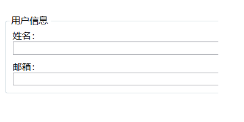
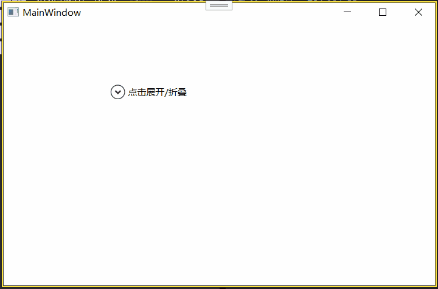

## 特殊容器

上一节讲了内容控件（`ContentControl`）的核心概念——它们有一个 `Content` 属性，可以往里塞任意东西。`Button`、`Label`、`ToolTip` 都是内容控件，但它们各自有各自的行为：`Button` 可点击，`Label` 有访问键，`ToolTip` 会自动弹出。

这一节要学的四个控件——**`ScrollViewer`、`GroupBox`、`TabItem`、`Expander`**——本质上也都是内容控件（它们都继承自 `ContentControl`），但它们的“行为”很特别：它们不是提供交互（如点击），而是提供**容器服务**——滚动、分组、选项卡切换、折叠展开。这些控件解决的是“内容太多了怎么装”的问题，所以说它们是“特殊容器”。

把这四个控件学会，你的界面就不仅能把东西摆对位置，还能处理“放不下”和“想分块”的现实需求。

---

### ScrollViewer

`ScrollViewer` 是最常用的特殊容器之一。它解决的问题非常直接：**当里面的内容超出可用空间时，自动出现滚动条，让用户可以滚动查看全部内容。**

#### 为什么需要 ScrollViewer？

在传统的 Windows 开发里，加滚动条得手动设置控件的 `AutoScroll` 属性，或者更底层地自己处理滚动逻辑。WPF 把这套功能封装成了一个独立的内容控件——你只需要把任何会“可能超出空间”的内容包在 `ScrollViewer` 里，其余全交给它。

#### 基本用法

```xml
<ScrollViewer Width="300" Height="200">
    <StackPanel>
        <Button Content="按钮1" Height="60" />
        <Button Content="按钮2" Height="60" />
        <Button Content="按钮3" Height="60" />
        <Button Content="按钮4" Height="60" />
        <Button Content="按钮5" Height="60" />
    </StackPanel>
</ScrollViewer>
```

这个 `StackPanel` 里五个按钮总高度 300，但 `ScrollViewer` 只有 200 高。运行后右侧会自动出现垂直滚动条，用户可以上下滚动看到所有按钮。

#### 控制滚动条显示行为

`ScrollViewer` 提供两个属性来控制水平滚动条和垂直滚动条的显隐：

- **`HorizontalScrollBarVisibility`**
- **`VerticalScrollBarVisibility`**

它们的取值是 `ScrollBarVisibility` 枚举：

- **`Auto`**（默认）：内容不超出时不显示滚动条，超出时自动显示。
- **`Visible`**：无论内容是否超出，滚动条始终显示（但滑块大小会反映内容占比）。
- **`Hidden`**：完全不显示滚动条，但用户仍然可以用鼠标滚轮或键盘方向键滚动内容（在某些场景下为了美观）。
- **`Disabled`**：滚动条不显示，且完全禁止滚动，超出的内容直接被截断。

```xml
<ScrollViewer VerticalScrollBarVisibility="Auto" HorizontalScrollBarVisibility="Hidden">
    <!-- 内容 -->
</ScrollViewer>
```

垂直方向内容多就出滚动条，水平方向不管什么都隐藏滚动条但可滚。

#### 控制滚动行为和位置

`ScrollViewer` 的常用属性：

- **`CanContentScroll`**：默认 `false`，滚动以**物理像素**为单位，滚动起来平滑。设为 `true` 时，滚动以**逻辑单元**为单位（典型就是配合 `StackPanel` 或 `VirtualizingStackPanel` 时，一次滚一个 item 的高度）。在大型列表里（后面讲 `ItemsControl` 时会再提到），`CanContentScroll` 和虚拟化紧密相关。
- **`ExtentWidth` / `ExtentHeight`**：只读属性，表示内容的实际总宽度/高度。这是滚动范围的总大小。
- **`ViewportWidth` / `ViewportHeight`**：只读属性，表示当前可视区域的宽度/高度。
- **`HorizontalOffset` / `VerticalOffset`**：只读属性，表示当前滚动到了哪个位置（水平和垂直偏移量）。
- **`ScrollableWidth` / `ScrollableHeight`**：只读属性，表示还可以滚动的剩余范围（`Extent - Viewport`）。

通过 `ScrollToXxx` 方法可以程序化地滚动到指定位置：

- `ScrollViewer.ScrollToTop()` / `ScrollViewer.ScrollToBottom()`
- `ScrollViewer.ScrollToLeftEnd()` / `ScrollViewer.ScrollToRightEnd()`
- `ScrollViewer.ScrollToVerticalOffset(double offset)`
- `ScrollViewer.ScrollToHorizontalOffset(double offset)`

#### ScrollChanged 事件

当用户滚动时，`ScrollViewer` 会触发 `ScrollChanged` 事件，参数 `ScrollChangedEventArgs` 包含了许多有用信息：`ExtentHeightChange`、`ViewportHeightChange`、`VerticalOffset` 等。这在做“滚动到某个位置时动态加载更多数据”（无限滚动）时非常关键。

**当前状态（最新值）**

| 属性                     | 类型       | 含义                    |
| ---------------------- | -------- | --------------------- |
| **`ExtentWidth`**      | `double` | 内容的总宽度（逻辑尺寸）          |
| **`ExtentHeight`**     | `double` | 内容的总高度                |
| **`ViewportWidth`**    | `double` | 可视区域的宽度（视口大小）         |
| **`ViewportHeight`**   | `double` | 可视区域的高度               |
| **`HorizontalOffset`** | `double` | 当前的水平滚动偏移量（内容向左滚动了多少） |
| **`VerticalOffset`**   | `double` | 当前的垂直滚动偏移量（内容向上滚动了多少） |

**变化量（相对于上一次事件）**

| 属性                         | 类型       | 含义                            |
| -------------------------- | -------- | ----------------------------- |
| **`ExtentWidthChange`**    | `double` | 内容宽度的变化量（正=变大，负=变小）           |
| **`ExtentHeightChange`**   | `double` | 内容高度的变化量                      |
| **`ViewportWidthChange`**  | `double` | 视口宽度的变化量（比如窗口被拉伸）             |
| **`ViewportHeightChange`** | `double` | 视口高度的变化量                      |
| **`HorizontalChange`**     | `double` | 水平滚动偏移的**变化量**（正=向右滚了，负=向左滚了） |
| **`VerticalChange`**       | `double` | 垂直滚动偏移的**变化量**（正=向下滚了，负=向上滚了） |

> **特别注意**：`HorizontalChange` 和 `VerticalChange` 是**偏移量的差值**，不是内容移动的方向。  
> `VerticalChange > 0`：向下滚动（手指上滑/鼠标滚轮向下），内容向上移动。  
> `VerticalChange < 0`：向上滚动。

```csharp
private void OnScrollChanged(object sender, ScrollChangedEventArgs e)
{
    // 如果用户滚到了最底部
    if (e.VerticalOffset + e.ViewportHeight >= e.ExtentHeight - 10)
    {
        LoadMoreData();
    }
    
    
    // 另一种方式判断
    var scrollViewer = sender as ScrollViewer;
    // 判断是否到达最底部（由于浮点精度，可用 >= 比较）
    if (scrollViewer.VerticalOffset >= scrollViewer.ScrollableHeight)
    {
        // 触底了，加载更多数据
    }
}
```

#### ScrollViewer 的子元素布局

`ScrollViewer` 里通常只放一个元素（因为它是内容控件），但这个元素可以是布局面板（如 `StackPanel`、`Grid`），里面再放很多子元素。

但有一点需要注意：**`ScrollViewer` 在测量阶段给子元素提供的可用尺寸是“无限大”的**（在滚动方向上）。这意味着放在 `ScrollViewer` 里的 `StackPanel` 不会受视口宽度或高度的限制——在垂直滚动时，子元素的宽度受 `ScrollViewer` 的视口宽度约束（默认会拉伸填满宽度），但高度是无限大的，子元素可以尽情往下延伸。这个行为和 `Canvas` 类似，区别在于 `Canvas` 连宽度都不限制，而 `ScrollViewer` 在非滚动方向仍然限制子元素的大小。

如果你想让子元素在非滚动方向也自动填满视口，可以用 `HorizontalAlignment="Stretch"`（或类似属性），这在 `ScrollViewer` 默认的 `HorizontalScrollBarVisibility` 为 `Disabled` 或 `Auto` 时有效。

#### 一个常用模式：ScrollViewer + TextBlock

显示长文本时，`TextBlock` 本身不支持滚动。你把它包在一个 `ScrollViewer` 里，文本长了就能出滚动条：

```xml
<ScrollViewer Height="150" VerticalScrollBarVisibility="Auto">
    <TextBlock Text="这里是一大段很长的文本..." TextWrapping="Wrap" />
</ScrollViewer>
```


这是富文本查看器、日志窗口的必备组合。


---

### GroupBox

`GroupBox` 是另一种特殊容器：它在视觉上画一个框，并带一个标题，把内部的内容圈起来，表示“这些控件属于同一组”。它最常见的应用场景就是**选项分组**——设置面板里把相关的几个选项放进一个组里，清晰好找。

#### 基本用法

```xml
<GroupBox Header="用户信息" Width="300" Margin="10">
    <StackPanel Margin="5">
        <TextBlock Text="姓名：" />
        <TextBox Margin="0,0,0,8" />
        <TextBlock Text="邮箱：" />
        <TextBox />
    </StackPanel>
</GroupBox>
```

效果会呈现一个带边线的矩形框，左上角显示“用户信息”文字，框里面是表单内容。



#### Header 属性

`GroupBox` 的 **`Header`** 属性类型是 `object`。这点和内容控件的 `Content` 是 `object` 类型异曲同工——标题不限于纯字符串，你可以放任意元素。

```xml
<GroupBox>
    <GroupBox.Header>
        <StackPanel Orientation="Horizontal">
            <Image Source="user_icon.png" Width="16" Height="16" Margin="0,0,5,0" />
            <TextBlock Text="用户信息" FontWeight="Bold" />
        </StackPanel>
    </GroupBox.Header>
    <!-- 内容 -->
</GroupBox>
```

这样你能做出带图标的组标题。`Header` 是 `object` 类型给了你极大的自由度。

#### GroupBox 的内容布局

`GroupBox` 继承自 `ContentControl`，所以它内部只能包一个子元素（但它内部的子元素可以是布局面板，从而放多个控件）。这跟 `ScrollViewer` 完全一样。

常用的组合就是 `GroupBox` + `StackPanel` 或 `GroupBox` + `Grid`。

#### 外观定制

`GroupBox` 的外观（边框样式、标题位置、颜色等）可以通过控件模板完全自定义。默认的 `GroupBox` 样式是圆角边框 + 左上角标题。你可以修改它的 `BorderBrush`、`BorderThickness`、`Background`、`Foreground`、`FontWeight` 等属性来调整基本外观，更深入的颜色重绘需要模板，这个放到后面章节。

---

### TabItem

`TabItem` 是 `TabControl`（选项卡控件）的子项，它本身也是一个内容控件。`TabControl` 是一组 `TabItem` 的容器，用户通过点击不同的标签页头来切换显示不同的 `TabItem` 内容。这种界面模式在设置对话框、多文档编辑器中非常常见。

#### TabControl 和 TabItem 的基本结构

```xml
<TabControl>
    <TabItem Header="常规">
        <StackPanel Margin="10">
            <CheckBox Content="自动保存" />
            <CheckBox Content="显示行号" />
        </StackPanel>
    </TabItem>
    <TabItem Header="外观">
        <StackPanel Margin="10">
            <TextBlock Text="主题" />
            <ComboBox>
                <ComboBoxItem Content="浅色" IsSelected="True" />
                <ComboBoxItem Content="深色" />
            </ComboBox>
        </StackPanel>
    </TabItem>
    <TabItem Header="高级">
        <StackPanel Margin="10">
            <TextBlock Text="这里放高级选项" />
        </StackPanel>
    </TabItem>
</TabControl>
```


`TabControl` 自动管理所有 `TabItem`，用户点击“常规”就显示常规内容，点击“外观”就切换到外观内容。每个 `TabItem` 都有独立的 `Header`（标签页标题）和内容。


#### TabItem 的属性

- **`Header`**（`object` 类型）：标签页上的标题文字或任意元素。和 `GroupBox.Header` 一样，支持复杂标题布局。
- **`IsSelected`**：`bool`，表示当前 `TabItem` 是否被选中。你可以程序化切换选项卡。
- **`TabStripPlacement`**（在 `TabControl` 上设置）：控制标签页标题条的位置——`Top`（默认）、`Bottom`、`Left`、`Right`。可以让选项卡放在内容区域的底部或两侧。

```xml
<TabControl TabStripPlacement="Left">
    <!-- TabItems -->
</TabControl>
```

标签页头会呈现在左侧，内容在右。

#### 事件

- `TabItem` 有 `GotFocus`/`LostFocus`，但没有直接的选中事件。通常处理的是 `TabControl.SelectionChanged` 事件，在选项卡切换后执行逻辑。

#### TabItem 也是内容控件

每个 `TabItem` 只包一个子元素（但子元素可以是一个布局面板），所以它的用法和其他内容控件完全一致。这让你可以非常灵活地组织每个选项卡里的内容。

#### 动态增减选项卡

你可以在代码中动态添加或删除 `TabItem`：

```csharp
TabItem newTab = new TabItem();
newTab.Header = "新选项卡";
newTab.Content = new TextBlock { Text = "新内容" };
tabControl.Items.Add(newTab);
```

`TabControl` 的 `Items` 集合存储所有 `TabItem`。

---

### Expander

`Expander` 是一个可折叠/展开的容器控件。它由一个标题头和一块内容区域组成，用户点击标题头可以切换内容的显示或隐藏。这个模式和网页里的手风琴组件非常像。

#### 基本用法

```xml
<Expander Header="点击展开/折叠" Margin="5">
    <StackPanel Margin="10">
        <TextBlock Text="这里是展开后显示的内容" />
        <Button Content="一个按钮" />
        <CheckBox Content="一个勾选框" />
    </StackPanel>
</Expander>
```



默认状态下 `Expander` 是**折叠**的（隐藏内容）。用户点击标题头的箭头或文字，内容区域滑出显示。再次点击则折叠回去。


#### Expander 的核心属性

- **`Header`**（`object` 类型）：标题内容，用法和 `GroupBox.Header`、`TabItem.Header` 一样，支持任意元素。
- **`IsExpanded`**：`bool`，表示当前是否展开。默认 `false`。你可以通过代码或绑定控制展开/折叠状态。
- **`ExpandDirection`**：控制展开方向。值有：
  - `Down`（默认）：内容从标题下方展开，向下推开其他元素。
  - `Up`：内容从标题上方展开，向上翻。
  - `Left`：内容从标题左侧展开，向左推。
  - `Right`：内容从标题右侧展开。
- **`Content`**：要展开的内容，和所有内容控件一样是 `object` 类型。

#### 事件

- **`Expanded`**：内容展开后触发。
- **`Collapsed`**：内容折叠后触发。

这两个事件让你可以执行延迟加载——只在用户展开时才去初始化或加载内容，节省启动时的开销。

#### 多个 Expander 的手风琴效果

把多个 `Expander` 放在一个 `StackPanel` 里，垂直排列，就形成了手风琴效果——用户可以逐个展开查看，也可以展开多个：

```xml
<StackPanel>
    <Expander Header="基本信息" IsExpanded="True">
        <!-- 内容 -->
    </Expander>
    <Expander Header="详细信息">
        <!-- 内容 -->
    </Expander>
    <Expander Header="附件">
        <!-- 内容 -->
    </Expander>
</StackPanel>
```

如果希望同一时间只有一个展开（手风琴的排他行为），需要通过绑定或其他手段手动管理 `IsExpanded` 属性。在 WPF 里通常是通过绑定配合 `ToggleButton` 的逻辑，或者直接写代码在 `Expanded` 事件里折叠其他 `Expander`。

#### Expander 折叠时对布局的影响

`Expander` 折叠或展开时，它的 `Content` 从视觉树中被移除或添加（取决于控件模板的具体实现，但一般不是真正移除，而是将 `Content` 的 `Visibility` 设为 `Collapsed`）。这意味着：

- 折叠时内容不占布局空间，父面板会给 `Expander` 缩小只保留标题头的大小。
- 展开时内容参与布局计算，`Expander` 体积变大，会推开其他元素。

这和 `GridSplitter` 的可调面板不太一样——`Expander` 是“开/关”式的显隐，不是连续拖动。

#### 在列表中使用 Expander

`Expander` 经常嵌套在列表控件（如 `ListBox`）中，为每个列表项提供可展开的详情区域。这在邮件客户端（邮件列表每项可展开查看正文）或任务列表（每项可展开查看子任务）里非常典型。后面学到数据绑定和 `DataTemplate` 时，会看到这种模式的优雅实现。

---

## 总结

6.3 节把四个常用特殊容器逐个拆解：

**ScrollViewer**：
- 用途：内容超出可用空间时提供滚动条。
- 核心属性：`HorizontalScrollBarVisibility`、`VerticalScrollBarVisibility`（Auto/Visible/Hidden/Disabled 控制滚动条显隐），`CanContentScroll`（像素滚动 vs 逻辑单元滚动）。
- 偏移与尺寸：`ExtentWidth/Height`（内容总尺寸）、`ViewportWidth/Height`（视口尺寸）、`HorizontalOffset/VerticalOffset`（当前滚动位置）、`ScrollToXxx` 方法程序化滚动。
- 事件：`ScrollChanged`（用于无限滚动、动态加载）。
- 经典组合：`ScrollViewer` + `TextBlock`（长文本滚动阅读），`ScrollViewer` + 任意面板（内容溢出保护）。

**GroupBox**：
- 用途：将相关控件圈在一起，提供带标题的视觉分组。
- 核心属性：`Header`（object 类型，支持复杂标题，不仅仅是字符串）。
- 本质是内容控件，内部只能包一个子元素（通常套一个面板）。
- 外观可调：`BorderBrush`、`BorderThickness`、`Background` 等。

**TabItem**：
- 用途：`TabControl` 内的一个选项卡页，用户点击标签头切换内容。
- 核心属性：`Header`（object 类型，标签头文字或元素）、`IsSelected`（是否当前选中）。
- `TabControl.TabStripPlacement` 控制标签头位置（Top/Bottom/Left/Right）。
- 可动态添加/删除 `TabItem`。

**Expander**：
- 用途：可折叠/展开的内容容器，点击标题头切换显隐。
- 核心属性：`Header`（object 类型）、`IsExpanded`（展开状态）、`ExpandDirection`（展开方向：Down/Up/Left/Right）。
- 事件：`Expanded`、`Collapsed`，方便延迟加载内容。
- 多个 `Expander` 可堆叠实现手风琴效果。

这些控件都是 `ContentControl` 的衍生，继承了“里面只能装一个东西”的限制，也继承了“能装任何东西”的自由。它们的价值在于提供了一种**结构化的空间管理方式——你的内容多了可以滚动、可以分组、可以用选项卡切换、可以折叠隐藏**。这些基本的容器模式组合起来，就能构建出专业、好用的操作界面。