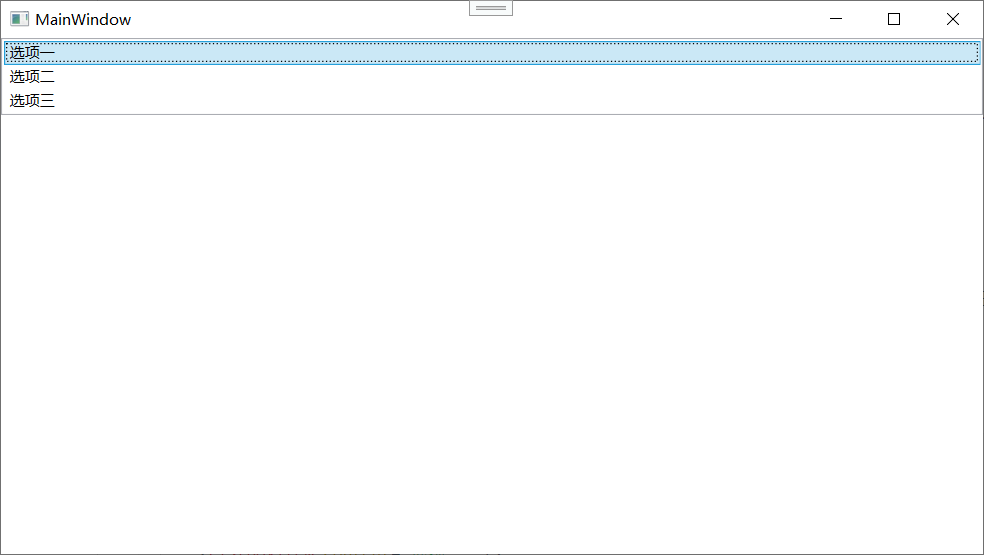
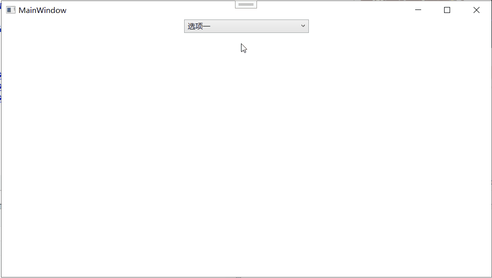

## 列表控件

前面讲的内容控件、文本控件、特殊容器，都有一个共同特点：**它们只处理一个东西**。`Button` 包一个 `Content`，`ScrollViewer` 包一个子元素，`TextBox` 存一段文字。但现实世界里大量数据不是“一个”，而是“一堆”——联系人列表、菜单项、下拉选项、日志条目、图片缩略图墙……

WPF 为“一堆东西”专门设计了一套控件体系，它们的基类是 **`ItemsControl`**（条目控件）。`ItemsControl` 可以容纳任意多个子元素，并在内部自动管理它们的呈现——比如竖向排列、横向排列、换行排列、或者更复杂的网格布局。

这一节 6.5 主要讲两个最常用的列表控件：**`ListBox`**（列表框，6.5.1）和 **`ComboBox`**（下拉框，6.5.2）。它们都继承自 `ItemsControl`，共享同一套条目管理机制。学会了这两个，后面遇到 `ListView`、`TreeView`、`DataGrid` 等更高级的列表控件，你会发现核心逻辑一模一样，只是外在行为和模板不同。

---

## ItemsControl：所有列表控件的基类

在深入 `ListBox` 和 `ComboBox` 之前，有必要先花点时间理解它们的共同基类 `ItemsControl`。这个基类提供了所有列表类控件通用的“管理一堆条目”的能力。

### Items 属性

`ItemsControl` 有一个 **`Items`** 属性，类型是 `ItemCollection`。这是一个集合，你可以往里面塞任何东西——字符串、数字、控件、面板、甚至其他列表控件。

在 XAML 里，你可以直接写在 `ItemsControl` 的标签内部：

```xml
<ListBox>
    <ListBoxItem Content="选项一" />
    <ListBoxItem Content="选项二" />
    <ListBoxItem Content="选项三" />
</ListBox>
```




XAML 解析器会自动把这些子元素添加到 `Items` 集合里。你不需要显式写 `<ListBox.Items>` 标签（虽然也可以写）。

在代码里：

```csharp
myListBox.Items.Add("新选项");
myListBox.Items.Add(new ListBoxItem { Content = "另一个选项" });
```

### ItemsSource 属性

除了手动一个一个往里塞条目，更常用的方式是通过数据绑定自动生成条目。这就是 **`ItemsSource`** 属性的作用——你可以把任何一个集合（数组、List、ObservableCollection 等）绑给它，`ItemsControl` 会自动为集合里每个元素创建一个条目。

```xml
<ListBox ItemsSource="{Binding UserList}" />
```

```csharp
myListBox.ItemsSource = myUserList;  // myUserList 是一个 ObservableCollection<User>
```

`Items` 和 `ItemsSource` 是**互斥**的——你只能用其中一个。如果同时设置了，运行时会抛异常。

### ItemTemplate：定义每个条目长什么样

当你通过 `ItemsSource` 绑定数据时，默认情况下条目显示为该数据对象的 `ToString()` 结果（通常就是类名，很难看）。你需要一个 **`ItemTemplate`**（条目模板）来告诉 WPF “这条数据应该怎么显示”。

`ItemTemplate` 的类型是 `DataTemplate`——这是 WPF 中专门用来把数据变成一棵控件树的模板机制。后面第 19 章会深入讲数据绑定和 `DataTemplate`，但这里先简单看个例子，建立感性认识：

```xml
<ListBox ItemsSource="{Binding UserList}">
    <ListBox.ItemTemplate>
        <DataTemplate>
            <StackPanel Orientation="Horizontal">
                <TextBlock Text="{Binding Name}" FontWeight="Bold" />
                <TextBlock Text=" - " />
                <TextBlock Text="{Binding Email}" Foreground="Gray" />
            </StackPanel>
        </DataTemplate>
    </ListBox.ItemTemplate>
</ListBox>
```

假设 `UserList` 是一个 `User` 对象的集合，每个 `User` 有 `Name` 和 `Email` 属性。上面的模板就会让 `ListBox` 的每一行显示为 “**张三** - zhang@example.com” 这样的格式。

**没有 `ItemTemplate` 的时候呢？** 如果你在 XAML 里直接写 `<ListBoxItem>` 子元素，那么每个 `ListBoxItem` 的 `Content` 就是你已经手动写好的内容，不需要模板。`ItemTemplate` 是**数据驱动**场景下的产物——数据集合是死的，模板负责把数据变成好看的 UI。

### ItemsPanel：定义条目怎么排列

默认情况下，`ListBox` 的条目是**垂直堆叠**的（像 `StackPanel` 一样）。但你可以通过 **`ItemsPanel`** 属性改变这个布局方式。比如你想让条目水平排列，就设一个水平 `StackPanel`；想让条目自动换行，就设一个 `WrapPanel`。

```xml
<ListBox ItemsSource="{Binding ImageList}">
    <ListBox.ItemsPanel>
        <ItemsPanelTemplate>
            <WrapPanel />
        </ItemsPanelTemplate>
    </ListBox.ItemsPanel>
    <!-- ItemTemplate 略 -->
</ListBox>
```

这个 `ListBox` 的条目会在水平方向自动换行排列，像缩略图墙一样。

`ItemsPanel` 的类型是 `ItemsPanelTemplate`——它是专门用来指定 `ItemsControl` 用什么面板来布局条目的模板。

### 其他通用属性

- **`DisplayMemberPath`**：如果数据源中的每个项是一个复杂对象，但你只想显示其中一个属性的值，可以用 `DisplayMemberPath` 快速指定那个属性的名字，而不需要写完整的 `ItemTemplate`。例如 `DisplayMemberPath="Name"` 就是每项只显示 `Name` 属性。这对简单场景非常省 XAML 代码。
- **`AlternationCount`**：设置交替行的数量，用于实现斑马条纹效果（让奇数行和偶数行背景色不同）。

理解了这个基类的基础，再看 `ListBox` 和 `ComboBox` 就简单了——它们只是在 `ItemsControl` 的基础上增加了“选择”和其他行为。

---

### ListBox

`ListBox` 是 `ItemsControl` 最直接的升级版。它继承了 `ItemsControl` 的所有能力（条目集合、条目模板、条目面板），并额外增加了**选择（Selection）** 机制——用户可以点击选中一个或多个条目，程序可以获取当前选中了什么。

#### 继承链

`ListBox` → `Selector` → `ItemsControl`

`Selector` 是一个抽象类，专门为“可以选择条目的控件”添加选择相关的属性和事件。`ComboBox`、`ListView`、`TabControl` 也都继承自 `Selector`。所以掌握了一个 `ListBox` 的选择机制，就等于掌握了 WPF 里所有可选控件的基础。

#### SelectionMode：单选还是多选

`ListBox` 的 **`SelectionMode`** 属性决定用户如何选择条目：

- **`Single`**（默认）：任何时候最多只能选中一个条目。用户点击新的条目，旧的自动取消选中。
- **`Multiple`**：用户可以同时选中多个条目。点击一个条目切换它的选中状态；按住 Ctrl 点击追加选中；按住 Shift 点击范围选中。
- **`Extended`**：和 `Multiple` 类似，但操作更符合文件管理器的习惯——直接点击会取消之前的所有选中并只选中当前项，Ctrl+点击才追加，Shift+点击范围选中。

```xml
<ListBox SelectionMode="Multiple" ItemsSource="{Binding Items}" />
```

大多数场景下，单选用 `Single`，多选用 `Extended`。纯粹的 `Multiple` 用得比较少，因为它“点击就切换”，用户要是没看仔细，很容易点走别的选中状态。

#### SelectedItem 和 SelectedIndex

获取当前选中的条目，最常用的方式是：

- **`SelectedItem`**（`object` 类型）：返回当前选中的那个条目对象本身。如果是单选模式，选中的就是那一个；如果是多选模式，返回的是**最后一个被选中的**或**第一个被选中的**（文档中一般说是第一个选中项或最后活跃项，行为取决于具体版本，最可靠的去拿 `SelectedItems`）。
- **`SelectedIndex`**（`int`）：当前选中条目的索引（从 0 开始计数）。如果没有选中任何条目，返回 -1。

```csharp
// 单选模式
var selected = myListBox.SelectedItem as MyDataObject;
if (selected != null) { /* 处理选中项 */ }
```

#### SelectedItems：多选时用这个

在多选模式下，用 `SelectedItems` 属性（类型是 `IList`）获取所有被选中的条目：

```csharp
foreach (MyDataObject item in myListBox.SelectedItems)
{
    // 处理每一个选中项
}
```

#### SelectedValue 和 SelectedValuePath

有时候你绑定的数据是一个复杂对象，但你只关心它的某个属性值。比如你有一个 `User` 对象列表，每项显示 `User.Name`，但你实际上关心的是选中项的 `User.Id`。传统方式是拿到 `SelectedItem` 再强转然后取属性。WPF 提供了一条快捷方式：

- **`SelectedValuePath`**：指定一个属性路径，如 `"Id"`。
- **`SelectedValue`**：根据 `SelectedValuePath`，自动提取选中项的对应属性值。

```xml
<ListBox ItemsSource="{Binding Users}" 
         DisplayMemberPath="Name"
         SelectedValuePath="Id"
         SelectedValue="{Binding SelectedUserId}" />
```

这样当用户选中某个用户时，ViewModel 的 `SelectedUserId` 自动被更新为该用户的 `Id` 值，不需要写任何事件处理代码，全靠绑定完成。

#### SelectionChanged 事件

当选中项变化时，`Selector.SelectionChanged` 事件触发。参数 `SelectionChangedEventArgs` 带有 `AddedItems` 和 `RemovedItems` 两个集合，告诉你哪些条目新被选中、哪些被取消选中。

```csharp
private void OnSelectionChanged(object sender, SelectionChangedEventArgs e)
{
    if (e.AddedItems.Count > 0)
    {
        var newSelection = e.AddedItems[0] as MyDataObject;
        // 处理新选中项
    }
}
```

注意：在初始化时（列表第一加载数据），也可能触发 `SelectionChanged`（从无选中变到有选中），所以事件处理里最好判断一下数据是否已加载完毕。

#### 附加特性：虚拟化与性能

当 `ListBox` 绑定到非常巨大的数据源（成千上万条）时，WPF 默认会为每个条目创建一个 `ListBoxItem` 容器。这在数据量大时会消耗大量内存和渲染性能。

`ListBox` 天生支持**UI 虚拟化**——只创建屏幕可见区域内的条目容器，滚动时回收复用在屏幕外的容器。默认情况下，虚拟化需要在满足以下条件时才生效：

- `ListBox` 放在能提供明确高度或宽度的容器里（如 `Grid` 的行）。
- `ItemsPanel` 使用的是支持虚拟化的面板（默认的 `VirtualizingStackPanel` 就支持）。
- 没有在外层额外包一个 `ScrollViewer`（`ListBox` 自带）。
- `CanContentScroll="True"`（这是默认值）。

如果你发现大列表滚动卡顿，可以检查是否破坏了上述条件。也可以显式设置：

```xml
<ListBox VirtualizingPanel.IsVirtualizing="True" 
         VirtualizingPanel.VirtualizationMode="Recycling" />
```

`Recycling` 模式会回收条目容器而不是每次都重建，性能更好。

---

### ComboBox

`ComboBox` 是 `Selector` 的另一个子类，本质上是**一个按钮 + 一个弹出式列表**的组合。用户点击按钮，弹出一个下拉框，里面显示可选条目，选中一个后下拉框关闭，按钮上显示当前选中项的内容。

#### 继承链

`ComboBox` → `Selector` → `ItemsControl`

所以 `ItemsControl` 和 `Selector` 的一切能力（`Items`、`ItemsSource`、`ItemTemplate`、`DisplayMemberPath`、`SelectedItem`、`SelectedIndex`、`SelectedValue`、`SelectedValuePath`、`SelectionChanged`）全都有，和 `ListBox` 的用法几乎一模一样。唯一的区别是 UI 呈现方式——`ListBox` 是直接展开在界面上的长列表，`ComboBox` 是收缩成一行、点击弹出的下拉框。

#### 基本用法

```xml
<ComboBox Width="200">
    <ComboBoxItem Content="选项一" />
    <ComboBoxItem Content="选项二" IsSelected="True" />
    <ComboBoxItem Content="选项三" />
</ComboBox>
```



或者走数据绑定路线：

```xml
<ComboBox ItemsSource="{Binding Users}" 
          DisplayMemberPath="Name"
          SelectedValuePath="Id"
          SelectedValue="{Binding SelectedUserId}" />
```

#### IsEditable：可编辑下拉框

默认情况下，`ComboBox` 是不可编辑的——用户只能从下拉列表里选，不能自己打字输入。但有些场景需要用户可以手动输入一个值（比如字体选择器，下拉列表里是常见字体，但用户可以自己输入任何字体名）。这时需要设置 **`IsEditable="True"`**。

```xml
<ComboBox IsEditable="True" Text="请输入或选择" />
```

`IsEditable` 打开后，`ComboBox` 的外观会变成一个文本框 + 下拉按钮的组合。用户可以：
- 直接在文本框里输入任意内容。
- 点击下拉按钮选择列表中的项，选中的值自动填进文本框。

与此相关的属性：

- **`Text`**：获取或设置文本框中的文本内容。当 `IsEditable="True"` 时，这个属性代表用户输入的文字。当用户从下拉列表中选择时，`Text` 会和选中项的显示文字同步。
- **`IsReadOnly`**：在可编辑模式下，设为 `True` 可以让用户能看到文本、打开下拉框选择，但不能手动修改文字。这类似于“强制从列表中选择”。

**注意**：当 `IsEditable="True"` 时，选中的条目不一定在列表中（因为用户可以输入任意值）。`SelectedItem` 可能是 `null`，而 `Text` 里有用户输入的字符串。你需要根据业务逻辑判断以哪个为准。

#### StaysOpenOnEdit

可编辑模式下，如果用户在文本框里输入文字进行搜索（比如输入拼音过滤下拉项），默认下拉框会在用户输入时关闭。设置 `StaysOpenOnEdit="True"` 可以让下拉框在编辑时保持打开。

#### IsDropDownOpen 和 DropDownOpened / DropDownClosed

你可以通过代码控制下拉框的打开和关闭：

```csharp
myComboBox.IsDropDownOpen = true;   // 打开下拉框
myComboBox.IsDropDownOpen = false;  // 关闭下拉框
```

两个事件：
- `DropDownOpened`：下拉框打开后触发。
- `DropDownClosed`：下拉框关闭后触发。

#### 自定义下拉框样式

`ComboBox` 的下拉框部分本身也是一个弹出窗口，可以通过自定义 `ItemTemplate` 和 `ItemsPanel` 来改变其外观，和 `ListBox` 完全一样。你甚至可以给 `ComboBox` 的每一个条目放上图片、多行文字、勾选标记等复杂内容。

```xml
<ComboBox ItemsSource="{Binding FontList}">
    <ComboBox.ItemTemplate>
        <DataTemplate>
            <StackPanel Orientation="Horizontal">
                <TextBlock Text="{Binding}" FontFamily="{Binding}" FontSize="14" />
            </StackPanel>
        </DataTemplate>
    </ComboBox.ItemTemplate>
</ComboBox>
```

这会做出一个字体选择下拉框，每一项都以自己代表的字体来显示字体名。这是 `ComboBox` 强大灵活性的体现。

#### MaxDropDownHeight 和 MaxDropDownItems

限制下拉框的最大高度或最多可见条目数，防止选项太多时下拉框撑得满屏幕都是：

```xml
<ComboBox MaxDropDownHeight="200" MaxDropDownItems="8" />
```

---

## 总结

6.5 节聚焦于 WPF 的列表控件体系，核心是理解 `ItemsControl` 的通用机制，然后顺藤摸瓜掌握 `ListBox` 和 `ComboBox`。

**ItemsControl 基础**：
- `Items`（手动添加子元素）和 `ItemsSource`（数据绑定自动生成条目），两者互斥。
- `ItemTemplate`（DataTemplate）：定义每个条目怎么显示，把数据变成 UI。
- `ItemsPanel`（ItemsPanelTemplate）：定义条目用什么排列方式（垂直/水平/换行/网格）。
- `DisplayMemberPath`：快速绑定单属性显示，省去写模板。

**ListBox**：
- 继承 `Selector` → `ItemsControl`，核心能力是**选择**。
- `SelectionMode`：`Single`（单选）、`Multiple`（多选简单模式）、`Extended`（多选扩展模式，符合文件管理器习惯）。
- `SelectedItem` / `SelectedIndex`（单选）、`SelectedItems`（多选）。
- `SelectedValuePath` + `SelectedValue`：快速提取选中项的某个属性值，MVVM 友好。
- `SelectionChanged` 事件：选中变化时通知。
- 内置 UI 虚拟化（`VirtualizingStackPanel`），大列表性能好。

**ComboBox**：
- 继承关系同 `ListBox`，但 UI 是按钮+下拉弹出框。
- 支持所有 `Selector` 选择属性和事件，用法几乎和 `ListBox` 一样。
- `IsEditable="True"` 开启可编辑模式，用户可手动输入文本。
- `Text` 属性存储用户输入的文本或选中项的显示文字。
- `IsDropDownOpen` 属性控制下拉框开闭，`DropDownOpened`/`DropDownClosed` 事件通知。
- `ItemTemplate` 同样支持复杂模板，可做富表现的下拉选项（如图标+文字）。

`ListBox` 和 `ComboBox` 是表单和数据浏览界面里使用频率极高的两个控件。它们背后的 `ItemsControl` 体系是你理解更高级列表控件（`ListView`、`TreeView`、`DataGrid`）的基础。关键记住：**条目怎么来**（Items/ItemsSource）、**长什么样**（ItemTemplate）、**怎么排列**（ItemsPanel）、**选中了谁**（SelectedItem/SelectedValue/SelectionChanged）——这四条规则贯穿所有列表类控件。