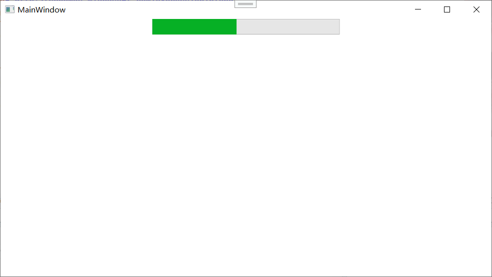
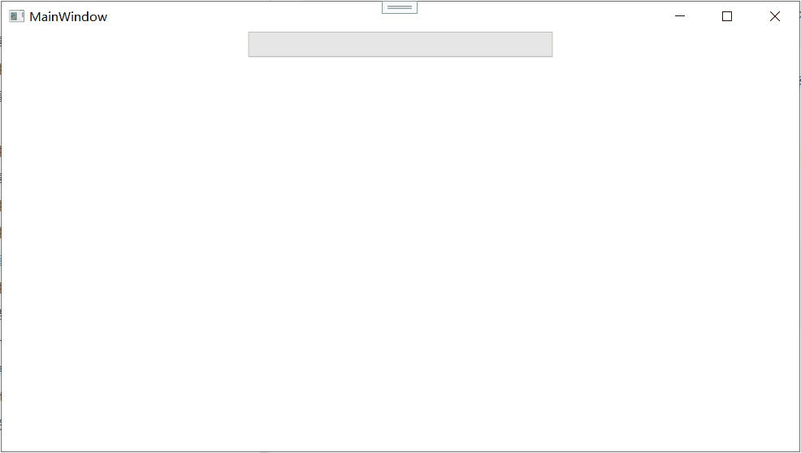

## 基于范围的控件

这节要学的两个控件——`Slider`（滑动条）和 `ProgressBar`（进度条）——都属于“基于范围的控件”。它们共同继承自一个叫 **`RangeBase`** 的抽象基类，这个基类提供了一套统一的属性来表示“当前在哪个位置”和“从哪到哪的范围”。理解 `RangeBase`，两个控件就不学自通了大半。

`Slider` 和 `ProgressBar` 在界面上是两种完全不同的表现形式：
- `Slider` 让用户**主动拖动**一个滑块来改变某个值（比如音量调节、亮度调节）。
- `ProgressBar` **被动地展示**某个操作的完成进度（比如文件下载进度、安装进度）。

但它们的底层数据模型一模一样：都有一个 `Minimum`、一个 `Maximum`，和一个夹在中间的 `Value`。

下面先快速认识 `RangeBase`，然后分别吃透 `Slider` 和 `ProgressBar`。

### RangeBase：滑动条和进度条的共同爹

`RangeBase` 定义了一套所有“基于范围”的控件都有的属性和事件。

**核心属性**：

- **`Minimum`**（`double`，默认 0）：范围的最小值。`Value` 不能低于这个值。
- **`Maximum`**（`double`，默认 10）：范围的最大值。`Value` 不能高于这个值。
- **`Value`**（`double`，默认 0）：当前值，必须夹在 `Minimum` 和 `Maximum` 之间。这是实际存储数据的属性。
- **`SmallChange`**（`double`，默认 1）：小步变化的幅度。用户用键盘方向键调节 `Slider` 时，按一下移多少。
- **`LargeChange`**（`double`，默认 10）：大步变化的幅度。用户用 PageUp/PageDown 调节，或点击 `Slider` 轨道空白处的时候，一次跳多少。

**核心事件**：

- **`ValueChanged`**：当 `Value` 属性变化时触发（不论是因为用户拖了滑动条，还是在代码里设了值）。参数 `RoutedPropertyChangedEventArgs<double>`，带有 `OldValue` 和 `NewValue`。

**依赖项属性的强制回调**：

`RangeBase.Value` 是一个依赖项属性，并且注册了**强制回调**（CoerceCallback）——任何时候 `Value` 被设置，无论是用户拖动、代码赋值还是数据绑定源推动，强制回调都会检查新值是否在 `Minimum` 和 `Maximum` 之间。如果不在，就把它“夹”回合法范围——低于 `Minimum` 就纠正为 `Minimum`，高于 `Maximum` 就纠正为 `Maximum`。

同样的，`Minimum` 和 `Maximum` 本身也注册了属性变更回调，当它们变化时，会主动调用 `CoerceValue(ValueProperty)` 来重新修正 `Value`。这是第 4 章讲的依赖项属性强制回调和联动修正的典型应用。

---

### Slider

`Slider` 是 `RangeBase` 的直系子类。它让用户通过拖动一个“滑块”来直观地修改 `Value`。几乎所有需要用户选择一个范围内的连续值（或离散值）的地方，都可以用 `Slider`——音量、亮度、对比度、缩放比例、视频进度条、评分星级……

#### 基本用法

```xml
<Slider Minimum="0" Maximum="100" Value="50" 
        Width="300" TickFrequency="10" />
```

这行代码画出一个水平滑动条，范围 0~100，初始值 50，每隔 10 个单位有一个刻度线。

#### Orientation：横着还是竖着

```xml
<Slider Orientation="Horizontal" />  <!-- 默认，水平 -->
<Slider Orientation="Vertical" />    <!-- 垂直 -->
```

垂直滑动条的高度需要显式设定，例如 `Height="200"`。水平和垂直的行为完全一样，只是外观方向不同。

#### TickBar：刻度和刻度线

`Slider` 可以在轨道上显示“刻度”来帮助用户定位。刻度相关的属性：

- **`TickFrequency`**（`double`）：刻度间隔。设为 10 表示每 10 个单位画一根刻度线。默认为 0（不画刻度）。
- **`TickPlacement`**（枚举）：刻度线画在哪。值有：
  - `None`（默认）：不显示刻度线。
  - `TopLeft`：水平滑动条在轨道上方；垂直滑动条在轨道左侧。
  - `BottomRight`：水平滑动条在轨道下方；垂直滑动条在轨道右侧。
  - `Both`：上下都有（或左右都有）。
- **`Ticks`**（`DoubleCollection`）：不想用 `TickFrequency` 自动等距生成刻度，你可以手动指定一组自定义位置。例如 `Ticks="0, 25, 50, 100"`。

```xml
<Slider Minimum="0" Maximum="100" Value="30"
        TickFrequency="10" TickPlacement="BottomRight" />
```

刻度让滑动条看起来更专业，用户也能更精确的定位。做音量调节、亮度调节等场景时建议加上刻度。

#### IsSnapToTickEnabled：吸附刻度

```xml
<Slider IsSnapToTickEnabled="True" TickFrequency="10" />
```

设为 `True` 后，用户拖动滑块时滑块会自动“吸附”到最近的刻度线上，实现离散的步进式调节。这在需要精确控制数值且你只想让用户选整十数值（比如 0, 10, 20...100）时非常有用。

注意：`IsSnapToTickEnabled` 需要 `TickFrequency` 大于 0 才有意义，或者你设了 `Ticks` 指定了刻度位置。

#### IsDirectionReversed：反向轨道

默认情况下，水平滑动条左边是最小值，右边是最大值；垂直滑动条上面是最小值，下面是最大值。设置 `IsDirectionReversed="True"` 可以反转这个顺序：

```xml
<Slider IsDirectionReversed="True" Orientation="Vertical" Height="200" />
```

这样垂直滑动条变成上面是最大值，下面是最小值（类似于某些调音台推子的行为）。

#### IsMoveToPointEnabled：点哪跳哪

默认情况下，用户点击滑动条空白轨道时，滑块会按照 `LargeChange` 的值跳一步（不会直接跳到鼠标位置）。设置 `IsMoveToPointEnabled="True"` 后，用户点轨道的任意位置，滑块就直接跳到那个位置。

```xml
<Slider IsMoveToPointEnabled="True" />
```

视频播放器的进度条通常用这个属性——用户点进度条后半段，视频直接跳到后半段。

#### Delay 和 Interval（来自 RepeatButton 的行为）

`Slider` 内部使用了 `RepeatButton` 来实现轨道两端的“箭头按钮”（当用户点击滑块两侧的轨道空白时，会触发连续增减）。因此 `Slider` 也继承了 `Delay` 和 `Interval` 属性（控制长按重复触发的延迟和间隔）。这些一般不去动它，知道有这个机制就行。

#### 响应用户拖动

最常用的响应方式就是处理 `ValueChanged` 事件：

```csharp
private void Slider_ValueChanged(object sender, RoutedPropertyChangedEventArgs<double> e)
{
    double newValue = e.NewValue;
    // 用新值更新音量、缩放等
}
```

在 MVVM 模式下，通常直接把 `Slider.Value` 绑定到 ViewModel 的属性上，不需要事件：

```xml
<Slider Value="{Binding Volume}" Minimum="0" Maximum="100" />
```

双向绑定让 `Slider` 拖动时 ViewModel 自动更新，ViewModel 改变时 `Slider` 也跟着动。

#### 自定义 Slider 外观

`Slider` 的外观完全可以通过控件模板重新设计。它的视觉树通常包含：
- 一个轨道（`Track`，包含 `Thumb` 滑块和两个 `RepeatButton`）
- 可选的 `TickBar`

你可以用 `ControlTemplate` 把滑块从默认的小圆点换成任何你喜欢的形状——比如圆形旋钮、长条按钮、甚至是自定义的图形。这是后话，到第 17 章模板会详细展开。

---

### ProgressBar

`ProgressBar` 也是 `RangeBase` 的子类，但它和 `Slider` 截然不同——它不给用户拖，纯粹用来**展示进度**。下载进度、操作完成百分比、任务执行进度，都用它。

#### 基本用法

```xml
<ProgressBar Minimum="0" Maximum="100" Value="45" 
             Width="300" Height="25" />
```


显示一个 45% 完成度的进度条。

`Value` 由程序更新。你可以在一个循环或异步任务里不断更新 `Value`：

```csharp
for (int i = 0; i <= 100; i++)
{
    myProgressBar.Value = i;
    await Task.Delay(50);  // 模拟工作
}
```

#### IsIndeterminate：不确定模式

有时候你没法给出准确进度——比如网络请求时间未知、操作步骤数不固定。这时候你需要一个“在做，但不知道还要多久”的提示。这就是**不确定模式**。

```xml
<ProgressBar IsIndeterminate="True" Width="300" Height="25" />
```


不确定模式下，`Value`、`Minimum`、`Maximum` 属性全部被忽略，进度条显示一段**循环滚动的亮块或光带**，告诉用户“程序没死，正在忙”。这个光带动画是 WPF 内置的，不需要你写任何代码。


**切换到确定模式**：当后端任务能拿到总进度时，直接切回来：

```csharp
myProgressBar.IsIndeterminate = false;
myProgressBar.Value = 50;
```

#### Orientation：也可以竖着

和 `Slider` 一样，`ProgressBar` 也支持垂直方向：

```xml
<ProgressBar Orientation="Vertical" Height="200" Width="25" Value="70" />
```

垂直进度条比较少见，但在某些特定仪表盘式场景（如温度计、容量指示器）能用上。

#### 最小高度和宽度

默认的 `ProgressBar` 外观高度是固定的（大约 20 多像素），如果你想让进度条更粗，可以设置 `Height` 或 `MinHeight`。还可以用 `Border` 或控件模板完全改变它的外观。

#### 进度条的动画效果

默认的确定模式进度条从 0 跳到 100 是瞬间的，看起来有点生硬。如果你想要平滑的动画效果（进度条慢慢涨上去），不要在循环里每步都设一次 `Value`（那样确实会产生逐步上涨的效果，但如果更新太快还是会闪），更好的办法是利用 `DoubleAnimation` 来平滑过渡到目标进度值。

但更简单的是用 `ProgressBar` 自带的模板——WPF 的默认进度条模板在值变化时**已经有平滑动画**了（自 .NET Framework 4 之后的改进），大多数情况下你不需要额外加动画，直接设值就会平滑过渡。如果你的版本没有平滑过渡，可能需要自定义模板或增加缓动。

#### Marquee 样式和模板

不确定模式的滚动光带动画，WPF 称为“Marquee”样式。它是通过控件模板里的 `VisualStateManager` 和 `Storyboard` 实现的。如果你想自定义光带的颜色、宽度、滚动速度，需要重写 `ProgressBar` 的 `ControlTemplate`。这是比较进阶的内容，但知道它背后是模板动画，你就不会觉得它神秘了。

#### 什么时候用 ProgressBar？

- **需要展示完成百分比**（文件下载、数据处理、安装进度）→ 用确定模式，定时更新 `Value`。
- **无法确定完成时间**（连接服务器、等待响应、加载中）→ 用不确定模式 `IsIndeterminate="True"`。
- **结合后台任务**：`ProgressBar` 通常和 `BackgroundWorker` 或 `async/await` + `IProgress<T>` 接口配合使用。这是多线程编程的一部分，后面第 31 章会讲。

---

## 总结

6.6 节的内容非常聚焦，就是两个基于范围值的控件：

**共同基类 `RangeBase`**：
- `Minimum`、`Maximum`、`Value`：定义范围区间。
- `SmallChange`、`LargeChange`：键盘和点击调节步长。
- `ValueChanged` 事件：值变化通知。
- 依赖项属性强制回调自动保证 `Value` 始终落在合法区间内。

**Slider（滑动条）**：
- 用户可拖动滑块来改变值。
- `Orientation`：水平或垂直。
- 刻度系统：`TickFrequency`（等距刻度）、`Ticks`（自定义位置）、`TickPlacement`（刻度位置）、`IsSnapToTickEnabled`（吸附刻度）。
- `IsDirectionReversed`：反向轨道。
- `IsMoveToPointEnabled`：点哪跳哪。
- 通过 `ValueChanged` 事件或数据绑定响应拖动。

**ProgressBar（进度条）**：
- 纯展示控件，不允许用户交互。
- 确定模式：通过更新 `Value` 展示完成百分比。
- 不确定模式（`IsIndeterminate="True"`）：显示滚动光带动画，表示“正在忙但未知进度”。
- 也支持 `Orientation` 水平和垂直。
- 常配合后台任务使用（`IProgress<T>` 接口）。

`Slider` 和 `ProgressBar` 是桌面应用里最直观的“数量表达”控件。一个让用户输入数量，一个向用户展示数量。它们共享的 `RangeBase` 基类统一了值范围、变化通知和边界保证。学完这一节，配合前面的文本控件和列表控件，你的控件工具箱已经相当丰富，能应付绝大多数标准表单和工具类界面的需求了。