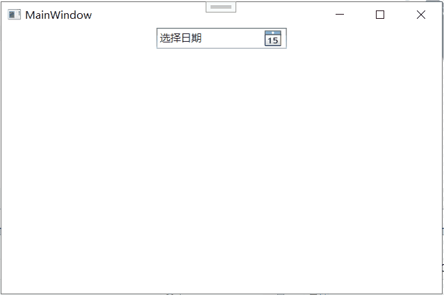
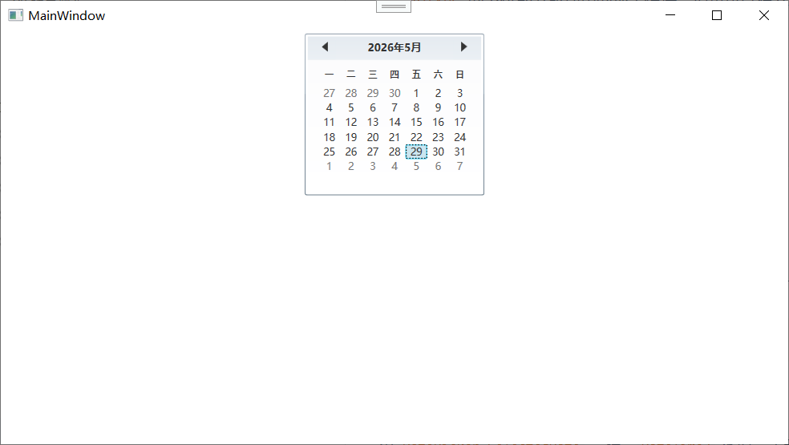

## 日期控件

到目前为止，你学过的控件处理的数据类型有：文字（`TextBox`、`TextBlock`）、布尔值（`CheckBox`、`RadioButton`）、数值范围（`Slider`、`ProgressBar`）、任意对象集合（`ListBox`、`ComboBox`）。但还有一类几乎每个业务应用都会遇到的数据类型——**日期和时间**。

让用户手动在一个文本框里输入日期是一件非常痛苦的事，而且格式不统一、容易出错。所以 WPF 提供了一个专门用来选择和显示日期的控件——**`DatePicker`**，以及一个完全展开的月历控件——**`Calendar`**。

这两个控件在功能上有很大重叠，但使用场景不同：

- **`DatePicker`**：紧凑型日期选择器，外观像一个文本框加一个小日历图标。点击图标弹出一个下拉的 `Calendar`，用户选完日期后日历消失，选中的日期填到文本框里。适合放在表单中作为日期输入字段。
- **`Calendar`**：完整的月历控件，直接嵌在界面上，常年可见。用户可以在上面浏览不同月份、选择日期，甚至选择日期范围。适合放在需要频繁查看和选择日期的面板里（如日程管理、航班查询页面的日历面板）。

两个控件都位于 `System.Windows.Controls` 命名空间下，是从 .NET Framework 4 开始引入 WPF 的。下面分别细讲。

---

### DatePicker

`DatePicker` 是 WPF 里最常用的日期输入控件。用户看到的是一个只读的文本框 + 一个日历小图标按钮。点击按钮后，弹出一个完整月历供选择，选中后自动填入日期文字。

#### 基本用法

```xml
<DatePicker Width="150" />
```



运行后显示一个空白文本框，右侧有个小日历图标。点击图标弹出日历，选中日期后文本框显示该日期（格式取决于系统区域设置，中文通常是 yyyy-MM-dd），日历弹窗自动关闭。

#### 核心属性

**`SelectedDate`**

类型：`DateTime?`（可为 null 的 `DateTime`）。这是 `DatePicker` 最重要的属性——用户选中的日期。如果没有选中任何日期，值为 `null`。

```xml
<DatePicker SelectedDate="2026-01-15" />
```

代码里设置和读取：

```csharp
datePicker.SelectedDate = new DateTime(2026, 1, 15);

if (datePicker.SelectedDate.HasValue)
{
    DateTime selected = datePicker.SelectedDate.Value;
    MessageBox.Show($"你选了: {selected.ToShortDateString()}");
}
```

`SelectedDate` 是一个依赖项属性，支持数据绑定。在 MVVM 里你通常会把它双向绑定到 ViewModel 的一个 `DateTime?` 属性上：

```xml
<DatePicker SelectedDate="{Binding Birthday, Mode=TwoWay}" />
```

**`DisplayDate`**

类型：`DateTime`（不能为 null）。控制日历弹出时默认显示哪个月份。默认值是 `DateTime.Today`（今天）。

如果不设 `DisplayDate`，日历弹出时总是显示当前月份。如果你希望弹出时显示一个特定的月份（比如用户出生年份所在的月份），可以这样设：

```xml
<DatePicker DisplayDate="1990-01-01" />
```

用户第一次打开日历时，会看到 1990 年 1 月的月历，而不是当前月份。

注意 `DisplayDate` 和 `SelectedDate` 是两个独立的概念：`DisplayDate` 只是控制日历显示哪个月份，不改变 `SelectedDate`。用户选了某个日期后，`SelectedDate` 会更新，`DisplayDate` 不会自动跟随变化（除非你代码里手动同步）。

**`Text`**

类型：`string`。获取或设置 `DatePicker` 文本框里显示的文字。这个属性的行为取决于 `IsEditable`：

- 当 `IsEditable="False"`（默认）时，`Text` 由选中的日期格式化而来，只读。
- 当 `IsEditable="True"` 时，用户可以直接在文本框里输入日期文本，然后 `DatePicker` 会尝试解析它。如果解析成功，`SelectedDate` 更新；如果解析失败，`SelectedDate` 保持原值或 null，控件的文本框会显示红色边框表示输入无效。

**`IsEditable`**

默认 `false`——用户不能手动输入日期文字，只能通过日历选择。设为 `true` 后，文本框变成可编辑的，用户既可以手工输入，也可以点日历选。

```xml
<DatePicker IsEditable="True" />
```

**`IsDropDownOpen`**

类型：`bool`。代码里控制日历弹窗的打开和关闭。

```csharp
myDatePicker.IsDropDownOpen = true;  // 弹出日历
```

**`SelectedDateFormat`**

类型：`DatePickerFormat` 枚举。控制选中日期后，文本框里的显示格式：

- `Long`：使用系统的长日期格式（如 `2026年1月15日`）。
- `Short`（默认）：使用系统的短日期格式（如 `2026/1/15` 或 `2026-01-15`）。

```xml
<DatePicker SelectedDateFormat="Long" />
```

**`BlackoutDates`**

类型：`CalendarBlackoutDatesCollection`。一个日期范围集合，定义哪些日期**不可选**。被加入黑名单的日期在日历弹窗里会被灰掉，用户无法点击选中。

```csharp
// 禁止选择过去所有日期
myDatePicker.BlackoutDates.Add(
    new CalendarDateRange(DateTime.MinValue, DateTime.Today.AddDays(-1)));

// 禁止选择 2026-02-01 到 2026-02-10
myDatePicker.BlackoutDates.Add(
    new CalendarDateRange(new DateTime(2026, 2, 1), new DateTime(2026, 2, 10)));

// 禁止选择所有周末
myDatePicker.BlackoutDates.Add(
    new CalendarDateRange(new DateTime(2026, 1, 3), new DateTime(2026, 1, 4)));
```

这个属性在业务中非常常用——酒店预订限定未来日期、会议安排排除节假日、报表查询限制在某个时间段内等等。

#### 事件

**`SelectedDateChanged`**

当用户选择了新日期（或清除了日期）时触发。参数 `SelectionChangedEventArgs`（因为 `DatePicker` 内部也实现了选择变化模式，但参数不直接包含新旧日期。要获取新日期，直接读 `datePicker.SelectedDate` 即可）。

```csharp
private void DatePicker_SelectedDateChanged(object sender, SelectionChangedEventArgs e)
{
    if (myDatePicker.SelectedDate.HasValue)
    {
        DateTime newDate = myDatePicker.SelectedDate.Value;
        // 做后续逻辑，比如过滤数据
    }
}
```

**`DateValidationError`**

当 `IsEditable="True"` 且用户输入了无法解析的文本时触发。你可以在这个事件里处理错误提示：

```csharp
private void DatePicker_DateValidationError(object sender, DatePickerDateValidationErrorEventArgs e)
{
    MessageBox.Show($"日期无效: {e.Text}");
    // e.ThrowException = false;  // 设为 false 避免抛异常
}
```

---

### Calendar

`Calendar` 是一个完整展开的月历控件，直接嵌入在界面上，不是弹窗形式。用户可以浏览任意月份，选择的日期高亮显示。它是 `DatePicker` 的下拉部分所使用的那个控件，但也可以独立使用。

#### 基本用法

```xml
<Calendar />
```



运行后直接显示当月的完整日历，包含：
- 顶部左右箭头翻月。
- 中间当前月份和年份。
- 主体区域显示该月的所有日期格子（周日到周六七列，一行一周）。

#### 核心属性

**`SelectedDate`**

和 `DatePicker.SelectedDate` 一样，`DateTime?` 类型，表示用户当前选中的日期。未选中时为 `null`。

```xml
<Calendar SelectedDate="2026-03-15" />
```

**`DisplayDate`**

和 `DatePicker.DisplayDate` 一样，控制日历显示哪个月份。用户翻月时，`DisplayDate` 会跟着变（这和 `DatePicker` 不同，后者弹窗关闭后 `DisplayDate` 不变）。

**`DisplayMode`**

类型：`CalendarMode` 枚举。控制月历的显示模式：

- `Month`（默认）：以“月”为单位显示，一次显示一个月的所有日期。这是最常用的模式。
- `Year`：以“年”为单位显示，一次显示一年 12 个月。用户点击某个月后，可以进入该月（如果 `IsTodayHighlighted` 未设置为 false，今天会用高亮标记，在年模式下也能看到）。
- `Decade`：以“十年”为单位显示，一次显示 10 个年份。用户点击某一年后，进入该年的 Year 模式。

```xml
<Calendar DisplayMode="Year" />
```

用户可以通过点击标题上的“月份”或“年份”文本，逐级向上切换（月 → 年 → 十年）。这提供了一种快速的日期浏览导航。

**`SelectionMode`**

类型：`CalendarSelectionMode` 枚举。决定用户可以怎样选择日期：

- `SingleDate`（默认）：只能选一个日期。
- `SingleRange`：可以选一个**连续的日期范围**。用户点击起始日期，按住 Shift 再点结束日期，或者拖拽选择。`SelectedDates` 集合会包含这个范围内的所有日期。
- `MultipleRange`：可以选**多个不连续的日期范围**。按 Ctrl 点击追加新的日期或范围。
- `None`：完全不能选，`Calendar` 变成一个只能看不能点的纯展示月历。

```xml
<Calendar SelectionMode="SingleRange" />
```

**`SelectedDates`**

当 `SelectionMode` 为 `SingleRange` 或 `MultipleRange` 时，用 `SelectedDates` 集合获取所有被选中的日期，而不是 `SelectedDate`（单选时用 `SelectedDate` 更简便）。`SelectedDates` 类型是 `SelectedDatesCollection`，可以遍历。

```csharp
foreach (DateTime date in myCalendar.SelectedDates)
{
    Console.WriteLine(date.ToShortDateString());
}
```

**`BlackoutDates`**

和 `DatePicker.BlackoutDates` 完全一样，设置不可选的日期范围。

**`IsTodayHighlighted`**

默认 `true`，会在今天的日期格子上加一个高亮标记（通常是额外边框或颜色）。设为 `false` 取消这个标记。

**`FirstDayOfWeek`**

决定每周的第一天是哪一天。对于中文系统，默认是 `Monday`（周一）。你可以设为 `Sunday`（周日），或者别的。

```xml
<Calendar FirstDayOfWeek="Sunday" />
```

#### 自定义 Calendar 外观

`Calendar` 控件模板比 `DatePicker` 更复杂，因为它包含更多的视觉状态——常规日期、今日高亮、选中日期、未选中日期、黑名单日期、不同 DisplayMode 下的显示、星期标题行等等。你可以通过重写 `Calendar` 的 `CalendarDayButtonStyle` 和 `CalendarButtonStyle` 等属性来改变天和月按钮的样式，也可以通过完整的 `ControlTemplate` 重新设计整个月历外观。

#### 事件

**`SelectedDatesChanged`**

当用户选择变化时触发（包括单选、多选、范围选择）。参数 `SelectionChangedEventArgs`。

```csharp
private void Calendar_SelectedDatesChanged(object sender, SelectionChangedEventArgs e)
{
    // e.AddedItems 包含新选中的日期
    // e.RemovedItems 包含被取消选中的日期
}
```

**`DisplayDateChanged`**

当 `DisplayDate` 变化时触发（用户翻月、翻年、或者代码修改了 `DisplayDate`）。参数 `CalendarDateChangedEventArgs`。

**`DisplayModeChanged`**

当 `DisplayMode` 变化时触发（用户从月视图切换到年视图）。

---

## DatePicker vs Calendar：怎么选？

| 特性      | DatePicker         | Calendar                       |
| ------- | ------------------ | ------------------------------ |
| 界面形态    | 文本框 + 弹出日历         | 直接嵌在界面上的月历面板                   |
| 日常用法    | 表单里的日期输入字段         | 日期面板、行程日历、预定视图                 |
| 多选/范围选择 | 不支持（仅单选或空）         | 支持 SingleRange / MultipleRange |
| 显示模式切换  | 不支持（一直就是月视图弹窗）     | 支持 Month / Year / Decade 三级浏览  |
| 占用空间    | 紧凑，一行高             | 较大，固定宽度约 220px，高度约 200px       |
| 可编辑文本   | IsEditable 可开启手动输入 | 无文本框                           |
| 黑名单     | 支持 BlackoutDates   | 支持 BlackoutDates               |

简单决策：**需要一个日期输入框，放表单里 → `DatePicker`。需要一个月历面板常年可见，或需要日期范围选择 → `Calendar`。**

---

## 总结

日期控件是表单和日程类应用的核心组件，WPF 提供了两个互补的控件：

**DatePicker**：
- 紧凑型日期输入控件，文本框 + 弹出日历。
- `SelectedDate`（`DateTime?`）：用户选中的日期，支持数据双向绑定。
- `DisplayDate`：弹窗日历初始显示的月份，默认今天。
- `IsEditable`：是否允许手动输入日期文本。
- `SelectedDateFormat`：日期显示格式（Long / Short）。
- `BlackoutDates`：不可选的日期范围集合。
- `SelectedDateChanged` 事件响应日期变化。

**Calendar**：
- 完整嵌入界面的月历面板。
- `SelectedDate`（单选）、`SelectedDates`（多选/范围选择）。
- `SelectionMode`：`SingleDate`（单选）、`SingleRange`（单范围）、`MultipleRange`（多范围）、`None`（只读）。
- `DisplayMode`：`Month`（月视图）、`Year`（年视图）、`Decade`（十年视图）三级导航。
- `DisplayDate`：当前显示的月份，随用户翻月自动更新。
- `FirstDayOfWeek`：自定义每周起始日。
- `IsTodayHighlighted`：是否高亮今天。
- `BlackoutDates`：同样支持黑名单。
- `SelectedDatesChanged`、`DisplayDateChanged`、`DisplayModeChanged` 等事件。

两个控件共享相同的日期选择和黑名单逻辑，底层日期处理能力一致。掌握了它们，你的表单和面板就能优雅地处理一切日期相关输入和展示需求了。