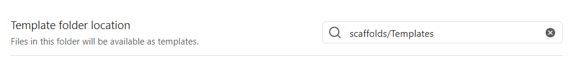
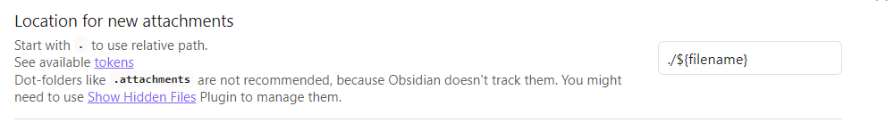
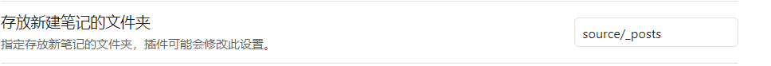
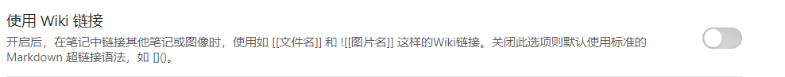
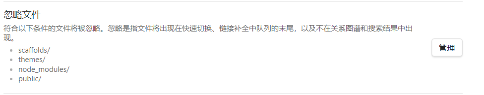

# Front-Matter


obsidian安装Template插件，设置目录后在该目录下创建`HexoPost.md`文件

`HexoPost.md`内容如下
```
---
title: <% tp.file.title %>
date: <% tp.date.now("YYYY-MM-DD HH:mm:ss") %>
toc: true
categories:
<%*
// 自动生成分类（兼容Windows路径）
let folders = await tp.file.folder(true).split(/[\\/]/); 
folders = folders.slice(2); // 移除 "_posts" 父级目录
for (let category of folders) {
    tR += `  - ${category}`;
}
if (folders.length === 0) {
    tR += "  - 未分类";
}
%>
tags:
---
```

这样就可以在新建md文件后点击obsidian侧边来自动填充categories

# 图片管理
站点配置文件`_config.yml`
```yml
post_asset_folder: true  # 启用文章资源文件夹
```
obsidian安装 Custom Attachment Location插件并进行如下设置


# 其它小优化

## 设置新建笔记位置

## 关闭wiki链接

文章内跳转使用md语法
`[显示文本](#锚点)` 
md标题自动生成锚点（全小写，空格换-）或者自定义锚点（`<a id="nihao"></a>`）

## 忽略文件夹


# 参考
[使用 Hexo 搭建博客 | OHLIA's Wiki](https://ohlia.github.io/Wiki-site/wiki/Hexo/build-blog-by-hexo/)
[Hexo和Obsidian：让个人博客写作更加优雅、高效 - ＊tree_fly 's Blog](https://itreefly.com/posts/e5113722.html)
[给博客上Live2d](https://github.com/EYHN/hexo-helper-live2d/blob/master/README.zh-CN.md)
