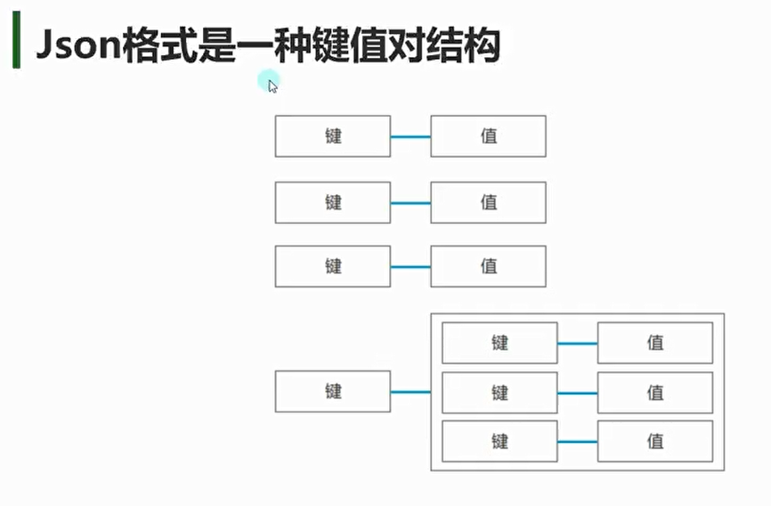
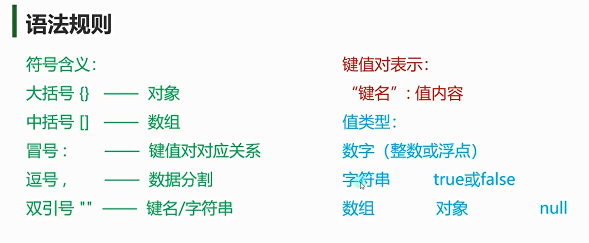
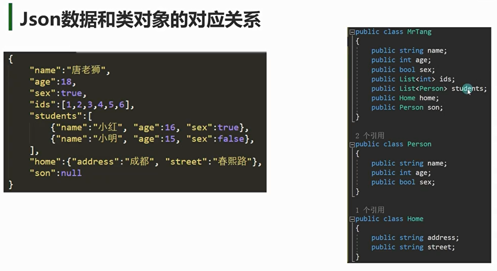
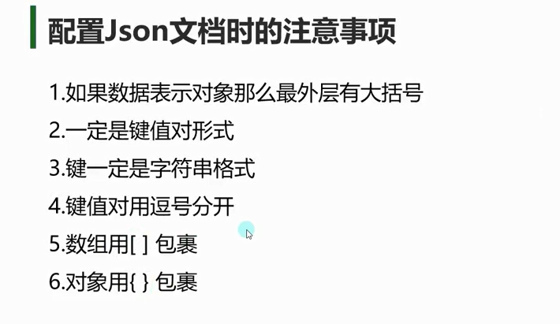
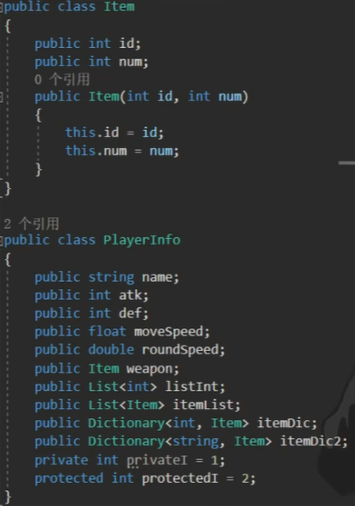

**数据类型**  
JSON支持以下几种数据类型：
- **字符串**：`"name": "Unity"`
- **数字**：`"version": 2021.3`
- **布尔值**：`"isActive": true`
- **数组**：`"features": ["2D", "3D", "VR"]`
- **对象**：`"settings": {"resolution": "1920x1080", "fullscreen": true}`
- **null**：`"error": null`
**JSON对象**  
JSON对象由大括号 `{}` 包裹，键值对用逗号分隔。键名必须用双引号括起来，值可以是任意JSON数据类型。
```json
{
  "name": "Unity",
  "version": 2021.3
}
```

**JSON数组**  
JSON数组由中括号 `[]` 包裹，元素用逗号分隔。数组中的元素可以是任意JSON数据类型。
```json
["2D", "3D", "VR"]
```

**嵌套结构**  
JSON支持对象和数组的嵌套，可以在对象中嵌套数组，数组中也可以嵌套对象。
```json
{
  "name": "Unity",
  "features": ["2D", "3D", "VR"],
  "settings": {
    "resolution": "1920x1080",
    "fullscreen": true
  }
}
```


Json格式是一种键值对结构



语法规则



Json数据和类对象的对应关系


```json
//大括号包裹的代表一个对象
{
    //冒号 代表的是 键值对的对应关系
    //逗号 就是分割成员变量的间隔符
    //Json当中的键一定要用 双引号包裹
    "name":"nihao",
    "age":18,
    "sex":true,
    //用于测试的 浮点类型 是支持浮点数的
    "testF":1.4,
    //中括号代表数组
    "ids":[1,2,3,4],
    "students":[{"name":"小红", "age":10, "sex":false},
                {"name":"小明", "age":8, "sex":true},
                {"name":"小强", "age":7, "sex":true}],
    "home":{"address":"成都", "street":"春熙路"},
    "son":null,
    //字典的话 键会变成双引号 以后转换时要注意！！！
    "dic":{"1":"123", "2":"234"}
}
```





请用Json语法描述一个玩家对象类，结构如下图



```json
{
    "name":"黄先生",
    "atk":10,
    "def":3,
    "moveSpeed":1.4,
    "roundSpeed":1.4,
    "weapon":{"id":1, "num":1},//如果没有武器 可以直接值为null
    "listInt":[1,2,3,4,5],
    "itemList":[{"id":2, "num":10}, 
                {"id":3, "num":99},
                {"id":4, "num":55}],
    "itemDic":{ "2":{"id":2, "num":1},
                "3":{"id":3, "num":10}},
    "itemDic2":{"2":{"id":2, "num":1}},
    "privateI":1,
    "protectedI":99
}
```
