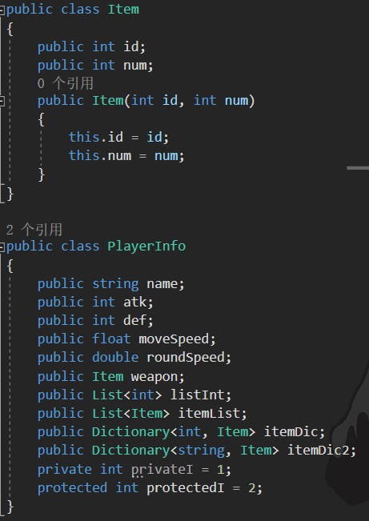

# JsonUtlity是什么
JsonUtlity 是Unity自带的用于解析Json的公共类。
Unity内置了`JsonUtility`，虽然功能相对简单，但对于大多数基本需求已经足够。如果需要更强大的功能，可以使用第三方库如`Newtonsoft.Json`。

JsonUtlity可以:
将内存中对象序列化为Json格式的字符串。
将Json字符串反序列化为类对象。


# 在文件中存读字符串
File.WriteAllText方法 存储字符串到指定路径文件中
```cs
//File类中的WriteAllText方法 存储字符串到指定路径文件中
//第一个参数 填写的是 存储的路径
//第二个参数 填写的是 存储的字符串内容
//注意：第一个参数 必须是存在的文件路径 如果没有对应文件夹 会报错
File.WriteAllText(Application.persistentDataPath + "/Test.json", "存储的json文件");
print(Application.persistentDataPath);
```

File.ReadAllText方法 在指定路径文件中读取字符串
```cs
//File类中的ReadAllText方法 在指定路径文件中读取字符串
string str = File.ReadAllText(Application.persistentDataPath + "/Test.json");
print(str);
```

# 使用JsonUtility序列化

**注意**
float序列化时看起来会有一些误差。
自定义类需要加上序列化特性`[System.Serializable]`。
想要序列化私有变量，需要加上特性`[SerializeField]`。
JsonUtility不支持字典。
JsonUtlity存储null对象不会是null，而是默认值的数据。
如果Json中数据少了，读取到内存中类对象中时不会报错。
JsonUtlity不能直接将数据反序列化为数据集合。
Json文档编码格式必须是UTF-8。

File存读字符串的方法ReadAllText和WriteAllText。
JsonUtlity提供的序列化反序列化方法ToJson和FromJson。
```cs
using UnityEngine;

[System.Serializable]
public class GameData
{
    public string playerName;
    public int level;
    public float health;
}

public class JsonExample : MonoBehaviour
{
    void Start()
    {
        // 序列化
        GameData data = new GameData();
        data.playerName = "Player1";
        data.level = 5;
        data.health = 100.0f;
        string json = JsonUtility.ToJson(data);

        File.WriteAllText(Application.persistentDataPath + "/savefile.json", json);

        // 反序列化
        string path = Application.persistentDataPath + "/savefile.json";
        if (File.Exists(path))
        {
            json = File.ReadAllText(path);
            GameData loadedData = JsonUtility.FromJson<GameData>(json);
            Debug.Log(loadedData.playerName);
        }
    }
}
```

**JsonUtlity无法直接读取数据集合，比如直接读取List或数组会报错。**
```json
[
    {"hp":4,"speed":6,"volume":5,"resName":"Airplane/Airplane1","scale":15},
    {"hp":3,"speed":7,"volume":4,"resName":"Airplane/Airplane2","scale":15},
    {"hp":2,"speed":8,"volume":3,"resName":"Airplane/Airplane3","scale":15},
    {"hp":10,"speed":3,"volume":10,"resName":"Airplane/Airplane4","scale":6},
    {"hp":6,"speed":5,"volume":7,"resName":"Airplane/Airplane5","scale":10}
]
```

```cs
[System.Serializable]
public class RoleInfo
{
    public int hp;
    public int speed;
    public int volume;
    public string resName;
    public int scale;
}

//JsonUtlity无法直接读取数据集合 比如直接读取List或数组 会报错
string jsonStr1 = File.ReadAllText(Application.streamingAssetsPath + "/RoleInfo.json");

List<RoleInfo> roleInfoList = JsonUtility.FromJson<List<RoleInfo>>(jsonStr1);//报错
```

可以外层套`{}`来做就不会报错
```json
// RoleInfo2.json
{
    "list":[
        {"hp":4,"speed":6,"volume":5,"resName":"Airplane/Airplane1","scale":15},
        {"hp":3,"speed":7,"volume":4,"resName":"Airplane/Airplane2","scale":15},
        {"hp":2,"speed":8,"volume":3,"resName":"Airplane/Airplane3","scale":15},
        {"hp":10,"speed":3,"volume":10,"resName":"Airplane/Airplane4","scale":6},
        {"hp":6,"speed":5,"volume":7,"resName":"Airplane/Airplane5","scale":10}
    ]
}
```
```cs
[System.Serializable]
public class RoleInfo
{
    public int hp;
    public int speed;
    public int volume;
    public string resName;
    public int scale;
}

public class RoleData
{
    public List<RoleInfo> list;
}

string jsonStr2 = File.ReadAllText(Application.streamingAssetsPath + "/RoleInfo2.json");
print(jsonStr2);
RoleData data = JsonUtility.FromJson<RoleData>(jsonStr2);
```


# 练习
有一个玩家数据类,为该类写一个方法结合JsonUtility知识点,完成对象的序列化和反序列化



```cs
using System.Collections;
using System.Collections.Generic;
using System.IO;
using UnityEngine;

/// <summary>
/// 物品类
/// </summary>
[System.Serializable]
public class Item
{
    public int id;       // 物品ID
    public int num;      // 物品数量

    public Item(int id, int num)
    {
        this.id = id;
        this.num = num;
    }
}

/// <summary>
/// 玩家信息类
/// </summary>
public class PlayerInfo
{
    public string name;                      // 玩家姓名
    public int atk;                          // 玩家攻击力
    public int def;                          // 玩家防御力
    public float moveSpeed;                  // 玩家移动速度
    public double roundSpeed;                // 玩家旋转速度
    public Item weapon;                      // 玩家武器信息
    public List<int> listInt;                // 整型列表
    public List<Item> itemList;              // 物品列表
    public Dictionary<int, Item> itemDic;    // 物品字典，以物品ID作为键
    public Dictionary<string, Item> itemDic2;// 物品字典，以字符串型的物品ID作为键
    [SerializeField]
    private int privateI = 1;                // 私有整数字段
    [SerializeField]
    protected int protectedI = 2;            // 受保护整数字段
}


public class Lesson04_练习题 : MonoBehaviour
{
    void Start()
    {
        PlayerInfo player = new PlayerInfo();
        player.name = "老狮";
        player.atk = 11;
        player.def = 5;
        player.moveSpeed = 20.5f;
        player.roundSpeed = 21.4f;

        player.weapon = new Item(1, 1);

        player.listInt = new List<int>() { 1, 2, 3, 4, 5 };

        player.itemList = new List<Item>() { new Item(1, 99), new Item(2, 44) };

        player.itemDic = new Dictionary<int, Item>() { { 1, new Item(1, 12) }, { 2, new Item(2, 22) } };

        player.itemDic2 = new Dictionary<string, Item>() { { "1", new Item(1, 12) }, { "2", new Item(2, 22) } };

        SaveData(player, "PlayerInfo");

        PlayerInfo player2 = LoadData("PlayerInfo");
    }


    public void SaveData(PlayerInfo player, string fileName)
    {
        string jsonStr = JsonUtility.ToJson(player);

        print(Application.persistentDataPath);

        File.WriteAllText(Application.persistentDataPath + "/" + fileName + ".json", jsonStr);
    }


    public PlayerInfo LoadData(string fileName)
    {
        string jsonStr = File.ReadAllText(Application.persistentDataPath + "/" + fileName + ".json");

        return JsonUtility.FromJson<PlayerInfo>(jsonStr);
    }
}
```

