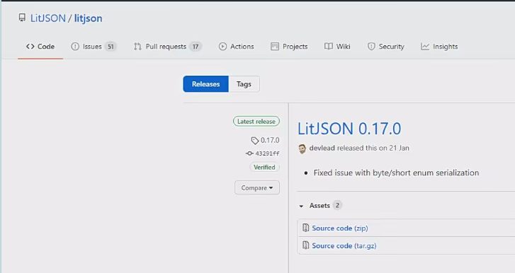
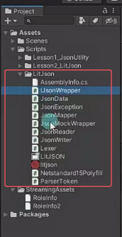
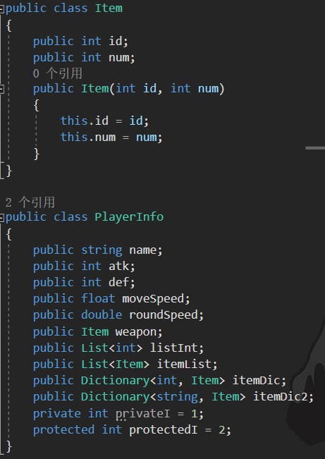

| 特性          | JsonUtility | Newtonsoft | LitJSON |
| ----------- | ----------- | ---------- | ------- |
| 安装方式        | 内置          | Package    | 手动DLL   |
| 序列化速度       | 中等          | 较慢         | 最快      |
| 复杂类型支持      | 有限          | 完善         | 中等      |
| 移动端适用性      | 优秀          | 较重         | 最佳      |
| 自定义格式化      | 基础          | 强大         | 中等      |
| Unity类型原生支持 | 优秀          | 需扩展        | 需转换     |

# LitJson是什么
LitJson 是一个第三方库，用于处理Json的序列化和反序列化。它是C#编写的，体积小、速度快、易于使用。可以很容易地嵌入到我们的代码中，只需要将LitJson代码拷贝到工程中即可。


# 获取LitJson
导入方式
前往LitJson官网 [LitJSON - Home](https://litjson.net/)下载LitJSON源码
将LitJSON文件夹放入Assets/Plugins
添加命名空间：`using LitJson;`


只要代码 其他图片什么的都可以删掉



# 使用LitJson
相对JsonUtlity不需要加特性。
不能序列化私有变量。
支持字典类型，字典的键 建议都是字符串，因为Json的特点 Json中的键会加上双引号。
需要引用LitJson命名空间。
LitJson可以准确的保存null类型。
类结构需要无参构造函数，否则反序列化时报错。
字典虽然支持，但是键在使用为数值时会有问题，需要使用字符串类型。
LitJson可以直接读取数据集合
文本编码格式需要是UTF-8，否则无法加载

序列化
```cs
using LitJson;

// 数据类定义
public class Weapon {
    public string name;
    public int attack;
}

// 转换为JSON
Weapon sword = new Weapon { name = "龙焰剑", attack = 150 };
string jsonStr = JsonMapper.ToJson(sword);     // 这里也可以用JsonData来接受
Debug.Log(jsonStr); // 输出：{"name":"龙焰剑","attack":150}

File.WriteAllText(Application.persistentDataPath + "/Test.json", jsonStr);
```

反序列化
```cs
string jsonStr = "{\"name\":\"治疗药剂\",\"count\":3}";
// string jsonStr = File.ReadAllText(Application.persistentDataPath + "/Test.json");
JsonData data = JsonMapper.ToObject(jsonStr); 
//通过泛型转换 更加的方便 建议使用这种方式 
Weapon w = JsonMapper.ToObject<Weapon>(jsonStr);

Item potion = new Item {
    itemName = (string)data["name"],
    quantity = (int)data["count"]
};

```

**LitJson可以直接读取数据集合**
文本编码格式需要是UTF-8，否则无法加载
```json
[
    {"hp":4,"speed":6,"volume":5,"resName":"Airplane/Airplane1","scale":15},
    {"hp":3,"speed":7,"volume":4,"resName":"Airplane/Airplane2","scale":15},
    {"hp":2,"speed":8,"volume":3,"resName":"Airplane/Airplane3","scale":15},
    {"hp":10,"speed":3,"volume":10,"resName":"Airplane/Airplane4","scale":6},
    {"hp":6,"speed":5,"volume":7,"resName":"Airplane/Airplane5","scale":10}
]
```
```cs
public class RoleInfo
{
    public int hp;
    public int speed;
    public int volume;
    public string resName;
    public int scale;
}

string jsonStr = File.ReadAllText(Application.streamingAssetsPath + "/RoleInfo.json");

RoleInfo[] arr = JsonMapper.ToObject<RoleInfo[]>(jsonStr);
List<RoleInfo> list = JsonMapper.ToObject<List<RoleInfo>>(jsonStr);
```

可以直接读字典对象
```json
// Dic.json
{
    "name":1,
    "name2":2,
    "name3":3,
    "name4":4
}
```
```cs
string jsonStr = File.ReadAllText(Application.streamingAssetsPath + "/Dic.json");
Dictionary<string, int> dic = JsonMapper.ToObject<Dictionary<string, int>>(jsonStr);
```


# 练习
有一个玩家数据类,请为该类写一个方法结合LitJson知识点,完成对象的序列化和反序列化



```cs
using LitJson;
using System.Collections;
using System.Collections.Generic;
using System.IO;
using UnityEngine;

public class Item2
{
    public int id;   // 物品ID
    public int num;  // 物品数量

    // 无参构造方法
    public Item2() { }

    public Item2(int id, int num)
    {
        this.id = id;
        this.num = num;
    }
}

public class PlayerInfo2
{
    public string name;                  // 玩家姓名
    public int atk;                      // 攻击力
    public int def;                      // 防御力
    public float moveSpeed;              // 移动速度
    public double roundSpeed;            // 回合速度
    public Item weapon;                   // 武器
    public List<int> listInt;            // 整型列表
    public List<Item2> itemList;         // 物品列表
    public Dictionary<string, Item2> itemDic2;  // 字典

    // 无参构造方法
    public PlayerInfo2() { }
}

public class Lesson05_练习题 : MonoBehaviour
{

    void Start()
    {
        // 创建玩家信息对象
        PlayerInfo2 player = new PlayerInfo2();
        player.name = "唐老狮";
        player.atk = 11;
        player.def = 5;
        player.moveSpeed = 20.5f;
        player.roundSpeed = 21.4;
        player.weapon = null;
        player.listInt = new List<int>() { 1, 2, 3, 4, 5 };
        player.itemList = new List<Item2>() { new Item2(1, 99), new Item2(2, 44) };
        player.itemDic2 = new Dictionary<string, Item2>() { { "1", new Item2(1, 12) }, { "2", new Item2(2, 22) } };

        SaveData(player, "PlayerInfo2");

        // 反序列化
        PlayerInfo2 p = LoadData("PlayerInfo2");
    }

    public void SaveData(PlayerInfo2 data, string fileName)
    {
        string jsonStr = JsonMapper.ToJson(data);

        print(Application.persistentDataPath);

        // 将JSON字符串写入指定路径的文件中
        File.WriteAllText(Application.persistentDataPath + "/" + fileName + ".json", jsonStr);
    }

    public PlayerInfo2 LoadData(string fileName)
    {
        // 读取JSON文件内容
        string jsonStr = File.ReadAllText(Application.persistentDataPath + "/" + fileName + ".json");

        // 将JSON字符串反序列化为对象
        return JsonMapper.ToObject<PlayerInfo2>(jsonStr);
    }
}
```