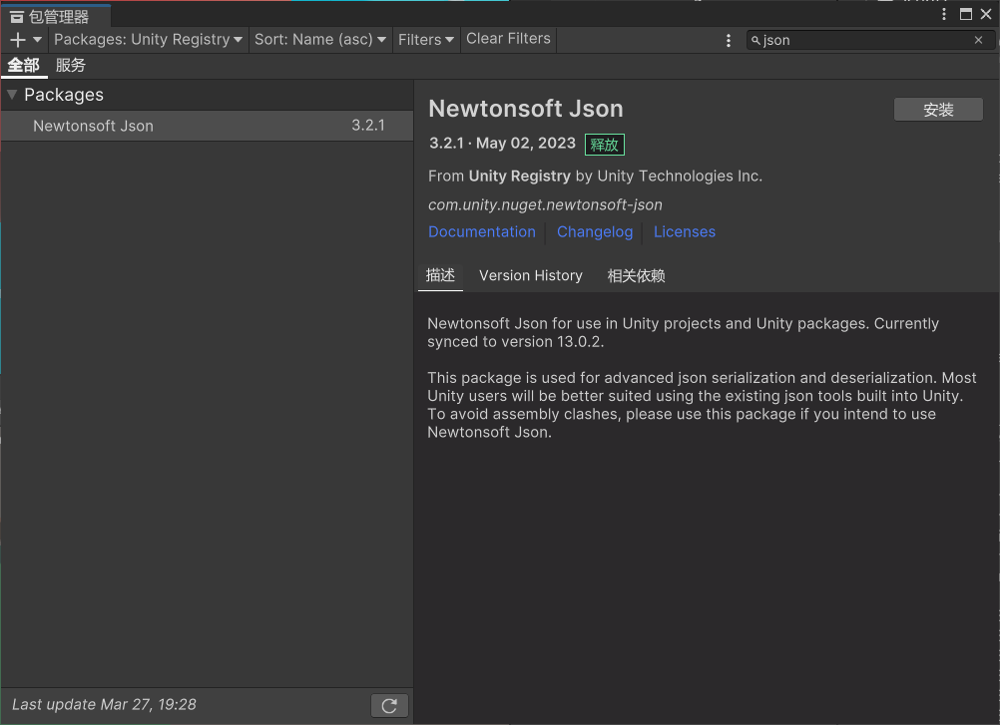

# 什么是 Newtonsoft Json
Json.NET（官方名称 Newtonsoft.Json）是 .NET 生态中最流行的 JSON 处理库，支持复杂对象的序列化（对象转 JSON）和反序列化（JSON 转对象）。
Unity 内置的 JsonUtility 功能有限（如不支持字典、私有字段、多态类型等），而 Newtonsoft Json 提供了更灵活、更强大的功能。

# Unity 中安装 Newtonsoft.Json
通过 Unity Package Manager (UPM) 安装




# 基础用法

**序列化与反序列化**
```cs
using Newtonsoft.Json;

// 数据类定义
public class PlayerData
{
    [JsonProperty("player_name")]
    public string Name;  // 自定义名称
    
    public int Level;
    public List<string> Inventory;
    
    [JsonIgnore]
    public string SecretCode; // 不会被序列化
}
public class Test : MonoBehaviour
{
    void Start()
    {
        PlayerData player = new PlayerData
        {
            Name = "Alice",
            Level = 10,
            Inventory = new List<string> { "Sword", "Potion" }
        };
        string json = JsonConvert.SerializeObject(player, Formatting.Indented);
        print(Application.persistentDataPath);
        File.WriteAllText(Application.persistentDataPath + "/player.json", json);

        // 反序列化
        json = File.ReadAllText(Application.persistentDataPath + "/player.json");
        PlayerData player2 = JsonConvert.DeserializeObject<PlayerData>(json);
    }
}
```

序列化后的json文件
```json
{
  "player_name": "Alice",
  "Level": 10,
  "Inventory": [
    "Sword",
    "Potion"
  ]
}
```
**数据反序列化为数据集合**
1.解析 JSON 数组到 `List<T>` 集合。
```json
[
  { "Name": "Slime", "HP": 50 },
  { "Name": "Dragon", "HP": 1000 }
]
```

```cs
using Newtonsoft.Json;
using System.Collections.Generic;

public class Enemy {
    public string Name;
    public int HP;
}

// JSON 数据
string json = @"[
  { 'Name': 'Slime', 'HP': 50 },
  { 'Name': 'Dragon', 'HP': 1000 }
]";

// 直接反序列化为 List<Enemy>
List<Enemy> enemies = JsonConvert.DeserializeObject<List<Enemy>>(json);

// 输出结果
foreach (Enemy enemy in enemies) {
    Debug.Log($"Name: {enemy.Name}, HP: {enemy.HP}");
}
```
2.解析 JSON 对象到 `Dictionary<string, int>`。
```cs
string json = @"{ 'Sword': 10, 'Potion': 5, 'Arrow': 20 }";

// 反序列化为 Dictionary<string, int>
Dictionary<string, int> inventory = JsonConvert.DeserializeObject<Dictionary<string, int>>(json);

// 输出结果
foreach (var item in inventory) {
    Debug.Log($"{item.Key}: {item.Value}");
}
```

3.解析包含不同派生类对象的集合。
```json
{
  "Characters": [
    { "$type": "Enemy, Assembly-CSharp", "Name": "Orc", "Damage": 20 },
    { "$type": "NPC, Assembly-CSharp", "Name": "Merchant", "Dialogue": "Welcome!" }
  ]
}
```

```cs
[JsonObject(ItemTypeNameHandling = TypeNameHandling.Auto)]
public class GameData {
    public List<Character> Characters; // 基类集合
}

public class Character {
    public string Name;
}

public class Enemy : Character {
    public int Damage;
}

public class NPC : Character {
    public string Dialogue;
}

string json = "..."; // 上述 JSON 数据

// 反序列化时自动识别派生类
GameData data = JsonConvert.DeserializeObject<GameData>(json, new JsonSerializerSettings {
    TypeNameHandling = TypeNameHandling.Auto // 关键设置
});

// 检查类型
Debug.Log(data.Characters[0].GetType()); // 输出 Enemy
Debug.Log(data.Characters[1].GetType()); // 输出 NPC
```


# 高级用法
## **处理默认值和空值**
```cs
using Newtonsoft.Json;

public class PlayerStats {
    public int Health = 100;    // 默认值 100
    public int Mana = 0;        // 默认值 0
    public string Title = null; // 默认值 null
}

// 配置序列化设置：忽略默认值和 null
var settings = new JsonSerializerSettings {
    DefaultValueHandling = DefaultValueHandling.Ignore, // 忽略类型的默认值（如 int 的 0）
    NullValueHandling = NullValueHandling.Ignore         // 忽略 null
};

PlayerStats stats = new PlayerStats(); 
stats.Health = 100; // 使用默认值
stats.Mana = 0;     // 使用默认值
stats.Title = null;

string json = JsonConvert.SerializeObject(stats, Formatting.Indented, settings);
Console.WriteLine(json);
```
输出结果：
```json
{} // 因为所有字段都是默认值或 null，全部被忽略
```

修改数据后的输出：
```cs
stats.Health = 80;
stats.Mana = 50;
stats.Title = "Hero";
```

```json
{
  "Health": 80,
  "Mana": 50,
  "Title": "Hero"
}
```

## 多态类型支持
**场景：序列化一个包含派生类对象的集合时，确保反序列化时能还原为正确的类型。**
```cs
using Newtonsoft.Json;

[JsonObject(ItemTypeNameHandling = TypeNameHandling.Auto)] // 关键：为集合中的元素添加类型信息
public class GameData {
    public List<Character> Characters;
}

public class Character {
    public string Name;
}

public class Enemy : Character {
    public int Damage;
}

public class NPC : Character {
    public string Dialogue;
}

// 创建包含派生类对象的集合
var gameData = new GameData {
    Characters = new List<Character> {
        new Enemy { Name = "Orc", Damage = 20 },
        new NPC { Name = "Merchant", Dialogue = "Welcome!" }
    }
};

// 序列化时保留类型信息
string json = JsonConvert.SerializeObject(gameData, Formatting.Indented, new JsonSerializerSettings {
    TypeNameHandling = TypeNameHandling.Auto // 自动添加类型信息
});

// 反序列化时自动识别类型
GameData loadedData = JsonConvert.DeserializeObject<GameData>(json, new JsonSerializerSettings {
    TypeNameHandling = TypeNameHandling.Auto
});

Console.WriteLine(loadedData.Characters[0].GetType().Name); // 输出 "Enemy"
Console.WriteLine(loadedData.Characters[1].GetType().Name); // 输出 "NPC"
```
生成的 JSON：
```json
{
  "Characters": [
    {
      "$type": "Enemy, Assembly-CSharp", // 类型信息
      "Name": "Orc",
      "Damage": 20
    },
    {
      "$type": "NPC, Assembly-CSharp",
      "Name": "Merchant",
      "Dialogue": "Welcome!"
    }
  ]
}
```

 ## 自定义转换器
 以 Unity 的 Vector3 为例
**场景：Json.NET 默认无法序列化 Unity 的 Vector3，需要自定义转换逻辑。**
```cs
using Newtonsoft.Json;
using Newtonsoft.Json.Linq;
using UnityEngine;

// 1. 编写自定义转换器
public class Vector3Converter : JsonConverter<Vector3> {
    public override void WriteJson(JsonWriter writer, Vector3 value, JsonSerializer serializer) {
        // 将 Vector3 序列化为字符串 "x,y,z"
        writer.WriteValue($"{value.x},{value.y},{value.z}");
    }

    public override Vector3 ReadJson(JsonReader reader, Type objectType, Vector3 existingValue, bool hasExistingValue, JsonSerializer serializer) {
        // 从字符串解析回 Vector3
        string str = (string)reader.Value;
        string[] parts = str.Split(',');
        return new Vector3(
            float.Parse(parts[0]),
            float.Parse(parts[1]),
            float.Parse(parts[2])
        );
    }
}

// 2. 使用转换器
public class TransformData {
    [JsonConverter(typeof(Vector3Converter))] // 标记使用自定义转换器
    public Vector3 Position;
    
    public Vector3 Rotation; // 未标记，会尝试默认序列化（可能失败）
}

// 测试
TransformData data = new TransformData {
    Position = new Vector3(1, 2, 3),
    Rotation = new Vector3(90, 0, 0)
};

// 全局注册转换器（避免每个字段标记）
JsonConvert.DefaultSettings = () => new JsonSerializerSettings {
    Converters = { new Vector3Converter() }
};

string json = JsonConvert.SerializeObject(data, Formatting.Indented);
Console.WriteLine(json);

// 反序列化
TransformData loadedData = JsonConvert.DeserializeObject<TransformData>(json);
```

输出结果：
```json
{
  "Position": "1,2,3", // 自定义转换器生效
  "Rotation": {         // 未使用转换器，Json.NET 尝试默认序列化（可能抛出错误！）
    "x": 90.0,
    "y": 0.0,
    "z": 0.0
  }
}
```


# 在 Unity 中的注意事项
**性能问题**
Newtonsoft Json 比 JsonUtility 慢，尤其在移动设备上。
优化建议：
避免频繁序列化大型对象（如每帧调用）。
使用 StringBuilder 或缓存减少 GC 压力。

