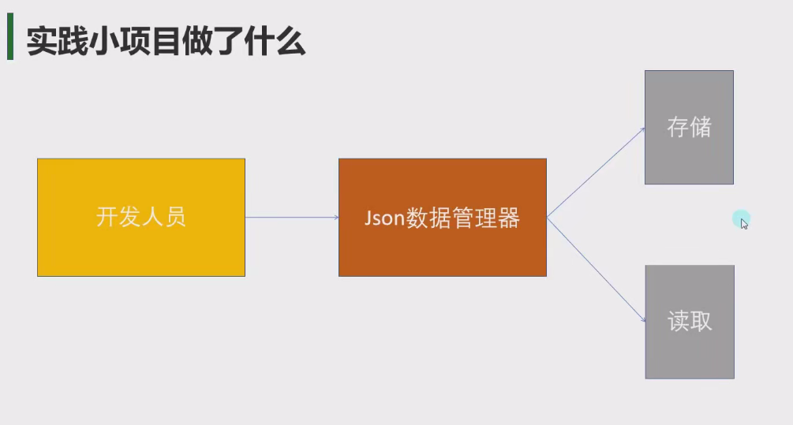
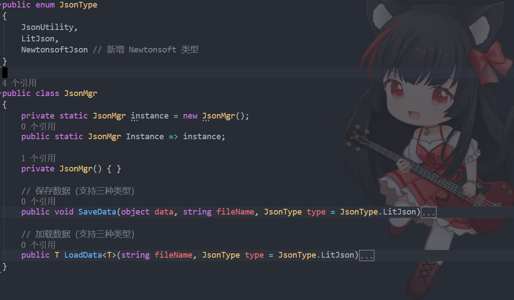
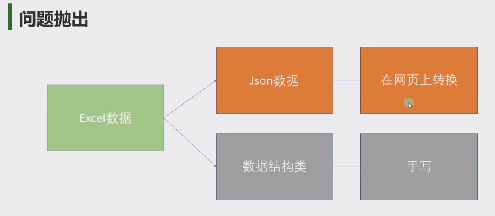
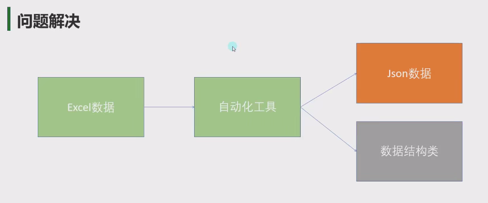

# 需求分析
写一个Json数据管理类
需要有一键存储和读取对应对象的方法



# 具体实现

```cs
using LitJson;
using Newtonsoft.Json;
using System.Collections;
using System.Collections.Generic;
using System.IO;
using UnityEngine;
using Newtonsoft.Json; // 需先安装 Newtonsoft.Json
using LitJson; // 需先安装 LitJson

public enum JsonType
{
    JsonUtility,
    LitJson,
    NewtonsoftJson // 新增 Newtonsoft 类型
}

public class JsonMgr
{
    private static JsonMgr instance = new JsonMgr();
    public static JsonMgr Instance => instance;

    private JsonMgr() { }

    // 保存数据（支持三种类型）
    public void SaveData(object data, string fileName, JsonType type = JsonType.LitJson)
    {
        string path = Path.Combine(Application.persistentDataPath, fileName);
        string json = "";

        switch (type)
        {
            case JsonType.JsonUtility:
                json = JsonUtility.ToJson(data, true);
                break;
            case JsonType.LitJson:
                json = JsonMapper.ToJson(data);
                break;
            case JsonType.NewtonsoftJson: // Newtonsoft 分支
                json = JsonConvert.SerializeObject(data, Formatting.Indented);
                break;
        }

        File.WriteAllText(path, json);
    }

    // 加载数据（支持三种类型）
    public T LoadData<T>(string fileName, JsonType type = JsonType.LitJson)
    {
        string path = Path.Combine(Application.persistentDataPath, fileName);

        if (!File.Exists(path))
        {
            Debug.LogError($"File not found: {path}");
            return default(T);
        }

        string json = File.ReadAllText(path);

        switch (type)
        {
            case JsonType.JsonUtility:
                return JsonUtility.FromJson<T>(json);
            case JsonType.LitJson:
                return JsonMapper.ToObject<T>(json);
            case JsonType.NewtonsoftJson: 
                return JsonConvert.DeserializeObject<T>(json);
            default:
                return default(T);
        }
    }
}
```

# 具体使用
```cs
// 定义测试数据类
[System.Serializable]
public class PlayerData
{
    public string playerName;
    public int level;
    public Vector3 position; // Unity 类型
}

// 保存数据（使用 Newtonsoft）
PlayerData data = new PlayerData 
{ 
    playerName = "Arthur", 
    level = 10, 
    position = new Vector3(1, 2, 3) 
};
JsonMgr.Instance.SaveData(data, "player.json", JsonType.NewtonsoftJson);

// 加载数据（使用 Newtonsoft）
PlayerData loadedData = JsonMgr.Instance.LoadData<PlayerData>(
    "player.json", 
    JsonType.NewtonsoftJson
);
Debug.Log(loadedData.position); // 输出 (1.0, 2.0, 3.0)
```


# 总结与挖坑
这要搞是不是有点复杂？


以后编辑器开发可以来解决



