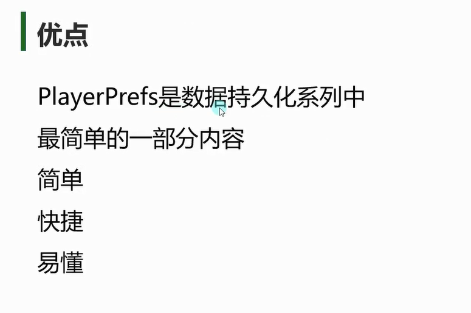
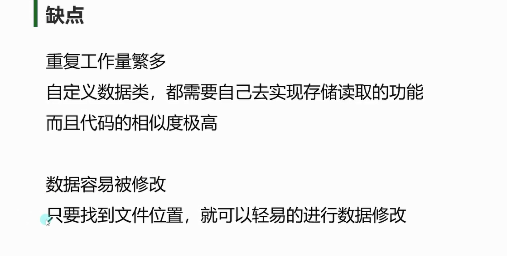
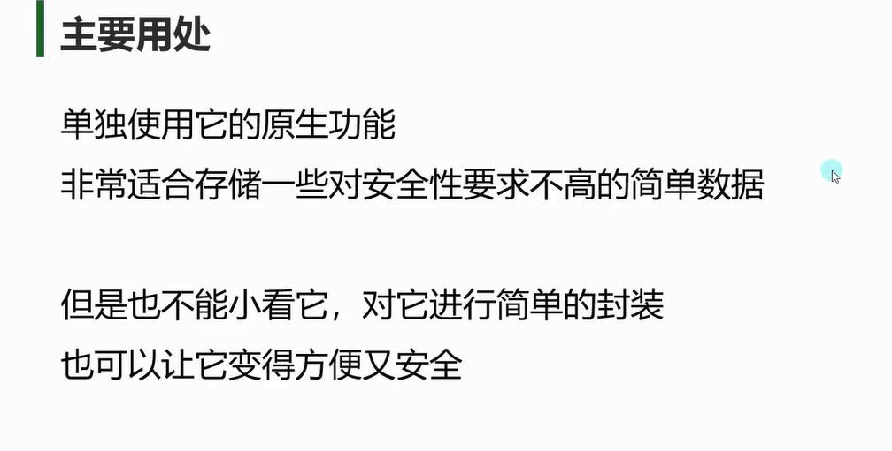

# 练习
**要在游戏中做一个排行榜功能，排行榜主要记录玩家名（可重复）,玩家得分，玩家通关时间，请用PlayerPrefs存储读取排行榜相关信息**
```cs
/// <summary>
/// 排行榜多条具体信息
/// </summary>
public class RankListInfo
{
    //排行榜单条信息列表 
    public List<RankInfo> rankList;

    //初始化的时候就是读取数据
    public RankListInfo()
    {
        Load();
    }

    /// <summary>
    /// 新加排行榜信息
    /// </summary>
    public void Add(string name, int score, int time)
    {
        rankList.Add(new RankInfo(name, score, time));
    }

    //存储数据
    public void Save()
    {
        //存储有多少条数据
        PlayerPrefs.SetInt("rankListCount", rankList.Count);
        for (int i = 0; i < rankList.Count; i++)
        {
            RankInfo info = rankList[i];
            PlayerPrefs.SetString("rankInfo" + i, info.playerName);
            PlayerPrefs.SetInt("rankScore" + i, info.playerScore);
            PlayerPrefs.SetInt("rankTime" + i, info.playerTime);
        }
    }

    //读取数据
    private void Load()
    {
        int rankListCount = PlayerPrefs.GetInt("rankListCount", 0);
        rankList = new List<RankInfo>();
        for (int i = 0; i < rankListCount; i++)
        {
            RankInfo info = new RankInfo(
            PlayerPrefs.GetString("rankInfo" + i),
            PlayerPrefs.GetInt("rankScore" + i),
            PlayerPrefs.GetInt("rankTime" + i));
            rankList.Add(info);
        }
    }
}

/// <summary>
/// 排行榜单条信息
/// </summary>
public class RankInfo
{
    public string playerName;
    public int playerScore;
    public int playerTime;

    public RankInfo(string name, int score, int time)
    {
        playerName = name;
        playerScore = score;
        playerTime = time;
    }
}

#endregion

public class Lesson03_练习题 : MonoBehaviour
{
    void Start()
    {
        //初始化一个排行榜
        RankListInfo rankListInfo = new RankListInfo();
        print(rankListInfo.rankList.Count);

        //打印排行榜所有信息
        for (int i = 0; i < rankListInfo.rankList.Count; i++)
        {
            print("姓名" + rankListInfo.rankList[i].playerName);
            print("分数" + rankListInfo.rankList[i].playerScore);
            print("时间" + rankListInfo.rankList[i].playerTime);
        }

        //添加排行榜单条信息保存
        rankListInfo.Add("nihao", 100, 66);
        rankListInfo.Save();
    }
}

```