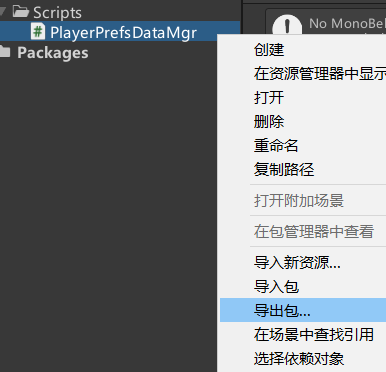

```cs
public class PlayerPrefsDataMgr
{
    private static PlayerPrefsDataMgr instance = new PlayerPrefsDataMgr();
    public static PlayerPrefsDataMgr Instance => instance;
    private PlayerPrefsDataMgr() { }

    public void Save(object obj, string key)
    {
        Type dataType = obj.GetType();
        FieldInfo[] fieldInfos = dataType.GetFields();

        //我们存储都是通过PlayerPrefs来进行存储的
        //保证key的唯一性 我们就需要自己定一个key的规则
        //我们自己定一个规则
        // keyName_数据类类型_字段类型_字段名
        string keyName = "";
        FieldInfo fieldInfo;
        for (int i = 0; i < fieldInfos.Length; i++)
        {
            fieldInfo = fieldInfos[i];
            keyName = $"{key}_{dataType.Name}_{fieldInfo.FieldType.Name}_{fieldInfo.Name}";
            SaveValue(fieldInfo.GetValue(obj), keyName);
        }
        // 只要Save了一次, 就马上存盘
        PlayerPrefs.Save();
    }

    private void SaveValue(object value, string key)
    {

       if (value is int)
        {
            PlayerPrefs.SetInt(key, (int)value);
        }
        else if (value is float)
        {
            PlayerPrefs.SetFloat(key, (float)value);
        }
        else if (value is string)
        {
            PlayerPrefs.SetString(key, (string)value);
        }
        else if (value is bool)
        {
            PlayerPrefs.SetInt(key, (bool)value ? 1 : 0);
        }
        // 如果value的类型是List<XXX>
        else if (typeof(IList).IsAssignableFrom(value.GetType()))
        {
            IList list = value as IList;
            PlayerPrefs.SetInt(key, list.Count);    // 要先保存List的长度
            for (int i = 0; i < list.Count; i++)
            {
                SaveValue(list[i], $"{key}_{i}");
            }
        }
        else if (typeof(IDictionary).IsAssignableFrom(value.GetType()))
        {
            IDictionary dic = value as IDictionary;
            PlayerPrefs.SetInt(key, dic.Count);
            int index = 0;
            foreach (object item in dic.Keys)
            {
                SaveValue(item, key + "_key_" + index.ToString());
                SaveValue(dic[item], key + "_value_" + index.ToString());
                index++;
            }
        }
        else
        {
            // 如果value的类型是自定义类型
            Save(value, key);
        }
    }

    //不用object对象传入 而使用 Type传入
    //主要目的是节约一行代码（在外部）
    //假设现在你要 读取一个Player类型的数据 如果是传入object 你就必须在外部new一个对象传入
    //现在有Type的 你只用传入 一个Type typeof(Player) 然后我在内部动态创建一个对象给你返回出来
    //达到了 让你在外部 少写一行代码的作用
    public object Load(Type type, String key)
    {
        object v = Activator.CreateInstance(type);
        // 填充数据
        FieldInfo[] fieldInfos = type.GetFields();
        string keyName = "";
        FieldInfo fieldInfo;
        for (int i = 0; i < fieldInfos.Length; i++)
        {
            fieldInfo = fieldInfos[i];
            keyName = $"{key}_{type.Name}_{fieldInfo.FieldType.Name}_{fieldInfo.Name}";     // 和存储的一样
            fieldInfo.SetValue(v, LoadValue(fieldInfo.FieldType, keyName));
        }
        return v;
    }
    private object LoadValue(Type fieldType, string key)
    {
        if (fieldType == typeof(int))
        {
            return PlayerPrefs.GetInt(key, 0);
        }
        else if (fieldType == typeof(float))
        {
            return PlayerPrefs.GetFloat(key, 0);
        }
        else if (fieldType == typeof(string))
        {
            return PlayerPrefs.GetString(key, "");
        }
        else if (fieldType == typeof(bool))
        {
            return PlayerPrefs.GetInt(key, 0) == 1 ? true : false;
        }
        else if (typeof(IList).IsAssignableFrom(fieldType))
        {
            int count = PlayerPrefs.GetInt(key, 0);
            IList list = Activator.CreateInstance(fieldType) as IList;
            Type type = fieldType.GetGenericArguments()[0];
            for (int i = 0; i < count; i++)
            {
                list.Add(LoadValue(type, $"{key}_{i}"));
            }
            return list;
        }
        else if (typeof(IDictionary).IsAssignableFrom(fieldType))
        {
            int count = PlayerPrefs.GetInt(key, 0);
            Type keyType = fieldType.GetGenericArguments()[0];
            Type valueType = fieldType.GetGenericArguments()[1];
            IDictionary dic = Activator.CreateInstance(fieldType) as IDictionary;
            for (int i = 0; i < count; i++)
            {
                object k = LoadValue(keyType, key + "_key_" + i.ToString());
                object v = LoadValue(valueType, key + "_value_" + i.ToString());
                dic.Add(k, v);
            }
            return dic;
        }
        else
        {
            return Load(fieldType, key);
        }
    }
}

```

右键PlayerPrefsDataMgr文件，导出包
