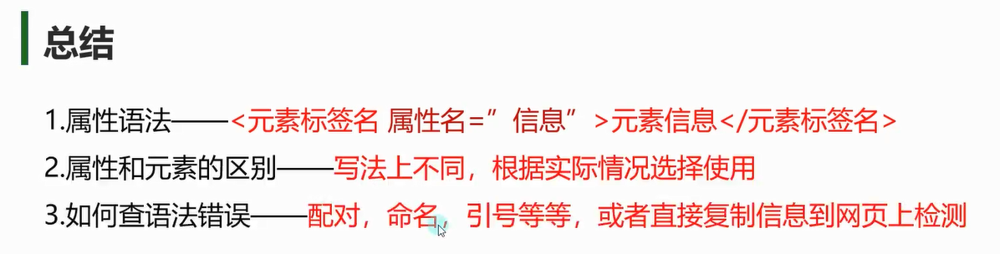
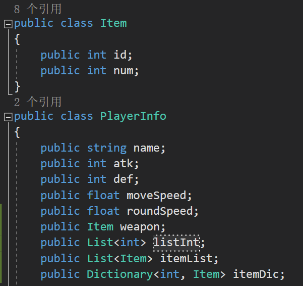

# 属性语法

**作用**：为元素附加额外信息。
**规则**：
- 属性值必须用引号包裹（单引号或双引号）。
- 同一元素不能有重复属性名。
```xml
<Student id="101" class="A班">  <!-- id 和 class 是属性 -->
  <Name>李四</Name>
</Student>
```


# 和元素节点区别


- **用元素**：当数据是**核心内容**或**需要嵌套**时。
- **用属性**：当数据是**次要信息**或**简单键值对**。
```xml
<!-- 元素表示法 -->
<Student>
  <Id>101</Id>
  <Name>王五</Name>
</Student>

<!-- 属性表示法 -->
<Student id="101" name="王五" />
```




# 练习

**请把上面的类结构用XML文档的形式翻译过来**
```xml
<?xml version="1.0" encoding="UTF-8"?>
<PlayerInfo>
    <!--自己定一个xml代表 类对象数据的规则
    我们的元素节点名 就用我们的变量名命名
    -->
    <name>你爹</name>
    <atk>10</atk>
    <def>5</def>
    <moveSpeed>20</moveSpeed>
    <roundSpeed>20</roundSpeed>
    <weapon>
        <id>1</id>
        <num>1</num>
    </weapon>
    <!--当出现没有变量名的数据时 我们就用变量类型名命名-->
    <listInt>
        <int>1</int>
        <int>2</int>
        <int>3</int>
    </listInt>
    <itemList>
        <Item id="1" num="10"/>
        <Item id="2" num="20"/>
        <Item id="3" num="30"/>
        <Item id="4" num="40"/>
    </itemList>
    <itemDic>
        <int>1</int>
        <Item id="1" num="1"/>
        <int>2</int>
        <Item id="2" num="1"/>
        <int>3</int>
        <Item id="3" num="1"/>
        <!-- 另一种写法 但是建议大家都统一
        <int>4</int>
        <Item>
            <id>4</id>
            <num>1</num>
        </Item>
        -->
    </itemDic>
</PlayerInfo>

```