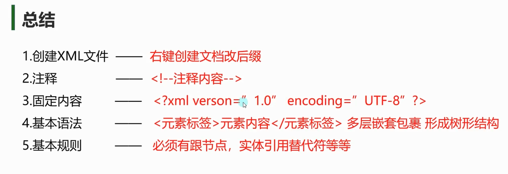
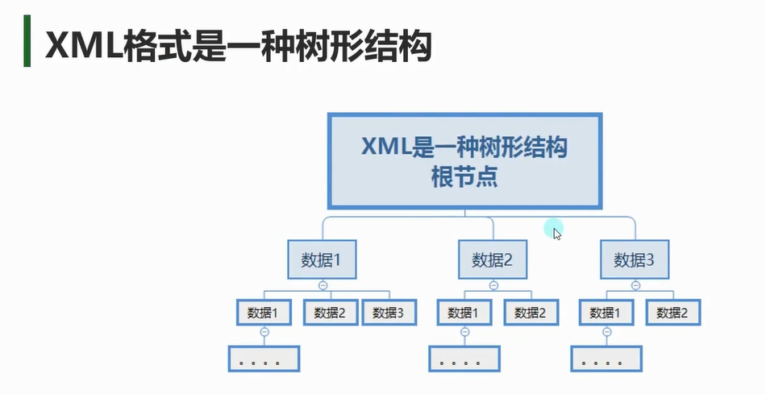
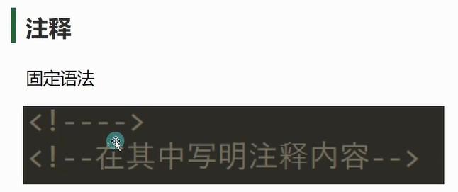
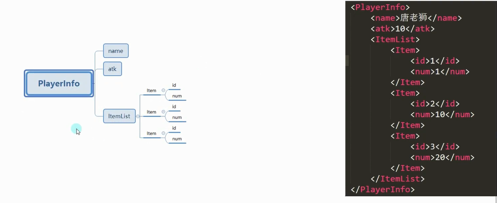
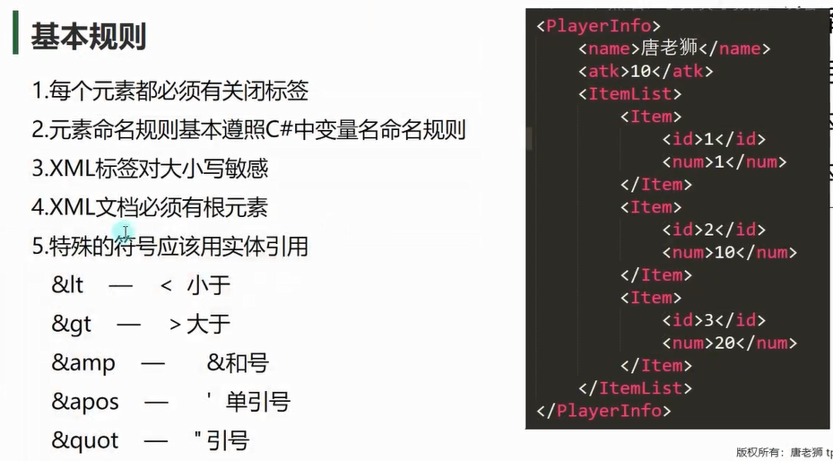

# 注释


# 固定内容
```xml
<!--XML 声明（可选）：定义版本和编码-->
<!--version代表版本 encoding代表编码格式-->
<!--
编码格式就 是读取文件时 解析字符串使用的编码是什么
编码格式：不同的字符 在内存中的二进制是不一样的 每个字符对应一个数字
不同的编码格式 字符 对应的 二进制 是不一样的
举个例子
ASCII:A-11
UTF-8:A-21
乱码的出现就是因为用来不同的编码格式解析文本内容
由于字符和对应的二进制不匹配 就会出现乱码
-->
<? xml version="1.0" encoding="utf-8" ?>
```

# 基本语法



- **根元素**：唯一的最外层标签。
- **子元素**：嵌套在根元素内部。
```xml
<?xml version="1.0" encoding="UTF-8"?>  <!-- 声明 -->
<School>                                <!-- 根元素 -->
  <Student id="101">                   <!-- 子元素 -->
    <Name>张三</Name>
    <Age>18</Age>
  </Student>
</School>

```


# **XML 命名规则**
标签和属性名基本遵守C#中的变量命名规则：
1. 以字母或下划线开头。
2. 不能包含空格。
3. 避免使用特殊符号（如 `!@$%`）。
4. 区分大小写（推荐全小写或驼峰式）。
```xml

```

# **特殊字符转义**
当内容包含 `<`、`>`、`&` 等符号时，需用转义符：

| 字符  | 转义符      |
| --- | -------- |
| `<` | `&lt;`   |
| `>` | `&gt;`   |
| `&` | `&amp;`  |
| `"` | `&quot;` |
| `'` | `&apos;` |
```xml
<Formula>3 &lt; 5</Formula>  <!-- 显示为 3 < 5 -->
```