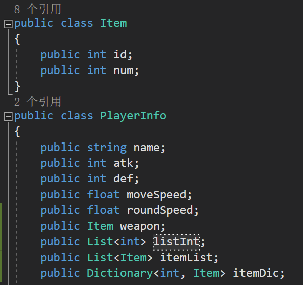

在 C# 中操作 XML 主要有 **三种常用方式**：`XmlDocument`（DOM 模式）、`XmlTextReader/XmlTextWriter`（流式读写）和 **LINQ to XML**。

| **特性**        | XmlDocument (DOM) | XmlTextReader | LINQ to XML  |
| ------------- | ----------------- | ------------- | ------------ |
| **内存占用**      | 高（全加载到内存）         | 低（流式读取）       | 中等           |
| **读写灵活性**     | 高（可随意修改节点）        | 只读            | 高（支持增删改查）    |
| **语法复杂度**     | 中等（需手动操作节点）       | 高（需处理读取状态）    | 低（类似 SQL 查询） |
| **适用场景**      | 小文件、需频繁修改结构       | 超大文件、只读       | 大多数常规场景（推荐）  |
| **Unity 兼容性** | 全平台支持             | 全平台支持         | 全平台支持        |
|               |                   |               |              |
# `XmlDocument`Xml文档类
`XmlDocument` 是一个表示 XML 文档的类，它提供了一种基于文档对象模型（DOM）的方式来处理 XML 数据。DOM 模型将整个 XML 文档加载到内存中，形成一个树形结构，你可以通过该结构方便地访问、修改和操作 XML 文档的各个部分，如元素、属性、文本节点等。
**主要属性**
- **`DocumentElement`**：获取 XML 文档的根元素。
- **`ChildNodes`**：获取文档的所有子节点。
- **`FirstChild`**：获取文档的第一个子节点。
- **`LastChild`**：获取文档的最后一个子节点。

**主要方法**
- **`Load(string filename)`**：从指定的文件中加载 XML 文档。
- **`LoadXml(string xml)`**：从字符串中加载 XML 数据。
- **`Save(string filename)`**：将 XML 文档保存到指定的文件中。
- **`CreateElement(string name)`**：创建一个具有指定名称的新元素。
- **`CreateAttribute(string name)`**：创建一个具有指定名称的新属性。
- **`SelectSingleNode(string xpath)`**：使用 XPath 表达式选择单个节点。
- **`SelectNodes(string xpath)`**：使用 XPath 表达式选择多个节点。

# `XmlNode`节点信息类
**主要属性**
- **`Name`**：获取节点的名称。
- **`InnerText`**：获取或设置节点及其所有子节点的串联值。对于元素节点，它会返回该元素内所有文本节点的文本内容。
- **`NodeType`**：获取节点的类型，例如元素节点（`XmlNodeType.Element`）、属性节点（`XmlNodeType.Attribute`）、文本节点（`XmlNodeType.Text`）等。
- **`ParentNode`**：获取该节点的父节点。
- **`ChildNodes`**：获取该节点的所有子节点，返回一个 `XmlNodeList` 对象。

**主要方法**
- **`AppendChild(XmlNode newChild)`**：将指定的节点添加到该节点的子节点列表的末尾。
- **`RemoveChild(XmlNode oldChild)`**：从该节点的子节点列表中移除指定的子节点。
- **`SelectSingleNode(string xpath)`**：使用 XPath 表达式选择单个子节点。
- **`SelectNodes(string xpath)`**：使用 XPath 表达式选择多个子节点，返回一个 `XmlNodeList` 对象。

# XPath 表达式
**一句话定义**：  XPath 是一种用于在 XML/HTML 文档中精准定位节点的查询语言。
```xml
<GameSkills>
  <!-- 战士技能 -->
  <Skill category="melee">
    <Name>旋风斩</Name>
    <Damage>120</Damage>
    <Cooldown>8</Cooldown>
    <Effect>AOE</Effect>
  </Skill>

  <!-- 法师技能 -->
  <Skill category="magic">
    <Name>火球术</Name>
    <Damage>200</Damage>
    <Cooldown>5</Cooldown>
    <Requires>法杖</Requires>
  </Skill>
</GameSkills>
```

## 路径表达式

| 类型       | 符号   | 作用      | 游戏案例                            |
| -------- | ---- | ------- | ------------------------------- |
| **绝对路径** | `/`  | 从根节点开始  | `/GameSkills/Skill` → 所有Skill节点 |
| **相对路径** | `//` | 任意层级查找  | `//Damage` → 所有伤害数值节点           |
| **当前节点** | `.`  | 当前上下文节点 | `./Name` → 当前Skill下的名字          |
| **父节点**  | `..` | 返回上级节点  | `Cooldown/..` → 包含冷却时间的Skill节点  |

**游戏示例**：快速找到火球术的伤害值
```xpath
/GameSkills/Skill[Name='火球术']/Damage
```

## 节点选择

| 语法        | 作用        | 游戏案例                                 |
| --------- | --------- | ------------------------------------ |
| `element` | 标签名选择     | `Skill` → 所有技能节点                     |
| `*`       | 通配符匹配任何元素 | `//*[@category]` → 带category属性的节点    |
| `@attr`   | 属性选择器     | `//Skill[@category='magic']` → 魔法类技能 |
| `text()`  | 获取文本内容    | `//Name/text()` → "旋风斩", "火球术"       |
| `node()`  | 匹配任何类型节点  | `//Effect/node()` → 包含文本和子节点         |


**游戏示例**：找出需要法杖的技能名称
```xpath
//Skill[Requires='法杖']/Name
```

## 谓词（Predicates）
**用方括号 [ ] 过滤节点**

|表达式|含义|游戏案例|
|---|---|---|
|`[1]`|位置索引（从1开始）|`/GameSkills/Skill[1]` → 第一个技能节点|
|`[last()]`|最后一个元素|`//Skill[last()]` → 法师技能节点|
|`[Damage > 150]`|数值比较|筛选伤害>150的技能|
|`[contains(Name, '火')]`|文本包含|名称含「火」的技能|

**游戏示例**：找冷却时间≥5的物理技能
```xpath
//Skill[@category='melee' and Cooldown >=5]
```

# 读取XMl文件信息
读取放在`Resources`文件夹和`StreamingAssets`文件夹的**TestXml.xml**
```cs
XmlDocument xmlDocument = new XmlDocument();

//加载存放在Resorces文件夹下的xml文件 类型是TextAsset
TextAsset textAsset = Resources.Load<TextAsset>("TestXml");
print(textAsset.text);//可以输出xml文本

//XmlDocument类中的LoadXml方法 能够翻译字符串为xml对象
xmlDocument.LoadXml(textAsset.text);
```

XML文件要在StreamingAssets文件夹下 因为StreamingAssets不会被压缩加密 Resources文件夹会
```cs
//XmlDocument类中的Load方法 传入xml文件的路径直接加载xml
xmlDocument.Load(Application.streamingAssetsPath + "/TestXml.xml");

```

# 读取元素和属性信息

```cs
//XmlDocument中的SelectSingleNode方法 获取xml当中的根节点
XmlNode root = xmlDocument.SelectSingleNode("Root");

//XmlNode中的SelectSingleNode方法 再通过根节点 去获取下面的子节点
XmlNode nodeName = root.SelectSingleNode("name");


print(nodeName.InnerText);
XmlNode nodeAge = root.SelectSingleNode("age");
print(nodeAge.InnerText);

```

**获取属性信息**
```cs
XmlNode nodeItem = root.SelectSingleNode("Item");

//XmlNode中的Attributes用中括号传入对应属性名字后.出Value  直接中括号获取信息
print(nodeItem.Attributes["id"].Value);//1
print(nodeItem.Attributes["num"].Value);//10
```

**获取所有同一名字节点**
```cs
//XmlNodeList中的SelectNodes方法 获取一个节点下的同名节点的方法
XmlNodeList friendList = root.SelectNodes("Friend");


// 遍历所有节点
for (int i = 0; i < friendList.Count; i++)
{
    print(friendList[i].SelectSingleNode("name").InnerText);
    print(friendList[i].SelectSingleNode("age").InnerText);
}
```


1. 读取XML文件
    - `XmlDocument xmlDocument = new XmlDocument();`
    - 读取文本方式1-`xmlDocument.LoadXml(传入xml文本字符串)`
    - 读取文本方式2-`xmlDocument.Load(传入路径)`
2. 读取元素和属性
    - 获取单个节点 : `XmlNode node = xmlDocument.SelectSingleNode(节点名)`
    - 获取多个节点 : `XmlNodeList nodeList = xmlDocument.SelectNodes(节点名)`
    - 获取节点元素内容：`node.InnerText`
    - 获取节点元素属性：
        - `item.Attributes[“属性名”].Value`
        - `item.Attributes.GetNamedItem(“属性名”).Value`
    - 通过迭代器遍历或者循环遍历XmlNodeList对象可以获取到各单个元素节点

# 练习
**有一个玩家数据类，请为该类写一个方法结合XML读取知识点，将XML中数据读取到PlayerInfo的一个对象中**

**PlayerInfo.cs**
```cs
using System;
using System.Collections;
using System.Collections.Generic;
using System.IO;
using System.Xml;
using UnityEngine;

public class Item
{
    public int id;
    public int num;
}

public class PlayerInfo
{
    public string name;
    public int atk;
    public int def;
    public float moveSpeed;
    public float roundSpeed;
    public Item weapon;
    public List<int> listInt;
    public List<Item> itemList;
    public Dictionary<int, Item> itemDic;

    public void LoadData(string fileName)
    {
        string path = Application.persistentDataPath + "/" + fileName + ".xml";

        if (!File.Exists(path))
        {
            path = Application.streamingAssetsPath + "/" + fileName + ".xml";
        }

        //加载 XML 文件信息
        XmlDocument xml = new XmlDocument();
        //加载
        xml.Load(path);

        //加载根节点才能加载后面的内容
        XmlNode playerInfo = xml.SelectSingleNode("PlayerInfo");

        //通过根节点去加载具体的信息
        this.name = playerInfo.SelectSingleNode("name").InnerText;
        this.atk = int.Parse(playerInfo.SelectSingleNode("atk").InnerText);
        this.def = int.Parse(playerInfo.SelectSingleNode("def").InnerText);
        this.moveSpeed = float.Parse(playerInfo.SelectSingleNode("moveSpeed").InnerText);
        this.roundSpeed = float.Parse(playerInfo.SelectSingleNode("roundSpeed").InnerText);

        //加载武器信息节点
        XmlNode weaponNode = playerInfo.SelectSingleNode("weapon");
        this.weapon = new Item();
        this.weapon.id = int.Parse(weaponNode.SelectSingleNode("id").InnerText);
        this.weapon.num = int.Parse(weaponNode.SelectSingleNode("num").InnerText);

        //加载整数列表节点
        XmlNode listIntNode = playerInfo.SelectSingleNode("listInt");
        XmlNodeList intList = listIntNode.SelectNodes("int");
        this.listInt = new List<int>();
        for (int i = 0; i < intList.Count; i++)
        {
            this.listInt.Add(int.Parse(intList[i].InnerText));
        }

        //加载物品列表节点
        XmlNode itemListNode = playerInfo.SelectSingleNode("itemList");
        XmlNodeList items = itemListNode.SelectNodes("Item");
        this.itemList = new List<Item>();
        foreach (XmlNode item in items)
        {
            Item item2 = new Item();
            item2.id = int.Parse(item.Attributes["id"].Value);
            item2.num = int.Parse(item.Attributes["num"].Value);
            this.itemList.Add(item2);
        }

        //加载物品字典节点
        XmlNode itemDicNode = playerInfo.SelectSingleNode("itemDic");
        XmlNodeList keyInt = itemDicNode.SelectNodes("int");
        XmlNodeList valueItem = itemDicNode.SelectNodes("Item");

        this.itemDic = new Dictionary<int, Item>();
        for (int i = 0; i < keyInt.Count; i++)
        {
            int key = int.Parse(keyInt[i].InnerText);
            Item value = new Item();
            value.id = int.Parse(valueItem[i].Attributes["id"].Value);
            value.num = int.Parse(valueItem[i].Attributes["num"].Value);
            this.itemDic.Add(key, value);
        }
    }
}
```

**Test.cs**
```cs
public class Test : MonoBehaviour
{
    void Start()
    {
        PlayerInfo p = new PlayerInfo();
        p.LoadData("PlayerInfo");
    }
}
```