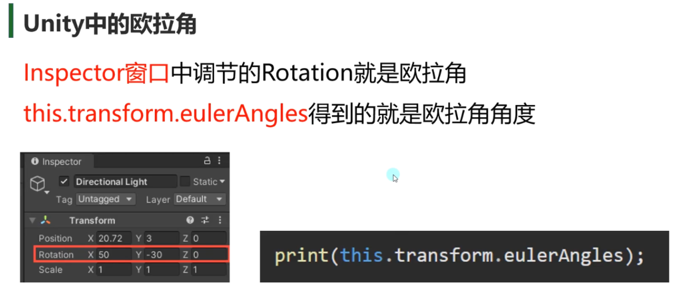

# 角度相关
```csharp
// 相对于世界坐标角度
print(this.transform.eulerAngles);

// 相对于父对象角度
// Inspector中显示的是相对父对象的角度，localEulerAngles的角度只能是0~360，但Inspector面板是可以负数的
print(this.transform.localEulerAngles);

// 不能单个x, y, z赋值
this.transform.localEulerAngles = new Vector3(10, 10, 10);
```

# 旋转相关
```csharp
// 自转API    第二个参数默认不写的话，绕着自己坐标转
this.transform.Rotate(new Vector3(0, 10, 0) * Time.deltaTime * 100, Space.World);    // 每帧绕y轴增加100 * （0，10，0）

//相对于某个轴 转多少度
//参数一:是相对哪个轴进行转动
//参数二:是转动的 角度 是多少
//参数三:默认不填 就是相对于自己的坐标系 进行旋转
transform.Rotate(Vector3.up, Time.deltaTime * 100);     // 在自己的坐标系的y轴旋转


// 绕着某个点旋转              绕着源点,   y轴,     转的多少度
this.transform.RotateAround(Vector3.zero, Vector3.up, 10 * Time.deltaTime);
```

| **代码**                                  | 原理    | 效率             | 可读性 |
| --------------------------------------- | ----- | -------------- | --- |
| `Rotate(new Vector3(0,1,0) * dt * 100)` | 欧拉角增量 | 较低（需创建Vector3） | 一般  |
| `Rotate(Vector3.up, dt * 100)`          | 轴-角度  | 较高             | 更佳  |
