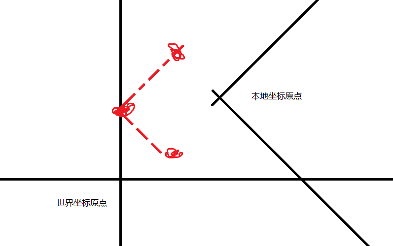
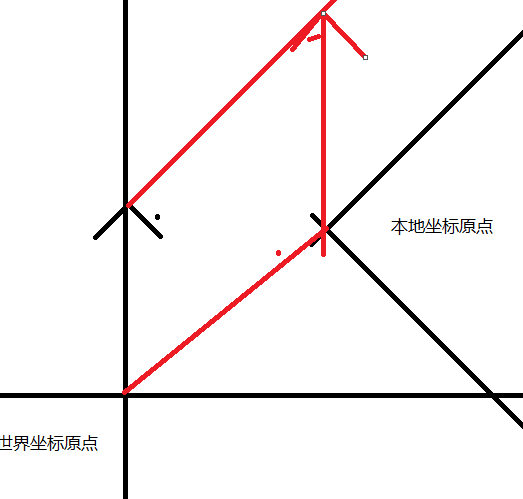
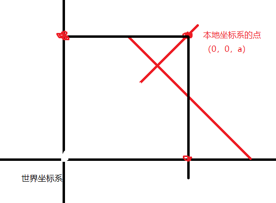

# 世界 -> 本地
 
## 世界坐标系的点 -> 本地坐标系的点
```csharp
// 世界坐标 转换为 本地坐标    (会受到缩放影响
// 即 在世界坐标系下的   (0, 0, 1) 在本地坐标系下表示为   transform.InverseTransformPoint(Vector3.forward)
print(this.transform.InverseTransformPoint(Vector3.forward));
```



## 世界坐标系的向量 -> 本地坐标系的向量
```csharp
// 世界坐标系的向量 平移到 本地坐标系后的向量值是     (不受缩放影响
print(this.transform.InverseTransformDirection(Vector3.forward));
// 世界坐标系的向量 平移到 本地坐标系后的向量值是     (受缩放影响
print(this.transform.InverseTransformVector(Vector3.forward));
```

# 本地 -> 世界
## 本地坐标系的点 -> 世界坐标系的点   （最重要的***）

```csharp
// 本地坐标 转换为 世界坐标    (会受到缩放影响
// 即 在本地坐标系下的   (0, 0, 1) 在世界坐标系下表示为   transform.TransformPoint(Vector3.forward)
print(this.transform.TransformPoint(Vector3.forward));

// eg:
GameObject obj = new GameObject("左前方物体");
obj.transform.position = this.transform.TransformPoint(new Vector3(-1, 0, 1));  // 在本地坐标的左前方（-1,0,1）处创建物体   
```


## 本地坐标系的向量 -> 世界坐标系的向量
```csharp
// 本地坐标系的向量 平移到 世界坐标系后的向量值是     (不受缩放影响
print(this.transform.TransformDirection(Vector3.forward));
// 本地坐标系的向量 平移到 世界坐标系后的向量值是     (受缩放影响
print(this.transform.TransformVector(Vector3.forward));
```
