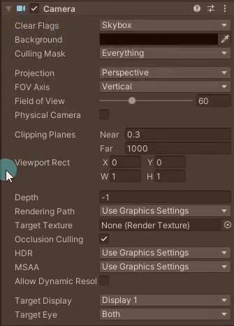
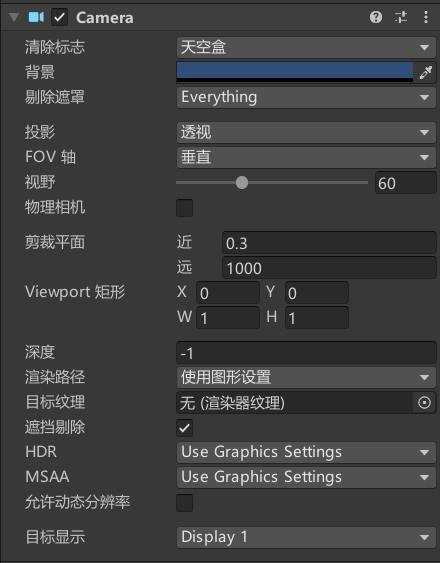
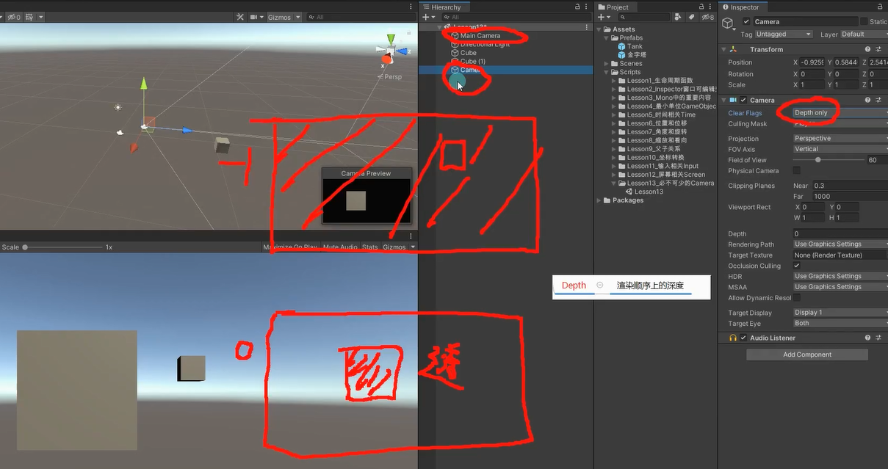
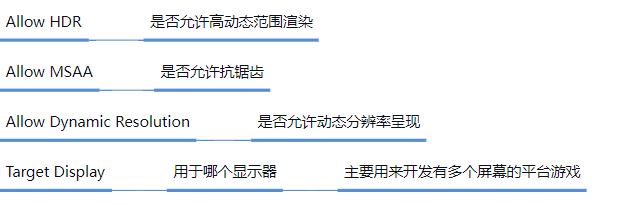

# Camera可编辑参数

## **Clear Flags清楚标志**
skybox天空盒    （做3d游戏）
Solid Color颜色填充     （做2d游戏）
Depth only 只画该层，背景透明   （一般多个摄像机叠加渲染的时候使用，一般与下面的**Depth**配合使用）
Don't Clear 不移除，覆盖渲染    （**不常用**，会保留每一帧的渲染内容，就像黄金体验镇魂曲）

## **Culling Mask剔除遮罩**
选择渲染部分层级（Layer）

## **Projection**
FOV Axis Fov轴：视野轴，决定了光学仪器的视野范围。

Perspective 透视模式
	Field of view 视野：摄像机视角（以沿着 FOV Axis__ 下拉选单中指定轴的度数为单位）。0-180度之间，一般保持默认60就行。

orthographic 正交摄像机（一般用于2D游戏制作）
	Size：摄制范围

## **Clipping Planes裁剪平面**   
Near：近平面
Far：远平面

## **Depth深度**
渲染顺序上的深度 （数字越小，越先渲染）
数字小的照片会先放， 数字大的照片会叠在上面，天空盒有背景是不透明，depth only透明

## **Target Texture目标纹理**
可以把摄像机画面渲染到一张图上， 主要用于制作小地图
在Project右键创建 Render Texture，将创建的Render Texture拖到摄像机，就会把摄像机看到的画面渲染到一张图上

## **Occlusion Culling剔除遮挡**
勾选时一些游戏物体被大一点的物体挡住可以不用渲染

# 不常用的参数
Viewport Rect视口范围 屏幕上将绘制该摄像机视图的位置，主要用于双摄像机游戏，0~1 相当于宽高百分比

Redering path渲染路径
