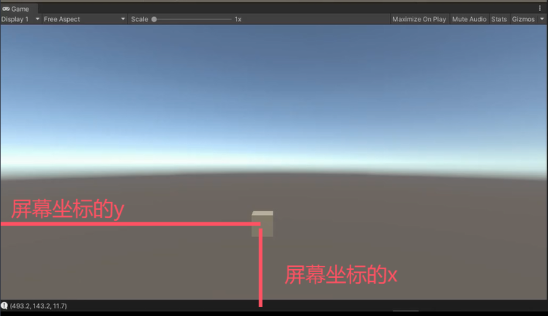

# 重要静态成员
```csharp
// 获取主摄像机       只能是有MainCamera tag的
print(Camera.main?.name);         **************
// 所有摄像机数量
print(Camera.allCamerasCount);
// 所有摄像机
Camera[] allCameras = Camera.allCameras;

// 渲染相关委托
// 摄像机剔除前处理的委托函 数
Camera.onPreCull += (c) =>
{
};
// 摄像机渲染前处理的委托
Camera.onPreRender += (c) =>
{
};
// 摄像机渲染后处理的委托
Camera.onPostRender += (c) =>
{
};
```


# 重要成员
Inspector窗口的所有值都能用代码得到并修改
比如：`Camera.main.depth = 10;`

**下面非常常用**

```csharp
// 世界坐标 转 屏幕坐标
// 转换后的x, y就是屏幕坐标, z则为  Camera.main 离 这个物体position有多远 (纵深
//  用这个来做 头顶血条          ****************
Vector3 vector3 = Camera.main.WorldToScreenPoint(this.transform.position);
print(vector3);
```


设置z之后，屏幕坐标就会转换到世界坐标的距离摄像机的z距离的平面上
```cs
// 屏幕坐标 转 世界坐标
// 转换要自己设定z轴的距离, 否则为0, 一直在视口点上坐标不变
Vector3 v = Input.mousePosition;        ***********
v.z = 10;
Vector3 vector31 = Camera.main.ScreenToWorldPoint(v);
```


