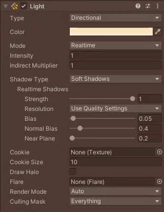
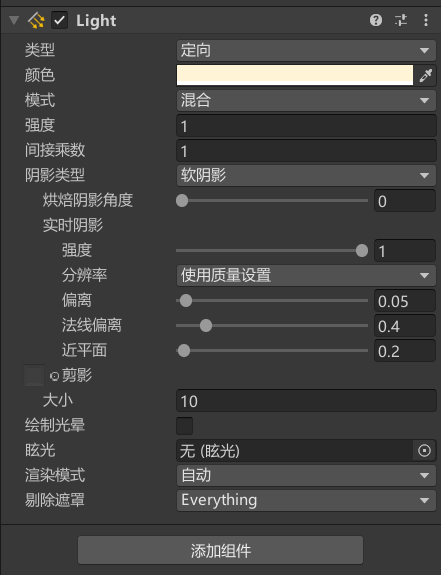
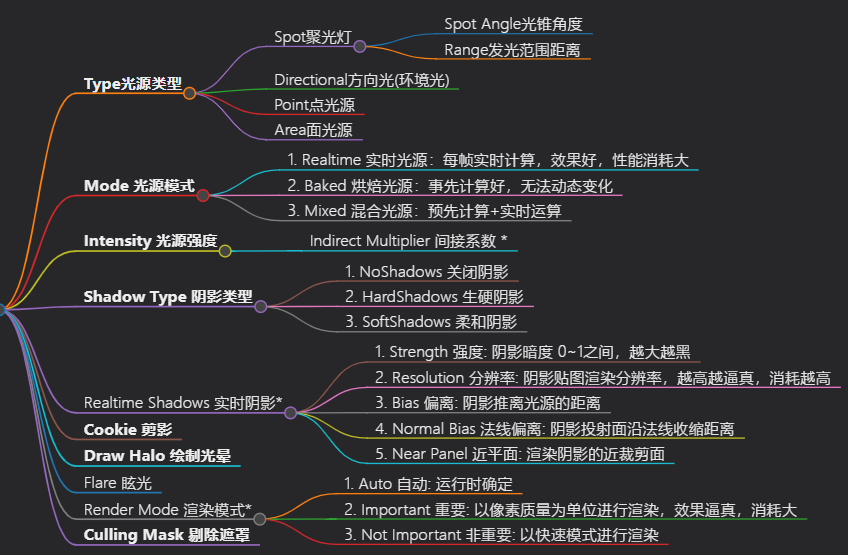

# **Type光源类型**
- Spot聚光灯
    - Spot Angle光锥角度
    - Range发光范围距离
- Directional方向光(环境光)
- Point点光源
- Area面光源

# **Mode 光源模式**
1. Realtime 实时光源：每帧实时计算，效果好，性能消耗大
2. Baked 烘焙光源：事先计算好，无法动态变化
3. Mixed 混合光源：预先计算+实时运算

# **Intensity 光源强度**
## Indirect Multiplier 间接系数 *
改变间接光的强度
低于1，每次反弹会使光更暗
大于1，每次反弹会使光更亮

# **Shadow Type 阴影类型**
1. NoShadows 关闭阴影
2. HardShadows 生硬阴影
3. SoftShadows 柔和阴影

# Realtime Shadows 实时阴影*
1. Strength 强度: 阴影暗度 0~1之间，越大越黑
2. Resolution 分辨率: 阴影贴图渲染分辨率，越高越逼真，消耗越高     （Project Setting中的Quallty的设置）
3. Bias 偏离: 阴影推离光源的距离
4. Normal Bias 法线偏离: 阴影投射面沿法线收缩距离
5. Near Panel 近平面: 渲染阴影的近裁剪面

# **Cookie 剪影**
投影遮罩: 一般用于聚光灯，显示图案

# **Draw Halo 绘制光晕**
球形光环开关
可以用于蜡烛等效果

# Flare 眩光
耀斑
有点类似于太阳耀斑效果
想要在Game窗口看到耀斑要在摄像机Camera上加FlareLayer脚本

# Render Mode 渲染模式*
1. Auto 自动: 运行时确定
2. Important 重要: 以像素质量为单位进行渲染，效果逼真，消耗大
3. Not Important 非重要: 以快速模式进行渲染

# **Culling Mask 剔除遮罩**
- 剔除遮罩层，决定哪些层的对象受到该光源影响

ps：所有参数都可都可以在代码中设置
