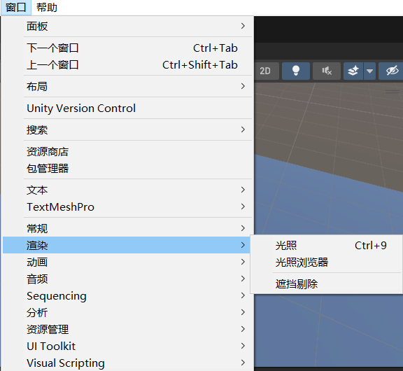
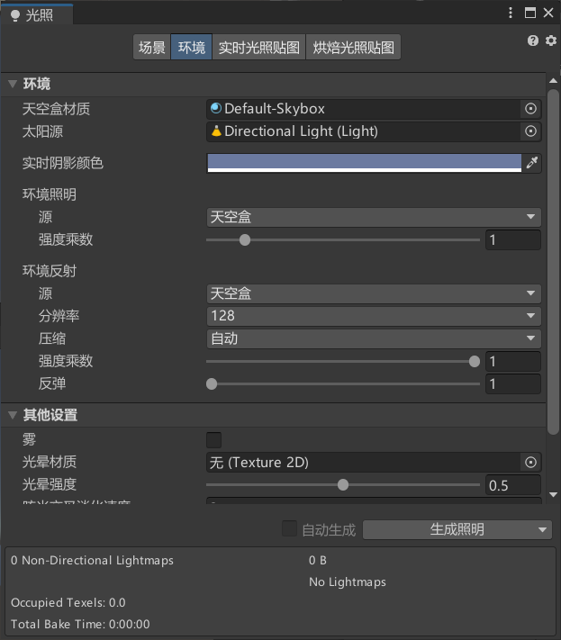

# **Skybox Material 天空盒材质**
可以改变天空盒
可以在project窗口右键创建材质，材质选择成天空盒着色器

# Sun Source 太阳来源*
不设置会默认使用场景中最亮的方向光代表太阳

# Environment Lighting 环境光设置*
## Source 环境光光源颜色*
1. Skybox 天空盒：天空和材质作为环境光颜色
2. Gradient 渐变：可以为天空、地平线、地面单独选择颜色和他们之间混合
3. Color颜色

## Intensity Multiplier 环境光亮度*

## Ambient Mode 环境模式*
1. 全局光照模式，只有启用了实时全局和全局烘焙时才有用
2. Realtime 实时（已弃用）
3. Baked 烘焙

# OtherSettings 其它设置*
## Fog 雾开关*
1. Color 雾颜色
2. Mode 雾计算模式
    - Linear 线性模式
        - 随距离线性增加
        - Start 开始距离 离摄像机多远开始有雾
        - End 结束距离 离摄像机多远完全遮挡
    - Exponential 指数模式
        - 随距离指数增加
        - Density 密度 雾强度
    - Exponential Qquare 指数平方模式
        - 随距离比指数更快的增加
        - Density 密度 雾强度

## Halo Texture 光晕材质*
光源周围挥着光环的纹理

## Halo Strength 光晕强度*
光环可见性
## Flare Fade Speed 炫光交叉淡化速度*
耀斑淡出时间，最初出现之后淡出的时间

## Flare Strength 炫光强度*
耀斑可见性

## Spot Cookie 聚光灯剪影*
聚光灯剪影纹理