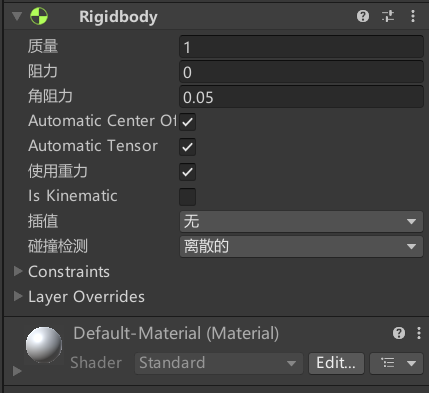
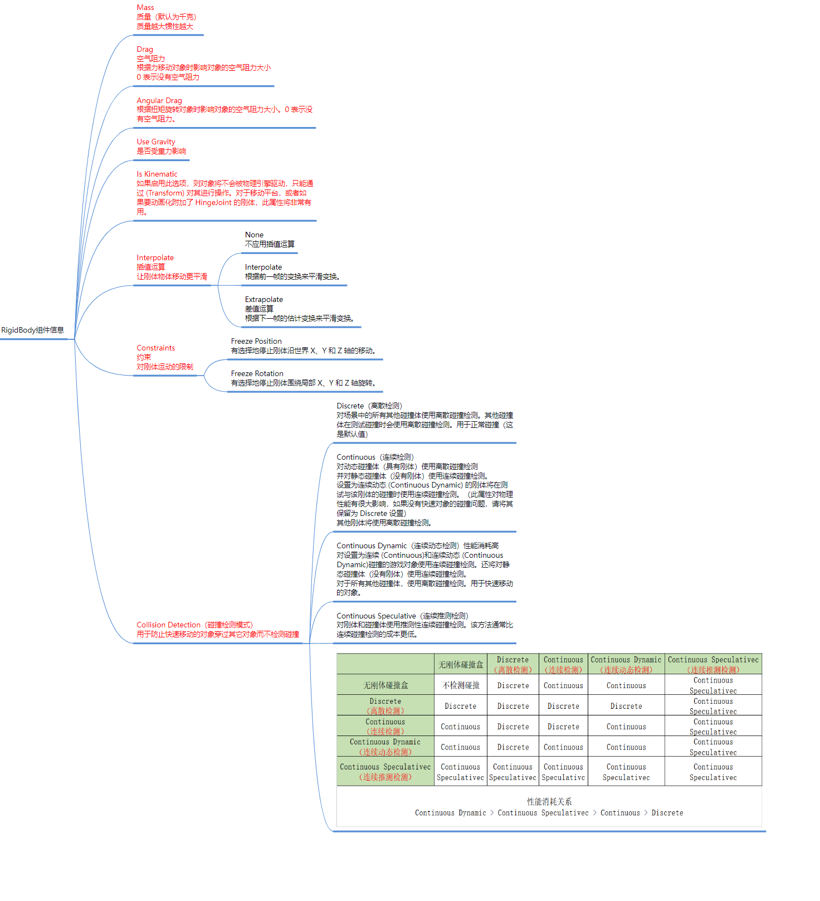
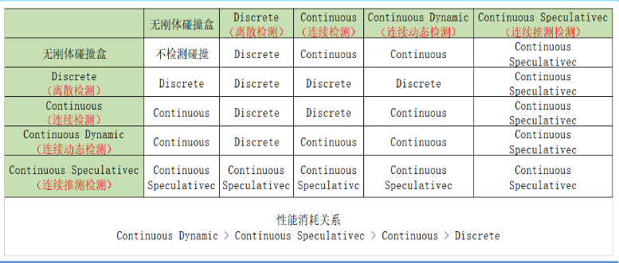

**碰撞产生的必要条件**：两个物体都有碰撞器，至少一个物体有刚体

RigidBody组件信息如下

# **Mass 质量**
- 默认为千克
- 质量越大惯性越大

# **Drag 空气阻力**
- 根据力移动对象时影响对象的空气阻力大小，0 表示没有空气阻力

# **Angular Drag 角阻力（扭矩阻力）**
- 通俗理解就是阻碍对象旋转的阻力，角阻力越大越不容易旋转
- 0 表示没有空气阻力。

# **Use Gravity 重力开关**
- 是否受重力影响

# **Is Kinematic**
- 控制物理是否影响刚体。
- 可以理解为开启后不受力的影响，只能通过Transform移动
- 如果启用此选项，则对象将不会被物理引擎驱动，只能通过 (Transform) 对其进行操作。对于移动平台，或者如果要动画化附加了 HingeJoint 的刚体，此属性将非常有用。

# **Interpolate 插值运算**
- 让刚体物体移动更平滑
- 可以更改FixTime，改成一秒，这样对象会很突兀的一秒移动一次，这时开启插值运算就可以让刚体对象平滑移动

1. None 无插值运算模式
    - 不应用插值运算
2. Interpolate 插值模式
    - 插值将始终滞后一点，但比外推更流畅。
    - 根据前一帧的变换来平滑变换。
3. Extrapolate 外推模式
    - 外推将根据当前速度预测刚体的位置。
    - 根据下一帧的估计变换来平滑变换。

# **Collision Detection 碰撞检测模式**
> Continuous Dynamic 连续动态检测 **>** Continuous Speculative 连续推测检测 **>** Continuous 连续检测 **>** Discrete 离散检测

- 用于防止快速移动的对象穿过其它对象而不检测碰撞
1. Discrete 离散检测
    - 默认的碰撞检测模式。
    - 在每一帧中进行一次碰撞检测，适用于大多数普通物体。
    - 最省性能，但可能会错过高速物体的碰撞。
    - 适合一般速度移动的物体，不适合高速移动的小物体。
    - 对场景中的所有其他碰撞体使用离散碰撞检测。其他碰撞体在测试碰撞时会使用离散碰撞检测。用于正常碰撞（这是默认值）
2. Continuous 连续检测
    - 提高了碰撞检测的精度，特别适合高速移动的物体。
    - 在每一帧中进行多次碰撞检测，避免高速物体穿过其他物体。
    - 比 `Discrete` 消耗更多的性能，但减少了穿透问题。
    - 适用于高速移动的物体，如子弹或快速飞行的物体。
    - 对动态碰撞体（具有刚体）使用离散碰撞检测，并对静态碰撞体（没有刚体）使用连续碰撞检测。
    - 设置为连续动态 (Continuous Dynamic) 的刚体将在测试与该刚体的碰撞时使用连续碰撞检测。（此属性对物理性能有很大影响，如果没有快速对象的碰撞问题，请将其保留为 Discrete 设置）
    - 其他刚体将使用离散碰撞检测。
3. Continuous Dynamic 连续动态检测
    - 针对快速移动的物体和其他静止或缓慢移动的物体之间的碰撞检测。
    - 结合 `Continuous` 和 `Discrete` 的优点，对高速物体进行多次检测，对慢速或静止物体进行一次检测。
    - 在保证精度的同时比 `Continuous` 更省性能。
    - 适用于快速移动的物体与静止或缓慢移动的物体之间的碰撞检测，如快速移动的角色或车辆。
    - 性能消耗高
    - 对设置为连续 (Continuous)和连续动态 (Continuous Dynamic)碰撞的游戏对象使用连续碰撞检测。还将对静态碰撞体（没有刚体）使用连续碰撞检测。
    - 对于所有其他碰撞体，使用离散碰撞检测。用于快速移动的对象。
4. Continuous Speculative 连续推测检测
    - 使用预测的方式进行碰撞检测。
    - 预测物体的未来位置，并在物体穿过其他物体前进行检测和处理。
    - 性能较高，精度也不错，但有时可能会出现误判。
    - 适合大多数需要高精度且有较高速度的物体。
    - 对刚体和碰撞体使用推测性连续碰撞检测。该方法通常比连续碰撞检测的成本更低。

# Constraints 刚体约束
- 对刚体运动的限制
1. Freeze Position 冻结位置
    - 有选择地停止刚体沿世界 X、Y 和 Z 轴的移动。
2. Freeze Rotation 冻结旋转
    - 有选择地停止刚体围绕局部 X、Y 和 Z 轴旋转。