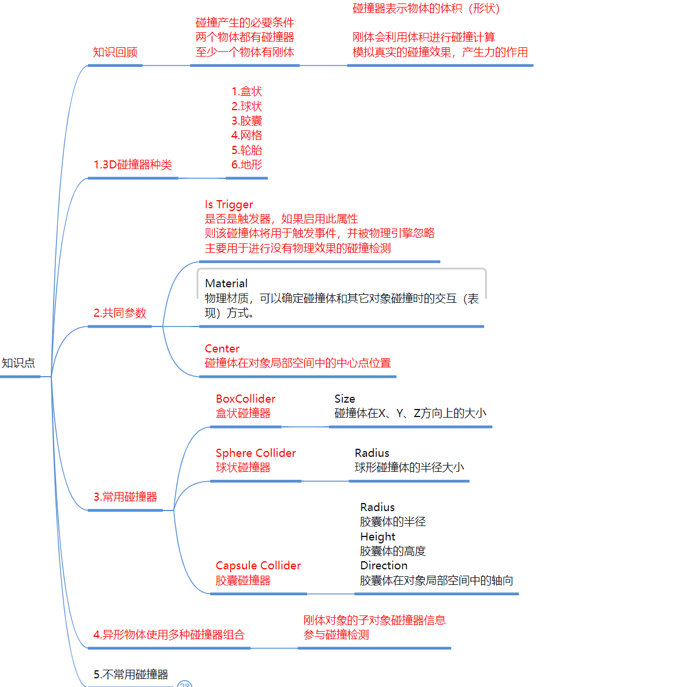
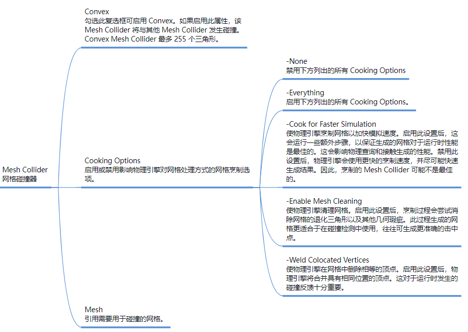
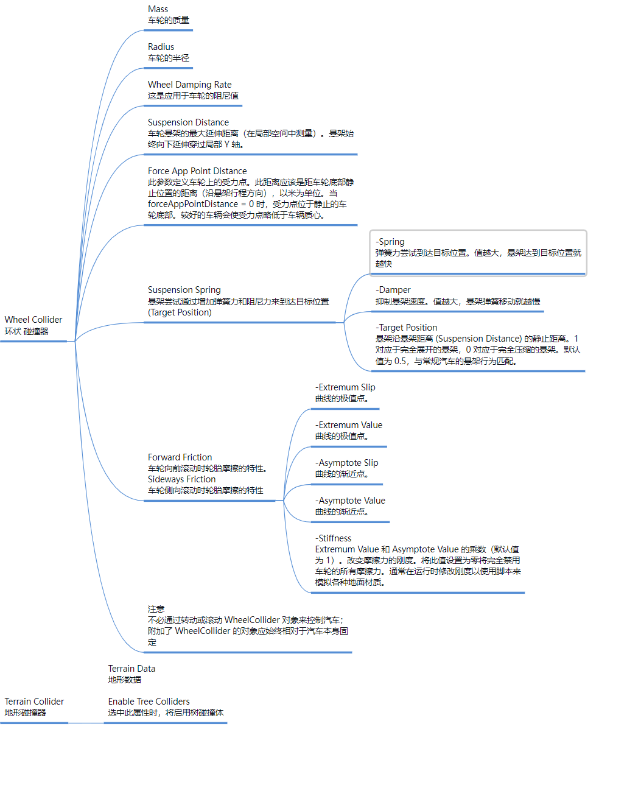

**知识回顾**
两个物体都有碰撞器，至少一个物体有刚体
碰撞器表示物体的体积（形状）
刚体会利用体积进行碰撞计算，模拟真实的碰撞效果，产生力的作用

# 3D碰撞器种类
1.盒状 2.球状 3.胶囊 4.网格 5.轮胎 6.地形

# 共同参数

## Edit Collider 编辑碰撞器
改变碰撞体大小

## Is Trigger 是否是触发器
- 如果启用此属性，则该碰撞体将用于触发事件，并被物理引擎忽略
- 主要用于进行没有物理效果的碰撞检测

## Material 物理材质*
- 可以确定碰撞体和其它对象碰撞时的交互（表现）方式。

## Center 碰撞器中心
- 碰撞体在对象局部空间中的中心点位置

# 常用碰撞器
## BoxCollider 盒状碰撞器
- Size 大小：碰撞体在X、Y、Z方向上的大小

## Sphere Collider 球状碰撞器
- Radius 半径：球形碰撞体的半径大小

## Capsule Collider 胶囊碰撞器
- Radius 半径：胶囊体的半径
- Height 高度：胶囊体的高度
- Direction 轴向：胶囊体在对象局部空间中的轴向

# 异形物体使用多种碰撞器组合
- 刚体对象的子对象碰撞器信息参与碰撞检测
- 比如金字塔预设体，只在金字塔最高层级对象添加刚体，子对象的所有Cube都会参与碰撞检测
- 再比如一个Cube添加刚体，再给他添加两个空物体，两个空物体分别添加斜着的盒型碰撞器当做支架，这样这个Cube下落时就会被支架撑起来，即便两个空物体连模型都没有只有碰撞器

# 不常用碰撞器*
## Mesh Collider 网格碰撞器*
- 不常用的原因是性能消耗较高
- 默认不会显示绿色的碰撞器边框，开启Convex 才会显示绿色的碰撞器边框
- Convex Mesh Collider 最多 255 个三角形。

## Wheel Collider 轮胎碰撞器*
- 可以通过给车的父对象加刚体（注意刚体质量一定要大），子对象加车轮碰撞器模拟汽车

## Terrain Collider 地形碰撞器*
- 不常用的原因是性能消耗很高