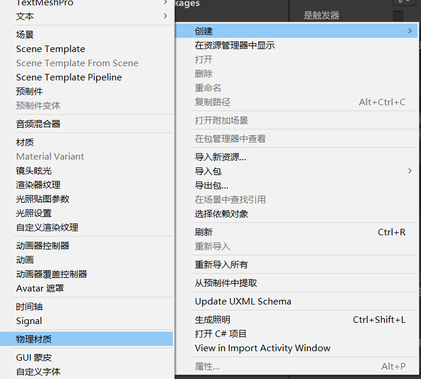

# 创建物理材质
- 在Project窗口加号创建或者右键创建
- 把物理材质拖拽到两个碰撞器上才能相互作用

# 物理材质参数
## Dynamic Friction 动摩擦力
- 已在移动时使用的摩擦力。通常为 0 到 1 之间的值。值为零就像冰一样，值为 1 将使对象迅速静止（除非用很大的力或重力推动对象）。

## Static Friction 静摩擦力
- 当对象静止在表面上时使用的摩擦力。通常为 0 到 1 之间的值。值为零就像冰一样，值为 1 将导致很难让对象移动。

## Bounciness 弹性
- 表面的弹性如何？值为 0 将不会反弹。值为 1 将在反弹时不产生任何能量损失，预计会有一些近似值，但可能只会给模拟增加少量能量。

## Friction Combine 摩擦力组合
- 两个碰撞对象的摩擦力的组合方式。
    1. Average 对两个摩擦值求平均值。
    2. Minimum 使用两个值中的最小值。
    3. Maximum 使用两个值中的最大值。
    4. Multiply 两个摩擦值相乘。

## Bounce Combine 反弹组合
- 两个碰撞对象的弹性的组合方式。其模式与 Friction Combine 模式相同。
    1. Average 对两个摩擦值求平均值。
    2. Minimum 使用两个值中的最小值。
    3. Maximum 使用两个值中的最大值。
    4. Multiply 两个摩擦值相乘。