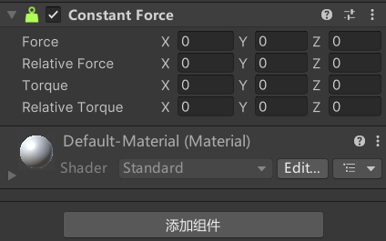

# 刚体加力
```csharp
// 获取刚体组件对象
rigidbody = this.GetComponent<Rigidbody>();

// 添加力
// (相对世界坐标系
rigidbody.AddForce(Vector3.forward * 10);
//   (相对本地坐标系
rigidbody.AddRelativeForce(Vector3.forward * 10);

// 添加扭矩力
// (世界坐标系      // 没有扭矩阻力会一直动
rigidbody.AddTorque(Vector3.up * 10);
// (本地坐标系
rigidbody.AddRelativeTorque(Vector3.forward * 10);

// 改变刚体速度       用的少, 位移一般用translate或者给力
// 世界坐标系
rigidbody.velocity = Vector3.forward;

// 模拟爆炸         在中心产生半径 20m 40的力
// 如果想要所有刚体都产生同样的爆炸效果就必须所有的刚体组件都要调用AddExplosionForce方法
rigidbody.AddExplosionForce(40, Vector3.zero, 20);
```
# AddForce方法第二个参数力的模式

## **1. ForceMode.Force（默认模式）**
- **公式**：F * t = m * v
- **说明**：
    - 力会持续作用，受物体质量（`mass`）影响，质量越大加速度越小。
    - 需要乘以 `Time.fixedDeltaTime` 才能与物理时间步长匹配（Unity 已自动处理）。
- **示例**：
```cs
// 推动质量为2kg的物体，每帧施加10N的力
rb.AddForce(Vector3.forward * 10, ForceMode.Force);
// 最终加速度 = 10N / 2kg = 5m/s²
```

### **2. ForceMode.Acceleration**
- **公式**：F * t = v （m 为 1）
- **说明**：
    - **直接施加加速度**，忽略物体质量。
    - 适合需要固定加速度的场景（如模拟重力）。
- **示例**：
```cs
// 无论质量如何，物体以5m/s²的加速度运动
rb.AddForce(Vector3.forward * 5, ForceMode.Acceleration);
```

### **3. ForceMode.Impulse**
- **公式**：F = m * v  （t 为 1）
- **说明**：
    - 瞬间施加一个冲量，效果类似“一次性爆发力”。
    - 受质量影响，质量越大效果越弱。
```cs
// 施加一个冲量为100N·s的力（相当于100N的力作用1秒）
rb.AddForce(Vector3.up * 100, ForceMode.Impulse);
// 质量为2kg时，速度增量 = 100 / 2 = 50m/s
```

### **4. ForceMode.VelocityChange**
- **公式**：F = v   （m 为 1， t 为 1）
- **说明**：
    - **直接修改速度**，忽略质量和时间步长。
    - 效果类似“瞬间设置速度”。
- **示例**：
```cs
// 直接将物体的Y轴速度增加10m/s（无视质量）
rb.AddForce(Vector3.up * 10, ForceMode.VelocityChange);
```

# 恒力场组件


# 刚体的休眠
Unity为了节约性能，可能会让刚体休眠。
比如让一个有刚体的Cube，受重力影响掉落一个平面上。
当他们静止时，斜向下旋转刚体，这个时候Cube可能不会往下落，因为Cube休眠了。
假如这个时候移动一下平面的位置，Cube可能又会往下落，因为移动平面唤醒了刚体。
```cs
// IsSleeping方法 获取刚体是否处于休眠状态
if (rigidBody.IsSleeping())
{
}

// 唤醒休眠
if (rigidBody.IsSleeping())
{
    rigidBody.WakeUp();
}
```