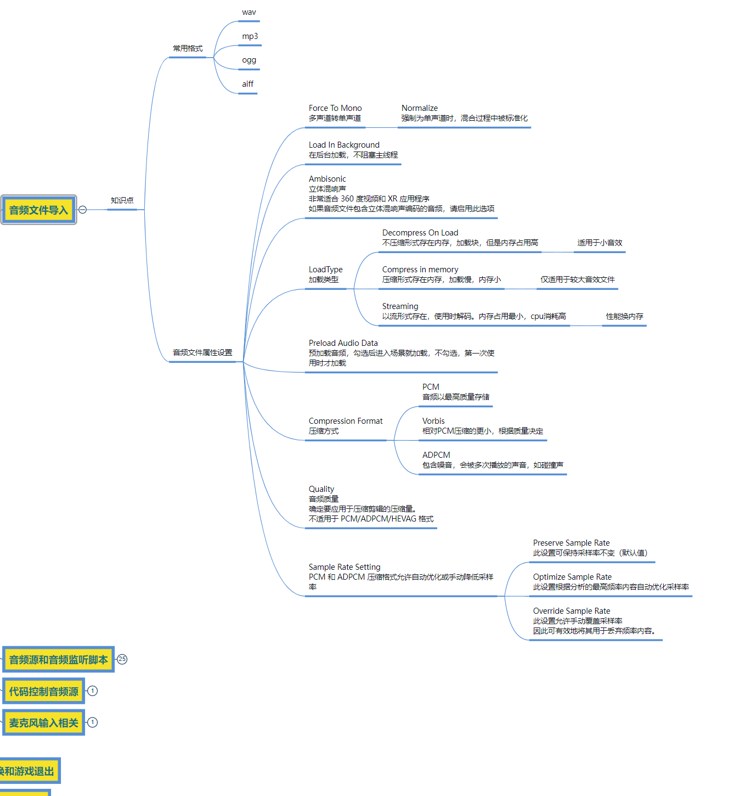

# 音频文件常用格式
- wav
- mp3
- ogg
- aiff    （不常用）

# 导入音频文件
导入音频文件直接从外部拖拽音频文件到Project窗口即可

# Force To Mono 强制变为单声道
- 多声道转单声道
- Normalize 归一化
    - 强制为单声道时，混合过程中被标准化

# Load In Background 后台加载
在后台加载，不阻塞主线程

# Ambisonic 全景声音*
- 立体混响声
- 非常适合 360 度视频和 XR 应用程序
- 如果音频文件包含立体混响声编码的音频，请启用此选项

# LoadType 加载类型
- Decompress On Load 加载时压缩
    - 不压缩形式存在内存，加载块，但是内存占用高
    - 适用于小音效
- Compress in memory 压缩内存
    - 压缩形式存在内存，加载慢，内存小
    - 仅适用于较大音效文件
- Streaming 流式处理
    - 以流形式存在，使用时解码。内存占用最小，cpu消耗高
    - 性能换内存

# Preload Audio Data 预加载音频数据
- 预加载音频，勾选后进入场景就加载，不勾选，第一次使用时才加载

# Compression Format 压缩格式
- PCM 音频以最高质量存储
- Vorbis 相对PCM压缩的更小，根据质量决定
- ADPCM 包含噪音，会被多次播放的声音，如碰撞声

# Quality 音频质量*
- 确定要应用于压缩剪辑的压缩量。
- 不适用于 PCM/ADPCM/HEVAG 格式

# Sample Rate Setting 采样率设置*
- PCM 和 ADPCM 压缩格式允许自动优化或手动降低采样率
- Preserve Sample Rate 保持采样率
    - 此设置可保持采样率不变（默认值）
- Optimize Sample Rate 优化采样率
    - 此设置根据分析的最高频率内容自动优化采样率
- Override Sample Rate 覆盖采样率
    - 此设置允许手动覆盖采样率 因此可有效地将其用于丢弃频率内容。