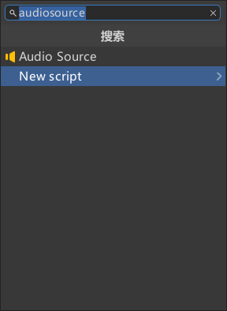
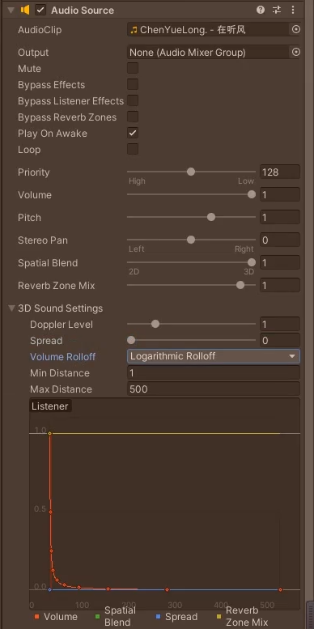
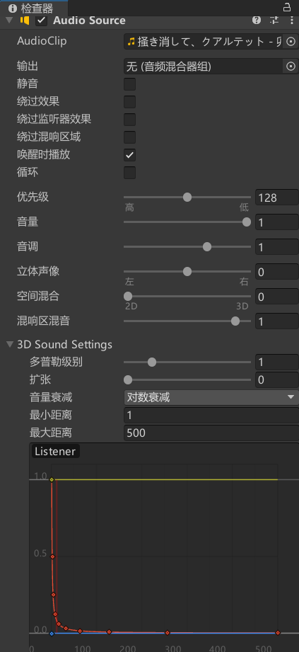
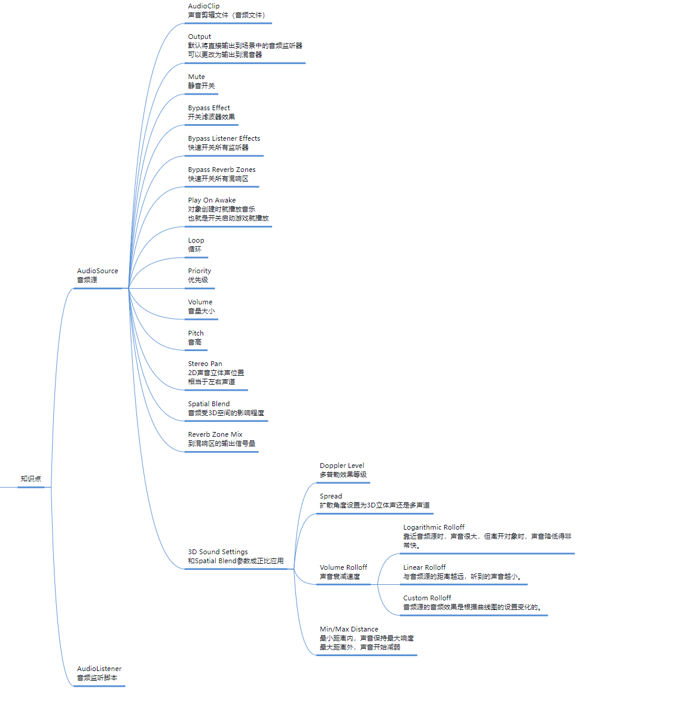

# 添加AudioSource 音频源脚本

# AudioClip 声音剪辑文件（音频文件）
- 可以拖拽音频文件到这个变量上

# Output 输出*
- 默认不设置的话将直接输出到场景中的音频监听器
- 可以更改为输出到混音器
- 混音器是高级功能，以后再讲解

# Mute 静音开关

# Bypass Effect 开关滤波器效果*

# Bypass Listener Effects 快速开关所有监听器*

# Bypass Reverb Zones 快速开关所有混响区*

# Play On Awake 唤醒时播放
- 对象创建时就播放音乐
- 开启的话启动游戏默认就播放
- 关闭的话启动游戏默认就不播放

# Loop 循环
- 循环播放音乐，一般背景音乐才用

# Priority 优先级
- 优先级越高，越不容易被别的音效覆盖

# Volume 音量大小

# Pitch 音调
- 可以理解为音乐快放满房

# Stereo Pan 立体声效
- 2D声音立体声位置
- 相当于左右声道

# Spatial Blend 空间混合
- 音频受3D空间的影响程度，默认是2D音效，拖满为1变成3D音效

# Reverb Zone Mix 混响区混音*
- 到混响区的输出信号量

# 3D Sound Settings 3D声音设置
- 和Spatial Blend参数成正比应用
- Doppler Level 多普勒效果等级
- Spread 扩张
    - 扩散角度设置为3D立体声还是多声道
- Volume Rolloff 音量衰减
    - 声音衰减速度，蓝线横轴可以理解为离耳朵的远近，红线纵轴可以理解为声音大小，耳朵可以理解为AudioListener音频监听脚本
    - Logarithmic Rolloff 对数衰减
        - 靠近音频源时，声音很大，但离开对象时，声音降低得非常快。
    - Linear Rolloff 线性衰减
        - 与音频源的距离越远，听到的声音越小。
    - Custom Rolloff 自定义衰减
        - 音频源的音频效果是根据曲线图的设置变化的。
- Min/Max Distance 最大最小距离
    - 最小距离内，声音保持最大响度
    - 最大距离外，声音开始减弱

# AudioListener 音频监听脚本
- 默认挂载到场景的主摄像机上，可以理解为是我们的耳朵
- 有且只有一个，两个把另外一个要移除

