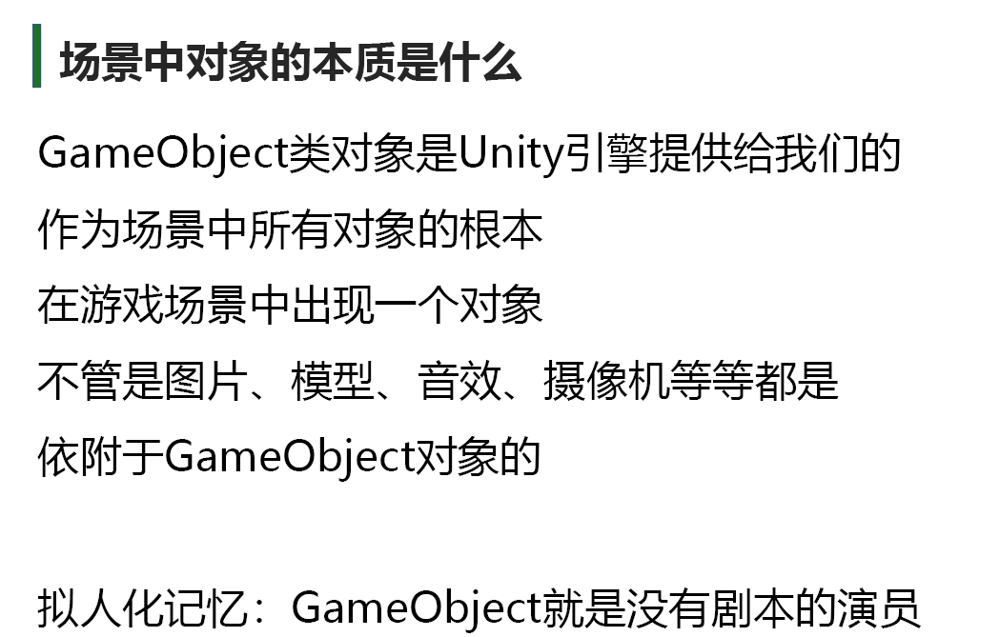
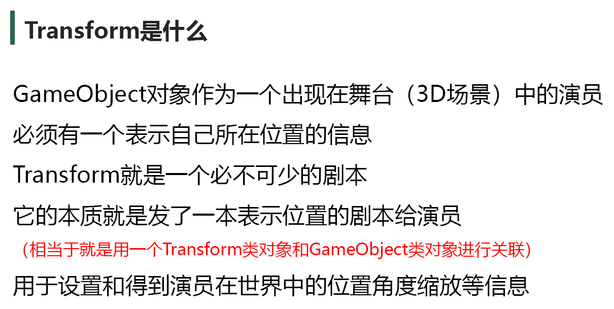
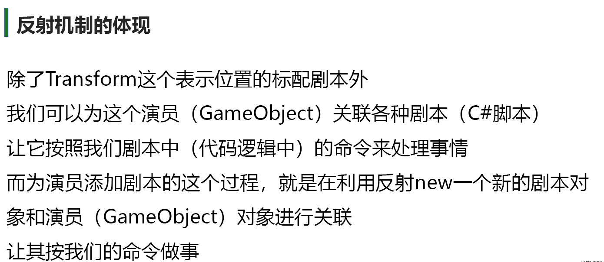
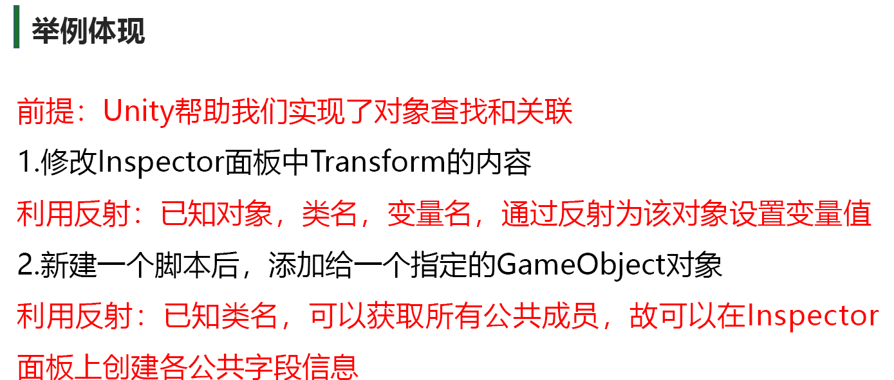
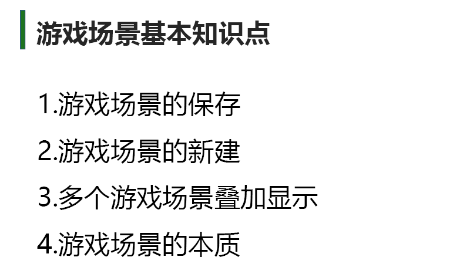
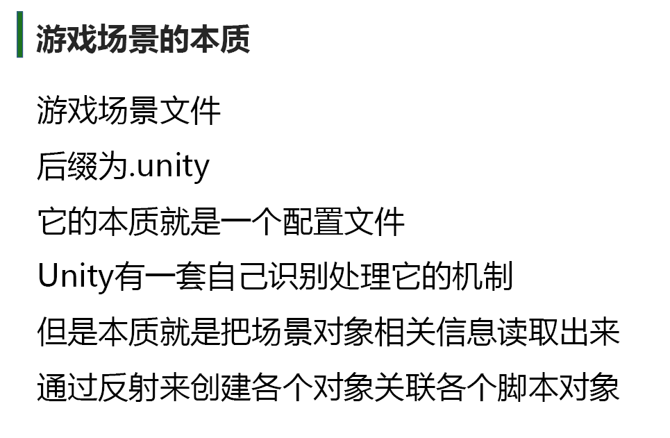

# Unity中的反射机制
Unity引擎本质是一个软件使用它时是处于运行中的我们是在一个**运行中的软件里制作游戏**的
Unity开发的本质就是
在Unity引擎的基础上利用反射和引擎提供的各种功能进行的拓展开发

回忆一下反射的概念
程序正在运行时，可以查看其它程序集或者自身的元数据（元数据就是程序当中的类，对象，函数，变量之类的东西）
**一个运行的程序查看本身或者其它程序的元数据的行为就叫做反射**
在程序运行时，通过反射可以得到其它程序集或者自己程序集中
代码的各种信息，比如**类，函数，变量，对象**等等
我们可以实例化它们，执行它们，操作它们












##  **Unity 反射机制的完整工作流**
假设你写了一个 `PlayerController.cs` 脚本
```csharp
public class PlayerController : MonoBehaviour {
    [SerializeField] 
    private float _moveSpeed = 5.0f;
    
    void Update() {
        // 移动逻辑
    }
}
```

1. **脚本编译阶段**：
   Unity 会通过 **Mono/C# 编译器** 将你的脚本编译到 `Assembly-CSharp.dll` 中，同时生成 **元数据表**
2. **编辑器反射阶段**：
   - Unity Editor 通过反射扫描所有 `MonoBehaviour` 子类
   - 解析 `[SerializeField]` 等特性
   - 生成 Inspector 面板的 UI 元素
3. **运行时反射阶段**：
   - 当场景加载时，Unity 通过反射：
    - 实例化 `PlayerController` 对象
    - 将序列化数据（如 `_moveSpeed`）注入到对应字段
    - 构建消息系统的方法表（用于 `SendMessage()`）

# 游戏场景


