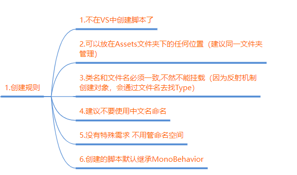
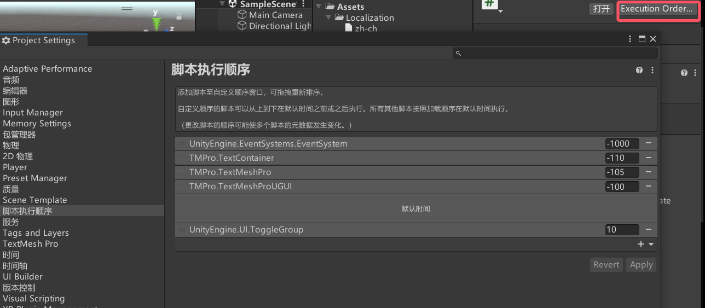
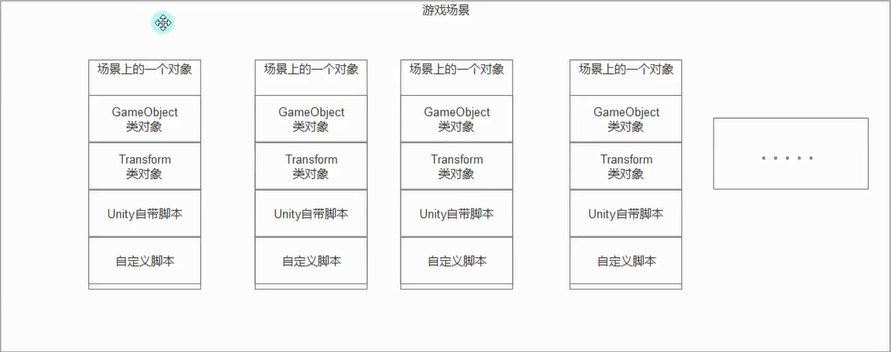

**MonoBehavior基类**
1. 创建的脚本默认都继承MonoBehaviour 继承了它才能够挂载在GameObject上
2. 继承了MonoBehavior的脚本不能new 只能挂！！！！！！！！
3. 继承了MonnBehavior的脚本不要去写构造函数，因为我们不会去new它，写构造函数没有任何意义
4. 继承了MonoBehavior的脚本可以在一个对象上挂多个（如果没有加DisallowMultipleComponent特性）
5. 继承MonoBehavior的类也可以再次被继承，遵循面向对象继承多态的规则

**不继承MonoBehavior的类**
1. 不继承Mono的类 不能挂载在GameObject上
2. 不继承Mono的类 想怎么写怎么写 如果要使用需要自己new
3. 不继承Mono的类 一般是单例模式的类（用于管理模块） 或者数据结构类（用于存储数据）
4. 不继承Mono的类 不用保留默认出现的几个函数

设置挂载脚本的执行顺序，默认时间前是系统必须执行的，可以设置自己添加的脚本的执行顺序，数字越小脚本越先执行

打开 当前unity版本下的Editor\Data\Resources\ScriptTemplates目录可以更改默认的脚本模板

