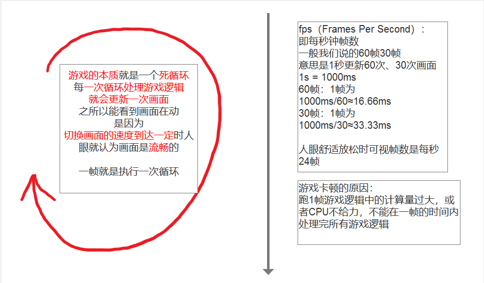
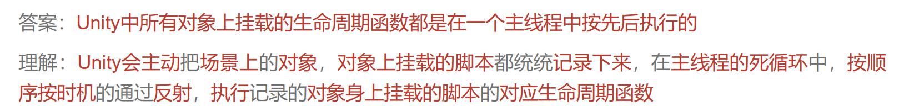



知识点一 了解帧的概念
    Unity 底层已经帮助我们做好了死循环
    我们需要学习Unity的生命周期函数
    利用它做好的规则来执行我们的游戏逻辑就行了

知识点二 生命周期函数的概念
    所有继承MonoBehavior的脚本 最终都会挂载到GameObject游戏对象上
    生命周期函数 就是该脚本对象依附的GameObject对象从出生到消亡整个生命周期中
    会通过反射自动调用的一些特殊函数

注意：
生命周期函数的访问修饰符一般为private和protected
因为不需要再外部自己调用生命周期函数 都是Unity自己帮助我们调用的
当对象（自己这个类脚本对象）被创建时 才会调用该生命周期函数
生命周期函数支持多态
如果GameObject一开始失活就不会调用生命周期函数

awake，onenable,start, fixedUpdate,update, laterupdate, ondisenable,ondestroy

# **Awake**：
类似构造函数的存在 我们可以在一个类对象 该创建 进行一些初始化操作

# **OnEnable**：
对于我们来说 想要当一个对象被激活时 进行一些逻辑处理 就可以写在这个函数

# **Start**：
主要作用还是用于初始化信息的 但是它相对Awake来说 要晚一点
如果我们在update中动态的创建对象，这个对象马上会执行Awake，但不会立即执行Start，要等到在**下一帧的第一次 `Update()` 之前**执行才会执行Start

# **FixedUpdate**：
它主要是用于 进行物理更新
它是每一帧的执行的 但是 这里的帧 和游戏帧 有点不同
它的时间间隔 是可以在 project setting中的 Time里去设置的

# **Update**：
主要用于处理游戏核心逻辑更新的函数

# **LateUpdate**：
一般这个更新是用来处理 摄像机位置更新相关内容的
Update和LateUpdate之间 Unity进了一些处理 处理我们动画相关的更新

# **OnDisable**：
如果我们希望在一个对象失活时做一些处理 就可以在该函数中写逻辑
失活后不参与游戏循环了，激活后又可以循环

# **OnDestroy**：
当对象销毁后调用

# 问题：不同对象的生命周期函数是在同一个线程中执行吗？

