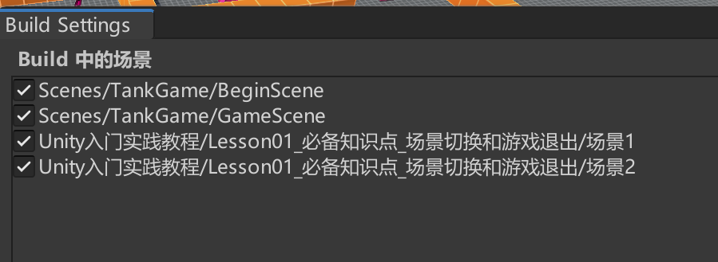

# 场景切换
按照 Build Settings 中的名称或索引加载场景。要引入`using UnityEngine.SceneManagement;`命名空间。
直接写代码切换场景可能会报错。注意: **切换必须要将场景拖到Unity 中的file-BuildSetting的Scene列表中**
然后可用用代码来切换

```cs
ScenneManager.Load("scenename");
```

# 退出游戏
退出播放器应用程序。执行这句代码就会退出游戏。但是在编辑模式下没有作用，一定是发布游戏过后才有用。
```cs
// 退出游戏
Application.Quit();
```
