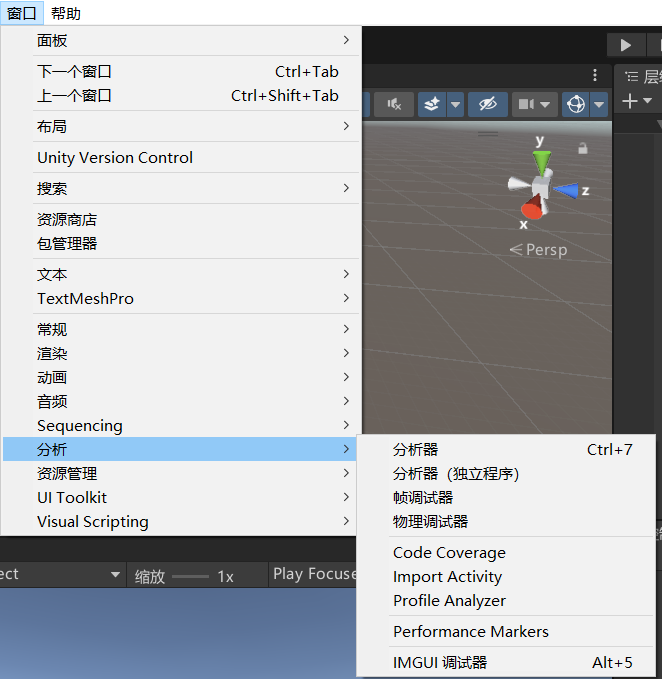

# Resources重复加载资源会浪费内存吗？
其实Resources加载一次资源过后
该资源就一直存放在内存中作为缓存
第二次加载时发现缓存中存在该资源，会直接取出来进行使用
所以，多**次重复加载不会浪费内存**
但是会**浪费性能**（每次加载都会去查找取出，始终伴随一些性能消耗）


# 手动释放掉缓存中的资源

`Resources.UnloadAsset`方法 卸载指定资源
可以在 window的 分析器查看内存是否卸载

```cs
//从内存中卸载 / assetToUnload /
//注意：
//该方法 不能释放 GameObject对象 因为它会用于实例化对象
//它只能用于一些 不需要实例化的内容 比如 图片 和 音效 文本等等
//一般情况下 我们很少单独使用它
//GameObject obj = Resources.CoroutineAsynLoad<GameObject>("Cube")
//即使是没有实例化的 GameObject对象也不能进行卸载
//Resources.UnloadAsset(obj);//报错 不能卸载GameObject

```

# Resources中的UnloadUnusedAssets方法 卸载未使用的资源
```cs
//卸载未使用的资源。
//注意：一般在过场景时和GC一起使用
Resources.UnloadUnusedAssets();
GC.Collect();    // 手动触发垃圾回收
```

