# LineRenderer画线渲染器组件是什么？
**LineRenderer** 是Unity提供的一个用于画线的组件。
使用它我们可以在场景中绘制线段，一般可以用于：绘制攻击范围，武器红外线，辅助功能，其它画线功能

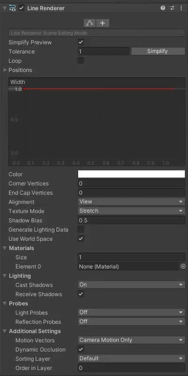


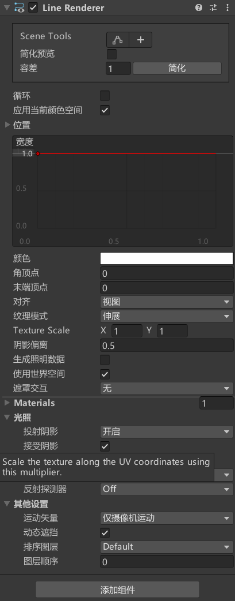

# 参数
## 场景点编辑模式
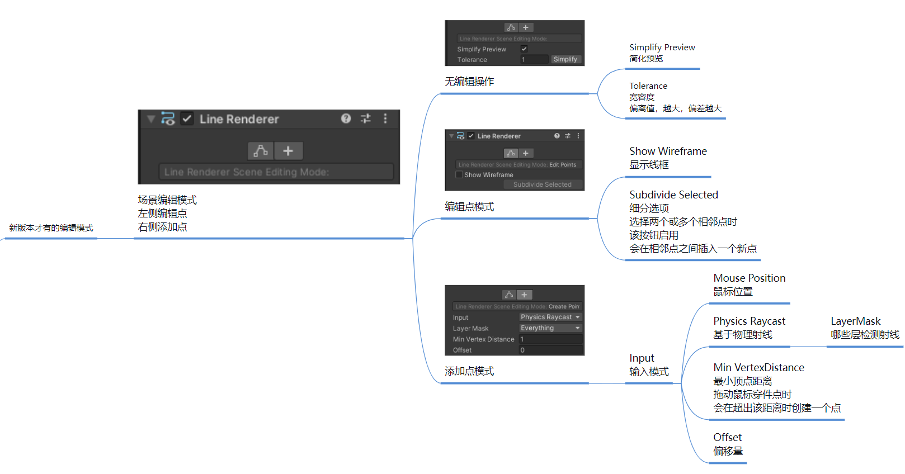

## Loop 循环
- 是否终点起始自动相连。

## Positions 位置
- 默认以世界坐标系为基准，设置线段的点并连接。
- 可以在 **Use World Space** 是否使用世界坐标系修改是否以世界坐标系为基准。
- 设置开不开启 **Loop 循环** 就能选择是否收尾线段点相连。
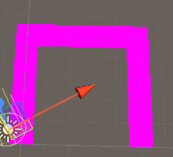
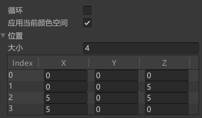
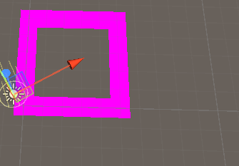
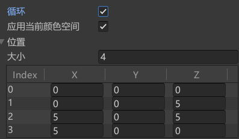
## Width 宽度
- 线段宽度曲线调整。

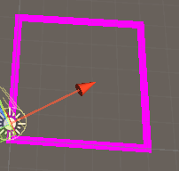
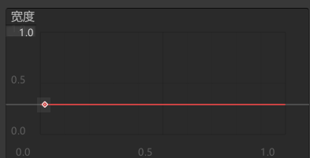

可以在宽度表里右键添加key，添加秘钥，修改划线宽度曲线。

## Color 颜色
修改颜色变化，颜色也可以是渐变的，假如没有材质修改颜色不起作用。


## Corner Vertices 角顶点
角顶点可以理解为把划线的角变成圆角。
此属性指示在一条线中绘制角时使用了多少额外的顶点。
增加此值，使线角看起来更圆。

## End Cap Vertices 末端顶点
终端顶点也变成圆角。


## Alignment 对其方式*
View：视点线段对着摄像机。
Transform Z：线段面向其Z轴。

## Texture Mode 纹理模式*
Stretch：拉伸，沿整条线映射纹理一次。
Tile：瓷砖平铺，不停的重复纹理。
Distribute Per Segment：分配执行。
Repeat Per Segment：重复显示。

## Shadow Bias 阴影偏移*
## Generate Lighting Data 生成光源数据*

## Use World Space 是否使用世界坐标系
- 勾选了，不管怎么改都是相对于世界坐标的线段点。
- 不勾选，就会是当前依附的游戏对象的相对坐标点，移动游戏对象也会移动划线。


## Materials 划线使用的材质球
我们可以新建一个材质，使用默认shader，关联一张图片，拖拽到划线组件的材质球上。
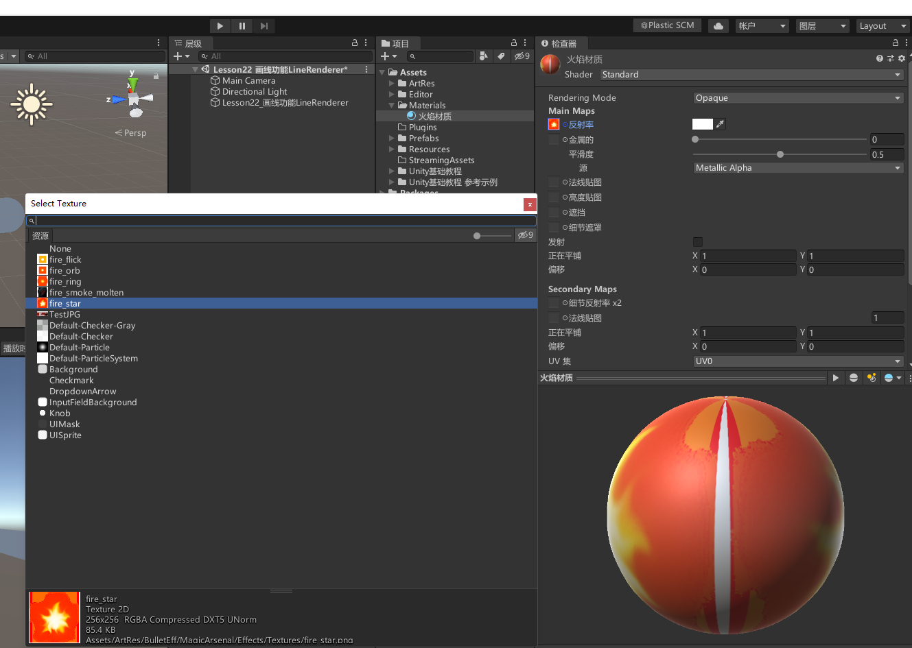
注意：假如一些材质需要光源，要开Generate Lighting Data 生成光源数据，不然可能变黑显示不出来。

## Lighting 光照影响*
Cast Shadows：投射阴影，是否开启阴影。
Receive Shadows：接收阴影。

## Probes 光照探针*
Light Probes：光探测器模式
不使用光探针
使用内插光探针
使用三维网格内插光探针
自定义从材质决定

## Reflection Probes：反射探测器模式*
不使用反射探针
启用混合反射探针
启用混合反射探针并且和天空和混合
启用普通探针，重叠式不混合

## Additional Settings 附加设置*
Motion Vectors：运动矢量
- 使用相机运动来跟踪运动
- 特定对象来跟踪运动
- 不跟踪
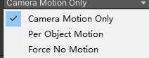


Dynamic Occludee：动态遮挡剔除
Sorting Layer：排序图层
Order in Layer：此线段在排序图层中的顺序


# 代码相关
```csharp
GameObject line = new GameObject();
line.name = "myLine";
LineRenderer myLine = line.AddComponent<LineRenderer>();


// 是否首尾相连
myLine.loop = true;
// 开始结束宽
myLine.startWidth = 0.02f;
myLine.endWidth = 0.02f;
// 开始结束颜色
myLine.startColor = Color.black;
myLine.endColor = Color.white;
// 设置材质
myLine.material = Resources.Load<Material>("Material地址");

// 设置点
// 先设置数量, 在设置每个点的位置
myLine.positionCount = 4;
myLine.SetPositions(new Vector3[]
{
    new Vector3(0, 0, 0),
    new Vector3(5, 0, 0),
    new Vector3(5, 0, 5),
    //new Vector3(0, 0, 5)          // 没有设置最后一个点，默认0,0,0
});
myLine.SetPosition(3, new Vector3(0, 0, 5));

// 是否使用世界坐标
myLine.useWorldSpace = false;

//是否接受光照进行着色计算
myLine.generateLightingData = true;
```


# 练习
**请写一个方法，传入一个中心点，传入一个半径，用 LineRenderer 画一个圆出来**
添加画圆函数，需要传入圆心位置(centerPos)，半径(r)，点的数量(pointNum)
```cs
// 圆心位置(centerPos)，半径，点的数量(pointNum)
public void DrawLineRenderer(Vector3 centerPos, float r, int pointNum)
{
    GameObject obj = new GameObject();
    obj.name = "R";

    LineRenderer line = obj.AddComponent<LineRenderer>();

    line.loop = true;

    line.positionCount = pointNum;

    float angle = 360f / pointNum;

    for (int i = 0; i < pointNum; i++)
    {
        // 1. 点加向量相当于平移点
        // 2. 四元数 * 向量相当于在旋转向量

        // 通过四元数进行旋转后，再进行位移操作
        Vector3 pos = Quaternion.AngleAxis(angle * i, Vector3.up) * Vector3.forward * r + centerPos;

        line.SetPosition(i, pos);
    }
}

```

**请实现，在 Game 窗口长按鼠标用 LineRenderer 画出鼠标移动的轨迹**
```cs
// 练习题二用来装 LineRenderer 的临时变量
private LineRenderer line2;

void Start()
{
    #region 练习题二
    // 在 Game 窗口长按鼠标用 LineRenderer 画出鼠标移动的轨迹

    ////假如没有添加鼠标左键被按下时的逻辑，那么每次只能接着上次画，会和上次画的末尾连接起来
    //line2 = this.gameObject.AddComponent<LineRenderer>();
    //line2.loop = false;
    //line2.startWidth = 0.5f;
    //line2.endWidth = 0.5f;
    //line2.positionCount = 0;
    #endregion
}

// 定义一个类成员变量 nowPos，记录当前鼠标指针所在的位置
private Vector3 nowPos;

// 在 Update 函数中，检测鼠标点击事件，实现从当前鼠标指针处开始划线的功能。
private void Update()
{
    // 鼠标左键被按下时
    if (Input.GetMouseButtonDown(0))
    {
        // 鼠标左键被按下时，创建新的游戏对象，并且新增为其 LineRenderer 组件
        GameObject obj = new GameObject();
        line2 = obj.AddComponent<LineRenderer>();

        // 设置线段状态为非闭合状态，设置开始和结束的宽度为 0.5
        line2.loop = false;
        line2.startWidth = 0.5f;
        line2.endWidth = 0.5f;

        // 设置顶点数目为 0 表示该线段暂时为空
        line2.positionCount = 0;
    }

    // 鼠标左键持续按压时
    if (Input.GetMouseButton(0))
    {
        // 鼠标左键持续按压时，不断新增线段中增加顶点，记录每个顶点的世界坐标，直到松开鼠标键停止绘制。
        line2.positionCount += 1;

        // 如何得到鼠标转世界坐标的对应点 
        // 知识点
        // 1. 如何得到鼠标位置
        // Input.mousePosition
        // 2. 怎么把鼠标转世界坐标

        // 使用 Camera.main.ScreenToWorldPoint() 方法来将当前鼠标所在的屏幕像素坐标转换到和场景中对象相对应的世界坐标上。
        nowPos = Input.mousePosition;
        // 这个 z 是设置和摄像机的距离的，这样画出来的线一直和摄像机的距离是 10
        nowPos.z = 10;  // 将 Z 轴坐标设置为一个固定值，使得线段可以显示在屏幕上方
        line2.SetPosition(line2.positionCount - 1, Camera.main.ScreenToWorldPoint(nowPos));
    }
}

```