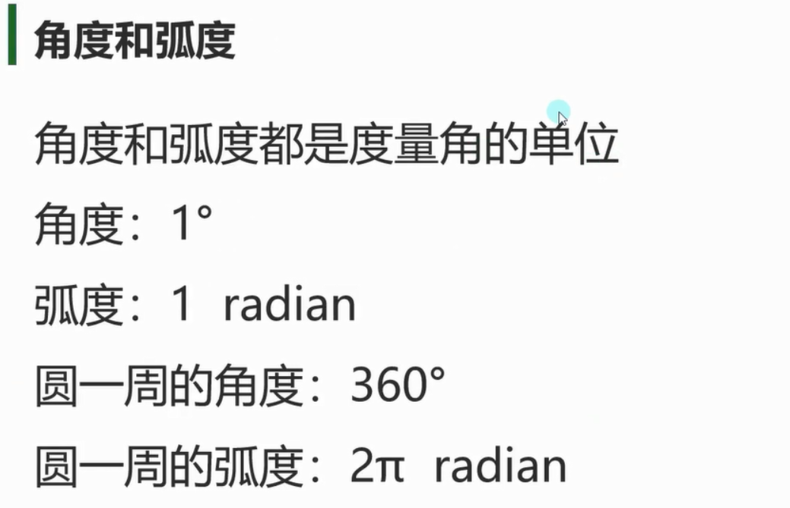
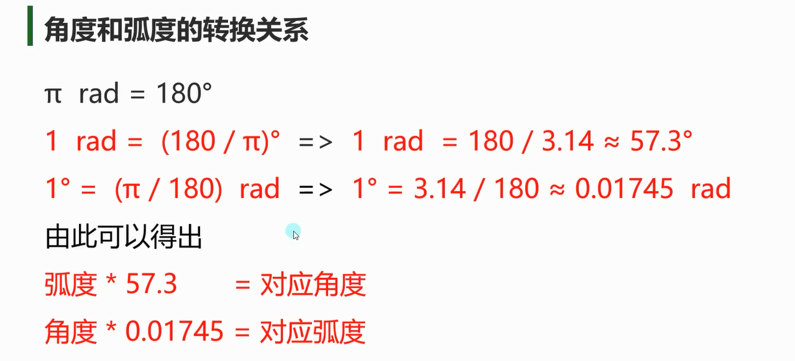

# Mathf和Math
- Math是C#中封装好的用于数学计算的**工具类**，位于System命名空间中。
- Mathf是Unity中封装好的用于数学计算的**工具结构体**，位于UnityEngine命名空间中。
- 他们都是提供来用于进行数学相关计算的。

# Mathf和Math的区别
- Mathf 和 Math中的相关方法几乎一样。
- Math - C#自带数学库，提供基本的数学计算方法。
- Mathf - Unity专门针对游戏开发增强的数学库，包含了Math中的方法，并添加了一些适用于游戏开发的方法。

# Mathf中的常用方法
## PI常量 获取圆周率π

```cs
// 众所周知的“3.14159265358979...”值（只读）。
print(Mathf.PI);//3.141593
```

## Abs静态方法 取绝对值
```cs
// 返回 f 的绝对值。
print(Mathf.Abs(-10));//10
print(Mathf.Abs(-20));//20
print(Mathf.Abs(1));//1
```

## CeilToInt静态方法 向上取整
```cs
// 返回大于或等于 f 的最小整数。
float f = 1.3f;
int i = (int)f;
print(i);//1
print(Mathf.CeilToInt(f));//2
print(Mathf.CeilToInt(1.00001f));//2
```

## FloorToInt静态方法 向下取整
```cs
// 返回小于或等于 f 的最大整数。
print(Mathf.FloorToInt(9.6f));//9
```

## Clamp静态方法 钳制函数
```cs
// 在给定的最小浮点值和最大浮点值之间钳制给定值。如果在最小和最大范围内，则返回给定值。
// 比最小还小，就取最小，比最大还大，就取最大，两者之间，就取本身
print(Mathf.Clamp(10, 11, 20));//11
print(Mathf.Clamp(21, 11, 20));//20
print(Mathf.Clamp(15, 11, 20));//15
```

## Max静态方法 获取最大值
```cs
// 返回两个或更多值中的最大值。
// 内部有一个可变长的参数
print(Mathf.Max(1, 2, 3, 4, 5, 6, 7, 8));//8
print(Mathf.Max(1, 2));//2
```

## Min静态方法 获取最小值
```cs
// 返回两个或更多值中的最小值。
// 内部有一个可变长的参数
print(Mathf.Min(1, 2, 3, 4, 545, 6, 1123, 123));//1
print(Mathf.Min(1.1f, 0.4f));//0.4
```

## Pow静态方法 一个数的n次幂
```cs
// 返回 f 的 p 次幂。
print("一个数的n次方" + Mathf.Pow(4, 2));//16
print("一个数的n次方" + Mathf.Pow(2, 3));//8
```

## RoundToInt静态方法 四舍五入
```cs
// 返回舍入为最近整数的 / f /。
print("四舍五入" + Mathf.RoundToInt(1.3f));//1
print("四舍五入" + Mathf.RoundToInt(1.5f));//2
```

## Sqrt静态方法 返回一个数的平方根
```cs
// 返回 f 的平方根。
print("返回一个数的平方根" + Mathf.Sqrt(4));//2
print("返回一个数的平方根" + Mathf.Sqrt(16));//4
print("返回一个数的平方根" + Mathf.Sqrt(64));//8
```

## IsPowerOfTwo静态方法 判断一个数是否是2的n次方
```cs
// 如果值是 2 的幂，则返回 true。
print("判断一个数是否是2的n次方" + Mathf.IsPowerOfTwo(4));//true
print("判断一个数是否是2的n次方" + Mathf.IsPowerOfTwo(8));//true
print("判断一个数是否是2的n次方" + Mathf.IsPowerOfTwo(3));//false
print("判断一个数是否是2的n次方" + Mathf.IsPowerOfTwo(1));//true
```


## Sign静态方法 判断正负数
```cs
// 返回 f 的符号。
// 正数和0就返回1，负数就返回-1
print("判断正负数" + Mathf.Sign(0));//1
print("判断正负数" + Mathf.Sign(10));//1
print("判断正负数" + Mathf.Sign(-10));//-1
print("判断正负数" + Mathf.Sign(3));//1
print("判断正负数" + Mathf.Sign(-2));//-1
```
## 插值运算
Lerp :   result = Mathf.Lerp(start, end, t);
t为插值系数   取值范围`[0, 1]`
`result = start + (end - start) * t`;

```cs
// t不变，起点不断变化
// 用法1  先快后慢, 无限趋近10
float start = 1;
start = Mathf.Lerp(start, 10, Time.deltaTime);


// 起点不变，时间t匀速变化
// 用法2  匀速变化
float start = 1; float time = 0, result = 0;
time += Time.deltaTime;
result = Mathf.Lerp(start, 10, time);
```





Rad2Deg常量 弧度转角度的常量
```cs
// 弧度到度换算常量（只读）。
float rad = 1;
float anger = rad * Mathf.Rad2Deg;
print(anger);//57.29578f;
```

Deg2Rad常量 角度转弧度的常量
```cs
// 度到弧度换算常量（只读）。
anger = 1;
rad = anger * Mathf.Deg2Rad;
print(rad);//0.01745329
```


# Unity中的三角函数
注意：Mathf中的三角函数相关函数，**传入的参数需要时弧度值**
## Sin静态方法 计算正弦函数
```cs
// 返回角度 f 的正弦。
print(Mathf.Sin(30 * Mathf.Deg2Rad));//0.5
```

## Cos静态方法 计算余弦函数
```cs
// 返回角度 f 的余弦。
print(Mathf.Cos(60 * Mathf.Deg2Rad));//0.5
```

注意：反三角函数得到的结果是 正弦或者余弦值对应的弧度

## Asin静态方法 反正弦函数
```cs
// 返回 f 的反正弦 - 其正弦为 f 的角度（以弧度为单位）。
rad = Mathf.Asin(0.5f);
print(rad * Mathf.Rad2Deg);//30
```

## Acos静态方法 反余弦函数
```cs
// 返回 f 的反余弦 - 其余弦为 f 的角度（以弧度为单位）。
rad = Mathf.Acos(0.5f);
print(rad * Mathf.Rad2Deg);//60
```


# 练习
## 使用插值实现一个方块跟随另一个方块移动
```cs
//这个脚本将要挂载到方块A上 实现方块A跟随着方块B
public class Lesson02_练习题 : MonoBehaviour
{
    

    //要跟随的对象B
    public Transform B;

    //移动速度
    public float moveSpeed;

    //位置中介
    private Vector3 pos;

    //B当前的位置
    private Vector3 bNowPos;

    //开始位置
    private Vector3 startPos;

    //匀速运动累加的时间
    private float time;

    //模式
    public int mode = 1;
    
    void Update()
    {
        if(mode == 1)
        {
            //第一种 就是 先快后慢的形式

            //记录当前这一帧A的位置
            pos = this.transform.position;

            //传入这一帧A的位置算出下一帧A的位置
            pos.x = Mathf.Lerp(pos.x, B.position.x, Time.deltaTime * moveSpeed);
            pos.y = Mathf.Lerp(pos.y, B.position.y, Time.deltaTime * moveSpeed);
            pos.z = Mathf.Lerp(pos.z, B.position.z, Time.deltaTime * moveSpeed);

            //算出下一帧A的位置赋值给A
            this.transform.position = pos;
        }
        else if(mode == 2)
        {
            //第二种 就是 匀速运动

            //发现存储的B的位置不等于当前B的位置
            if (bNowPos != B.transform.position)
            {
                //清空时间 重写设置B的位置 开始位置是A当前的位置
                time = 0;
                bNowPos = B.transform.position;
                startPos = this.transform.position;
            }

            //时间每一帧运算累加
            time += Time.deltaTime;

            //startPos和bNowPos其实定死了 只有time在变化 传入算出下一帧A的位置
            pos.x = Mathf.Lerp(startPos.x, bNowPos.x, time * moveSpeed);
            pos.y = Mathf.Lerp(startPos.y, bNowPos.y, time * moveSpeed);
            pos.z = Mathf.Lerp(startPos.z, bNowPos.z, time * moveSpeed);

            //算出下一帧A的位置赋值给A
            this.transform.position = pos;
        }
    }

    private void OnGUI()
    {
        if(GUI.Button(new Rect(0, 0, 200, 200), "切换模式"))
        {
            mode = 3 - mode;
        }
    }
}

```

## 实现一个物体按照曲线移动（正弦或余弦）
```cs
public class MathfTest : MonoBehaviour
{
    // 向前移动速度
    public float moveSpeed = 5;
    // 振幅
    public float changeSize = 10;
    // 频率
    public float changeSpeed = 5;
    // 时间
    public float time = 0;

    private void Update()
    {
        this.transform.Translate(Vector3.forward * moveSpeed * Time.deltaTime);
        time += Time.deltaTime;
        this.transform.Translate(Vector3.right * Mathf.Sin(time * changeSpeed) * changeSize * Time.deltaTime);
    }
}


```