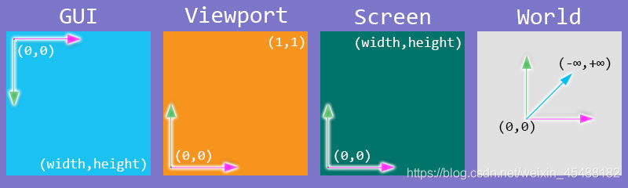
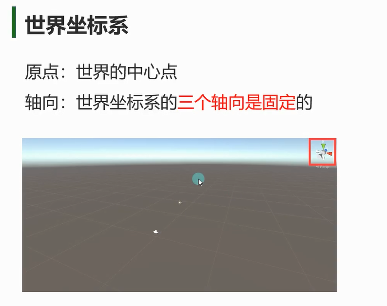
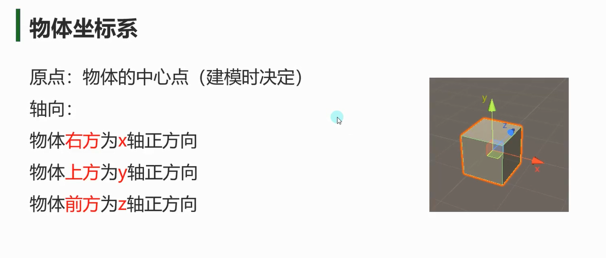
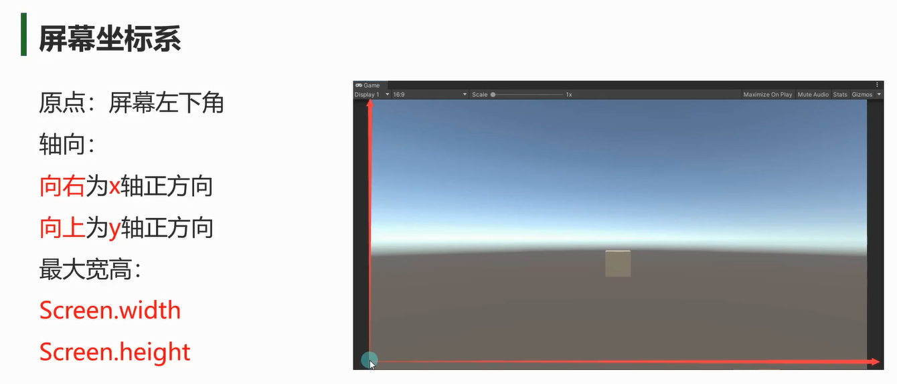
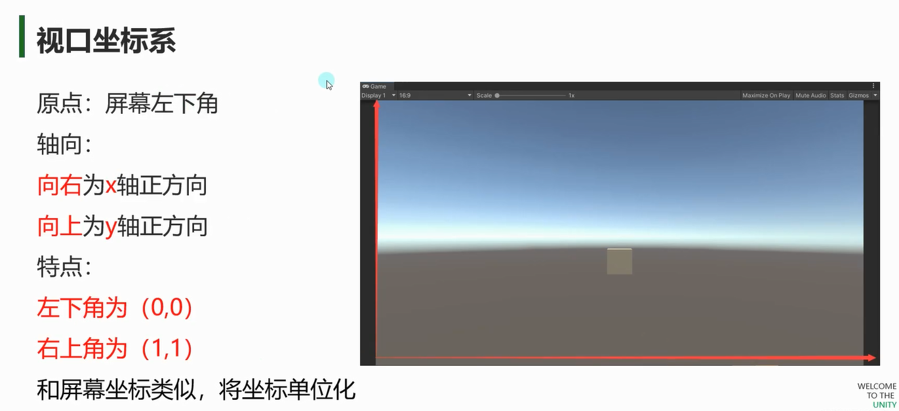
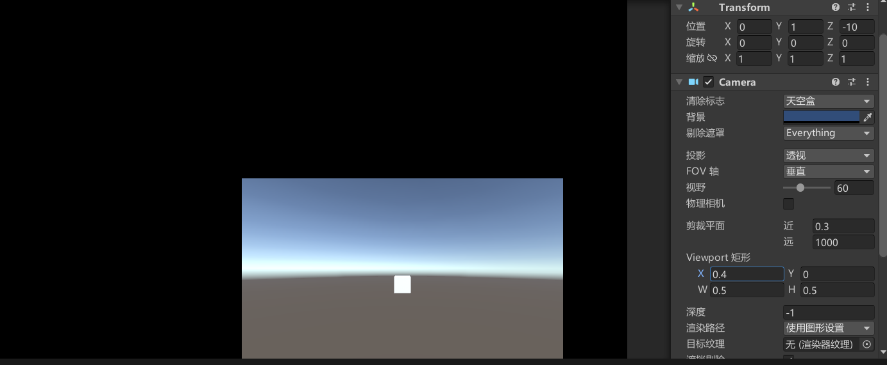

# 世界坐标系


- `this.transform.position`-返回物体在世界坐标系中的位置
- `this.transform.rotation`-返回物体在世界坐标系中的旋转四元数
- `this.transform.eulerAngles`-返回物体在世界坐标系中的欧拉角
- `this.transform.lossyScale`-返回物体在世界坐标系中的缩放
- 修改它们将导致相对于世界坐标系的变化

# 物体坐标系

- `this.transform.localPosition`-返回物体在其父对象坐标系中的位置
- `this.transform.localEulerAngles`-返回物体在其父对象坐标系中的旋转四元数
- `this.transform.localRotation`-返回物体在其父对象坐标系中的欧拉角
- `this.transform.localScale`-返回物体在其父对象坐标系中的缩放
- 修改它们将导致相对于父对象物体坐标系的变化

# 屏幕坐标系

- `Input.mousePosition`-返回鼠标在屏幕坐标系中的位置
- `Screen.width`-返回屏幕坐标系的宽度
- `Screen.height`-返回屏幕坐标系的高度
- `currentResolution`当前屏幕的分辨率为

# 视口坐标系




# 坐标转换

## 世界转本地

`this.transform.InverseTransformDirection` 将世界空间中的方向向量转换为本地空间中的方向向量。
```cs
Vector3 worldDirection = new Vector3(1, 0, 0);
Vector3 localDirection = this.transform.InverseTransformDirection(worldDirection);    // (不受缩放影响
```

`this.transform.InverseTransformPoint` 将世界空间中的点转换为本地空间中的点。
```cs
Vector3 worldPoint = new Vector3(5, 2, 3);
Vector3 localPoint = this.transform.InverseTransformPoint(worldPoint);
```

`this.transform.InverseTransformVector` 将世界空间中的向量转换为本地空间中的向量。
```cs
Vector3 worldVector = new Vector3(2, 1, 0);
Vector3 localVector = this.transform.InverseTransformVector(worldVector);     // (受缩放影响
```


## 本地转世界
`this.transform.TransformDirection` 将本地空间中的方向向量转换为世界空间中的方向向量。
```cs
Vector3 localDirection = new Vector3(0, 1, 0);
Vector3 worldDirection = this.transform.TransformDirection(localDirection);// (不受缩放影响
```

`this.transform.TransformPoint` 将本地空间中的点转换为世界空间中的点。
```cs
Vector3 localPoint = new Vector3(2, 3, 1);
Vector3 worldPoint = this.transform.TransformPoint(localPoint);
```

`this.transform.TransformVector` 将本地空间中的向量转换为世界空间中的向量。
```cs
Vector3 localVector = new Vector3(1, 0, 0);
Vector3 worldVector = this.transform.TransformVector(localVector);    // (受缩放影响
```


## 世界转屏幕
`Camera.main.WorldToScreenPoint` 将世界空间中的点转换为屏幕空间中的点。
```cs
Vector3 worldPoint = new Vector3(5, 2, 3);
Vector3 screenPoint = Camera.main.WorldToScreenPoint(worldPoint);
```

## 屏幕转世界
`Camera.main.ScreenToWorldPoint` 将屏幕空间中的点转换为世界空间中的点。
```cs
Vector3 screenPoint = new Vector3(100, 200, 0);
Vector3 worldPoint = Camera.main.ScreenToWorldPoint(screenPoint);
```

## 世界转视口
`Camera.main.WorldToViewportPoint` 将世界空间中的点转换为视口空间中的点。
```cs
Vector3 worldPoint = new Vector3(5, 2, 3);
Vector3 viewportPoint = Camera.main.WorldToViewportPoint(worldPoint);
```

## 视口转世界
`Camera.main.ViewportToWorldPoint` 将视口空间中的点转换为世界空间中的点。
```cs
Vector3 viewportPoint = new Vector3(0.5f, 0.5f, 0);
Vector3 worldPoint = Camera.main.ViewportToWorldPoint(viewportPoint);
```

## 视口转屏幕
`Camera.main.ViewportToScreenPoint` 将视口空间中的点转换为屏幕空间中的点。
```cs
Vector3 viewportPoint = new Vector3(0.5f, 0.5f, 0);
Vector3 screenPoint = Camera.main.ViewportToScreenPoint(viewportPoint);
```

## 屏幕转视口
`Camera.main.ScreenToViewportPoint` 将屏幕空间中的点转换为视口空间中的点。
```cs
Vector3 screenPoint = new Vector3(100, 200, 0);
Vector3 viewportPoint = Camera.main.ScreenToViewportPoint(screenPoint);
```