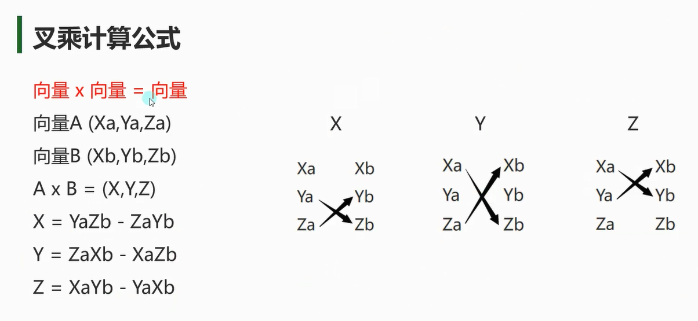
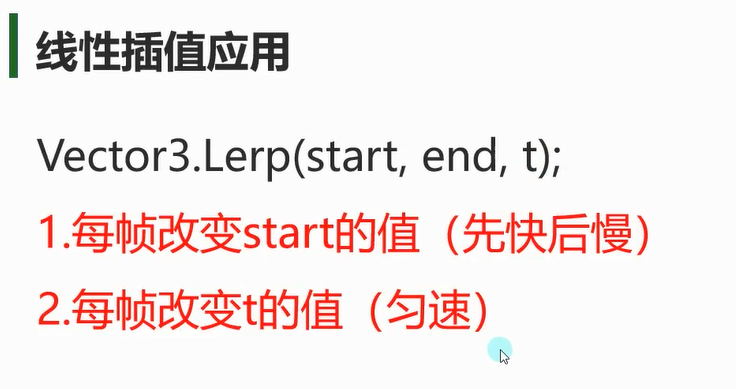
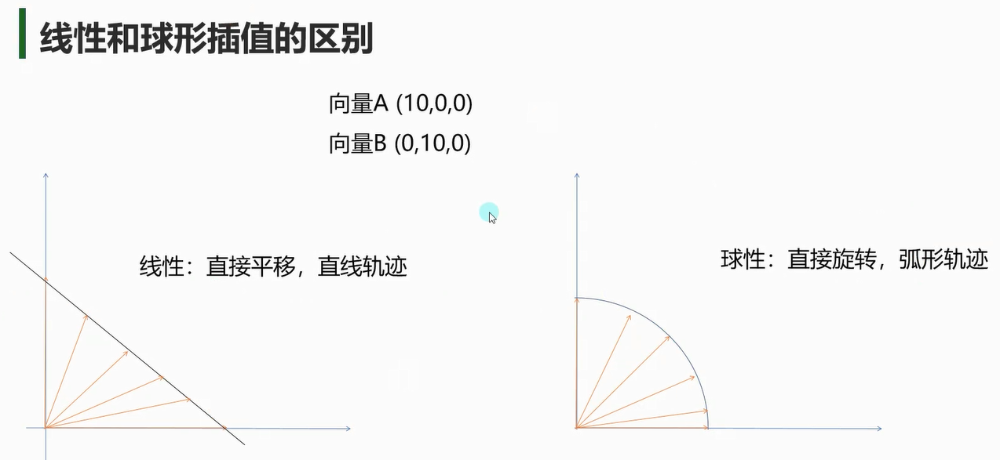
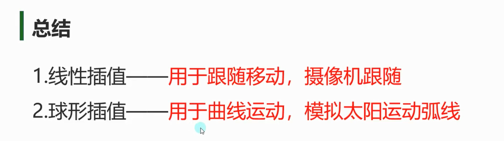
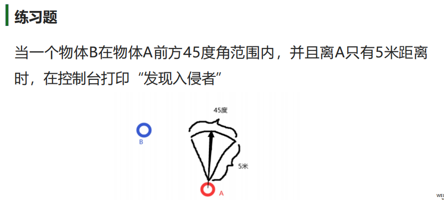

# Unity中的向量
## 向量常用的成员和方法
向量在数学和编程中有许多常用的成员和方法，常见的包括：
1. **成员**：
    - `x`、`y`、`z`：向量的分量，表示向量在 x、y、z 方向上的值。
    - `magnitude` 或 `length`：向量的**长度或模长**，表示从原点到向量的终点的距离。
    - `normalized`：返回与当前向量方向相同但长度为1的**单位向量**。也可以 向量 /magnitude
    - `sqrMagnitude`：向量**长度的平方**，用于比较向量长度时避免开方计算。
    - `zero`：零向量，所有分量均为0的向量。
2. **方法**：
    - `Vector3.Dot(Vector3 a, Vector3 b)`：计算两个向量的**点乘**结果。返回弧度
    - `Vector3.Cross(Vector3 a, Vector3 b)`：计算两个向量的**叉乘**结果。
    - `Vector3.Distance(Vector3 a, Vector3 b)`：计算两个向量之间的**距离**。
    - `Vector3.Lerp(Vector3 a, Vector3 b, float t)`：在两个向量之间进行**线性插值**。
    - `Vector3.Slerp(Vector3 a, Vector3 b, float t)`：在两个向量之间进行**球形插值**
    - `Vector3.Normalize(Vector3 value)`：将向量转化为单位向量。
    - `Vector3.Project(Vector3 vector, Vector3 onNormal)`：将一个向量**投影**到另一个向量上。
    - `Vector3.RotateTowards(Vector3 current, Vector3 target, float maxRadiansDelta, float maxMagnitudeDelta)`：将一个向量从当前方向**旋转**到目标方向。
    - `Vector3.Angle(Vector3 from, Vector3 to)`：返回值float, 计算两个向量之间的**角度值**

例子eg: 
- 利用 $A \cdot B = |A| * |B| cos\theta$ 或者 Vector.Angle()(角度) 来计算$\theta$ 
- $A\cdot B >= 0$ 前方 $A \times B < 0$  则A右B左
- 线性插值 (匀速)


## 向量的点积
```cs
// Debug类中的DrawLine静态方法 画线段
// 参数：前两个参数分别是起点和终点，最后一个参数是划线颜色。
Debug.DrawLine(this.transform.position, this.transform.position + this.transform.forward, Color.red);

// Debug类中的DrawRay静态方法 画射线
// 参数：前两个参数分别是起点和方向，最后一个参数是划线颜色。
Debug.DrawRay(this.transform.position, this.transform.up, Color.blue);

```


两个向量 a=(x1​,y1​) 和 b=(x2​,y2​) 的点积定义为 `a⋅b=x1x2​+y1​y2`​​，其结果是一个标量，且 `a⋅b=∣a∣×∣b∣×cosθ`，其中 θ 是 a 和 b 之间的夹角。
$\theta = Acos(单位向量a \cdot 单位向量b )$ 
**点积可用于判断两个向量的前后关系**
```cs
Vector3 forward = transform.forward;
Vector3 toEnemy = enemy.position - transform.position;
float dotResult = Vector3.Dot(forward, toEnemy.normalized);

// 值>0表示敌人在前方，<0表示在后方
if(dotResult > 0.5f) {
    // 敌人位于前方60度范围内
}
```

## 向量的叉积
获取垂直向量（右手定则， 常用于计算旋转轴）
**可以用叉乘来判断两个向量的左右关系**

```cs
Vector3 C = Vector3.Cross(A.position, B.position);
if (C.y > 0)
{
    Debug.Log("A在B的右侧");
}
else
{
    Debug.Log("B在A的右侧");
}
```

## 向量插值运算
插值公式和差不多
### 线性插值

先快后慢 每帧改变start位置 位置无限接近 但不会得到end位置
```cs
// 可以理解为t不变 每次往方向向量加的值(end - start)一直会变小

A.position = Vector3.Lerp(A.position, target.position, Time.deltaTime);
```

匀速 每帧改变时间 当t>=1时 得到结果
```cs

// 可以理解为t每一帧累加相同值 start和(end - start)不变 所以是匀速运动
// 这种匀速移动 当time>=1时  我改变了 目标位置后  它会直接瞬移到我们的目标位置 因为t>=1时直接的得到结果
public Transform target;
private Vector3 startPos;
private Vector3 tmpTarget;
private float time = 0;
void Update()
{
	// 每次终点移动变化, 重置时间, 起点
	if (tmpTarget != target.position)
	{
		tmpTarget = target.position;
		time = 0;
		startPos = transform.position;
	}

	time += Time.deltaTime;
	transform.position = Vector3.Lerp(startPos, target.position, time);


```

### 球形插值

从（10， 0， 0） 到 （0， 0， 10）
```cs
time += Time.deltaTime;
A.position = Vector3.Slerp(Vector3.right * 10, Vector3.forward * 10, time);
```


# 练习
## 用向量相关知识，实现摄像机跟随

摄像机代码写在`LateUpdate`中
如果在`Update`中更新摄像机的位置，可能会出现**摄像机位置更新早于目标对象位置更新**的情况，导致摄像机出现**抖动或延迟跟随**的问题。
而在`LateUpdate`中更新摄像机位置，可以确保在目标对象位置更新完成后再进行摄像机的移动，从而实现平滑的跟随效果。
```cs
public float zOffect = 4;
public float yOffect = 7;
public Transform target;


void LateUpdate()
{
    // 摄像机的位置等于目标的位置进行向量偏移
    // 先朝目标对象的面朝向的反方向平移4米再朝目标的头顶位置平移7米
    
    // 设置摄像机位置
    this.transform.position = target.position - target.forward * zOffect + target.up * yOffect;
    
    // 看向目标
    this.transform.LookAt(target);
}

```

## 发现入侵者
当一个物体B在物体A前方45度角范围内，并且离A只有5米距离时，在控制台打印“发现入侵者”


```cs
// 手动算
if (Vector3.Distance(this.transform.position, B.transform.position) <= 5)
{
    // 第一步：算出点乘结果（方向向量）
    float dotResult = Vector3.Dot(this.transform.forward, (B.transform.position - this.transform.position).normalized);
    // 第二步：通过反余弦函数算出夹角
    if (Mathf.Acos(dotResult) * Mathf.Rad2Deg <= 22.5f)
    {
        print("手动算角度 发现入侵者");
    }
}


// Angle直接算角度
if (Vector3.Distance(this.transform.position, B.transform.position) <= 5 &&
    Vector3.Angle(this.transform.forward, B.transform.position - this.transform.position) <= 22.5f)
{
    print("Angle直接算角度 发现入侵者");
}
```

## 左上，左下 ，右上，右下哪个方位?
判断一个物体B位置再另一个物体A的位置的左上，左下 ，右上，右下哪个方位
```cs
public class VectorPositionDetector : MonoBehaviour
{
    public Transform objectA;
    public Transform objectB;
    [Header("阈值")] 
    public float angleThreshold = 45f; // 方向识别角度范围

    void Update()
    {
        // 获取A到B的水平方向向量
        Vector3 aToB = objectB.position - objectA.position;
        aToB.y = 0; // 忽略垂直分量

        // 获取A的基准方向向量（已水平化）
        Vector3 aForward = objectA.forward;
        aForward.y = 0;
        Vector3 aRight = objectA.right;
        aRight.y = 0;

        // 计算方向点积（自动处理向量长度）
        float forwardDot = Vector3.Dot(aToB.normalized, aForward.normalized);
        float rightDot = Vector3.Dot(aToB.normalized, aRight.normalized);

        // 精确角度计算版本
        float angle = Vector3.Angle(aForward, aToB);
        
        // 基本方位判断
        bool isFront = forwardDot > 0;
        bool isBack = forwardDot < 0;
        bool isRight = rightDot > 0;
        bool isLeft = rightDot < 0;

        // 精确方位判断（45度扇形区）
        bool inFrontSector = angle <= angleThreshold;
        bool inRightSector = Vector3.Angle(aRight, aToB) <= angleThreshold;
        
        Debug.Log($"前方: {isFront} | 后方: {isBack}\n" +
                  $"右侧: {isRight} | 左侧: {isLeft}\n" +
                  $"前扇形区: {inFrontSector} | 右扇形区: {inRightSector}");


        // 计算八个方向识别
        bool isFrontRight = forwardDot > 0 && rightDot > 0;
        bool isFrontLeft = forwardDot > 0 && rightDot < 0;
        
        // 距离综合判断
        float distance = aToB.magnitude;
        bool inRange = distance < 5f; // 5米范围内
        
        // 运动方向预测（需记录上一帧位置）
        Vector3 velocity = (objectB.position - lastPosition) / Time.deltaTime;
        lastPosition = objectB.position;
    }
}

```

```cs
using System.Collections;
using System.Collections.Generic;
using UnityEngine;

public class Lesson08_练习题 : MonoBehaviour
{

    //拖拽得到AB位置变量
    public Transform A;
    public Transform B;

    //点乘接过和叉乘结果变量
    private float dotResult;
    private Vector3 crossResult;

    void Update()
    {
        #region 练习题一
        //判断一个物体B位置再另一个物体A的位置的左上，左下 ，右上，右下哪个方位

        //计算 A位置向量和AB方向差向量 点乘和叉乘结果
        dotResult = Vector3.Dot(A.forward, B.position - A.position);
        crossResult = Vector3.Cross(A.forward, B.position - A.position);

        //根据点乘和叉乘的值判断前后左右
        if (dotResult >= 0)
        {
            //右侧
            if (crossResult.y >= 0)
            {
                print("右前");
            }
            //左侧
            else
            {
                print("左前");
            }
        }
        else
        {
            //右侧
            if (crossResult.y >= 0)
            {
                print("右后");
            }
            //左侧
            else
            {
                print("左后");
            }
        }

        // 练习题二
        //当一个物体B在物体A左前方20度角或右前方30度范围内，并且离A只有5米距离时，在控制台打印“发现入侵者”

        //计算叉乘 用于判断左边还是右边
        crossResult = Vector3.Cross(A.forward, B.position - A.position);

        //判断距离
        if (Vector3.Distance(A.position, B.position) <= 5)
        {
            //A左前方20度角或右前方30度范围内
            if (crossResult.y >= 0 && Vector3.Angle(A.forward, B.position - A.position) <= 30 ||
                crossResult.y < 0 && Vector3.Angle(A.forward, B.position - A.position) <= 20)
            {
                print("发现入侵者");
            }
        }
    }
}

```

## 插值实现摄像机跟随
```cs
// 如果当前摄像机的目标位置不是目标对象的后方4米，向上偏7米 就设置目标位置 记录摄像机当前开始位置 重置时间
if (cameraTargetPos != target.position + -target.forward * zOffect + target.up * yOffect)
{
    cameraTargetPos = target.position + -target.forward * zOffect + target.up * yOffect;
    startPos = this.transform.position;
    time = 0;
}
time += Time.deltaTime;
this.transform.position = Vector3.Lerp(startPos, cameraTargetPos, time * moveSpeed);
```

## 球形插值模拟太阳轨迹

```cs
private void Update()
{
    time2 += Time.deltaTime;
    // sun.position = Vector3.Slerp(Vector3.right * 10, Vector3.left * 10, time2 * 0.1f);//假如直接写最终值会不知道从哪里转 可能会平这转
    sun.position = Vector3.Slerp(Vector3.right * 10, Vector3.left * 10 + Vector3.up * 0.1f, time2 * 0.1f);//要给最终值加一点向上的向量 才会往上转
}
```