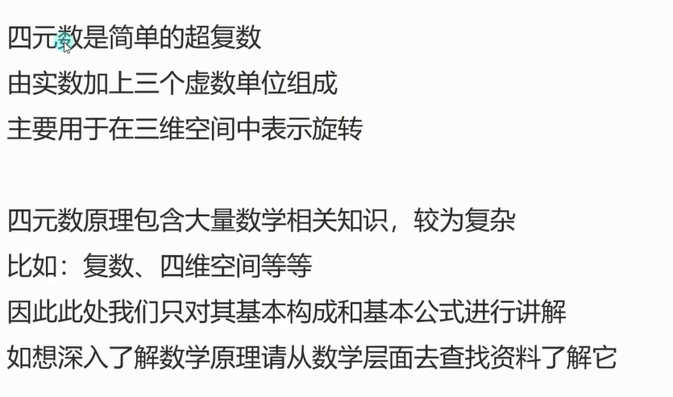
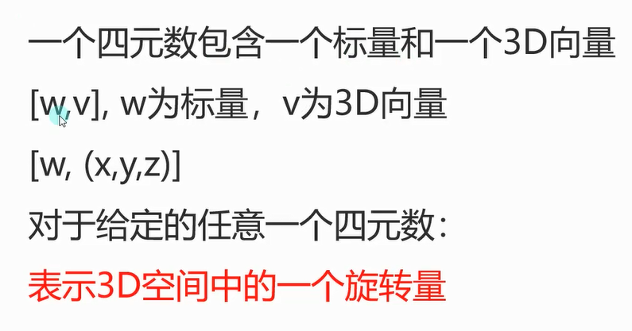
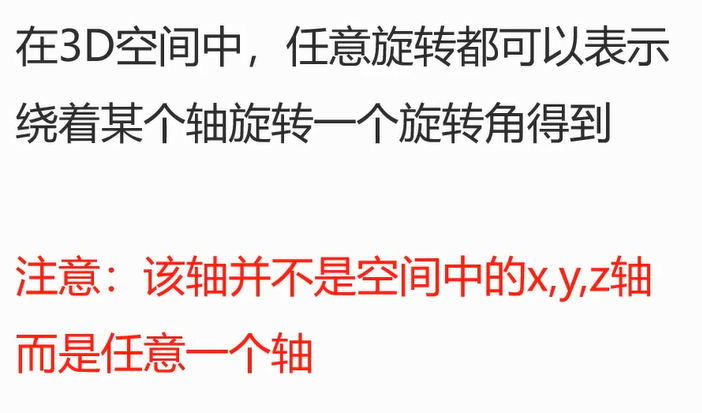
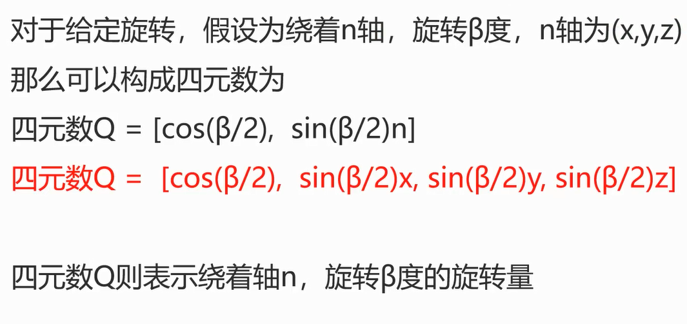
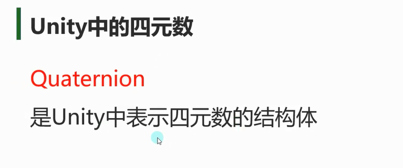
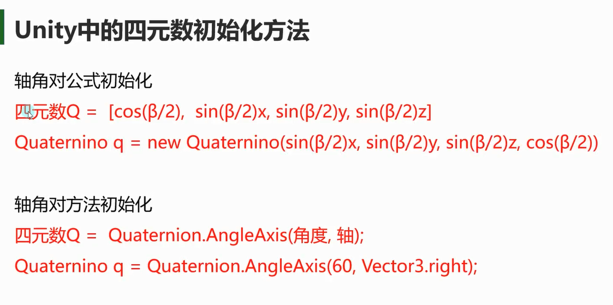
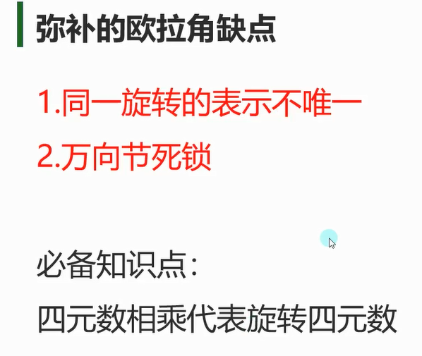
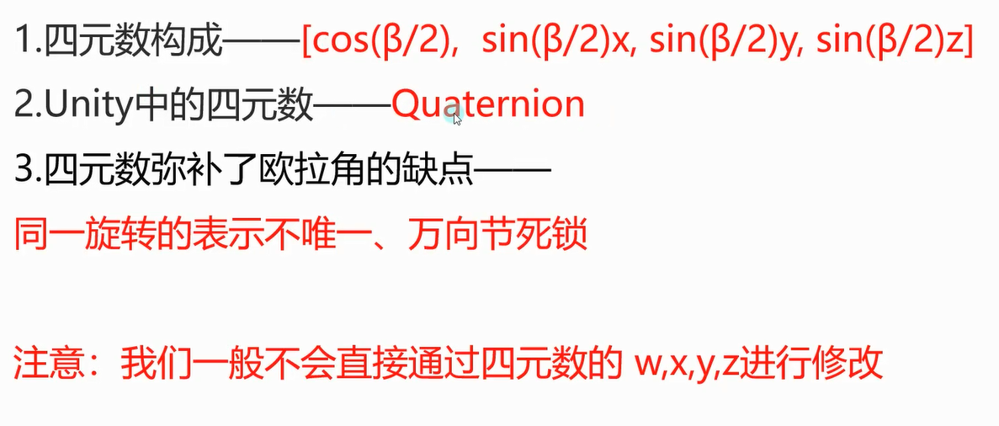

# 四元数概念
**数学定义**
四元数由4个分量组成：`x`, `y`, `z`, `w`，数学表示为 `q = xi + yj + zk + w`


# 四元数构成


# 轴-角对



这里的n是3d向量



# Unity中的四元数 Quaternion


# Unity中的四元数初始化方法


```cs
//用四元数的计算原理 绕着(x,y,z)向量旋转β度(弧度)
float timeAngle = Mathf.Sin(β / 2 * Mathf.Deg2Rad);
Quaternion q = new Quaternion(timeAngle * x, timeAngle * y, timeAngle * z, Mathf.Cos(β / 2 * Mathf.Deg2Rad));


//绕着(1,0,0)向量旋转60度 要传入弧度制 角度转弧度
Quaternion q1 = new Quaternion(Mathf.Sin(30 * Mathf.Deg2Rad), 0, 0, Mathf.Cos(30 * Mathf.Deg2Rad));
```

```cs
//创建一个围绕 axis 旋转 offsetAngle 度的旋转。
//提供的轴角对 初始化 四元数的方法 分别传入度数和向量轴
Quaternion q2 = Quaternion.AngleAxis(60, Vector3.right);
```

# 四元数和欧拉角相互转换
```cs
// 欧拉角 转 四元数
Quaternion q = Quaternion.Euler(60, 0, 0);

// 四元数 转 欧拉角
print(q.eulerAngles);//(60.0, 0.0, 0.0)
```


# 弥补的欧拉角缺点


注意：四元数转换为欧拉角的范围始终是`[-180°, 180°]`之间
```cs
//每一帧绕着y轴旋转1度 
//四元数绕 y轴转  *****物体坐标系****** 旋转
this.transform.rotation *= Quaternion.AngleAxis(1, Vector3.up);
```


