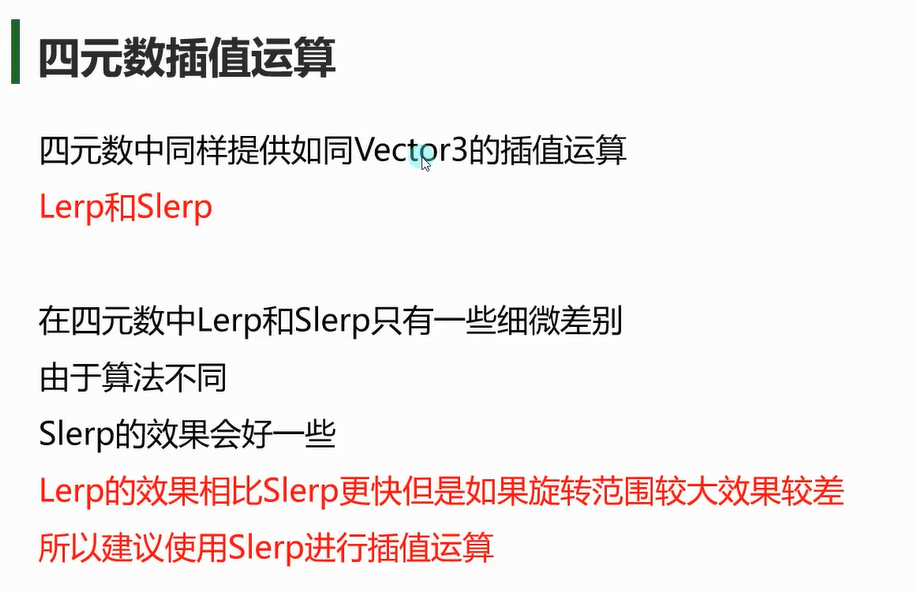
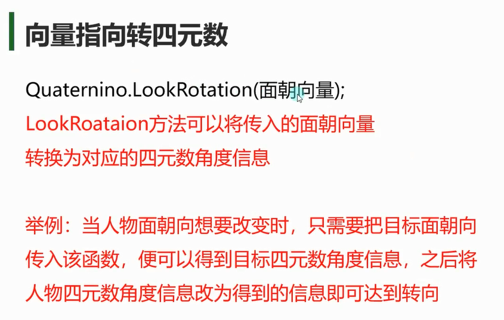

# 单位四元数


```cs
// 单位四元数 [1, (0, 0, 0)]
 Quaternion i = Quaternion.identity;
 
 //Object的Instantiate方法有重载 第三个参数可以传入四元数角度 
 Instantiate(testCube, Vector3.zero, Quaternion.identity);
```

# 插值运算


```cs
// 无限接近，先快后慢
A.transform.rotation = Quaternion.Slerp(A.transform.rotation, target.rotation, Time.deltaTime);

// 匀速
time += Time.deltaTime; 
B.transform.rotation = Quaternion.Slerp(start, target.rotation, time);
```

# 向量指向转四元数LookRotation



```cs
public Transform target;
public float rotateSpeed = 2f;

void Update() {
    Vector3 dir = target.position - transform.position;
    Quaternion targetRot = Quaternion.LookRotation(dir);
    transform.rotation = Quaternion.Slerp(transform.rotation, targetRot, rotateSpeed * Time.deltaTime);
}  
```